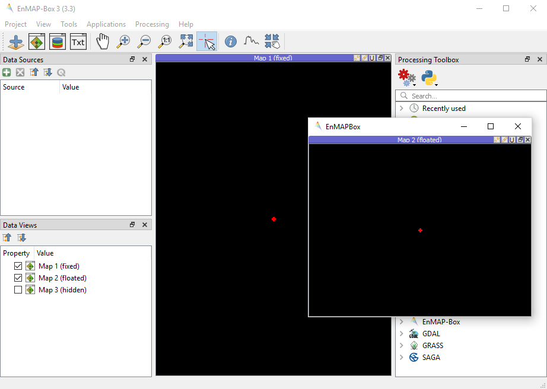
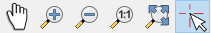
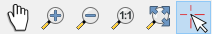

.. include:: ../external_links.rst

.. _GUI_GettingStarted:

.. Getting Started
.. ===============

==============
EnMAP Cookbook
==============

The following examples show how to interact with the EnMAP-Box GUI.
They are available unittest TestCases in `examples/api_examples.py`

.. important::
    For simplicity, we always import the following Qt and QGIS libraries globally::

        from qgis.core import *
        from qgis.gui import *
        from qgis.PyQt.QtWidgets import *
        from qgis.PyQt.QtGui import *
        from qgis.PyQt.QtCore import *

    So we can use several classes like QgsMapCanvas_ or QWidget_ and do not need to import them explicitly.

1. Start the EnMAP-Box
======================

As we like to start our examples from an IDE like PyCharm_, we first need to start a QgsApplication_.
It provides the main GUI loop that receives user interactions, like mouse clicks and keyboard entries::

    from enmapbox.testing import start_app
    qgsApp = start_app()

Now we can start and open the EnMAP-Box and load some example data::

    from enmapbox import EnMAPBox
    enmapBox = EnMAPBox(None)
    enmapBox.openExampleData()
    qgsApp.exec_()

If we would'nt call the GUI loop with ``qgsApp.exec_()``, our program will terminate immediately.

The EnMAPBox object is a singleton, which means that there exist only one EnMAPBox instance. You can connect
to a running EnMAP-Box instance like this::

    from enmapbox import EnMAPBox
    enmapBox = EnMAPBox.instance()
    print(enmapBox)

Finally, shut down the EnMAP-Box instance::

    enmapBox = EnMAPBox.instance()
    enmapBox.close()

2. Data Sources
======================

Add Data Sources
----------------

The EnMAP-Box differentiates between Raster, Vector, Spectral Libraries and other data sources. To add new data sources,
you just need to provide a file-path or other unique resource identifier via ``enmapBox.addSource(r'uri')`` ::

    enmapBox = EnMAPBox.instance()

    # add some data sources
    from enmapboxtestdata import enmap as pathRasterSource
    from enmapboxtestdata import landcover_polygons as pathVectorSource
    from enmapboxtestdata import library as pathSpectralLibrary

    #add a single source
    enmapBox.addSource(pathRasterSource)

    #add a list of sources
    enmapBox.addSources([pathVectorSource, pathSpectralLibrary])

A the EnMAP-Box uses the QGIS API to visualize spatial data, we can add OpenGIS Web Services (OWS)
like Web Map Services (WMS) and Web Feature Services (WFS) as well::

    wmsUri = 'referer=OpenStreetMap%20contributors,%20under%20ODbL&type=xyz&url=http://tiles.wmflabs.org/hikebike/%7Bz%7D/%7Bx%7D/%7By%7D.png&zmax=17&zmin=1'
    wfsUri = r'restrictToRequestBBOX=''1'' srsname=''EPSG:25833'' typename=''fis:re_postleit'' url=''http://fbinter.stadt-berlin.de/fb/wfs/geometry/senstadt/re_postleit'' version=''auto'''
    enmapBox.addSource(wmsUri, name="Open Street Map")
    enmapBox.addSource(wfsUri, name='Berlin PLZ')

  .. image:: ../img/gstart_datasources.png
     :width: 100%

List Existing Data Sources
--------------------------

You can iterate over all or specific type of data sources::

    for source in enmapBox.dataSources():
        print(source)

    for source in enmapBox.dataSources('RASTER'):
        print(source)

Remove Data Sources
-------------------

Data sources can be removed by its source path::

    enmapBox = EnMAPBox.instance()
    enmapBox.removeSource('source_path')

    # or remove multiple sources
    enmapBox.removeSources(['list-of-source_path'])

Data Sources are unique
-----------------------

EnMAP-Box Data sources are unique; which means that only one data source refers to the same source path.
Adding the same source multiple times does not change the total number of data sources::

    from enmapbox import EnMAPBox
    from enmapboxtestdata import enmap

    enmapBox = EnMAPBox(None)
    enmapBox.addSource(enmap)
    print('# data sources: {}'.format(len(enmapBox.dataSources())))

    # add the same source again
    enmapBox.addSource(enmap)
    print('# data sources: {}'.format(len(enmapBox.dataSources())))

.. note::

    * Data sources are internally described by the `enmapbox.gui.datasources.DataSource` class.

    * A `DataSource` object stores information on the data source uri, name, type and its creation date.

Receive data source changes:
----------------------------

The Qt Signals `sigDataSourceAdded` and `sigDataSourceAdded` can be used to be informed on changes of the EnMAP-Box data sources::

        from enmapbox import EnMAPBox

        enmapBox = EnMAPBox(None)
        enmapBox.sigDataSourceAdded.connect(lambda uri:print('DataSource added: {}'.format(uri)))
        enmapBox.sigDataSourceRemoved.connect(lambda uri: print('DataSource removed: {}'.format(uri)))

Overwriting a file source and adding it again to the EnMAP-Box will remove the data source first and add it's again.
This allows to react on changes and to ensure data integrity, e.g. to account for changes in file size and metadata.

Create a text file and add it to the EnMAP-Box::

        import tempfile, os, time
        tempDir = tempfile.mkdtemp()
        pathFile = os.path.join(tempDir, 'testfile.txt')

        with open(pathFile, 'w', encoding='utf-8') as f:
            f.write('First version')

        assert os.path.isfile(pathFile)
        enmapBox.addSource(pathFile)
        assert len(enmapBox.dataSources()) == 1

This creates a printout like::

    DataSource added: C:\Users\user\AppData\Local\Temp\tmp4gjczg1u\testfile.txt

Wait a while, then overwrite the text file and add it again::

        time.sleep(2)

        with open(pathFile, 'w', encoding='utf-8') as f:
            f.write('Second version')

        assert os.path.exists(pathFile)
        enmapBox.addSource(pathFile)
        assert len(enmapBox.dataSources()) == 1

The shell printouts should be like:

.. code-block:: batch

    DataSource removed: C:\Users\user\AppData\Local\Temp\tmp4gjczg1u\testfile.txt
    DataSource added: C:\Users\user\AppData\Local\Temp\tmp4gjczg1u\testfile.txt

3. Dock Windows
======================

The EnMAP-Box `Docks` to visualize spatial data and spectral libraries. `Docks` are based on the
`pyqtgraphDock <http://www.pyqtgraph.org/documentation/index.html>`_ which inherits QDockWidget_, but can be
arranged much more flexible, e.g. in nested layouts. We use these `Docks` as containers for specialized widgets,
in particular the `enmapbox.gui.mapcanvas.MapCanvas` (as `MapDock`) and the `SpectralLibraryWidget` (`SpectralLibraryDock`).

You can create new docks with ``EnMAPBox.createDock('<dockType>')``::

    from enmapbox.gui.enmapboxgui import EnMAPBox, Dock, MapDock, SpectralLibraryDock
    enmapBox = EnMAP-Box.instance()

    enmapBox.createDock('MAP')  # a spatial map
    enmapBox.createDock('SPECLIB') # a spectral library
    enmapBox.createDock('TEXT') # a text editor
    enmapBox.createDock('WEBVIEW') # a browser
    enmapBox.createDock('MIME') # a window to drop mime data (for developers)

Dock titles, visibility and behaviour can be modified::

    # modify dock properties
    mapDock1 = enmapBox.createDock('MAP')
    mapDock2 = enmapBox.createDock('MAP')
    mapDock3 = enmapBox.createDock('MAP')

    # set dock title
    mapDock1.setTitle('Map 1 (fixed)')
    mapDock2.setTitle('Map 2 (floated)')
    mapDock3.setTitle('Map 3 (hidden)')

    mapDock2.float()
    mapDock3.setVisible(False)

   Three map docks. Map 3 is hidden and therefore visible in the dock manager panel only.

Docks can be accessed similar to `DataSources`::

        from enmapbox.gui.docks import Dock, SpectralLibraryDock
        for dock in enmapBox.dockManager().docks():
            assert isinstance(dock, Dock)
            print(dock)

The `dockType` keyword serves as filter::

        # list map docks only
        for dock in enmapBox.dockManager().docks(dockType='MAP'):
            assert isinstance(dock, Dock)
            print(dock)

        # list all spectral library docks
        for dock in enmapBox.dockManager().docks(dockType='SPELCIB'):
            assert isinstance(dock, Dock)
            print(dock)

5. Map Tools
=================================

QgsMapTools_ control what happens when a user clicks into a QgsMapCanvas_, e.g. to zoom in or zoom out.
You can set the current map tool as followed::

        from enmapbox.gui import MapTools
        enmapBox.setMapTool(MapTools.ZoomIn)

The map tool will be set to all MapCanvases known to the EnMAP-Box, in particular those in `MapDocks`.
Possible map tools are:

===== ====================== =========================== =================================================
Icon  Key (str)              Key (Enum)                  Description
===== ====================== =========================== =================================================
|     ``PAN``                ``MapTools.Pan``            Activate pan tool to move the map
|     ``ZOOM_IN``            ``MapTools.ZoomIn``         Zoom in
|     ``ZOOM_OUT``           ``MapTools.ZoomOut``        Zoom Out
|     ``ZOOM_FULL``          ``MapTools.Zoom Full``      Zoom to the full extend
|     ``ZOOM_PIXEL_SCALE``   ``MapTools.ZoomPixelScale`` Raster pixel have same size like screen pixel
|     ``CURSOR_LOCATION``    ``MapTools.CursorLocation`` Select cursor location information
===== ====================== =========================== =================================================

     Map tool icons to pan, zoom in, out, full extent and pixel scale, and to get cursor location information.

6. Spatial Points and Extents
=====================================

Working with spatial data often requires to convert coordinates between different coordinate reference systems (CRS).
The EnMAP-Box classes `SpatialPoint` and `SpatialExtent` inherit QgsPointXY_ and QgsRectangle_,
respectively and enhance their parent classes by keeping a reference on the QgsCoordinateReferenceSystem_ used to specify the
coordinates.

Retrieve a QgsRasterLayer_ center coordinate and convert it into geographic
lat/lon coordinates::

        from enmapboxtestdata import enmap
        from enmapbox.gui import SpatialPoint

        layer = QgsRasterLayer(enmap)
        point = SpatialPoint.fromMapLayerCenter(layer)

        targetCrs = QgsCoordinateReferenceSystem('EPSG:4326')

        print('Original CRS: "{}"'.format(layer.crs().description()))
        print('QgsPointXY  : {}'.format(QgsPointXY(point)))
        print('SpatialPoint: {}\n'.format(point))

        pointTargetCRS = point.toCrs(targetCrs)
        print('Target CRS  : "{}"'.format(targetCrs.description()))
        print('QgsPointXY  : {}'.format(QgsPointXY(pointTargetCRS)))
        print('SpatialPoint: {}\n'.format(pointTargetCRS))

Same can be done with map layer extents::

        from enmapbox.gui import SpatialExtent
        extent = SpatialExtent.fromLayer(layer)
        print('Original CRS: "{}"'.format(layer.crs().description()))
        print('QgsRectangle : {}'.format(QgsRectangle(extent)))
        print('SpatialExtent: {}'.format(extent))

        extentTargetCRS = point.toCrs(targetCrs)
        print('Target CRS: "{}"'.format(targetCrs.description()))
        print('QgsRectangle : {}'.format(QgsPointXY(pointTargetCRS)))
        print('SpatialExtent: {}'.format(extentTargetCRS))

.. note::

    Be aware that some CRS transformations are not possible and might cause errors. This might happen in particular when
    transforming coordinates from regional projected CRS, like an UTM Zone, into a CRS that is defined for another region
    of the world.

7. Map Locations and Spectral Profiles
=========================================

The EnMAP-Box emits a `sigCurrentLocationChanged` signal if the `Identify` map tool is activated and user
left-clicks on a map canvas.

.. code-block:: python

    from enmapbox.gui import MapTools, SpatialPoint

    def printLocation(spatialPoint:SpatialPoint):
        print('Mouse clicked on {}'.format(spatialPoint))

    enmapBox.sigCurrentLocationChanged.connect(printLocation)

The overloaded `sigCurrentLocationChanged` signature can be used to get the map canvas instance where the location was selected from::

    def printLocationAndCanvas(spatialPoint: SpatialPoint, canvas:QgsMapCanvas):
        print('Mouse clicked on {} in {}'.format(spatialPoint, canvas))

    enmapBox.sigCurrentLocationChanged[SpatialPoint, QgsMapCanvas].connect(printLocationAndCanvas)

If "Identify raster profile" is activated, the EnMAP-Box extracts `SpectralProfiles` from the raster layer(s) below the mouse-click location.
These spectra can be received from the  `sigCurrentSpectraChanged` signal:

.. code-block:: python

    def printSpectralProfiles(currentSpectra:list):

        print('{} SpectralProfiles collected'.format(len(currentSpectra)))
        for i, p in enumerate(currentSpectra):
            assert isinstance(p, QgsFeature)
            p = SpectralProfile.fromSpecLibFeature(p)
            assert isinstance(p, SpectralProfile)
            print('{}: {}'.format(i+1, p.values()['y']))

    enmapBox.sigCurrentSpectraChanged.connect(printSpectralProfiles)

The last cursor location and/or spectral profiles are saved and can be accessed::

    print('Last location: {}'.format(enmapBox.currentLocation()))
    print('Last SpectralProfile: {}'.format(enmapBox.currentSpectra()))

