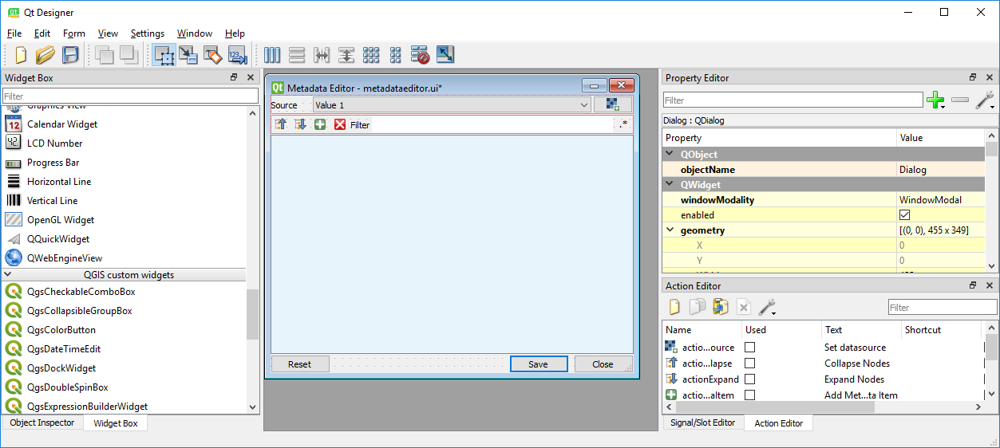
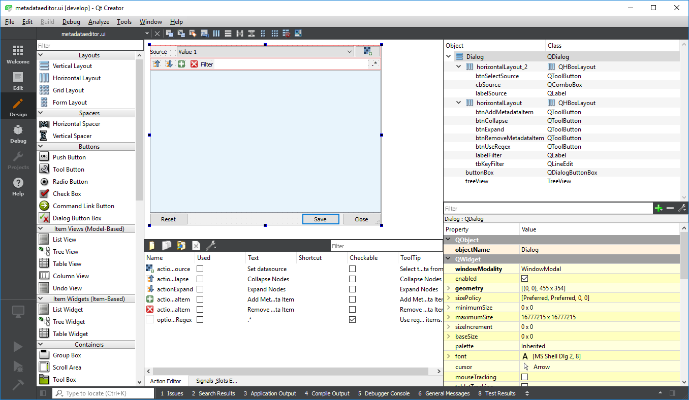

.. include:: external_links.rst

*Last Update: 2020-08-12*

.. _dev_installation:

Installation
############

Overview
========

If you like to develop an EnMAP-Box application, or more general, a QGIS and Qt application, we recommend to use
a state-of-the-art Integrated Development Environment (IDE) like `PyCharm`_. It offers run-time debugging,
code completion, spell-checking, syntax highlighting, SCM support, unit-testing and many other helpful things.

1. Have Git installed
=====================

If not, download and install *Git* from https://git-scm.com/downloads

Check if git is installed to your local shell, e.g. as:

.. code-block:: bat

    C:\Windows\System32>git --version
    git version 2.26.0.windows.1

2. Clone this repository
========================

Clone the EnMAP-Box repository (or a fork) to your local ``my_repositories`` folder and update
its submodules by:

.. code-block:: bash

    cd my_repositories
    git clone --recurse-submodules git@github.com:EnMAP-Box/enmap-box.git
    cd enmap-box
    git config --local include.path ../.gitconfig

The last line ensures that pull requests will update submodules as well.

Now you can use `git pull <https://git-scm.com/docs/git-pull>`_ to update your local copy of the
EnMAP-Box repository:

.. code-block:: bash

    cd my_repositories/enmap-box
    git pull

.. tip::

        Replace the repo uri with that of your EnMAP-Box repo fork, if you like to
        provide code via pull requests.

.. _dev_installation_create_conda_qgis:

3. Setup a QGIS environment
============================

This section gives examples how you can setup a QGIS & EnMAP-Box development used by PyCharm on different platforms.

a) OSGeo4W (Windows)
--------------------

1. Install or update packages
~~~~~~~~~~~~~~~~~~~~~~~~~~~~~

1. Install QGIS using the OSGeo4W Network installer https://qgis.org/en/site/forusers/download.html

2. Install the OSGeo4W environment to a folder of choice (preferably one you have permanent writing access to).
   In following this is called `OSGeo4W`.

2. Start the OSGeo4W Setup.

3. Go forward to these steps by clicking `next`. Usually the default settings should be fine
    * 'Advanced Install'
    * 'Install from Internet'
    * 'Root Directory' (should be your `OSGEO4W` directory)
    * Select Local Package Directory (default)
    * Select Your Internet Connect (default Direct Connection)
    * Choose A Download Site (default https://download.osgeo.org )

4. Select Packages to install / update

    +---------------------+------------------------------+
    | Package             | Note                         |
    +=====================+==============================+
    | qgis                | recent official QGIS version |
    +---------------------+------------------------------+
    |python3-scikit-learn |                              |
    +---------------------+------------------------------+

5. Press Next to install packages / updates

2. Setup development environment
~~~~~~~~~~~~~~~~~~~~~~~~~~~~~~~~

1. Copy the `qgis-env.bat` and `start_pycharm.bat` from https://github.com/EnMAP-Box/enmap-box/tree/main/scripts/OSGeo4W
   to a local folder, e.g. your windows desktop
2. Modify the `qgis-env.bat` config section to fit to your local environment, i.e. set the correct paths to your
   local OSGeoW installation and PyCharm executable

    .. code-block:: batch

        @echo off

        :: ### CONFIG SECTION ###
        :: root of local OSGEO4W installation
        set OSGEO4W_ROOT=D:\OSGeo4W
        :: PyCharm executable, adjust for version updates
        set PYCHARM_EXE="C:\Program Files (x86)\JetBrains\PyCharm 2022.1.2\bin\pycharm64.exe"

        :: git binaries and git lfs binaries
        set BIN_GIT=C:\Program Files\Git\bin
        set BIN_LFS=C:\Program Files\Git LFS

3. Call `start_pycharm.bat` to open PyCharm within the latest QGIS release.
   You can modify the start script to start a different QGIS build. E.g.

    .. code-block:: batch

        call "%~dp0\qgis-env.bat" qgis-ltr
        start "PYCHARM" /B %PYCHARM_EXE%

   will start the QGIS Long Term Release (if installed) instead of the latest QGIS release (`qgis`).

   Possible QGIS versions provided by the OSGeo4W installer are:

   +----------------+--------------------------------------------------+
   | Build          | Description                                      |
   +================+==================================================+
   | `qgis`         | QGIS Desktop (latest release)                    |
   +----------------+--------------------------------------------------+
   | `qgis-ltr`     | QGIS Desktop (long term release)                 |
   +----------------+--------------------------------------------------+
   | `qgis-dev`     | QGIS nightly build of the development branch     |
   +----------------+--------------------------------------------------+
   | `qgis-rel-dev` | QGIS nightly build of the latest release branch  |
   +----------------+--------------------------------------------------+

b) Linux
--------

1. Install QGI  as described in https://qgis.org/en/site/forusers/download.html

c) macOS
--------
1. Install QGIS as described in https://qgis.org/en/site/forusers/download.html

d) Docker
---------

 tbd.

e) Setup Conda (all platforms)
--------------------------------
.. warning::

    Installing QGIS via conda is not officially supported by the QGIS core development team.
    The QGIS versions available in conda can therefore differ from the official QGIS versions!

The installation of QGIS within a `conda <https://docs.conda.io/en/latest>`_ /
`anaconda <https://www.anaconda.com/>`_ environment is (almost) the same on macOS, windows or linux. Using conda
it is often much easier to install additional python packages while admin rights are not required.`

1. Make sure `conda <https://docs.conda.io/en/latest/miniconda.html>`_ is installed on your system.

2. Create a new conda environment named *qgis_stable* as specified in `conda_environment.yml`:

.. code-block:: batch

   conda env create --name qgis_stable --file https://raw.githubusercontent.com/EnMAP-Box/enmap-box/main/conda_environment.yml

.. tip::

   Depending on the components and applications you like to use, it might be required to install more packages.
   If you cloned the EnMAP-Box repository you can also point to the local :file:`conda_environment.yml`.
   Edit the ``--name`` or the YAML file itself as you wish. For more information on creating and managing conda environments visit the `conda documentation <https://docs.conda.io/projects/conda/en/latest/user-guide/tasks/manage-environments.html?highlight=manage%20environments#creating-an-environment-from-an-environment-yml-file>`_

..
    .. tip::

       To inspect the The `conda_environment.yml` is part of the EnMAP-Box repo you will find a YAML file which defines a conda environment where all necessary dependencies for the EnMAP-Box are included:

       .. literalinclude:: /../../conda_environment.yml
          :caption: conda_environment.yml
          :language: yaml

    .. admonition:: macOS Users

            If you are using macOS and calling ``qgis`` does not show any application window, it might be necessary to set:

            .. code-block:: bash

               export QT_MAC_WANTS_LAYER=1

            This can be done permanently for the active conda environment by:

            .. code-block:: bash

               conda env config vars set QT_MAC_WANTS_LAYER=1

3.  `Activate <https://docs.conda.io/projects/conda/en/latest/user-guide/tasks/manage-environments.html?highlight=manage%20environments#activating-an-environment>`_
    the new environment

    .. code-block:: batch

       conda activate qgis_stable

4.  Now you can start `QGIS`_, the :ref:`dev_qt_designer` and :ref:`dev_qt_assistant` from your conda shell:

    .. code-block:: batch

       qgis
       designer
       assistant

5. To easily start applications like PyCharm in this environment, which have not been installed by conda, you might
   define an alias during the activation of the environment.

    * Create an activation script and define an alias for PyCharm:

      Windows: *<your conda installation>/envs/qgis_stable/etc/conda/activate.d/pycharm-activate.bat*

      .. code-block:: batch

         @echo off
         doskey pycharm="<path to pycharm executable>"

      MacOS: *<your conda installation>/envs/qgis_stable/etc.conda/activate.d/pycharm-activate.sh*

      .. code-block:: bash

         alias pycharm='open -a PyCharm\ CE.app'

    * For completeness, also create a deactivation script:

      Windows: *<your conda installation>/envs/qgis_stable/etc/conda/deactivate.d/others-deactivate.bat*

      .. code-block:: batch

        @echo off
        doskey pycharm=

      MacOS/Linux: *<your conda installation>/envs/qgis_stable/etc.conda/deactivate.d/pycharm-deactivate.sh*

      .. code-block:: bash

        alias pycharm=

.. _dev_setup_pycharm:

4. Setup PyCharm
================

1.  Start `PyCharm`_ and add `my_repositories/enmap-box` as new project via *File > Open File or Project*

2.  If this is not already the case, tell PyCharm where to find your Git-executable.
    Open *File > Settings > Version Control > Git* to set *Path to Git executable*. Press *Test* to check the used Git version.

    .. figure:: img/pycharm_git_settings.png

        Set the Git executable used by PyCharm

    .. tip::

        Use ``where`` to return the path of a git-executable that is available in your DOS/Linux/macOS shell

        .. code-block:: bat

            (qgis_stable) C:\>where git
            C:\Users\geo_beja\AppData\Local\Programs\Git\cmd\git.exe

3.  Switch to *Project: enmap-box > Project Interpreter* and select the QGIS python as python interpreter.

    .. figure:: img/pycharm_conda_interpreter_add.png

        Add the *qgis_stable* python to the list of python interpreters

    .. figure:: img/pycharm_conda_interpreter.png

        Select the *qgis_stable* python as project interpreter

4.  Switch to *Project Structure* and add the QGIS python folder as additional project content root.

    +---------------+--------------------------------------------------------------------------------------------+
    | OSGeo4W       | ``<your OSGeo4W folder>\bin\python``                                                       |
    +---------------+--------------------------------------------------------------------------------------------+
    | Linux         | ``/usr/bin/python3``                                                                       |
    +---------------+--------------------------------------------------------------------------------------------+
    | macOS         | ``/Application/QGIS.app/Contents/MacOS/bin/python3``                                       |
    +---------------+--------------------------------------------------------------------------------------------+
    | conda (win)   | ``<your conda installation>/envs/qgis_stable/Library/python``                              |
    +---------------+--------------------------------------------------------------------------------------------+
    | conda (linux) | ``<your conda installation>/envs/qgis_stable/share/qgis/python``                           |
    +---------------+--------------------------------------------------------------------------------------------+
    | conda (macOS) | ``<your conda installation>/envs/qgis_stable/QGIS.app/Contents/MacOS/../Resources/python`` |
    +---------------+--------------------------------------------------------------------------------------------+

    Right-click on the ``plugins`` subfolder and select :guilabel:`Sources`.
    This makes QGIS internal plugins like the "processing" plugin available to PyCharm.

    Now the PyQGIS API is available to your Python installation.

    .. tip::

        The same way allows you to include other directories to your project's *PYTHONPATH*,
        e.g. to make code available from other folder or repositories.

    .. figure:: img/pycharm_project_content_roots.png

        Use ``qgis_stable/Library/python`` as additional content root

5.  PyCharm and PyQGIS may need the environmental variable ``QGIS_PREFIX_PATH``. Typical paths are:

    ================= ===============================================================================
    QGIS Installation QGIS_PREFIX_PATH
    ================= ===============================================================================
    OSGeo4W           `<OSGeo4W>/apps/qgis`
    Linux
    conda (Windows)   `<conda installation>\\envs\\qgis_stable\\Library`
    conda (Linux)     `<conda installation>/envs/qgis_stable`
    conda (macOS)     `<conda installation>/envs/qgis_stable/QGIS.app/Contents/Resources`
    ================= ===============================================================================

    If not already set in the environment from which you started PyCharm, you can set it explicitly.
    Open *Run > Debug ... > Edit Configurations* and add the *QGIS_PREFIX_PATH* to the User environmental variables.
    This way PyCharm runs python files in a environment with *QGIS_PREFIX_PATH* defined.

    .. figure:: img/pycharm_QGIS_PREFIX_PATH.png

    Also define the Environment variables for the Python console. Go to *File > Settings > Build, Execution, Deployment > Console > Python Console*
    and add *QGIS_PREFIX_PATH* to the Environment variables.

    .. figure:: img/pycharm_qgispath_console.png

    You may also modify the shell used in your PyCharm terminal to use the QGIS environment.
    Open *Tools > Terminal* and set the shell path to, for example:

    ================= ===============================================================================
    QGIS Installation Terminal path
    ================= ===============================================================================
    OSGeo4W           ``cmd.exe "/K" qgis_env.bat`` (see above how to create the ``qgis_env.bat``)
    conda (Windows)   ``cmd.exe "/K" <conda installation>\Scripts\activate.bat qgis_stable``
    ================= ===============================================================================

    .. figure:: img/pycharm_conda_terminal.png

        How to use the conda terminal in PyCharm

7.  Test the Python environment

    To check if the QGIS API is available, open a *Python Console* and import the `QgsApplication`_ object.

    .. code-block:: python

        from qgis.core import QgsApplication
        QgsApplication.instance() is None

    The output should return ``True``, as we have not initialized any QgsApplication.

    Now check if we can use the EnMAP-Box API to start the EnMAP-Box

    .. code-block:: python

        import enmapbox
        enmapbox.run()

    This should initialize a new QgsApplication and start the EnMAP-Box.
    The outputs printed to the python shell should look like:

    .. code-block:: bash

        Application state:
        QGIS_PREFIX_PATH env var:		D:\miniconda3\envs\qgis_stable\Library
        Prefix:		D:\miniconda3\envs\qgis_stable\Library
        Plugin Path:		D:\miniconda3\envs\qgis_stable\Library/plugins
        Package Data Path:	D:\miniconda3\envs\qgis_stable\Library/.
        Active Theme Name:
        Active Theme Path:	D:\miniconda3\envs\qgis_stable\Library/./resources/themes\\icons/
        Default Theme Path:	:/images/themes/default/
        SVG Search Paths:	D:\miniconda3\envs\qgis_stable\Library/./svg/
                C:\Users\geo_beja\AppData\Local\Temp\QGIS-PythonTestConfigPathp1k7w_s_\profiles\default/svg/
        User DB Path:	D:\miniconda3\envs\qgis_stable\Library/./resources/qgis.db
        Auth DB Path:	C:\Users\geo_beja\AppData\Local\Temp\QGIS-PythonTestConfigPathp1k7w_s_\profiles\default/qgis-auth.db

    If the terminal environment was setup well, you
    can start the EnMAP-Box from the *Terminal* window as well by

    .. code-block:: bat

        (qgis_stable) ..\enmap-box>python enmapbox

Other Tools
===========

The Qt company provides several tools to that help to create Qt applications and are useful for PyQt and PyQGIS users
as well.

.. _dev_qt_assistant:

Qt Assistant
------------

The Qt Assistant allows you to browse fast and offline through Qt help files (``*.qch``). These files exists for
all Qt classes and the QGIS API. They can be generated event with Sphinx, which allows you to provide your
own source-code documentation as ``.qch`` file as well.

1.  Start the Qt Assistant, e.g. from your PyCharm terminal:

    .. code-block:: bat

        (qgis_stable) $>assistant

2.  Download the ``*.qch*`` files which contain:

    * the Qt API documentation files: https://github.com/PierreRaybaut/PyQtdoc
    * the QGIS API documentation  `qgis.qch <https://api.qgis.org/api/qgis.qch>`_

    Go to *Preferences > Add* and add the following ``*.qch`` files

    ============= =====================================
    File          Documentation
    ============= =====================================
    qgis.qch      qgis.core, qgis.gui
    qtcore.qch    Qt5.QtCore
    qtgui.qch     Qt5.QtGui
    qtwidgets.qch Qt5.QtWidgets
    ============= =====================================

    Now you can explore the Qt (``Q...``) and QGIS (``Qgs...``) classes

    .. figure:: img/qt_assistant.png
         :width: 100%

.. _dev_qt_designer:

Qt Designer
-----------

The Qt Designer is a powerful tool to create GUI frontends by drawing, drag and drop.
Created GUI form files are saved in a XML file ending with ``*.ui``. These can be called from
python to automatically create the entire GUI backend, e.g. windows and buttons defined with the Qt Designer.

You can start the Qt Designer from your PyCharm terminal by:

    .. code-block:: bat

        (qgis_stable) $>designer

     Qt Designer showing the metadataeditor.ui for the Metadata editor.

..

Qt Creator
----------

Qt Creator is the one-in-all IDE to develop Qt C++ applications. It includes the functionality covered by Qt Assistant
(here called Help) and Qt Designer (here called form designer) and helps to browse C++ code. It is the preferred tool to
explore the QGIS C++ source code, for example if you like to better understand what it does behind the QGIS python API.

Qt and the Qt Creator are available at https://www.qt.io/download. Ensure to install the code documentation for the same
Qt version used by QGIS.

     Qt Creator with opened metadataeditor.ui.

..
        SSH access on windows
        1. create a ssh key pair
        2. upload public key to repository of choice
        3. install Putty
        4. start Pageant.ext and add your private key to
        5. add :code:`set GIT_SSH=C:\Program Files\PuTTY\plink.exe` to your startup script
        6. there is an issue with a frozen command line when a server is connected the first time with ssh
           (see https://stackoverflow.com/questions/33240137/git-clone-pull-continually-freezing-at-store-key-in-cache)
           to solve it, start putty and connect to the server once per SSH (e.g. to github.com).
           putty will save its fingerprint
        7. now you can call git push using ssh authentication in background

OSGeo4W for Devs
================

If you work on windows and want to test your code based on nightly builds of the upcoming QGIS
version, or like to inspect/debug the QGIS C++ API at runtime, you might use the OSGeo4W
installer to setup your development environment:

Setup Environment
-----------------

1. Download the (new) OSGeo4W installer (`osgeo4w-setup.exe` from https://www.qgis.org/en/site/forusers/download.html )

2. Install the nightly build branch `qgis-dev` and related debug symbols `qgis-dev-pdb`.

3. Install other required packages, e.g. pip3 etc. Later on.
   In case of missing packages, search and install via OSGeo4W installer first. If not available there, use
   the OSGeo4W shell and call `pip`.

4. Create a `qgis-dev-env.bat` to setup your QGIS environment

    .. code-block:: bash

        set OSGEO4W_ROOT=D:\OSGeo4W
        set QGISDISTR=qgis-dev
        set DIR_GIT=C:\Program Files\Git\cmd
        set DIR_LFS=C:\Program Files\Git LFS
        :: add GIT and LFS to path

        call "%OSGEO4W_ROOT%\bin\o4w_env.bat"
        path %OSGEO4W_ROOT%\apps\%QGISDISTR%\bin;%DIR_GIT%;%DIR_LFS%;%PATH%

        set QGIS_PREFIX_PATH=%OSGEO4W_ROOT:\=/%/apps/%QGISDISTR%
        set GDAL_FILENAME_IS_UTF8=YES
        rem Set VSI cache to be used as buffer, see #6448
        set VSI_CACHE=TRUE
        set VSI_CACHE_SIZE=1000000
        set QT_PLUGIN_PATH=%OSGEO4W_ROOT%\apps\%QGISDISTR%\qtplugins;%OSGEO4W_ROOT%\apps\qt5\plugins
        set PYTHONPATH=%OSGEO4W_ROOT%\apps\%QGISDISTR%\python;%OSGEO4W_ROOT%\apps\%QGISDISTR%\python\plugins;%PYTHONPATH%

    Don't forget to make git and git-lfs available in this environment.

5. Create a `qgis-dev-pycharm.bat` in the same folder as `qgis-dev.bat` that starts PyCharm

    .. code-block:: bash

        call "%~dp0\QGIS-dev.bat"
        set PYCHARM_EXE="C:\Program Files (x86)\JetBrains\PyCharm 2020.3.4\bin\pycharm64.exe"

        start "PYCHARM" /B %PYCHARM_EXE%

        :: uncomment to start QGIS
        :: start "QGIS" /B "%OSGEO4W_ROOT%\bin%QGISDISTR%-bin.exe" %*

6. Call `qgis-dev-pycharm.bat` to start PyCharm and set your project settings to:

* Project Interpreter: `<OSGEO4W>\bin\python.exe`

    .. figure:: img/pycharm_osgeo4w_interpreter.png
         :width: 100%

         Using the OSGeo4W python as project interpreter.

* Terminal Shell Path: `cmd.exe "/K" <your path to>\qgis-dev.bat`
  (this is why we created two batch files. `qgis-dev.bat` setups the environment, but does not start any app)

    .. figure:: img/pycharm_osgeo4w_terminal.png
         :width: 100%

         The `qgis-dev.bat` will be called when starting the terminal

* add `<OSGEO4W>\apps\qgis-dev\python` and
  `<OSGEO4W>\apps\qgis-dev\python\plugins` as source folders

    .. figure:: img/pycharm_osgeo4w_content_roots.png
         :width: 100%

         Adding the QGIS `python` and `python\plugins` folder as content roots.

Debug QGIS with Visual Studio
-----------------------------

1. Clone the QGIS repo and checkout the latest master

2. Install Visual Studio and open the QGIS repo

3. Start a QGIS desktop, e.g. with `qgis-dev` from the OSGeo4W shell

4. Attach the Visual Studio debugger to a QGIS desktop instance

* Open Debug > Attach to Process (CTRL+ALT+P)

* Filter available processes by 'QGIS' and, e.g., select `qgis-dev-bin.exe`

* Press the Attach button

References
==========

- Git -the simple guide (no deep shit) https://rogerdudler.github.io/git-guide/
- Qt5 C++ API https://doc.qt.io/qt-5/
- QGIS C++ API https://api.qgis.org/api/
- QGIS Python https://qgis.org/pyqgis
- QGIS Python developer cookbook https://docs.qgis.org/3.4/en/docs/pyqgis_developer_cookbook

