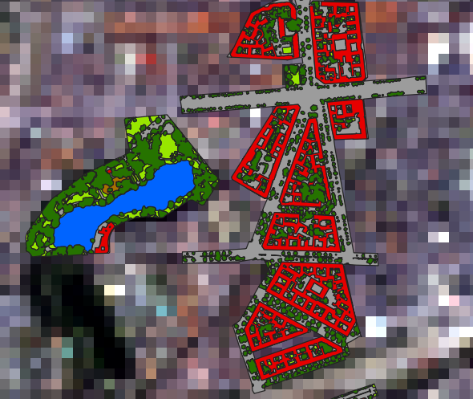
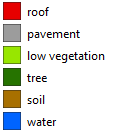
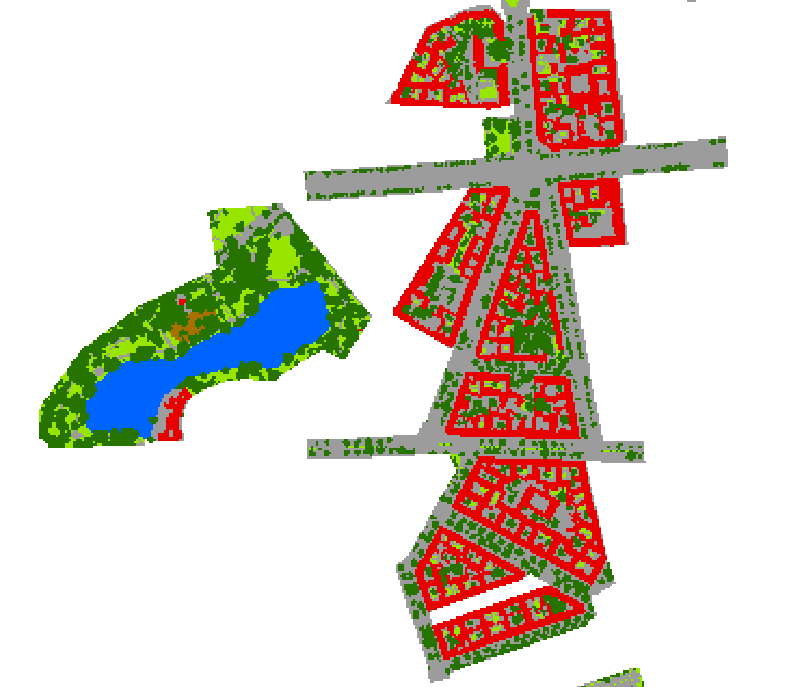
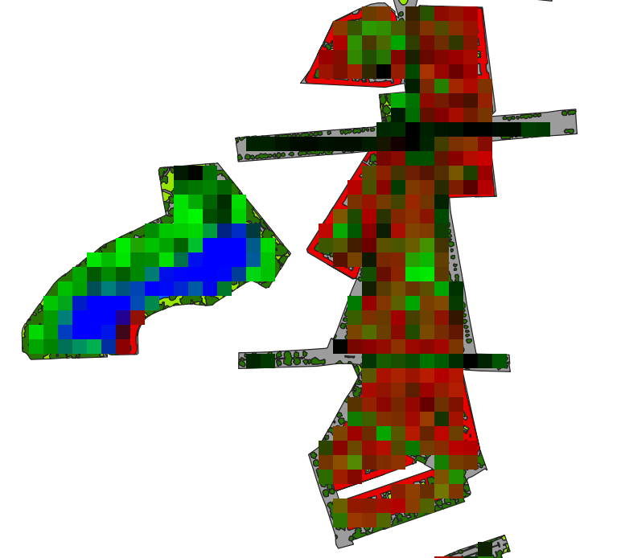
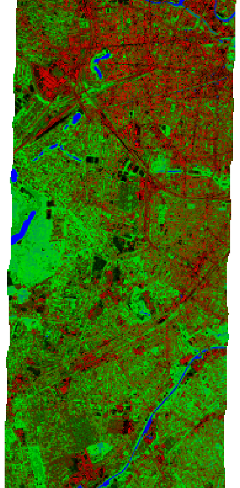
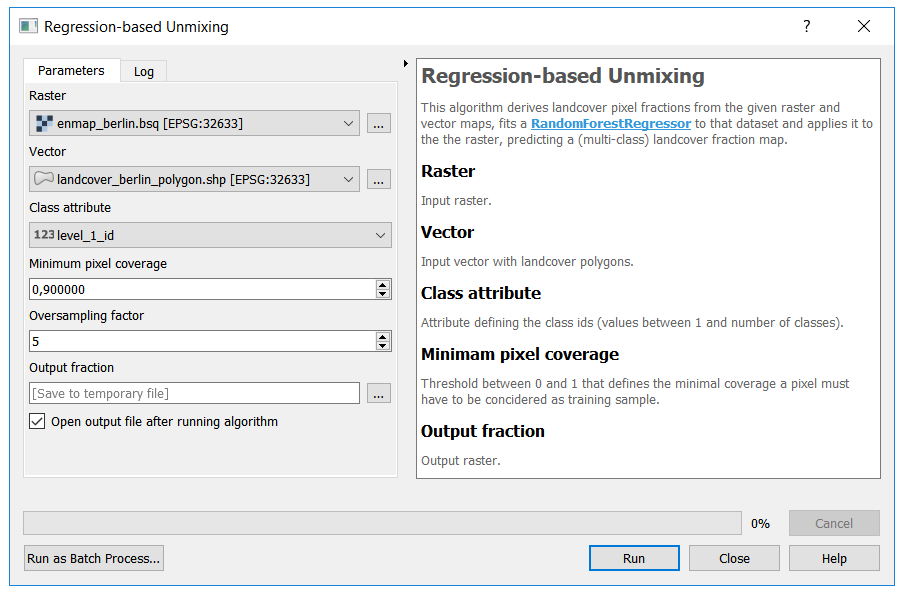
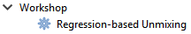
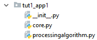
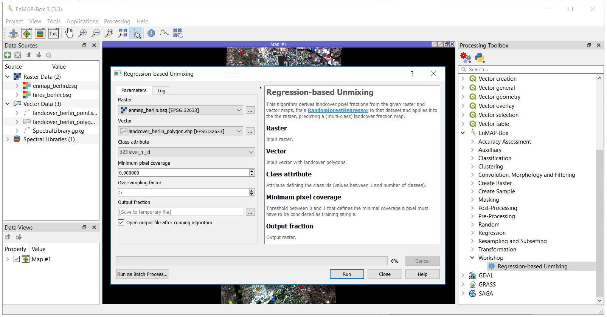

1. Implementing Processing Algorithms
#####################################

Overview
========

In this tutorial will you learn:

1.	how to implement an image processing algorithm in Python (i.e. **core algorithm**) using the HUB Datacube API
2.	how to integrate the **core algorithm** into the QGIS Processing Framework (i.e. **processing algorithm**)
3.  how to integrate the **processing algorithm** into the EnMAP-Box (i.e. **EnMAP-Box Application**)

To put everything into context, we will follow the use case described below.

Use case description
====================

In this tutorial we want to implement a workflow for regression-based landcover fraction unmixing.
We use the EnMAP-Box testdata to explain and visualize all the details, but the implementation is not limited to that specific dataset.

Our data are a simulated 30 m EnMAP raster and a vector with detailed landcover polygons:

    Simulated 30 m EnMAP raster (enmap_berlin.bsq) overlayed by landcover polygons (landcover_berlin_polygon.shp)

    Landcover categories

The landcover is rasterized at a detailed resolution (e.g. 10 times finer than the EnMAP resolution):

    Rasterized landcover at 3 m resolution (oversampling the EnMAP resolution by factor 10)

The rasterized landcover is aggregated into the target resolution (i.e. 30 m EnMAP):

    Aggregated 30 m landcover fraction as false-color-composition: Red=’roof’, Green=’tree’ and Blue=’water’

Finally, a Random Forest Regressor is fitted with the created dataset and applied to the whole EnMAP raster to
derive a landcover fraction map:

    Predicted 30 m landcover fractions as false-color-composition: Red=’roof’, Green=’tree’ and Blue=’water’

Core algorithm implementation
=============================

The core algorithm is implemented using the **HUB Datacube API**. Here is a full listing:

Code listing
------------

.. literalinclude:: tut1_app1/core.py
    :caption:

Test environment
----------------

Here is a test setup using the EnMAP-Box testdata:

.. literalinclude:: tut1_app1/test_core.py
    :caption:

.. admonition:: Task

    - Start PyCharm via the `PyCharm Start Script <https://enmap-box.readthedocs.io/en/latest/dev_section/dev_installation.html#ide-start-script>`_.

    - Open and run the **test_core.py** script (right click into the editor and click **Run 'test_core'**).

      .. image:: pt1/pycharm_run.png

The final result will be shown in a map viewer:

Code discussion
---------------

In the following section we will explore the implementation interactively and in great detail.

.. admonition:: Task

    - Open the **core.py** module.

    - Set breakpoints at the beginning of each section, e.g.

      .. image:: pt1/breakpoints.png

    - Run the **test_core.py** script in debug mode.

      .. image:: pt1/pycharm_debug.png

    - Investigate the program state at each breakpoint via the debug view.

      .. image:: pt1/pycharm_debug_view.png

    - Answer the questions stated below.

----

Import everything from the ``hubdc.core`` module:

.. literalinclude:: tut1_app1/core.py
    :caption:
    :start-after: # 0
    :end-before: # 1

----

Define the core function signature and provide a descriptive doc string:

.. literalinclude:: tut1_app1/core.py
    :start-after: # 1
    :end-before: # 2

----

Open the raster and vector input files.

.. literalinclude:: tut1_app1/core.py
    :start-after: # 2
    :end-before: # 3

.. admonition:: Exercise

    Investigate the ``raster`` and ``vector`` variables via the Evaluate View (press **Alt+F8**).

    .. image:: pt1/pycharm_evaluate_view.png

    .. raw:: html

       

       
1. What are their types?

       
The type of <b>raster</b> is hubdc.core.RasterDataset. 
       The type of <b>vector</b> is hubdc.core.VectorDataset.

       

       

       
2. Find more information in the <a href="https://hub-datacube.readthedocs.io">HUB Datacube Documentation</a>!

       Usage examples are listed in the Cookbook: 
       <a href="https://hub-datacube.readthedocs.io/en/latest/usage/core.html#raster-dataset">RasterDataset recipes</a> 
       <a href="https://hub-datacube.readthedocs.io/en/latest/usage/core.html#vector-dataset">VectorDataset recipes</a> 
       

       

       
3. What is the shape (i.e. bands, ysize, xsize) of the raster?

       <code>raster.shape() = bands, ysize, xsize = (177, 400, 220)</code>
       

----

Get the target ``grid`` from the raster and define a new ``gridOversampled`` with the same extent,
but finer oversampled resolution.

Create a class ``idRaster`` by rasterizing the vector class attribute into the oversampled grid.

Read the data from the id raster into a Numpy ``idArray``.

.. note::

    It is assumed that the id of the first class is 1, of the second class is 2, and so on.
    The largest id is equal to the number of classes.

.. literalinclude:: tut1_app1/core.py
    :start-after: # 3
    :end-before: # 4a

.. admonition:: Exercise

    .. raw:: html

       

       
1. Explain by what elements a grid is characterized!

       
A grid is characterized by an Extent (bounding box and projection) and a Resolution.

       

       

       
2. What is the difference between <b>grid</b> and <b>gridOversampled</b>.

       The resolution, and derived from that, their shape: 
       <code>grid.shape() = ysize, xsize = (400, 220)</code>
       <code>gridOversampled.shape() = ysize, xsize = (4000, 2200)</code>
       

       

       
3. What is the shape of the <b>idArray</b> and what values are stored in it?

       <code>idArray.shape = bands, ysize, xsize = (1, 4000, 2200)</code>
       <code>np.unique(idArray) = [0, 1, 2, 3, 4, 5, 6]</code>
       

----

Derive the number of classes fom the ``idArray`` and initialize the ``fractionArray``.

.. literalinclude:: tut1_app1/core.py
    :start-after: # 4a
    :end-before: # 4b

.. admonition:: Exercise

    .. raw:: html

       

       
What is the shape of the <b>fractionArray</b>?

       <code>fractionArray.shape = bands, ysize, xsize = (6, 400, 220)</code>
       

Derive for each class a binary occurrence ``maskArray`` and create a ``maskRaster`` from it.

.. literalinclude:: tut1_app1/core.py
    :start-after: # 4b
    :end-before: # 4c

.. admonition:: Exercise

    .. raw:: html

       

       
Visualize the <b>maskRaster</b> in a map viewer!

       <code>MapViewer().addLayer(maskRaster.mapLayer()).show()</code> 
       
       

Aggregate the ``maskRaster`` into the ``fractionRaster`` by resampling it into the target ``gridOversampled``.

Read the data from the ``fractionRaster`` into the prepared ``fractionArray``.

.. literalinclude:: tut1_app1/core.py
    :start-after: # 4c
    :end-before: # 5

.. admonition:: Exercise

    .. raw:: html

       

       
Visualize the <b>fractionRaster</b> in a map viewer!

       <code>MapViewer().addLayer(fractionRaster.mapLayer()).show()</code> 
       
       

Sum up all class-wise fractions into an overall pixel ``coverageArray``.

.. literalinclude:: tut1_app1/core.py
    :start-after: # 5
    :end-before: # 6

Compare the overall ``coverageArray`` to the minimal ``coverage`` threshold to find sufficiently covered pixel.

For all ``valid`` pixels, extract the raster ``profiles`` and class fraction ``labels``.

.. literalinclude:: tut1_app1/core.py
    :start-after: # 6
    :end-before: # 7

.. admonition:: Exercise

    .. raw:: html

       

       
How many valid pixel are left?

       <code>np.sum(valid) = 1666</code> 
       

       

       
If the <b>coverage</b> condition would be 0.5, how many valid pixel are left?

       <code>np.sum(coverageArray >= 0.5) = 2038</code> 
       

       

       
What are the shapes of the <b>profiles</b> and <b>labels</b>?

       <code>profiles.shape = bands, samples = 177, 1666</code> 
       <code>labels.shape = bands, samples = 6, 1666</code> 
       

.. tip::

    `Numpy array indexing <https://docs.scipy.org/doc/numpy/user/basics.indexing.html>`_
    can become quite complex. Get yourself familiarized with it.

----

Use the extracted profiles and labels to fit a multi-target Random Forest Regressor.

.. literalinclude:: tut1_app1/core.py
    :start-after: # 7
    :end-before: # 8

.. tip::

    Get yourself familiarized with the Scikit-Learn
    `RandomForestRegressor <https://scikit-learn.org/stable/modules/generated/sklearn.ensemble.RandomForestRegressor.html>`_.

.. admonition:: Exercise

    .. raw:: html

       

       
Plot the Random Forest feature importances! Use the <b>plt.plot</b> function.

       <code>plt.plot(rfr.feature_importances_)</code> 
       
       

----

Read raster data into an ``array``.

Identify all ``valid`` pixels.

Extract and prepare valid samples as input ``X`` for prediction.

Predict class fractions ``y`` using the Random Forest Regressor for all valid pixels.

Initialize result ``fractionArray`` with a no data value of -1.

Fill prediction ``y`` into the ``fractionArray``.

.. literalinclude:: tut1_app1/core.py
    :start-after: # 8
    :end-before: # 9a

.. admonition:: Exercise

    .. raw:: html

       

       
The way the <b>valid</b> pixel mask is calculated, is not universal.
        What is the problem and how could it be improved?

       We only evaluate the first band for no data pixel.
       If the value of a pixel in the first band is valid, but has a no data value in one of the other bands,
       we would pass an invalid sample to the predict method, which could cause problems. 
       Solution: <code>valid = np.all([a != ndv for a, ndv in zip(array, raster.noDataValues()], axis=0)</code> 
       

----

Write the ``fractionArray`` as a ``fractionRaster`` and set the no data value.

.. literalinclude:: tut1_app1/core.py
    :start-after: # 9a
    :end-before: # 9b

.. admonition:: Exercise

    .. raw:: html

       

       
What raster format was used for creating the <b>fractionRaster</b>?

       We derive the raster driver from the output filename extention <b>'.bsq'</b>,
       which is associated with the <b>ENVI</b> driver. 
       Investigate the <b>RasterDriver.fromFilename</b> source for more details.
       

       

       
How would you create a GeoTiff output?

       Change the output filename to <b>'fraction.tif'</b>. 
       Or set the driver explicitely: <code>driver = RasterDriver(name='GTiff')</code>
       

.. tip::

    Get yourself familiarized with the full list of
    `GDAL Raster Formats <https://www.gdal.org/formats_list.html>`_.

----

.. tip::

    The EnMAP-Box has introduced a special attribute definition format for categorical vector data,
    stored as a JSON file. It allows to specify category names and colors:

    .. literalinclude:: pt1/landcover_berlin_polygon.json
      :language: JSON

    The category legend for the **level_3_id** attribute would look like this.

    .. image:: pt1/class_legend_level3.png

If an attribute definition file is available, set the category names as raster band names.

.. literalinclude:: tut1_app1/core.py
    :start-after: # 9b

----

This concludes the code discussion.

Core algorithm (advanced)
=========================

The above **core algorithm** implementation is operating on the full dataset at once.
This may be acceptable for quick and dirty prototyping, small datasets or "throw-away-after-creating-my-results" scenarios.

But if you want to release an algorithm to a wider community, you should consider a more memory-efficient implementation.

Here is an adoption of the original **core algorithm**,
where the data input and output is done on smaller memory-efficient subgrids.

.. literalinclude:: tut1_app2/core.py
    :caption:

Processing Framework integration
================================

To integrate the **core algorithm** into the **QGIS Processing Framework**, we derive from the **QgsProcessingAlgorithm** class.
This provides us with an auto-generated graphical user interface:

Here is a full listing of the implementation:

Code listing
------------

.. literalinclude:: tut1_app1/processingalgorithm.py
    :caption:

Test environment
----------------

Here is a test setup using the EnMAP-Box testdata:

.. literalinclude:: tut1_app1/test_processingalgorithm.py
    :caption:

.. admonition:: Task

    Open and run the **test_processingalgorithm.py** script in PyCharm.

Prints::

    {'outfraction': 'C:/enmap-box-workshop2019/programming_tutorial1/tut1_app1\\fraction.bsq'}

The final result will be shown in a map viewer:

Code discussion
---------------

In the following section we will explore the implementation in detail.

----

Import our **core algorithm** and everything from the ``qgis.core`` module:

.. literalinclude:: tut1_app1/processingalgorithm.py
    :start-after: # 0
    :end-before: # 1

----

Define a new class that derives from **QgsProcessingAlgorithm**.

Define various keys for all algorithm parameters we need to acquire from the user.

.. literalinclude:: tut1_app1/processingalgorithm.py
    :start-after: # 1
    :end-before: # 2

----

Define the **group** and **displayName** (and their internal identifiers) for placing the algorithm into the list of available algorithms:

.. literalinclude:: tut1_app1/processingalgorithm.py
    :start-after: # 2
    :end-before: # 3

----

Define the **initAlgorithm** method to specify all parameters needed for the core algorithm.
This defines the auto-generated GUI.

.. literalinclude:: tut1_app1/processingalgorithm.py
    :start-after: # 3
    :end-before: # 4

.. tip::

    Get yourself familiarized with the full list of QGIS processing parameters.
    In the `QGIS API Class List <https://qgis.org/api/annotated.html>`_,
    search [Ctrl+F] for the term **QgsProcessingParameter** to find the list of available parameters.

    .. image:: pt1/parameter_list.png

    .. image:: pt1/parameter_list2.png

    |

    .. warning::

        The QGIS API Documentation is written in C++ terminology.
        At first, users who don't know about C++ find it hard to understand C++ API Docs.
        However, over time it's getting easier. **Getting used to C++ terminology is inevitable**.

----

Define the **processAlgorithm** method that wraps the **core algorithm** implemented above.

With the various **self.parameterAs<type>(parameters, self.P_<key>, context)** evaluation statements,
we query the selected user inputs and pass it to the **core algorithm**.

Finally, we return a dictionary of all created outputs.

Also note **try-except** idiom, that is used to handle any uncatched exceptions.

.. literalinclude:: tut1_app1/processingalgorithm.py
    :start-after: # 4
    :end-before: # 5

.. tip::

    Get yourself familiarized with the full list of evaluation methods.
    In the `QgsProcessingAlgorithm <https://qgis.org/api/classQgsProcessingAlgorithm.html>`_ documentation,
    search [Ctrl+F] for the term **parameterAs** to find the list of available evaluation methods.

    .. image:: pt1/parameterAs_list.png

    .. image:: pt1/parameterAs_list2.png

.. tip::

    Get yourself familiarized with the `QgsProcessingFeedback <https://qgis.org/api/classQgsProcessingFeedback.html>`_ class,
    which exposes various methods for providing progress feedback from the algorithm to the GUI.

----

Define a meaningful algorithm description which will be visible in the auto-generated GUI.

.. literalinclude:: tut1_app1/processingalgorithm.py
    :start-after: # 5
    :end-before: # 6

----

Provide a link to an external website, that is opened in the users web browser,
when the **Help** button in the auto-generated GUI is clicked.

.. literalinclude:: tut1_app1/processingalgorithm.py
    :start-after: # 6
    :end-before: # 7

----

Define how a new instance of this class is created.
Usually, this won't change, unless you need to parametrize your algorithm at creation time (rare!).

.. literalinclude:: tut1_app1/processingalgorithm.py
    :start-after: # 7

----

This concludes the code discussion.

EnMAP-Box integration
=====================

To integrate the **processing algorithm** into the **EnMAP-Box**,
create a folder structure with the above implemented **core.py** and **processingalgorithm.py** files:

In **__init__.py** we have to derive from the **EnMAPBoxApplication** class and
implement a **enmapboxApplicationFactory** method which returns an instance of our application.

Here is a full listing of the implementation:

Code listing
------------

.. literalinclude:: tut1_app1/__init__.py
    :caption:

Test environment
----------------

Here is a test setup using the EnMAP-Box testdata:

.. literalinclude:: tut1_app1/test_app.py
    :caption:

.. admonition:: Task

    Open and run the **test_app.py** script in PyCharm.

    After the **EnMAP-Box** is loaded, navigate to
    **EnMAP-Box > Workshop > Regression-based Unmixing** in the **Processing Toolbox** panel
    and execute the algorithm..

Deployment
----------

Up to now, the application is only visible after adding it programmatically to the EnMAP-Box via::

    enmapBox.addApplication(RegressionBasedUnmixingApp(enmapBox=enmapBox))

To also show it in the EnMAP-Box opened inside QGIS, we have two options:

1. Insert the application folder path into the **/enmapbox/coreapps/enmapboxapplications.txt** file::

    # this file describes other locations of EnMAP-Box applications
    # just give the PATH relative to the root directory

    C:\source\enmap-box-workshop2019\programming_tutorial1\tut1_app1

or

2. Copy the application folder into the **/enmapbox/apps** folder::

    /enmapbox
        /apps
            /tut1_app1

.. note::

    If you want your application shipped together with the EnMAP-Box, contact us:

    Andreas Rabe (andreas.rabe@geo.hu-berlin.de)

