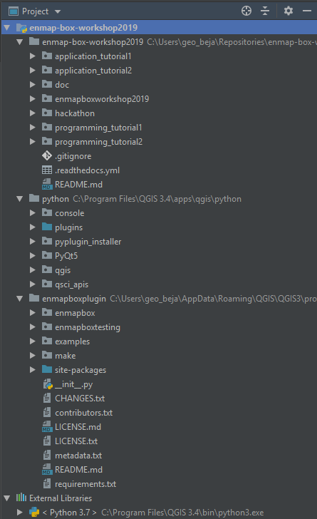

.. include:: ../../external_links.rst

Setup your programming project
##############################

#. Install the EnMAP-Box as QGIS Plugin, as described in https://enmap-box.readthedocs.io/en/latest/usr_section/usr_installation.html
   Start the EnMAP-Box and open *Project* > *Load Example Data*, which will download and install the EnMAP-Box
   testdata sets.

#. Create a workshop folder, hereafter referred as ``<workshop folder>``

#. Clone the workshop repository and checkout the develop branch

    .. code-block:: batch

        cd <workshop folder>
        git clone https://bitbucket.org/hu-geomatics/enmap-box-workshop2019.git
        cd enmap-box-workshop2019
        git checkout develop

#. Start PyCharm and create a new project ``<workshop folder>/programming_tutorial``.

#. Set the QGIS python as python interpreter
   (for more details on this and the following steps you might also read `here <https://enmap-box.readthedocs.io/en/latest/dev_section/dev_installation.html#create-a-new-project>`)

#. Add the workshop repository folder ``enmap-box-workshop2019`` to your project sources

#. Add the QGIS python code folder ``<QGIS Root>/apps/qgis/python`` to your project sources and mark its ``plugins`` subfolder  as source root.

    .. note::

        Folders in the PyCharm project tree can be defined as source root by right-mouse click > `Mark Directory as` > `Source Root`.

#. Add the EnMAP-Box plugin folder to your project sources and mark its ``site-packages`` subfolder as source root.

    PyCharm project structure after adding the QGIS and EnMAP-Box source code as project sources

