.. _ProgTT_basicsFOO:

Part I: Basics
==============

.. _ProgTT_basics_exercise1_hello_world:

1. Hello World
--------------

Creating a GUI with Qt is simple. If we start from scratch, we first need to
create a |QApplication| instance::

    from PyQt5.QtWidgets import QApplication, QWidget

    app = QApplication([])

This initializes the Qt framework, allows us to draw widgets on screen and to react on user
inputs. Now we can create our first widget and show it::

    widget = QWidget()
    widget.setWindowTitle('Hello World')
    widget.show()

    app.exec_()

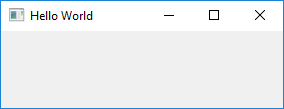

    Example 1: An empty *Hello World* widget.

.. tip::

    |QWidget| is the base class of all Qt widgets. |QWidgets| offer several customizations, e.g.::

        widget.setFixedSize(150, 200) # change width and height
        widget.setVisible(False) # hide the widget

Please note the ``app._exec_()`` line. It tells our |QApplication| instance to enter the event loop.
This loop regularly checks if there are any user inputs, e.g. mouse movements or keyboard events, and react to.

Replace ``app._exec_()`` with ``print('Application finished')`` and see what happens. The widget might show up for
some milliseconds, but disappears as the main application terminates immediately.

.. note::

    * A |QApplication| already exists if we start from the QGIS python console or when our code is called from an EnMAP-Box instance.

    * If we start our own python shell, e.g. out of PyCharm, we (i) need to initialize a |QApplication| and
      (ii) enter it's event loop.

    * A |QApplication| needs to be instantiated *only once*. The `Qt documentation <https://doc.qt.io/qt-5/qapplication.html#details>`_ writes:

        `For any GUI application using Qt, there is precisely one QApplication object, no matter whether the application has
        0, 1, 2 or more windows at any given time.
        For non-QWidget based Qt applications, use QGuiApplication instead, as it does not depend on the QtWidgets library.`

**Summary**

You now learned to:

* initialize a |QApplication| and start the GUI event loop

* create |QWidgets| and show them on screen

**Complete code**

.. code-block:: python

    def test_example1_hello_world(self):

        from PyQt5.QtWidgets import QApplication, QWidget

        app = QApplication([])

        widget = QWidget()
        widget.setWindowTitle('Hello World')
        widget.show()

        app.exec_()
        print('Application finished')

.. _basics_exercise1_hello_real_world:

2. Hello Real World
-------------------

This tutorial addresses GIS and remote sensing people, so let's use the
`QGIS API <https://api.qgis.org/api/>`_ to visualize *real world* spatial data.

Similar to the Qt framework and its |QApplication|, we need to initialize the QGIS API first by
creating a |QgsApplication|. To simplify a couple issues, we use the EnMAP-Box API to do so::

    from enmapbox.testing import start_app
    app = start_app()

.. note::

    * |QgsApplication| inherits *|QApplication|*, so it's not required to create a separated one

    * ``enmapbox.testing.start_app(...)`` creates a |QgsApplication| instance *and* emulates
      several aspects of a real QGIS Desktop Application. E.g. it loads different raster drivers, initializes
      the QGIS Processing Framework and create a QGIS Desktop Application mockup.

Now we can create a |QgsRasterLayer| that shows a web map service with the google satellite map::

    from qgis.core import QgsRasterLayer
    uri = r'crs=EPSG:3857&format&type=xyz&url=https://mt1.google.com/vt/lyrs%3Ds%26x%3D%7Bx%7D%26y%3D%7By%7D%26z%3D%7Bz%7D&zmax=19&zmin=0'
    layer = QgsRasterLayer(uri, 'google maps', 'wms')
    assert layer.isValid()

The |QgsMapCanvas| visualizes |QgsMapLayers|, like our |QgsRasterLayer|. Before map layers can be rendered, they need to be
stored in a |QgsMapLayerStore|. This will be done if we add them to the current |QgsProject| instance::

        from qgis.gui import QgsMapCanvas
        from qgis.core import QgsProject

        QgsProject.instance().addMapLayer(layer)

        canvas = QgsMapCanvas()
        canvas.setWindowTitle('Hello Real World')
        canvas.setLayers([layer])

Now we focus the map canvas to the spatial extent of our raster layer and start the application loop::

        canvas.setExtent(layer.extent())
        canvas.setDestinationCrs(layer.crs())
        canvas.show()
        app.exec_()

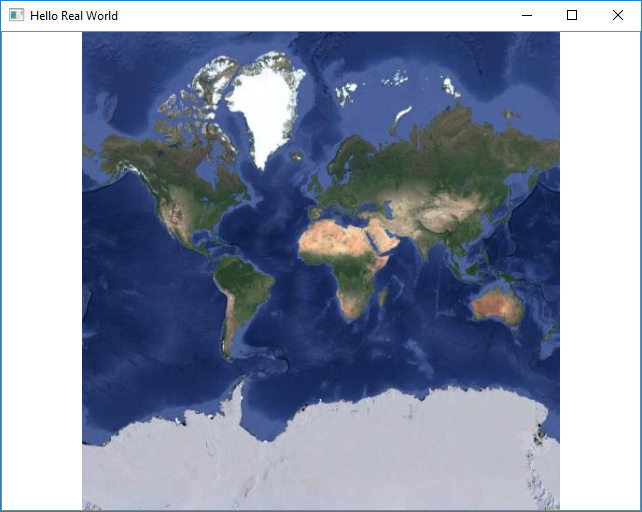

Of course we can visualize local files like from the EnMAP-Box testdata as well::

    import enmapboxtestdata
    uri = enmapboxtestdata.enmap
    layer = QgsRasterLayer(uri)

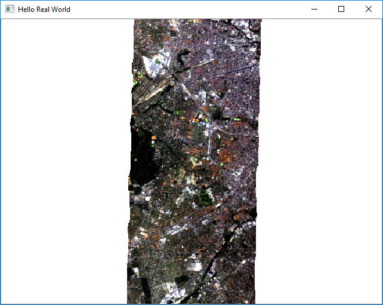

    Example 2b: |QgsMapCanvas| visualizing the EnMAP example image.

The canvas CRS can be set to any CRS of choice. This becomes impressive when reprojecting the global google satellite map
into a non-global UTM Zone, like that for 32N(`EPSG code 32632 <https://spatialreference.org/ref/epsg/32632/>`_)::

    from qgis.core import QgsCoordinateReferenceSystem
    canvas.setDestinationCrs(QgsCoordinateReferenceSystem('EPSG:32632'))

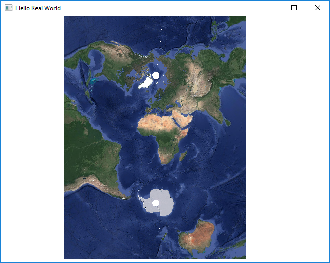

**Summary**

You now can:

* open raster data sources as |QgsRasterLayer|

* visualize |QgsMapLayers| on a |QgsMapCanvas|

* create a |QgsCoordinateReferenceSystem| for any EPSG code of interest

* specify a map canvas CRS

**Full source code**

.. code-block:: python

        from enmapbox.testing import start_app

        app = start_app()

        assert isinstance(app, QApplication)
        assert isinstance(app, QgsApplication)

        uri = r'crs=EPSG:3857&format&type=xyz&url=https://mt1.google.com/vt/lyrs%3Ds%26x%3D%7Bx%7D%26y%3D%7By%7D%26z%3D%7Bz%7D&zmax=19&zmin=0'
        layer = QgsRasterLayer(uri, 'google maps', 'wms')

        import enmapboxtestdata
        layer = QgsRasterLayer(enmapboxtestdata.enmap)

        QgsProject.instance().addMapLayer(layer)

        assert layer.isValid()

        from qgis.gui import QgsMapCanvas
        canvas = QgsMapCanvas()
        canvas.setWindowTitle('Hello Real World')
        canvas.setLayers([layer])
        canvas.setExtent(layer.extent())
        canvas.setDestinationCrs(layer.crs())
        canvas.show()

        app.exec_()

.. _basics_exercise3_create_widgets:

3. Create new widgets
---------------------

`Widgets` can be small like a single button, but also complex forms which allow to enter various inputs.
Technically, a new widget is created by:

#. inheriting |QWidget| or one of its child classes, e.g. |QDialog|

#. modification of the **frontend**, e.g. adding other widgets or changing visual properties

#. modification of the **backend** modification, e.g. by adding methods to validate user inputs

Let's create a simple widget that contains:

 * a map to show spatial data

 * a text box to show multi-line textual data

 * a label to show other information

 * a button to reset the map

Create the main widget
........................

First, we create a new class that inherits from |QWidget|. Because we will need a couple of other widgets as well,
we also import the Qt and QGIS widget libraries::

    from qgis.core import *
    from qgis.gui import *
    from qgis.PyQt.QtWidgets import *
    from qgis.PyQt.QtGui import *
    from qgis.PyQt.QtCore import *

    class ExampleWidget(QWidget):

    def __init__(self, parent=None):
        super(ExampleWidget, self).__init__(parent)
        self.setWindowTitle('Example Widget')
        self.resize(QSize(300,200))

``super(ExampleWidget, self).__init__(parent)`` calls the constructor of ``QWidget`` and initializes all properties
and functions available for |QWidgets|. To visualize this widget call::

        app = start_app()

        myWidget = ExampleWidget()
        myWidget.show()

        app.exec_()

Add child widgets
.................

Now we add other *child* widgets to the *parent* widget::

        self.textBox = QTextEdit()
        self.mapCanvas = QgsMapCanvas()
        self.label = QLabel('Label info')
        self.button = QPushButton('Press me')

`Qt Layout classes <https://doc.qt.io/qt-5/layout.html>`_ control the widget position and resizing behaviour.
In this case we want a nested layout that orders widgets in two rows of a major vertical |QVBoxLayout|. Each row is realized with a |QHBoxLayout| ::

        self.setLayout(QVBoxLayout())

        self.topLayout = QHBoxLayout()
        self.topLayout.addWidget(self.textBox)
        self.topLayout.addWidget(self.mapCanvas)

        self.bottomLayout = QHBoxLayout()
        self.bottomLayout.addWidget(self.label)
        self.bottomLayout.addWidget(self.button)

        self.layout().addLayout(self.topLayout)
        self.layout().addLayout(self.bottomLayout)

Finally let's add some raster data to the map canvas and start our widget::

        from enmapboxtestdata import enmap
        layer = QgsRasterLayer(enmap)
        QgsProject.instance().addMapLayer(layer)
        self.mapCanvas.setLayers([layer])
        self.mapCanvas.setDestinationCrs(layer.crs())
        self.mapCanvas.setExtent(self.mapCanvas.fullExtent())

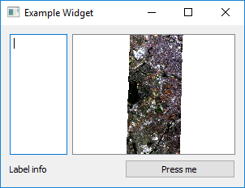

**Summary**

Now you can:

* create your own widget

* order widgets in vertical, horizontal and nested layouts

**Full code**

`ExampleWidget` definition

.. code-block:: python

    class ExampleWidget(QWidget):

        def __init__(self, parent=None):
            super(ExampleWidget, self).__init__(parent)

            self.setWindowTitle('Example Widget')
            self.resize(QSize(300, 200))

            self.textBox = QTextEdit()
            self.mapCanvas = QgsMapCanvas()
            self.label = QLabel('Label info')
            self.button = QPushButton('Press me')

            self.setLayout(QVBoxLayout())

            self.topLayout = QHBoxLayout()
            self.topLayout.addWidget(self.textBox)
            self.topLayout.addWidget(self.mapCanvas)

            self.bottomLayout = QHBoxLayout()
            self.bottomLayout.addWidget(self.label)
            self.bottomLayout.addWidget(self.button)

            self.layout().addLayout(self.topLayout)
            self.layout().addLayout(self.bottomLayout)

            from enmapboxtestdata import enmap
            layer = QgsRasterLayer(enmap)
            QgsProject.instance().addMapLayer(layer)
            self.mapCanvas.setLayers([layer])
            self.mapCanvas.setDestinationCrs(layer.crs())
            self.mapCanvas.setExtent(self.mapCanvas.fullExtent())

Calling code

.. code-block:: python

        app = start_app()

        myWidget = ExampleWidget()
        myWidget.show()

        app.exec_()

4. Signals and Slots
--------------------

Graphical User Interfaces react on various types of user interactions and inputs. For example

* a click on a `Start` button that starts a time-demanding process

* a click on a `Cancel` button that interrupts a time-demanding process

* a tooltip that is shown when the mouse cursor stops over a widget

* a text box that changes its background color into red when its input becomes invalid

With Qt, such interactions are often realized with `Signals and Slots <https://doc.qt.io/qt-5/signalsandslots.html>`_ .
All widgets can emit signals to inform other widgets or objects about changes and events. In Qt terminology, functions
that are triggered by a signal are called *slots*.

Connect Signals
...............

Let's enhance our `ExampleWidget` to react on the button's `.clicked() <https://doc.qt.io/qt-5/qabstractbutton.html#clicked>`_
signal. We define the slot function `onButtonClicked` to add some text to the text box and update the label::

    def onButtonClicked(self, *args):
        text = self.textBox.toPlainText()
        text = text + '\nclicked'
        self.textBox.setText(text)

        from datetime import datetime
        self.label.setText('Last click {}'.format(datetime.now().time()))

Then we modify the *ExampleWidget's* constructor (``__init__``) and connect the `clicked` signal with the `onButtonClicked` slot::

    self.button.clicked.connect(self.onButtonClicked)

In addition we like to reset the map canvas to the full layer extent, e.g. after a user has changed the spatial extent
by zooming or panning. We like to keep our source-code clear and short. As the reset operation can be defined in
one-line, we use a `lambda function <https://www.w3schools.com/python/python_lambda.asp>`_ as signal-slot::

    self.button.clicked.connect(lambda : self.mapCanvas.setExtent(self.mapCanvas.fullExtent()))

Re-start the widget, zoom or pan within the map canvas and click the button:

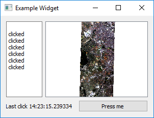

Create Signals
..............

|QObjects| like our widget can define and emit their own signals. This might become useful if other widgets need to be informed about changes.
Signals are defined like class (not instance) variables::

    class ExampleWidget(...)

        sigButtonClicked = pyqtSignal()

        def __init__(...):
            ...

and triggered by and object instance with the `emit` function::

    self.button.clicked.connect(lambda: self.sigButtonClicked.emit())

Overload Signals
................

You can overload a signal's signature to emit different sets of arguments::

    class ExampleWidget(...)

        sigButtonClicked = pyqtSignal([], [str])

        def __init__(...):
            ...

In this case the signal ``sigButtonClicked`` can be emitted without argument or providing an extra string with more information::

    self.button.clicked.connect(lambda: self.sigButtonClicked.emit())
    self.button.clicked.connect(lambda: self.sigButtonClicked[str].emit('Button  clicked'))

Similarly, you can connect a slot with a signal that provides specific arguments. If you would like to receive the
`sigButtonClicked` definition that also sends some textual information, connect to it like in this example::

    myWidget = ExampleWidget()
    myWidget.sigButtonClicked[str].connect(lambda text : print('Received: "{}"'.format(text)))
    myWidget.show()

Clicking the `Examplewidgets` button will now print ``Received: "Button clicked"`` to the console

**Summary**

You now can:

* use signals and connect them to slots

* define lambda functions and use them as singnal-slots

* create and emit your own signals

* overload signals with different sets of arguments and connect slots to them

5. Context Menus
----------------

`Context menus <https://doc.qt.io/qt-5/qtwidgets-mainwindows-menus-example.html>`_ inform users about possible settings
and operations. To show a context menu, we need to implement the virtual `contextMenuEvent <https://doc.qt.io/qt-5/qwidget.html#contextMenuEvent>`_ method
and execute a |QMenu| ::

        class ContextMenuExample(QWidget):

            def __init__(self, *args):
                super(ContextMenuExample, self).__init__(*args)
                self.resize(QSize(450, 100))
                self.setWindowTitle('ContextMenuExample')

            def contextMenuEvent(self, event:QContextMenuEvent):
                menu = QMenu()

                action1 = menu.addAction('Print "A"')
                action1.triggered.connect(lambda: print('A'))

                action2 = menu.addAction('Print "B"')
                action2.triggered.connect(lambda: print('B'))

                menu.exec_(event.globalPos())

        app = QApplication([])
        w = ContextMenuExample()
        w.show()
        app.exec_()

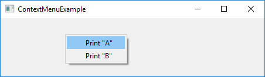

As you see, |QActions| objects are used to describe menu items. The `triggered` signal is fired on mouse-click and can be used
to call slot functions. More complex |QMenus| should be structured with separators and child menus::

                menu.addSeparator()
                subMenu = menu.addMenu('More actions..')
                action3 = menu.addAction('Print "C.1"')
                action3.triggered.connect(lambda: print('C.1'))

                action4 = menu.addAction('Print "C.2"')
                action4.triggered.connect(lambda: print('C.2'))

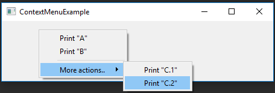

|QAction| objects can be made checkable. This is useful to present On/Off switches, e.g. to set internal options. For this we
define two boolean variables in the class constructor::

    class ContextMenuExample(QWidget):

        def __init__(self, *args):
            super(ContextMenuExample, self).__init__(*args)
            self.resize(QSize(450, 100))
            self.setWindowTitle('ContextMenuExample')

            self.option1 = True
            self.option2 = False

and enhance `contextMenuEvent(..)`::

        subMenu = menu.addMenu('Options...')

        opt1 = subMenu.addAction('Option 1')
        opt1.setCheckable(True)
        opt1.setChecked(self.option1 == True)
        opt1.toggled.connect(lambda b: setattr(self, "option1", b))

        opt2 = subMenu.addAction('Option 2')
        opt2.setCheckable(True)
        opt2.setChecked(self.option2 == True)
        opt2.toggled.connect(lambda b: setattr(self, "option2", b))

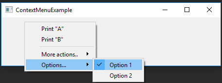

**Summary**

You now learned how to:

* create and show context menus

* create a |QAction| and use its `triggered` and `toggled` signals

* overwrite a virtual method / function

6. Qt Designer
--------------

The more widgets your GUI contains, the more you have to specify details like widget positions, layout behaviour,
button names etc. Tools like the Qt Designer and Qt Creator allow you to design a GUI *frontend* by drag 'n drop, to
better focus on what you want to visualize and to separate front-end from background logic.

Draw a Frontend
........................

Start the Qt Designer (or Qt Creator), click on `File` > `New..` and create a new from (``exampleform.ui``) based on *Widget*.

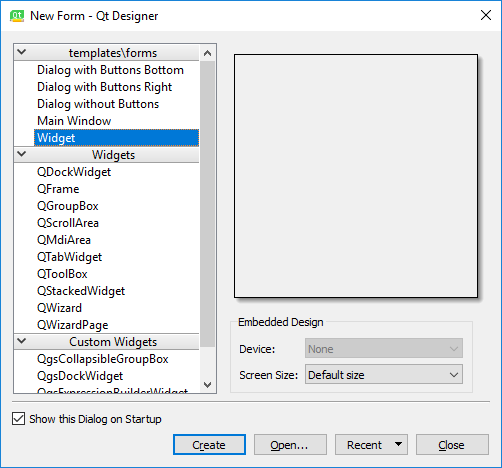

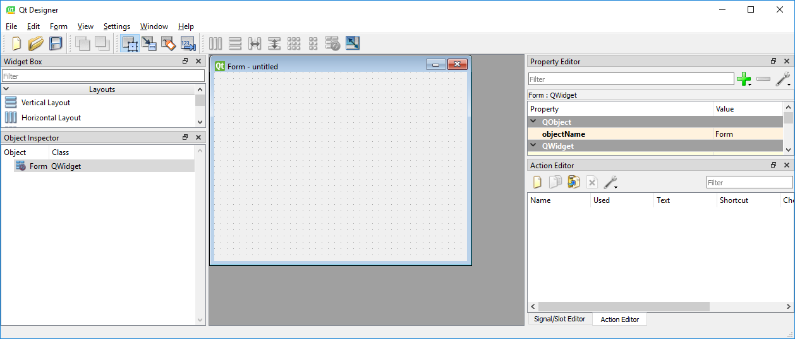

Now take *at least* 10 minutes to discover the Qt Designer:

* Drag and drop widgets from `Widget Box` to your empty form

* Add layouts from the `Widget Box` to your form and add some widgets

* Explore and modify widget properties with the `Property Editor`

* Set tooltips, change minimum and maximum sizes

* Visualize previews via `View` > `Preview` (or CTRL + P)

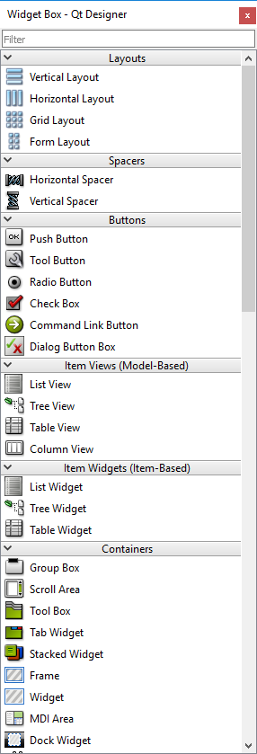

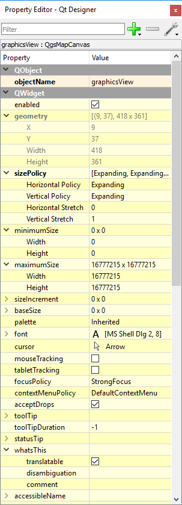

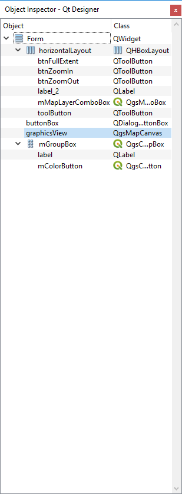

Build a complex UI
.....................

Now we want to create a new widget called `EnMAPBoxWorkshopUI`, which later on can be used to:

* start collecting spectral profiles from a map that is opened in the EnMAP-Box

* receive these spectral profiles from the EnMAP-Box and draw them in a plot

For this we first create a new form that derives from |QWidget| and save it as `enmapboxworkshop.ui`:

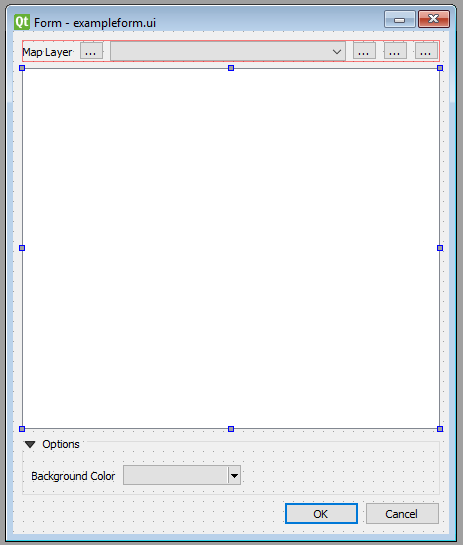

    ``exampleform_reference.ui`` opened in Qt Designer

* the the parent widget's window title to `EnMAPBox Workshop UI`

* create a |QLabel| with object name ``applicationLogo``

* set the image ``programming_tutorial2/tut2_part1_basics/application_logo.svg``
  as background pixmap for the application logo

* create a |QHBoxLayout| that contains:

    * a |QLabel| `Map Tools`
    * a |QToolButton| with object name ``btnSelectProfiles``. It will be used to activate the profile selection
    * a |QToolButton| with object name ``btnClear``. It will be used to clear the plot window

* add a |QGraphicsView| with object name ``plotWidget``

* add a |QgsCollapsibleGroupBox| with title `Options`

* add a |QLabel| `Background Color` and add a |QgsColorButton| with object name ``btnBackgroundColor``

* use the preview (Ctrl+R) to check how your widgets look like, in particular when resizing it, or when you
  collapse or expand the group box

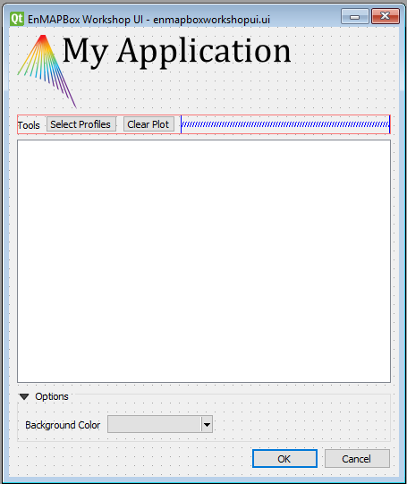

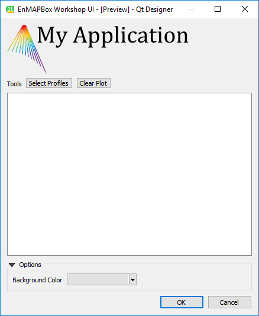

Save your last modification with (CTRL+S) and inspect in an text editor. As you see, the Qt Designer
describes the entire frontend in an XML structure.

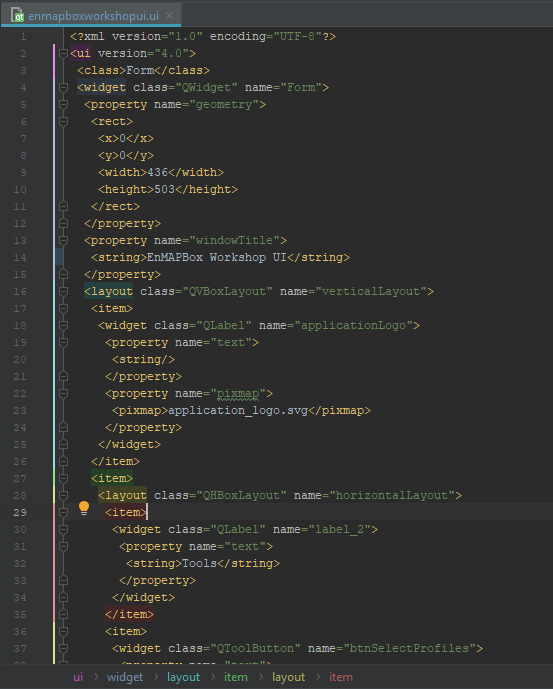

Write the backend
.................

Before we can use our `EnMAPBoxWorkshopUI` widget from python, we need to write its *backend*. The backend loads the `enmapboxworkshopui.ui`
and makes all Qt objects available that we have specified in the Qt Designer. It further specifies signals to
communicate with other widgets, e.g. a `sigSpectralProfileRequest` which we will need to inform the EnMAP-Box if
we want to collect Spectral Profiles.::

    from enmapbox.gui.utils import loadUi
    pathUi = os.path.join(os.path.dirname(__file__), 'enmapboxworkshopui.ui')

    class EnMAPBoxWorkshopUI(QWidget):

        sigSpectralProfileRequest = pyqtSignal()

        def __init__(self, parent=None):
            super(EnMAPBoxWorkshopUI, self).__init__(parent)
            loadUi(path, self)

            assert isinstance(self.applicationLogo, QLabel)
            assert isinstance(self.btnSelectProfiles, QToolButton)
            assert isinstance(self.btnClear, QToolButton)
            assert isinstance(self.plotWidget, QGraphicsView)
            assert isinstance(self.btnBackgroundColor, QgsColorButton)

.. tip::

    The function ``enmapbox.gui.utils.loadUi(...)`` enhances the `loadui` described in https://www.riverbankcomputing.com/static/Docs/PyQt5/designer.html  by
    taking care on QGIS and Python specific issues.

We can now open the `EnMAPBoxWorkshopUI` from python::

    app = start_app()

    w = EnMAPBoxWorkshopUI()
    w.show()

    app.exec_()

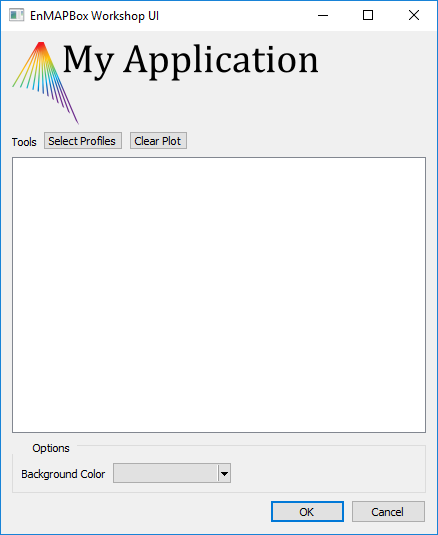

QGIS and EnMAP-Box Icons
.........................

There might be a tiny difference between the Qt Designer's preview [Ctrl+R] and how the widget looks when started from Python.

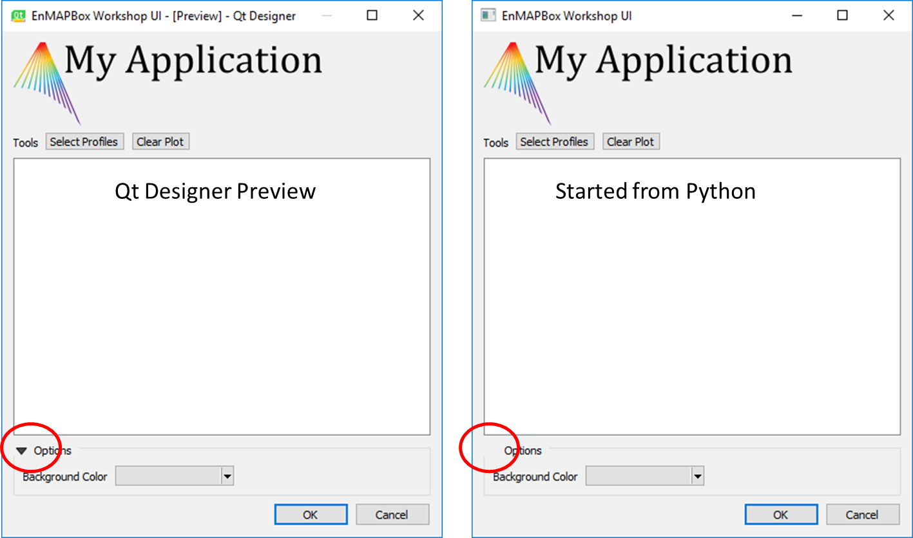

In this case the missing |QgsCollapsibleGroupBox| icon has not been loaded into the `Qt resource system <https://doc.qt.io/qt-5/resources.html>`_.
However, the icon is available:

* if we start our widget from the QGIS python, or

* if we load the missing resources manually

Long story short, download the `qgsresources.zip <https://bitbucket.org/hu-geomatics/enmap-box-workshop2019/downloads/qgisresources.zip>`_
and extract it into the enmapbox root folder:

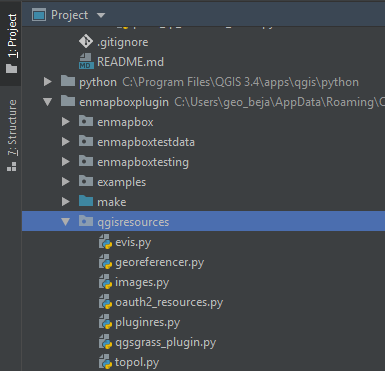

The QGIS icons are available after initializing a |QgsApplication| with::

    from enmapboxtesting import start_app
    app = start_app()

To show a QGIS icon, we just need to create a |QIcon| with the icon's resource identifier::

    self.btnSelectProfiles.setIcon(QIcon('://enmapbox/gui/ui/icons/spectralprofile.svg'))
    self.btnClear.setIcon(QIcon(':/images/themes/default/mIconClearText.svg'))

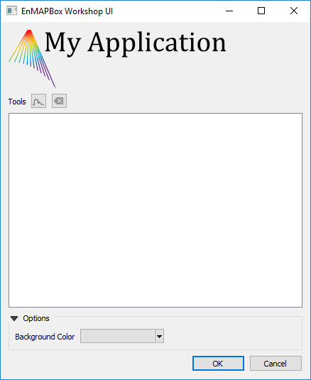

.. tip::

    Read :ref:`iconselect_tool` to visualize all icons that are available in a Qt environment.

Promote widgets
...............

You might have realized that some widgets are missing in the widget box, e.g. the |QgsMapCanvas| that we have used in
the first exercises.

*So how can we design a GUI frontend with widgets unavailable in the widget box?*

In this case we (i) use a widget as a placeholder that is available in the widget box and that (ii) our widget-of-interest inherits from.

In our `EnMAPBoxWorkshopUI` we like to plot spectral profiles for which we use a
`pyqtgraph.PlotWidget <https://pyqtgraph.readthedocs.io/en/latest/widgets/plotwidget.html>`_. This widget is not available in
the widget box, but it inherits from |QGraphicsView|. Therefore we can promote our QGraphicView (object name `plotWidget`)
into a `pyqtgraph.PlotWidget`::

#. Open your `enmapboxworkshop.ui`, select the `plotWidget`, right-mouse context menu and open *Promoted Widgets*.

#. Define a *New Promoted Class* as

    ===================== ====================
    Base class name       QGraphicsView
    Promoted class name   PlotWidget
    Header file           pyqtgraph.PlotWidget
    ===================== ====================

   Click to `Add` and close the dialog

#. Now select the `plotWidget` QGraphicsView object, open its context menu > `Promote to..` > `PlotWidget`

    .. image:: img/example6_promote_widget_to.png

#. Save your changes (Ctrl+S).

#. Verify that our `plotWidget` indeed is a `pyqtgraph.PlotWidget` instance (and not just a |QGraphicsView|) with an additional ``assert``::

    from pyqtgraph import PlotWidget
    assert isinstance(self.plotWidget, PlotWidget)

#. Re-start the `EnMAPBoxWorkshopUI` to see how the `plotWidget` has changed into a `pyqtgraph.PlotWidget`

    .. image:: img/example5_enmapboxworkshopui_plotwidget.png

.. tip::

    Each widgets inherits from |QWidget|, so you can always use a |QWidget| in the Qt Designer and promote
    it into a more specialized widget class.

React on User Input
...................

The backend specifies how widgets react on user input. In our case we would like to allow users to set the plot widget's background color::

    self.btnBackgroundColor.setColor(self.plotWidget.backgroundBrush().color())
    self.btnBackgroundColor.colorChanged.connect(self.plotWidget.setBackgroundBrush)

Restart the widget and change the background color, e.g. into orange.

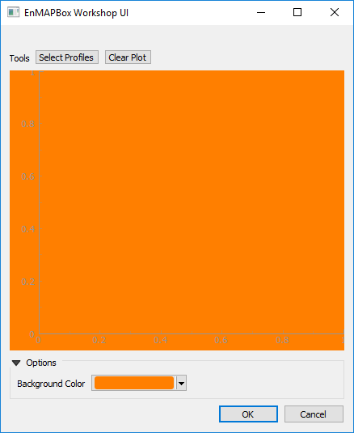

**Summary**

You now can:

* use the Qt Designer to create a GUI frontend

* promote basic Qt / QGIS widgets into any other derived widgets

* write a backend that connects widgets and responses to user inputs

.. AUTOGENERATED SUBSTITUTIONS - DO NOT EDIT PAST THIS LINE

.. |QAction| replace:: `QAction <https://doc.qt.io/qt-5/qaction.html>`__
.. |QActions| replace:: `QActions <https://doc.qt.io/qt-5/qaction.html>`__
.. |QApplication| replace:: `QApplication <https://doc.qt.io/qt-5/qapplication.html>`__
.. |QDialog| replace:: `QDialog <https://doc.qt.io/qt-5/qdialog.html>`__
.. |QGraphicsView| replace:: `QGraphicsView <https://doc.qt.io/qt-5/qgraphicsview.html>`__
.. |QHBoxLayout| replace:: `QHBoxLayout <https://doc.qt.io/qt-5/qhboxlayout.html>`__
.. |QIcon| replace:: `QIcon <https://doc.qt.io/qt-5/qicon.html>`__
.. |QLabel| replace:: `QLabel <https://doc.qt.io/qt-5/qlabel.html>`__
.. |QMenu| replace:: `QMenu <https://doc.qt.io/qt-5/qmenu.html>`__
.. |QMenus| replace:: `QMenus <https://doc.qt.io/qt-5/qmenu.html>`__
.. |QObjects| replace:: `QObjects <https://doc.qt.io/qt-5/qobject.html>`__
.. |QToolButton| replace:: `QToolButton <https://doc.qt.io/qt-5/qtoolbutton.html>`__
.. |QVBoxLayout| replace:: `QVBoxLayout <https://doc.qt.io/qt-5/qvboxlayout.html>`__
.. |QWidget| replace:: `QWidget <https://doc.qt.io/qt-5/qwidget.html>`__
.. |QWidgets| replace:: `QWidgets <https://doc.qt.io/qt-5/qwidget.html>`__
.. |QgsApplication| replace:: `QgsApplication <https://api.qgis.org/api/classQgsApplication.html>`__
.. |QgsCollapsibleGroupBox| replace:: `QgsCollapsibleGroupBox <https://api.qgis.org/api/classQgsCollapsibleGroupBox.html>`__
.. |QgsColorButton| replace:: `QgsColorButton <https://api.qgis.org/api/classQgsColorButton.html>`__
.. |QgsCoordinateReferenceSystem| replace:: `QgsCoordinateReferenceSystem <https://api.qgis.org/api/classQgsCoordinateReferenceSystem.html>`__
.. |QgsMapCanvas| replace:: `QgsMapCanvas <https://api.qgis.org/api/classQgsMapCanvas.html>`__
.. |QgsMapLayerStore| replace:: `QgsMapLayerStore <https://api.qgis.org/api/classQgsMapLayerStore.html>`__
.. |QgsMapLayers| replace:: `QgsMapLayers <https://api.qgis.org/api/classQgsMapLayer.html>`__
.. |QgsProject| replace:: `QgsProject <https://api.qgis.org/api/classQgsProject.html>`__
.. |QgsRasterLayer| replace:: `QgsRasterLayer <https://api.qgis.org/api/classQgsRasterLayer.html>`__
