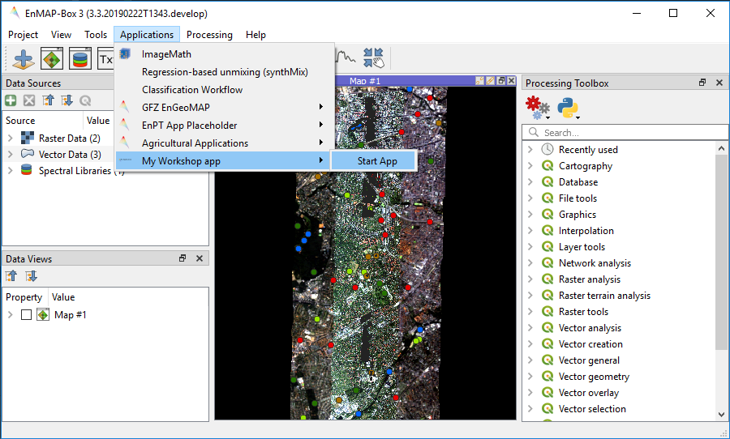

Part II: EnMAP-Box GUI
======================

1. Your GUI in the EnMAP-Box
-----------------------------

Let's create an `EnMAPBoxApplication` called *MyEnMAPBoxWorkshopApplication* that brings our *EnMAPBoxWorkshopUI* into the the EnMAP-Box.

#. Read the :ref:`Create EnMAP-Box Applications <dev_tut_create_enmapbox_application>` guide and

#. Create an folder `myworkshopapp` that contains everything required for our EnMAP-Box Application:

    #. a module `__init__.py` that contains the ``def enmapboxApplicationFactory(enmapBox)``.

    #. a module `workshopapp.py` to define the EnMAPBoxApplication interface. It needs to implement ``EnMAPBoxApplication.menu(self, appMenu)->QMenu``.

    #. the application GUI, defined in `enmapboxworkshopui.ui` (frontend) and `enmapboxworkshopui.py` (backend)

    #. other resources, e.g. icons

   If you have already done the `Implementing Processing Algorithms` tutorial, you can use and enhance the `EnMAPBoxApplication` created
   there (`tut1_app1`) to implement the ``EnMAPBoxApplication.menu(self, appMenu)->QMenu`` method

Start the EnMAP-Box and make your application available::

    from enmapbox.testing import initQgisApplication
    APP = initQgisApplication()

    from enmapbox import EnMAPBox, EnMAPBoxApplication
    from myworkshopapp.workshopapp import MyEnMAPBoxWorkshopApplication

    enmapBox = EnMAPBox(None)
    enmapBox.loadExampleData()

    myApp = MyEnMAPBoxWorkshopApplication(enmapBox)
    assert isinstance(myApp, EnMAPBoxApplication)
    enmapBox.addApplication(myApp)

    APP.exec_()

Now you can start the application from the EnMAP-Box menu bar

**Summary**

Now you know:

* how to implement an `EnMAPBoxApplication` interface

* how to make your own GUI applications startable in the EnMAP-Box

2. GUI - EnMAP-Box interaction
------------------------------

We would like to enable interactions between our application and the EnMAP-Box. For example:

#. A click on our applications `Select Profile` button should activate the EnMAP-Box *Identify Location* mode with checked *Collect Profiles* option

    .. image:: img/part2_enmapbox_toolbar_identify_spectral_profiles.png

#. If a Spectral Profile is collected, we like to show it in our plot widget

The connection between EnMAP-Box and `MyEnMAPBoxWorkshopApplication` is created by adding the following lines to `MyEnMAPBoxWorkshopApplication.startGUI(...)`::

        # request & receive SpectralProfiles from EnMAP-Box
        if isinstance(self.enmapbox, EnMAPBox):
            self.enmapbox.sigCurrentSpectraChanged.connect(w.addSpectralProfiles)
            w.sigSpectralProfileRequest.connect(self.activateSpectralProfileCollection)

The method `activateSpectralProfileCollection` activates the EnMAP-Box map tools::

    def activateSpectralProfileCollection(self):
        """
        Activates the EnMAP-Box Identify location mode + identify profiles
        """
        if isinstance(self.enmapbox, EnMAPBox):
            self.enmapbox.ui.actionIdentify.setChecked(True)
            self.enmapbox.ui.optionIdentifyProfile.setChecked(True)

The `EnMAPBoxWorkshopUI` gets an `addSpectralProfiles(...)` to receive and draw collected profiles::

        def addSpectralProfiles(self, spectralProfiles:list):
            """
            Plots spectral profiles
            :param spectralProfiles: list of spectral profiles
            """
            from enmapbox.gui import SpectralProfile
            from pyqtgraph import PlotItem, PlotDataItem
            assert isinstance(spectralProfiles, list)

            plotItem = self.plotWidget.getPlotItem()
            assert isinstance(plotItem, PlotItem)

            for spectralProfile in spectralProfiles:
                assert isinstance(spectralProfile, QgsFeature)
                spectralProfile = SpectralProfile.fromSpecLibFeature(spectralProfile)
                assert isinstance(spectralProfile, SpectralProfile)

                pdi = PlotDataItem(x=spectralProfile.xValues(), y=spectralProfile.yValues())
                plotItem.addItem(pdi)

If too many profiles are drawn, users might want to clear the plot, so we enhance `EnMAPBoxWorkshopUI` by::

    def __init__(...)

        ...

        self.btnClear.clicked.connect(self.clearPlot)

    def clearPlot(self):
        """
        Removes all plot data items
        """
        self.plotWidget.plotItem.clear()

**Summary**

You now can:

* receive Spectral Profiles from the EnMAP-Box and use them in your own application

* plot items with the PyQtGraph library

