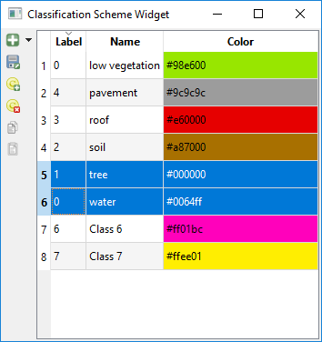
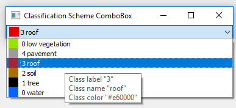
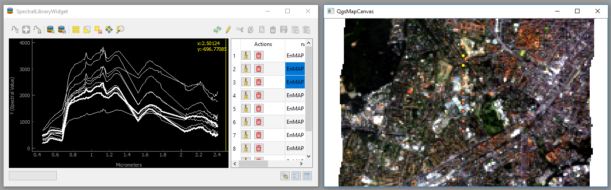
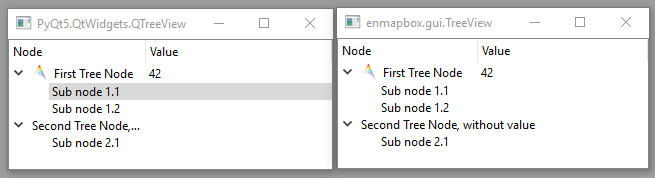
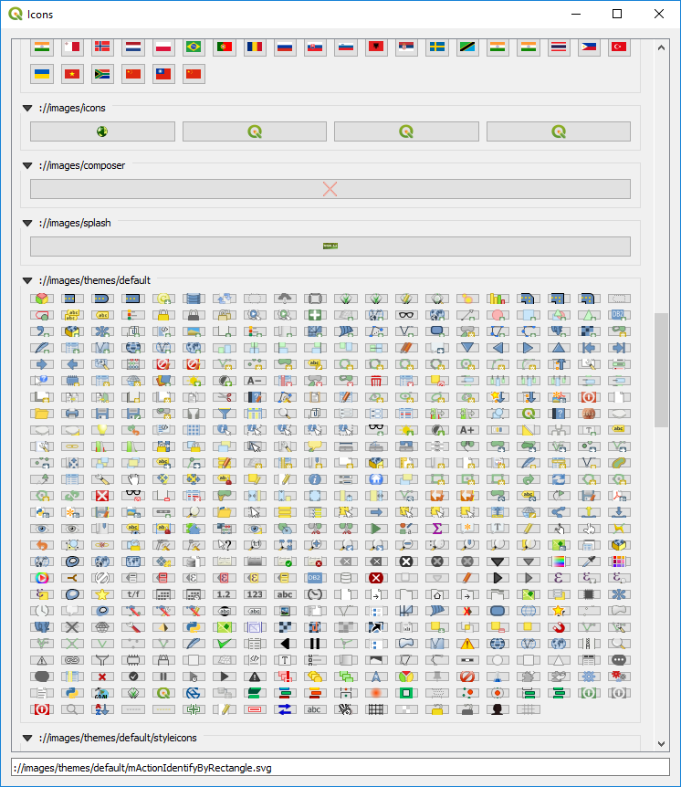
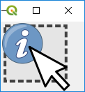

.. include:: ../../external_links.rst

.. _ProgTT_advanced:

Part III: Advanced GUI programming
==================================

.. _classification_schemes:

1. Classification Schemes
-------------------------

`Classification Schemes` are common in remote sensing to describe categorical information, like the
`CORINE Land Cover classification <https://land.copernicus.eu/pan-european/corine-land-cover>`_.

For raster images, Classification Schemes are usually defined as lists of class information, where each
class has (i) a numeric label used as pixel value, (ii) a textual class name and (iii) a class color. It is convenient
that class labels with value 0 identify *no data* or *unclassified* areas, while the other classes use label values > 0.

===== ============== ===================
Label Name           Color
===== ============== ===================
0     unclassified   black
1     impervious     red
2     low vegetation bright green
3     tree           dark green
4     soil           brown
5     water          blow
===== ============== ===================

`Classification Schemes` can be used for vector data as well, e.g. to colorize points or polygons.

The EnMAP-Box GUI offers the `ClassificationSchemeWidget` to create and modify a `ClassificationScheme`. It allows users to

* add / remove classes

* modify class names and colors

* import classes from other raster files, QgsMapLayers_ or the clipboard

* copy and paste selected classes, e.g. between two `ClassificationSchemeWidgets`.

The `ClassificationSchemeComboBox` can be used to select a `ClassInfo` from a `ClassificationScheme`:

.. code-block:: python

    app = initQgisApplication()
    from enmapbox.gui import ClassificationSchemeWidget, ClassificationSchemeComboBox, ClassificationScheme, ClassInfo
    from enmapboxtestdata import landcover_polygons

    layer = QgsVectorLayer(landcover_polygons)
    classificationScheme = ClassificationScheme.fromMapLayer(layer)

    classSchemeWidget = ClassificationSchemeWidget(classificationScheme=classificationScheme)
    classSchemeWidget.setWindowTitle('Classification Scheme Widget')
    classSchemeWidget.show()

    classSchemeComboBox = ClassificationSchemeComboBox(classification=classificationScheme)
    classSchemeComboBox.setWindowTitle('Classification Scheme ComboBox')
    classSchemeComboBox.show()

    for classInfo in classificationScheme:
        assert isinstance(classInfo, ClassInfo)
        print('Label: Name:{} Color: {}'.format(
            classInfo.label(),
            classInfo.name(),
            classInfo.color().getRgb()))

    app.exec_()

.. code-block:: bash

    Label: Name:0 Color: low vegetation
    Label: Name:1 Color: pavement
    Label: Name:2 Color: roof
    Label: Name:3 Color: soil
    Label: Name:4 Color: tree
    Label: Name:5 Color: water

2. Spectral Libraries
---------------------

The EnMAP-Box GUI supports the visualization and management of raster profiles
from different sensors or images in the same plot. For this the EnMAP-Box uses:

* the `SpectralProfile` class to store all information related to a *single* profile,
  including metadata like the geographic position and other textual or numeric attributes

* the `SpectralLibrary` class to store multiple `SpectralProfiles`. A `SpectralLibrary` is an in-memory point QgsVectorLayer_.
  If `SpectralProfiles` define a coordinate, they can be visualized as points in a QgsMapCanvas_. Attributes
  can be modified in an attribute table

* the `SpectralLibraryWidget` to visualize and edit a `SpectralLibrary`

Let's collect some profiles from the EnMAP testdata image::

    from enmapbox.testing import initQgisApplication
    app = initQgisApplication()
    from enmapbox.gui import SpectralProfile, SpectralLibrary, SpectralLibraryWidget, SpatialPoint, SpatialExtent
    from enmapboxtestdata import enmap

    # collect 10 SpectraProfiles from center of the EnMAP test image
    # to the south in steps of 200 meters

    enmapLayer = QgsRasterLayer(enmap)
    center = SpatialPoint.fromMapLayerCenter(enmapLayer)

    step = 200
    profiles = []
    for i in range(10):
        position = SpatialPoint(center.crs(), center.x(), center.y() + i*step)
        profile = SpectralProfile.fromRasterSource(enmapLayer, position)
        profile.setName('EnMAP Profile {}'.format(i+1))
        profiles.append(profile)

Now create a `SpectralLibrary` and add the collected profiles to::

    speclib = SpectralLibrary()
    speclib.startEditing()
    speclib.addProfiles(profiles)
    speclib.commitChanges()

.. hint::
        As the `SpectralLibrary` inherits  QgsVectorLayer_, it uses a database-like interface to store modifications:

        * call `.startEditing()` to enable modifications

        * call `.commitChange()` to save modification, or

        * call `.rollBack()` to revert modification

In contrast to QgsVectorLayers_, you can access the `SpectralProfiles` of a `SpectralLibrary` like items of a python list and
iterate over them::

    print('First profile:'.format(speclib[0]))

    print('Number of profiles: {}'.format(speclib))
    for i, profile in enumerate(speclib):
        assert isinstance(profile, SpectralProfile)
        print('Profile {} "{}": {}'.format(i, profile.name(), profile.yValues()))

The `SpectralLibraryWidget` visualize profiles and attributes, and a QgsMapCanvas_ can be used to show the profile location::

        w = SpectralLibraryWidget(speclib=speclib)
        w.show()

        canvas = QgsMapCanvas()
        QgsProject.instance().addMapLayers([enmapLayer, speclib])
        canvas.setLayers([speclib, enmapLayer])
        canvas.setDestinationCrs(enmapLayer.crs())
        canvas.setExtent(SpatialExtent.fromLayer(speclib).toCrs(enmapLayer.crs()))
        canvas.show()

        app.exec_()

.. note::
    Spectral profiles that got selected in the plot widget or attribute table will be highlighted in the map canvas as well.

3. Create a Tree Model
----------------------

The `Qt Model-View concept <https://doc.qt.io/qt-5/model-view-programming.html>`_ allows users to visualize data as a
node-tree in a QTreeView_. This requires us to implement a QAbstractItemModel_ that serves as model for a QTreeView_.
The `enmapbox.gui.TreeModel` and `enmapbox.gui.TreeView` class can be used to simplify this development::

        from enmapbox.testing import initQgisApplication
        app = initQgisApplication()
        from enmapbox.gui import TreeView, TreeModel, TreeNode

        treeModel = TreeModel()
        treeView = TreeView()
        treeView.setModel(treeModel)
        treeView.setWindowTitle('enmapbox.gui.TreeView')
        treeView.show()

The `TreeModel` has an invisible root node to which we append visible child nodes of type `TreeNode`::

        n1 = TreeNode(treeModel.rootNode(),
                      name='First Tree Node',
                      icon=QIcon(':/enmapbox/gui/ui/icons/enmapbox.svg'))
        n1.setValue(42)
        n1.setIcon(QIcon(':/enmapbox/gui/ui/icons/enmapbox.svg'))

        n2 = TreeNode(treeModel.rootNode(), name='Node 2')
        n2.setName('Second Tree Node, without value')
        n1.setIcon(QIcon(':/enmapbox/gui/ui/icons/enmapbox.svg'))

Each `TreeNode` object can have multiple child nodes::

        # define sub nodes
        sub1 = TreeNode(n1, name='Sub node 1.1')
        sub2 = TreeNode(None, name='Sub node 1.2')
        n1.appendChildNodes([sub2])

        sub3 = TreeNode(n1, name='Sub node 2.1')
        n2.appendChildNodes(sub3)

The `TreeModel` can be used as input model for each QTreeView_. Using a `enmapbox.gui.TreeView` instead will take care of
the column span that is expanded for nodes with node name but without a node value:

.. _iconselect_tool:

4. Discover Qt Resource Icons
-----------------------------

Icons that have been already loaded to the Qt Resource System can be visualized with the `iconselect.AvailableIcons`
widget. Open the QGIS Python Console and call::

    import os.path, sys
    from enmapbox.testing import initQgisApplication
    app = initQgisApplication()
    from enmapbox import DIR_REPO

    # ensure that the enmapbox/make folder is added to the PYTHONPATH
    dirMakeScripts = os.path.join(DIR_REPO, 'make')
    if dirMakeScripts not in sys.path:
        sys.path.append(dirMakeScripts)

    import iconselect
    iconselect.run()

Click on an icon to get its resource path, e.g. ``://images/themes/default/mActionIdentifyByRectangle.svg``.
The resource path can now be used to open QIcons_::

    icon = QIcon('://images/themes/default/mActionIdentifyByRectangle.svg')
    label = QLabel()
    label.setPixmap(icon.pixmap(QSize(100,100)))
    label.show()

