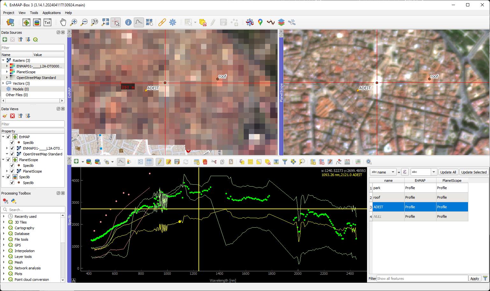

#########################
EnMAP-Box 3 Documentation
#########################

The EnMAP-Box is a Python plugin for `QGIS <https://www.qgis.org/en/site/#>`__, designed to process, visualize and
analyze hyperspectral remote sensing data.

.. figure:: img/screenshot_3.15.1.png
   :figwidth: 150%

   The graphical user interface of the EnMAP-Box

Get going with the :ref:`Installation <usr_installation>` and the :ref:`Getting Started <getting_started>` chapter.
Have a look at the :ref:`Cookbook <cookbook>` for usage examples!

Key features
************

* Extend your QGIS for remote sensing image analysis
* Add powerful tools to process and analyze imaging spectroscopy data
* Integrate machine learning algorithms into your image classification and regression with Random Forests, Support Vector Machines and many more
* Create and manage spectral libraries with attribute data
* Develop your own image processing algorithms using a powerful Python API

   The graphical user interface of the EnMAP-Box visualizing (left) a hyperspectral EnMAP image and (right) a multi-spectral
   PlanetScope image from the city of Valencia, Spain.

Related websites
****************

- `Environmental Mapping and Analysis Program (EnMAP) <https://www.enmap.org/>`__
- `Source code repository <https://github.com/EnMAP-Box/enmap-box/tree/main/>`__
- `HYPERedu on eo-college <https://eo-college.org/resource-spectrum/hyperspectral/>`__

.. show NEWS section

.. include:: general/news.rst

|
|

....

.. toctree::
    :maxdepth: 6
    :caption: General

    general/about.rst
    general/features.rst
    general/news.rst
    general/contribute.rst
    general/faq_trouble.rst
    general/roadmap.rst
    general/glossary.rst
    Data Access <general/data_access.rst>

..  toctree::
    :maxdepth: 6
    :caption: User Section

    usr_section/usr_installation.rst
    usr_section/usr_gettingstarted.rst
    usr_section/usr_cookbook/usr_cookbook.rst
    usr_section/usr_manual/usr_manual.rst

    usr_section/application_tutorials/index.rst

..  toctree::
    :maxdepth: 6
    :caption: Developer Section

    dev_section/dev_installation.rst
    dev_section/dev_enmapboxrepository
    dev_section/dev_publish_enmapbox.rst
    dev_section/cookbook/index.rst
    dev_section/tutorials/index.rst
    dev_section/rfc_list/index.rst
    dev_section/styleguide.rst
    dev_section/icon_links_viewer.rst

..    dev_section/api/modules.rst
..    dev_section/programming_tutorials/index.rst

Indices and tables
------------------

* :ref:`genindex`
* :ref:`modindex`
* :ref:`search`

