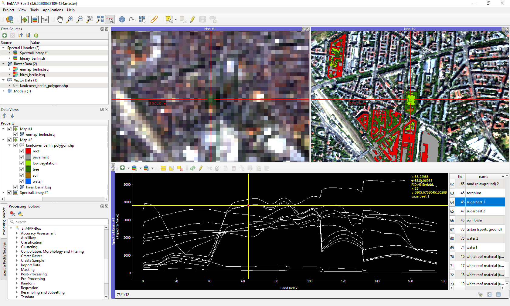

..  EnMAP-Box 3 documentation master file, created by
    sphinx-quickstart on Fri Jan 19 05:59:30 2018.
    You can adapt this file completely to your liking, but it should at least
    contain the root `toctree` directive.

#########################
EnMAP-Box 3 Documentation
#########################

The EnMAP-Box is a python plugin for `QGIS <https://www.qgis.org/en/site/#>`_, designed to process and visualise
hyperspectral remote sensing data.

Get going with the :ref:`Installation <usr_installation>` and the :ref:`Getting Started <getting_started>` chapter.
Have a look at the :ref:`Cookbook <cookbook>` for usage examples!

Key features
************

* Extend your QGIS for remote sensing image analysis
* Add powerful tools to process and analyse imaging spectroscopy data
* Integrate machine learning algorithms into your image classification and regression with Random Forests, Support Vector Machines and many more
* Create and manage spectral libraries with attribute data
* Develop your own image processing algorithms using a powerful Python API

Related websites
****************

- `Environmental Mapping and Analysis Program (EnMAP) <https://www.enmap.org/>`_
- `Source code repository <https://github.com/EnMAP-Box/enmap-box/tree/main/>`_
- `HYPERedu on eo-college <https://eo-college.org/resource-spectrum/hyperspectral//>`_

News
****

EnMAP-Box Version 3.10 released
==============================

June 09, 2022

A new EnMAP-Box version has been released.
A list of all improvements can be found in the `changelog <https://github.com/EnMAP-Box/enmap-box/blob/main/CHANGELOG.rst>`_.

EnMAP-Box Version 3.9 released
==============================

Oct. 10, 2021

A new EnMAP-Box version has been released.
A list of all improvements can be found in the `changelog <https://github.com/EnMAP-Box/enmap-box/blob/main/CHANGELOG.rst>`_.

EnMAP-Box Workshop 2021
=======================

Jun, 07, 2021

The next EnMAP-Box workshop will be held online on 21-23 June, 2021.
The workshop aims to demonstrate the current state of the EnMAP-Box by way of presentations, live demos with Q&A and self-paced tutorials.
Registration for up to 250 participants is now open at the `workshop website <https://bitbucket.org/hu-geomatics/enmap-box/wiki/events/Workshop_2021>`_.

.. figure:: img/events/workshop2021.banner.png
    :align: center

FOSSGIS 2021
============

Jun 09, 2021

Benjamin Jakimow presented how to use Spectral Libraries in QGIS using the EnMAP-Box (german).

.. raw:: html

   <video width="100%" height="380" controls> <source src="https://mirror.selfnet.de/CCC//events/fossgis/2021/h264-hd/fossgis2021-8945-deu-Von_Pixeln_und_Profilen_Die_Nutzung_von_Spektralbibliotheken_in_QGIS_mit_der_EnMAP-Box_hd.mp4" type="video/mp4"></video>

EnMAP-Box Version 3.7 released
==============================

Oct. 27, 2020

A new EnMAP-Box version has been released. It includes product readers for EnMAP L1B, L2C and L2A, PRISMA L2D
and DESIS L2A images, and a first version of Spectral Math in the QGIS Expression Builder.
A list of all improvements can be found in the `changelog <https://github.com/EnMAP-Box/enmap-box/blob/main/CHANGELOG.rst>`_.

FOSSGIS 2020
============

Andreas Rabe presented the EnMAP-Box at the FOSSGIS 2020 in Freiburg. See the full live-demo session here (german):

.. raw:: html

   <iframe width="100%" height="380" src="https://www.youtube.com/embed/egaJLUe_eXY" frameborder="0" allow="accelerometer; encrypted-media; gyroscope; picture-in-picture" allowfullscreen></iframe>

|

QGIS User Conference 2019
=========================

Two Presentations by EnMAP-Box developers Andreas Rabe and Benjamin Jakimow at the QGIS User conference in Coruña

* `Earth observation data processing in QGIS with a python API <https://av.tib.eu/media/40775>`_
* `EO Time Series Viewer - A plugin to explore Earth Observation Time Series Data in QGIS <https://av.tib.eu/media/40776>`_

|
|

.. toctree::
    :maxdepth: 6
    :caption: General

    general/about.rst
    general/faq_trouble.rst
    general/contribute.rst
    general/roadmap.rst
    general/glossary.rst

..  toctree::
    :maxdepth: 6
    :caption: User Section

    usr_section/usr_installation.rst
    usr_section/usr_gettingstarted.rst
    usr_section/usr_cookbook/usr_cookbook.rst
    usr_section/usr_manual/usr_manual.rst
    usr_section/application_tutorials/index.rst
    usr_section/workshop_tutorials/index.rst

..  toctree::
    :maxdepth: 6
    :caption: Developer Section

    dev_section/dev_installation.rst
    dev_section/dev_enmapboxrepository
    dev_section/dev_publish_enmapbox.rst
    dev_section/dev_cookbook/dev_cookbook.rst
    dev_section/dev_guide.rst
    dev_section/rfc_list/index.rst
    dev_section/styleguide.rst

..    dev_section/api/modules.rst
..    dev_section/programming_tutorials/index.rst

Indices and tables
------------------

* :ref:`genindex`
* :ref:`modindex`
* :ref:`search`

