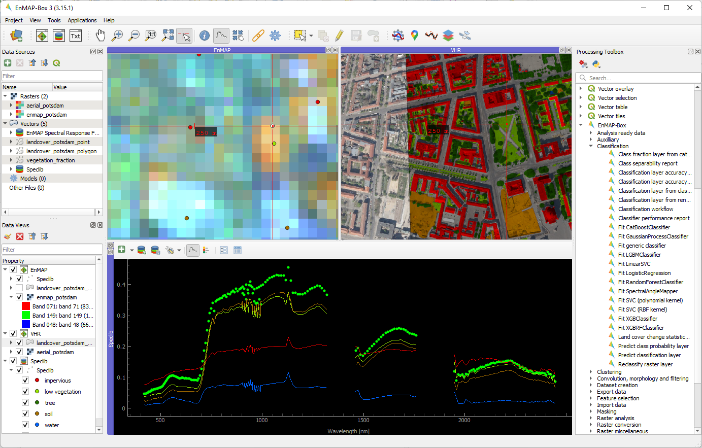

#######################
EnMAP-Box Documentation
#######################

The EnMAP-Box is Python plugin for `QGIS <https://www.qgis.org/en/site/#>`__,
to process, visualize and analyze mulit- and hyperspectral remote sensing data.

   Graphical user interface of the EnMAP-Box

Visit our overview on EnMAP-Box :ref:`features <features>` and get going
with the :ref:`Installation <usr_installation>` and :ref:`Getting Started <getting_started>` chapters.
Have a look at the :ref:`Cookbook <cookbook>` for usage examples!

Related Sites
*************

- Environmental Mapping and Analysis Program (EnMAP) https://www.enmap.org
- Source code repository https://github.com/EnMAP-Box/enmap-box>
- HYPERedu on eo-college https://eo-college.org/resource-spectrum/hyperspectral

.. include:: general/news.rst

|
|

....

.. toctree::
    :maxdepth: 6
    :caption: General

    general/about.rst
    general/features.rst
    general/news.rst
    general/contribute.rst
    general/faq_trouble.rst
    general/roadmap.rst
    general/glossary.rst
    Data Access <general/data_access.rst>

..  toctree::
    :maxdepth: 6
    :caption: User Section

    usr_section/usr_installation.rst
    usr_section/usr_gettingstarted.rst
    usr_section/usr_cookbook/usr_cookbook.rst
    usr_section/usr_manual/usr_manual.rst

    usr_section/application_tutorials/index.rst

..  toctree::
    :maxdepth: 6
    :caption: Developer Section

    dev_section/dev_installation.rst
    dev_section/dev_enmapboxrepository
    dev_section/dev_publish_enmapbox.rst
    dev_section/cookbook/index.rst
    dev_section/tutorials/index.rst
    dev_section/rfc_list/index.rst
    dev_section/styleguide.rst
    dev_section/icon_links_viewer.rst

..    dev_section/api/modules.rst
..    dev_section/programming_tutorials/index.rst

Indices and tables
------------------

* :ref:`genindex`
* :ref:`modindex`
* :ref:`search`

