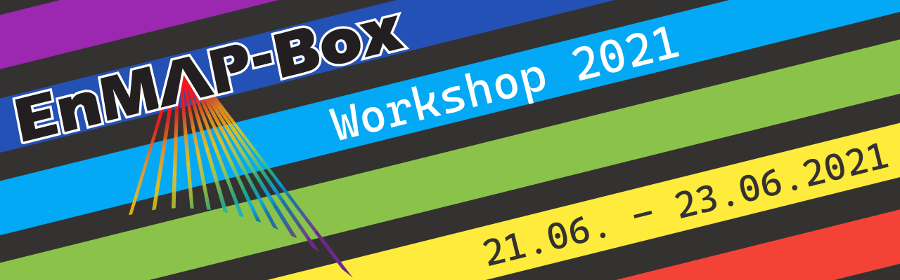

News
****

FOSSGIS 2023 Berlin
===================

The EnMAP-Box will be present at the FOSSGIS with a demosession:
*Visualisierung und Analyse von Satellitenbildern mit der EnMAP-Box* (https://pretalx.com/fossgis2023/talk/9WAMJ9/)

Looking forward meeting you there!

UPDATE - `Here <https://media.ccc.de/v/fossgis2023-24078-visualisierung-und-analyse-von-satellitenbildern-mit-der-enmap-box>`_
is the recording of the presentation:

.. raw:: html

   

   <video width="100%" height="430" controls> <source src="https://cdn.media.ccc.de/events/fossgis/2023/webm-hd/fossgis2023-24078-deu-Visualisierung_und_Analyse_von_Satellitenbildern_mit_der_EnMAP-Box_webm-hd.webm" type="video/webm"></video>
   

|

EnMAP-Box Version 3.11 released
==============================

Oct. 10, 2022

A new EnMAP-Box version has been released.
A list of all improvements can be found in the `changelog <https://github.com/EnMAP-Box/enmap-box/blob/main/CHANGELOG.md#version-311>`_.

EnMAP-Box Version 3.10 released
==============================

June 09, 2022

A new EnMAP-Box version has been released.
A list of all improvements can be found in the `changelog <https://github.com/EnMAP-Box/enmap-box/blob/main/CHANGELOG.md#version-310>`_.

EnMAP-Box Version 3.9 released
==============================

Oct. 10, 2021

A new EnMAP-Box version has been released.
A list of all improvements can be found in the `changelog <https://github.com/EnMAP-Box/enmap-box/blob/main/CHANGELOG.md#version-39>`_.

EnMAP-Box Workshop 2021
=======================

June 07, 2021

The next EnMAP-Box workshop will be held online on 21-23 June, 2021.
The workshop aims to demonstrate the current state of the EnMAP-Box by way of presentations, live demos with Q&A and self-paced tutorials.
Registration for up to 250 participants is now open at the `workshop website <https://bitbucket.org/hu-geomatics/enmap-box/wiki/events/Workshop_2021>`_.

FOSSGIS 2021
============

June 09, 2021

Benjamin Jakimow presented how to use Spectral Libraries in QGIS using the EnMAP-Box (german).

.. raw:: html

   

   <video width="100%" height="430" controls> <source src="https://mirror.selfnet.de/CCC//events/fossgis/2021/h264-hd/fossgis2021-8945-deu-Von_Pixeln_und_Profilen_Die_Nutzung_von_Spektralbibliotheken_in_QGIS_mit_der_EnMAP-Box_hd.mp4" type="video/mp4"></video>
   

|

EnMAP-Box Version 3.7 released
==============================

Oct. 27, 2020

A new EnMAP-Box version has been released. It includes product readers for EnMAP L1B, L2C and L2A, PRISMA L2D
and DESIS L2A images, and a first version of Spectral Math in the QGIS Expression Builder.
A list of all improvements can be found in the `changelog <https://github.com/EnMAP-Box/enmap-box/blob/main/CHANGELOG.md>`_.

FOSSGIS 2020
============

Andreas Rabe presented the EnMAP-Box at the FOSSGIS 2020 in Freiburg. See the full live-demo session here (german):

.. raw:: html

   

   <iframe width="100%" height="430" src="https://www.youtube.com/embed/egaJLUe_eXY" frameborder="0" allow="accelerometer; encrypted-media; gyroscope; picture-in-picture" allowfullscreen></iframe>
   

|

QGIS User Conference 2019
=========================

Two Presentations by EnMAP-Box developers Andreas Rabe and Benjamin Jakimow at the QGIS User conference in Coruña

* `Earth observation data processing in QGIS with a python API <https://av.tib.eu/media/40775>`_
* `EO Time Series Viewer - A plugin to explore Earth Observation Time Series Data in QGIS <https://av.tib.eu/media/40776>`_