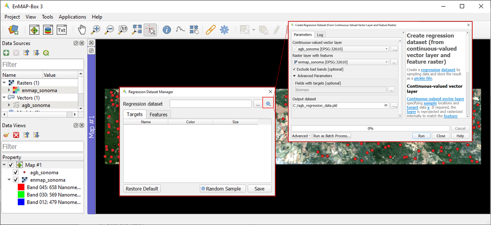

.. include:: /icon_links.rst

.. _tutorial_biomass:

Regression-based mapping of forest aboveground biomass
######################################################

**Authors:**  Sam Cooper, Akpona Okujeni, Patrick Hostert, Benjamin Jakimow, Andreas Janz, Fabian Thiel, & Sebastian van der Linden

**Contributors:** Klara Busse, Clemens Jaenicke

**Publication date:** 03/07/2020

**Latest update:** 23/01/2024

Introduction
************

1. Background
=============

.. image:: /img/hyperedu_logo.png
   :alt: hyperEDU logo
   :align: right
   :width: 30%

This tutorial is featured on the `HYPERedu online learning platform <https://eo-college.org/resource-spectrum/hyperspectral/>`_, an educational initiative under the `EnMAP mission <https://www.enmap.org/>`_ hosted on EO College. HYPERedu offers annotated slide collections and hands-on tutorials utilizing the open-source EnMAP-Box software, covering fundamental principles, methods, and applications of imaging spectroscopy.

Slide collections with annotations for the tutorial *Regression-based mapping of forest aboveground biomass* and a software description unit for the EnMAP-Box can be found here:

* `Slide collection <https://eo-college.org/resource/regression-based-mapping-of-forest-aboveground-biomass/>`_
* `EnMAP software description <https://eo-college.org/resource/enmap-box/>`_

2. Content
==========

Forest aboveground biomass (AGB) is a measure of the living and dead plant material in a given area. As such, it is
often used for forest management, assessing fire potential, and is an important metric used in modelling carbon and
nutrient cycles. AGB can be directly measured at a plot level by harvesting and weighing vegetation, but this is both
an expensive and highly invasive process. Through the use of statistical modelling and remotely sensed imagery, AGB can
be mapped across broad, spatially continuous areas using only a small number of directly measured reference plots.
This tutorial focuses on regression-based modeling of forest AGB using the EnMAP-Box. A hyperspectral image mosaic
from the EnMAP sensor (here simulated from AVIRIS imagery) and a corresponding vector dataset containing plot-based AGB
references are used for this tutorial. The aim is to provide an introduction into the functionality of the
EnMAP-Box, as well as hands-on training for implementing regression-based mapping.

3. Requirements
===============

This tutorial is designed for EnMAP-Box 3, version 3.13.0 or higher. Minor changes may be present in subsequent versions, such as modified menu labels or added parameter options.

4. Further reading
==================

We recommend [1]_ and [2]_ for a comprehensive overview of imaging spectroscopy of terrestrial ecosystems, [3]_ for
an overview of remote sensing of forest AGB and [4]_ for a companion study using the same data.

.. [1] Foerster, S., Guanter, L., Lopez, T., Moreno, J., Rast, M., Schaepman, M.E. (2019) Exploring the Earth System with Imaging Spectroscopy. Springer International Publishing
.. [2] Thenkabail, P. S., & Lyon, J. G. (2016). Hyperspectral remote sensing of vegetation. CRC press.
.. [3] Lu, D., Chen, Q., Wang, G., Liu, L., Li, G., & Moran, E. (2016). A survey of remote sensing-based aboveground biomass estimation methods in forest ecosystems. International Journal of Digital Earth, 9(1), 63-105.
.. [4] Cooper, S., Okujeni, A., Pflugmacher, D., van der Linden, S., & Hostert, P. (2021). Combining simulated hyperspectral EnMAP and Landsat time series for forest aboveground biomass mapping. International Journal of Applied Earth Observation and Geoinformation, 98.

5. Data
=======

:download:`You can download the data for this exercise here:`
    https://box.hu-berlin.de/f/c64b035316f54be08ebb/?dl=1

The tutorial data contains a simulated hyperspectral EnMAP image, plot-based AGB references
as well as a land cover map for a small study area located in Sonoma County, California, USA. The simulated EnMAP
image is a subset extracted from the “2013 Simulated EnMAP Mosaics for the San Francisco Bay Area, USA” dataset [5]_.
AGB reference data was sampled from an existing LiDAR derived AGB map [6]_. The land cover map was
taken from the 2011 National Landcover Database (NLCD) [7]_.

.. csv-table::
   :header-rows: 1
   :delim: ;
   :widths: auto

   Data type; Filename; Description
   Raster; :file:`enmap_sonoma.tif`; Simulated spaceborne hyperspectral data from the EnMAP sensor with a spatial resolution of 30m, 195 bands, and 1000x200 pixels (GeoTIFF ``tif``with QGIS layer style file ``qml``)
   Raster; :file:`nlcd_sonoma.tif`; National Land Cover Database 30m classification for the study region (GeoTIFF ``tif`` with QGIS layer style file ``qml``)
   Vector; :file:`agb_sonoma.gpkg`; 343 AGB reference points sampled from the existing LiDAR derived AGB map (GeoPackage ``gpkg``)

.. [5] Dubayah, R.O., A. Swatantran, W. Huang, L. Duncanson, H. Tang, K. Johnson, J.O. Dunne, and G.C. Hurtt. 2017. CMS: LiDAR-derived Biomass, Canopy Height and Cover, Sonoma County, California, 2013. ORNL DAAC, Oak Ridge, Tennessee, USA. https://doi.org/10.3334/ORNLDAAC/1523
.. [6] Cooper, S.; Okujeni, A.; Jänicke, C.; Segl, K.; van der Linden, S.; Hostert, P. (2020): 2013 Simulated EnMAP Mosaics for the San Francisco Bay Area, USA. GFZ Data Services. https://doi.org/10.5880/enmap.2020.002
.. [7] Multi-Resolution Land Characteristics Consortium (MRLC) (2018). National Land Cover Database 2011 (NLCD 2011). Multi-Resolution Land Characteristics Consortium (MRLC). https://data.nal.usda.gov/dataset/national-land-cover-database-2011-nlcd-2011. Accessed 2022-08-08.

|

Exercise A: Getting started with the EnMAP-Box
**********************************************

.. admonition:: Description

   This exercise introduces basic functionalities of the EnMAP-Box for this tutorial. You will get to know the graphical
   user interface and will learn how to load data, visualize raster and vector data, and use the basic navigation tools.
   Additionally, you will learn to work with multiple map views and how to visualize image spectra using Spectral
   Library Windows.

   Duration: 30 min

1. Start the EnMAP-Box
======================

* Start QGIS and click the |enmapbox| icon in the toolbar to open the EnMAP-Box. The GUI of the EnMAP-Box consists of
  a **Menu** and a **Toolbar** as well as panels for **Data Sources** and **Data Views**.
* The **QGIS Processing Toolbox** including the EnMAP-Box algorithms can be optionally added to the GUI by clicking
  on :guilabel:`View` in the Menu and by checking the :guilabel:`Processing Toolbox` from the :guilabel:`Panel` list.

2. Load data
============

* To load new datasets into the EnMAP-Box, click the |mActionDataSourceManager| icon and navigate to the file directory
  containing your data. Select :file:`agb_sonoma.gpkg` from the Open data source dialogue and select :guilabel:`Open`.
* Alternatively, the EnMAP-Box offers simple drag & drop capabilities to load data from an external file manager
  (e.g. Windows File Explorer). Load :file:`enmap_sonoma.tif` by dragging and dropping the file from your file manager
  into the :guilabel:`Data Sources` panel.
* All data currently open in the EnMAP-Box will appear in the Data Sources panel.

3. Visualize raster data
========================

* The EnMAP-Box offers **Map Views** (Map #) for visualizing raster and vector data. Click the |viewlist_mapdock| icon to open a
  new Map View and drag :file:`enmap_sonoma.tif` from the :guilabel:`Data Sources` panel into Map #1.

* In addition to a new Map View opening, a corresponding Data View entry is created in the :guilabel:`Data Views` panel
  which shows all data currently loaded in a given Map View.

* The :file:`enmap_sonoma.tif` image will be displayed as true color RGB composite. True color rendering is based on predefined
  RGB band combinations (R: 658 nm, G: 569 nm, B: 479 nm) stored in the QGIS Style File :file:`enmap_sonoma.qml`.

  .. image:: img/ex_a_agb_tutorial_figure_3.png
     :width: 100%

* **Raster Layer Styling** is a versatile tool for defining or modifying the RGB representation of raster images, either manually or through pre-defined settings. To change the RGB representation of :file:`enmap_sonoma.tif`, open the Raster Layer Styling panel by clicking the |symbology| icon in the :guilabel:`Data Views` panel.

    * Choose :file:`enmap_sonoma.tif` from the dropdown menu and the :guilabel:`RGB tab` as render type.
    * You can now choose between various pre-defined RGB representations from the dropdown menu (note: rasters needs to have wavelength information) or manually specify your RGB band combination.
    * You may further use the functionalities offered for contrast enhancement (e.g. Cumulative count cut: 2-98%).

4. Basic navigation tools
=========================

* The Toolbar offers common navigation tools for exploring visualized datasets. Make yourself familiar with the
  following navigation tools: |navtools|.
* Note that the mouse wheel can be used alternatively for zooming
  (roll mouse wheel forward/backward) and panning (press and hold mouse wheel).
* For a better orientation when exploring visualized raster images, you may switch on the crosshairs (right click into
  Map View and activate :menuselection:`Crosshair --> Show`.
* Make yourself familiar with the |cursorlocationinfo| icon on the toolbar to view pixel values of the displayed raster.
  Note: |select_location| :sup:`Identify Cursor Info` must be activated to access this tool. When activated and used, a new
  Cursor Location Values window will open displaying data from the selected pixel. This tool similarly works for
  viewing attribute information of displayed vector data.

.. |navtools| image:: img/navtools.png
   :height: 27px

5. Multiple map views
=====================

* The EnMAP-Box enables users to work with multiple Map Views, which can be flexibly organized and geospatially linked.
* Open a new Map View (Map #2) by clicking the |viewlist_mapdock| icon. A new Data view appears corresponding to the newly added Map View.

* Display :file:`enmap_sonoma.tif` as an RGB composite of your choice in Map #2.

.. tip::

   When loading a raster image to a map view, you may also right click the filename in the :guilabel:`Data Sources`
   panel and select either :guilabel:`Open in existing map` or :guilabel:`Open in new map`. If the raster image has wavelength
   information associated with it, you may also select a predefined composite from the context menu.

* To establish geospatial linking, click the |link_basic| icon to open the :guilabel:`Map Linking` window. Choose the |link_all_mapscale_center| :sup:`Link Map Scale and Center` option, and close the dialog.

.. tip::

   Map Windows can be re-arranged by clicking on the blue Map title bar (Map #) and dragging it to the desired position.
   A transparent blue rectangle will appear indicating the docking position once you release the mouse button.
   You may also undock map views from the EnMAP-Box window by selecting |float_window| from the blue Map title bar.
   To re-dock a Map View, click and drag the blue Map title bar to an open Map View already docked in the EnMAP-Box window.

.. |float_window| image:: img/float_window.png

6. Visualize vector data
========================

* Close Map #2 from the previous step.
* Load :file:`agb_sonoma.gpkg` to Map #1.
* To change the order of stacked layers, go to the :guilabel:`Data Views` panel and drag one layer on top or below
  another one. Arrange the layer stack so that :file:`agb_sonoma.gpkg` is displayed on top of :file:`enmap_sonoma.tif`.
* By default, vector files are displayed with a single uniform symbol. To change this symbology, right
  click on :file:`agb_sonoma.gpkg` in the :guilabel:`Data Views` panel, select :guilabel:`Layer Properties` and navigate to :guilabel:`Symbology`
  in the Layer Properties window. You can now change the symbology in accordance to the QGIS functionality.

    * Select :guilabel:`Graduated` from the dropdown menu, and select ``biomass`` in :guilabel:`Value` and ``Color`` in :guilabel:`Method`.
    * Set the :guilabel:`Color ramp` to run from white to green.
    * Press :guilabel:`Classify` and then :guilabel:`OK` to display the biomass values associated with each point.

7. Extract & visualize image spectra
====================================

* The EnMAP-Box offers **Spectral Library Windows** (SpectralLibrary #) for visualizing spectra and handling
  their metadata.
* This tool may also be used to extract and visualize spectra which are spatially associated with vector
  data open in the EnMAP-Box, i.e., the AGB reference points. To do this, open a new Spectral Library
  window by selecting the |viewlist_spectrumdock| icon on the toolbar.
* Next, import spectral profiles from other sources by clicking at the |speclib_add| icon in the SpectralLibrary #1
  menu. Specify the following settings:

    * :guilabel:`Format` = Raster Layer
    * |mIconCollapse| :guilabel:`Options`: Raster = :file:`enmap_sonoma.tif`, Vector = :file:`agb_sonoma.gpkg`
    * |mIconCollapse| :guilabel:`Field Value Import`: Click on the |mSourceFields| icon, select ``biomass`` and click :guilabel:`OK`.

* Terminate the Import Spectral Profile dialogue with :guilabel:`OK`. A spectral library is automatically built based on the
  geographic location of each point in the vector file. The associated attribute information is displayed in the table on the right.
* In Exercise B, you will learn how to create regression models based on the illustrated spectra and related AGB quantities
  to predict AGB across the whole image.

.. image:: img/ex_a_agb_tutorial_figure_7.png
   :width: 100%

.. admonition:: Learning Activities

   * **A1**: What land cover types are present in the imagery? How are the AGB reference plots distributed throughout the scene?
   * **A2**: What different information can you see when switching from a true color composite to a NIR false color composite?

|

Exercise B: Regression based mapping of AGB
*******************************************

.. admonition:: Description

   One of the strengths of remote sensing comes from its ability to take high-quality plot measurements of a
   variable of interest and building statistical models with which wall to wall maps of this variable can
   be created. One of the most common ways of doing this is to create regression models based on the optical
   properties of the training data and applying it to large scale imagery. This exercise …

   * Introduces a regression-based mapping approach for taking plot measurements of AGB and generating
     spatial AGB estimates using an input raster of hyperspectral imagery.
   * Demonstrates the Regression Dataset Manager and the Regression Workflow applications of the EnMAP-Box.

   Duration: 20 min

1. Use the Regression Dataset Manager for data preparation
==========================================================

* The **Regression Dataset Manager** offers different options to prepare data for the **Regression workflow**
  application. In the context of this tutorial, you will create a Regression Dataset from a raster and a vector
  layer containing the spectral features (independent variable) and the target variable (dependent variable),
  respectively. The regression dataset will be stored as pickle file (:file:`.pkl`).
* Open :file:`enmap_sonoma.tif` and :file:`agb_sonoma.gpkg` in a single **Map Window**. Close all other
  opened **Map** and **Spectral Library Windows**.
* Navigate to :guilabel:`Applications` in the Menu, choose :guilabel:`Regression`, and then :guilabel:`Regression Dataset Manager`.
* To create the Regression Dataset from a raster and a vector layer, click on the |processing_collapse|
  icon and select |mIconPolygonLayer| :sup:`Create regression dataset (from continuous-valued vector layer and feature raster)`.
  A new widget will be opened. Run the dialog with the following inputs:

mIconPolygonLayer

    * :guilabel:`Continuous-valued vector layer`: select :file:`agb_sonoma.gpkg`
    * :guilabel:`Raster layer with features`: select :file:`enmap_sonoma.tif`
    * :guilabel:`Fields with targets`: select attribute ``biomass``
    * :guilabel:`Output dataset`: select :menuselection:`... --> Save to File…` and define an output path and file name
      (e.g. :file:`agb_regression_data.pkl`).

* After running the dialog, :file:`agb_regression_data.pkl` will be opened under :guilabel:`Models` in the Data Sources
  panel. Close the Regression Dataset Manager.

.. tip::

   The Regression Dataset Manager offers different random sampling options, e.g. for splitting Regression data
   into training and validation data. Once the Regression data is prepared, you can access these options
   through the |processingAlgorithm| :guilabel:`Random Sample` button.

2. Use the Regression Workflow for estimating AGB
=================================================

* The **Regression Workflow** application offers several state-of-the-art regression algorithms from the
  scikit-learn library (see https://scikit-learn.org/stable/index.html) for predicting continuous variables.
  The application further includes an optional cross-validation for assessing model performances.
* Click on :guilabel:`Applications` in the Menu, select :guilabel:`Regression`, and then :guilabel:`Regression workflow` to open the regression application.

   * Choose :file:`agb_regression_data.pkl` as :guilabel:`Training dataset`.
   * Select ``RandomForestRegressor`` (default, due to the low processing time) as :guilabel:`Regressor`,
     and use the default model parameters. Note that the different algorithms provided lead to varying accuracies
     and processing times. Refer to the scikit-learn documentation for more information.
   * :guilabel:`Raster layer with features` specifies the raster image to which the regression model will be applied.
     Select :file:`enmap_sonoma.tif`.
   * To make use of a cross-validation, set the :guilabel:`Number of cross-validation folds' to ``10`` (default)
     and leave the :guilabel:`Open output cross-validation regressor...` option checked. Specify output path and file name
     (e.g. :file:`agb_estimation_cv.html`) under :guilabel:`Output cross-validation regressor performance report` to save the report in
     your working directory.
   * The regression model can be optionally saved, e.g. for applying the model again to a dataset.
     Specify output path and file name (e.g. :file:`agb_rfmodel.pkl`) under :guilabel:`Output regressor` to save the
     result in your working directory.
   * Specify output path and file name (e.g. :file:`agb_estimation.tif`)
     under :guilabel:`Output regressor layer` to save the result in your working directory.
   * Click run to start the Regression Workflow.

.. tip::

   All processing options of the **Regression Workflow** that are labeled as [optional] can be disregarded by
   setting the :guilabel:`Output` to ``Skip Output``.

3. Assess the model performance for AGB estimation
==================================================

* After running the Regression Workflow, the performance report with scatterplots and statistical measures
  will be opened in your default web browser.
* Based on the 10-fold cross-validation, you can now access the performance of your model to predict AGB.

4. Visualize AGB results
========================

* After running the Regression Workflow, all outputs will appear in the Data Sources panel.
* Close all opened Map/SpectralLibrary Windows. Open :file:`enmap_sonoma.tif` as an RGB composite of your choice in Map #1.
* Open the :file:`agb_estimation.tif` in a new Map View and link to the Map #1. Use the Layer Properties to change the color ramp to white-green (Singleband pseudocolor).

Learning Activities
===================

.. admonition:: Learning Activities

   * **B1**: What general trends do you see in the biomass estimations? How do they compare to landscape features seen in the EnMAP imagery?
   * **B2**: Discuss the accuracy results, both in terms of the statistical measures, as well as the form of the scatterplot and histograms.

|

Exercise C: Compare AGB estimates with the NDVI
***********************************************

.. admonition:: Description

   In this exercise, you will learn how to use the Raster Math application to calculate a NDVI map and
   generate a forest mask based on the NLCD land cover map. Based on the forest area only, you will then
   assess the AGB prediction from Exercise B relative to the NDVI using the Scatter Plot Tool.

   Duration: 30 min

1. Introduction to Raster Math
==============================

* **Raster math** is a powerful raster calculator inspired by the QGIS Raster calculator, the GDAL Raster calculator and ENVI Band Math. In addition to those tools, the EnMAP-Box Raster math calculator supports multi-band arrays, vector layer inputs, multi-line code fragments and metadata handling. In the following sections, you will utilize Raster Math to...

    * to calculate a NDVI map from two bands of our EnMAP imagery,
    * to generate a forest mask from the NLCD land cover map,
    * and to apply a forest mask to both the NDVI and AGB maps.

* Close all opened Map/Spectral Library Windows. Display :file:`enmap_sonoma.tif`, :file:`nlcd_sonoma.tif`
  and :file:`agb_estimation.tif` in a single or in multiple Map Views.
* Open the ** Raster Math** application by going to :guilabel:`Applications` then selecting :guilabel:`Raster math`
* Raster Math consists of several panels, including the :

  * :guilabel:`Code`: text editor to define a single-line expression or a multi-line code fragment for raster calculations on input datasets
  * :guilabel:`Data sources`: list of available datasets to conduct the calculations

2. Calculate NDVI
=================

* The Normalized Difference Vegetation Index (NDVI) is a commonly used vegetation index that is correlated with
  both vegetation cover and AGB. The formula for NDVI is:

  .. math::

     NDVI = \frac{NIR-Red}{NIR+Red}

  where NIR is the near-infrared band reflectance (~850nm) and Red is the red band reflectance (~660nm).
  We will now calculate NDVI from the EnMAP imagery using Raster Math.

* In the Code Editor, define the Red and NIR bands in our EnMAP imagery. These correspond to bands 45 (658 nm) and 71 (847 nm),
  respectively:

  .. code-block:: python

     red = enmap_sonoma@45
     nir = enmap_sonoma@71

  ... then, define the NDVI formula:

  .. code-block:: python

     ndvi = (nir - red) / (nir + red)

  ... and, finally, delete the temporary variables used for calculating the NDVI:

  .. code-block:: python

     del red,nir

* Specify output path and file name (e.g. :file:`ndvi.tif`) under :guilabel:`Output raster layer` to save the result in your working directory.
* Click run to start the calculation. A new raster dataset :file:`ndvi.tif` will appear in the Data Sources panel.

3. Create a forest mask
=======================

* As the model was trained using AGB reference plots from forest areas, only limited inference can be made of the non-forest AGB estimates.
  We will therefore apply a forest mask to our AGB map as well as to the NDVI map. The forest mask will be generated based on the available NLCD land cover map.
* Below are the NLCD classes and color legend represented in the raster data. We will consider any pixel to be
  forest which is labelled as Deciduous (41), Evergreen (42), or Mixed (43) forest according to the NLCD classification.

* Open the **Raster Math** application and enter the following code into the code editor to calculate the forest masks:

  .. code-block:: python

    forest_mask = nlcd_sonoma
    forest_classes = [42, 43, 44]
    for x in range(forest_mask.shape[1]):
         for y in range(forest_mask.shape[2]):
              if forest_mask[0, x, y] in forest_classes:
                  forest_mask[0, x, y] = 0
              else:
                  forest_mask[0, x, y] = 1

* Line by line, this

  1. Copies the NLCD information to a new object we will manipulate to create the mask
  2. Creates a list of classes which we consider forest
  3. Loops through the x dimension of the raster.
  4. Loops through the y dimension of the raster.
  5. Check if the element at the current x and y position is in the forest_classes list
  6. If it is, set that value to 0
  7. Else
  8. Set that value to 1

* Specify output path and file name (e.g. :file:`forest_mask.tif`) under :guilabel:`Output raster layer` to save the result in your working directory.
* Click run to start the calculation. A new raster dataset :file:`forest_mask.tif` will appear in the Data Sources panel. The resulting mask now has a value of 0 for forested pixels, and 1 for non-forested pixels.

4. Apply the forest mask to the AGB estimates
=============================================

* Open the **Raster Math** application and enter the following code into the code editor to apply the forest mask to the AGB and NDVI images.:

.. code-block:: python

    mask = forest_mask.astype(bool)
    agb_masked = agb_estimation
    agb_masked[mask] = -99
    agb_masked.setNoDataValue(-99)
    del mask

* Line by line, this script:

  1. Sets the mask to a Boolean data type (i.e. True/False). The mask file contains binary values where 0
     indicates forest (i.e. non-masked pixels) and 1 indicates non-forest (i.e. pixels to be ignored).
     In Python, 1 also represents True while 0 represents False, and by setting the datatype to ``bool``,
     we explicitly tell Python to treat these values in this manner.
  2. Copies the AGB values to a new array.
  3. Steps through each value in the new array and sets the value to -99 if the mask value is True.
     In numpy array speak, this line can therefore read: “For each value in ``agb_masked``, if the corresponding
     value in ``forest_mask`` is True (i.e. non-forest), then set that value to -99”. If the mask value is False
     (i.e. forested), nothing will happen, and the biomass value will remain in the array.
  4. Sets the no data value for the masked array to -99. This helps the EnMAP-Box to automatically display the
     data correctly, and since it is not a realistic value for both AGB and NDVI, we can safely ignore it.
  5. Deletes the temporary variables used for calculating the NDVI.

* Specify output path and file name (e.g. :file:`agb_masked.tif`) under :guilabel:`Output raster layer` to save the result in your working directory.
* Click run to start the calculation. A new raster dataset :file:`agb_masked.tif` will appear in the Data Sources panel. The resulting raster now displays AGB estimates for forest areas, while any other land cover types are masked.

5. Apply the forest mask to the NDVI
====================================
* Apply the forest mask to the NDVI by using **Raster Math**.

.. code-block:: python

    mask = forest_mask.astype(bool)
    ndvi_masked = ndvi
    ndvi_masked[mask] = -99
    ndvi_masked.setNoDataValue(-99)
    del mask

* Specify output path and file name (e.g. :file:`ndvi_masked.tif`) under :guilabel:`Output raster layer` to save the result in your working directory.
* Click run to start the calculation. A new raster dataset :file:`ndvi_masked.tif` will appear in the Data Sources panel. The resulting raster now displays the NDVI for forest areas, while any other land cover types are masked.

6. Visualize AGB vs. NDVI with the Scatter Plot tool
====================================================

* Close all Map Views.
* Open an RGB composite of :file:`enmap_sonoma.tif` in Map #1.
* Display :file:`agb_masked.tif` and :file:`ndvi_masked.tif` in Map#2 and Map#3, respectively and
  use the Layer Properties to change the color ramp of both maps to white-green. Link all Map Views.

* To investigate the relationship between estimated AGB and NDVI, we will make use of the EnMAP-Box's Scatter Plot tool.
  This is one of several tools integrated into the EnMAP-Box to support data visualization and assessment

* Open the **Scatter Plot** tool by going to :guilabel:`Tools` then selecting :guilabel:`Scatter Plot`.

   * Select :file:`agb_masked.tif` and *Band 1* for specifying :guilabel:`X values` and
     :file:`ndvi_masked.tif` and *Band 1* for specifying :guilabel:`Y values`.
     If a selected raster has multiple bands, you would specify the desired band from the dropdown.
   * Click on :guilabel:`Apply` to visualize the Scatter Plot.

* The |mIconCollapse| :guilabel:`Settings` offer different options for visualizing the scatter plot.
   * You may change the :guilabel:`Min` and :guilabel:`Max` values, :guilabel:`Coloring` or :guilabel:`Cumulative count cut`
     options to improve your visualization.
   * Under :guilabel:`Extent` you may choose ``Current canvas`` or ``Whole raster`` to display data of the current map canvas only or to
     display all raster data. Choose ``Whole raster``.
   * Under :guilabel:`Accuracy` you may choose to display ``Estimated`` or ``Actual``. ``Actual`` will display all available data, while
     ``Estimated`` will only display a random subset. For large raster extents, ``Estimated`` is much faster, and for that reason is the default.
     Leave :guilabel:`Accuracy` as ``Estimated``.
   * Click on :guilabel:`Apply` to update the Scatter Plot. If Live update is checked, visualization of the scatter plot will be automatically updated.

* The |mIconCollapse| :guilabel:`Analytics` offers options to assess the relationship between x and y values.

  * The :guilabel:`1:1 line` represents the linear 1:1 relationship between the two variables of the same unit if they were perfectly correlated.
  * The :guilabel:`Fitted line` represents the linear regression line fitted between the actual data from the two variables.
    The linear regression function, the coefficient of determination (r^2) and the Root Mean Squared Error (rmse) will
    be additionally displayed. Activate the *Min-max line* by checking the box to its left.

Learning Activities
===================

.. admonition:: Learning Activities

    * **C1**: Why was it necessary to mask the AGB results?
    * **C2**: What relationships can you see between AGB and NDVI? Do these relationships hold true if you look at
      the un-masked AGB and NDVI maps?
    * **C3**: Given the relationships between AGB and NDVI, do you think NDVI could be used to map AGB?
      What limitations would you expect from such a model?

Additional Exercises
********************

.. admonition:: Learning Activities

   * **AE1**: Use the **Image Statistics** tool in the :guilabel:`Tools` menu to look at the band statistics for the
     biomass predictions both with and without the tree mask applied.
   * **AE2**: Because we randomly subsetted the training data prior to model training, the performance of the model
     has an element of uncertainty to it. To better understand this, rerun the regression workflow 3-5 times. Then use
     the **Raster Math** tool to calculate the average estimate and variance. How does running the regression in such an
     ensemble approach affect the results? What is the spatial pattern of variation in estimates?
   * **AE3**: Rerun regression (Exercise B) using NDVI as the input rather than the hyperspectral imagery.