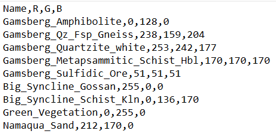
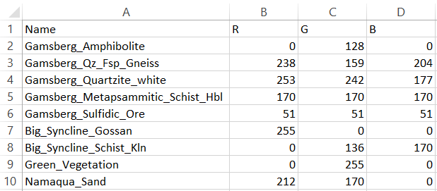
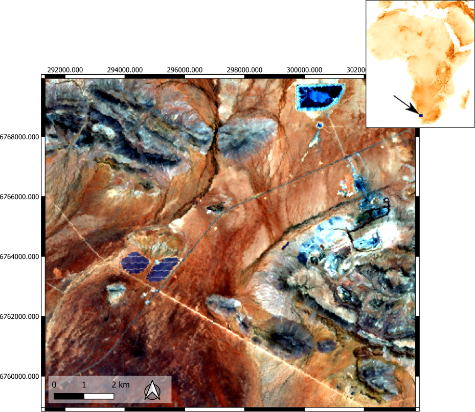
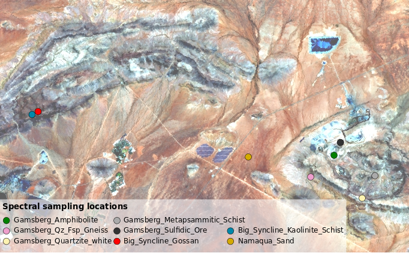
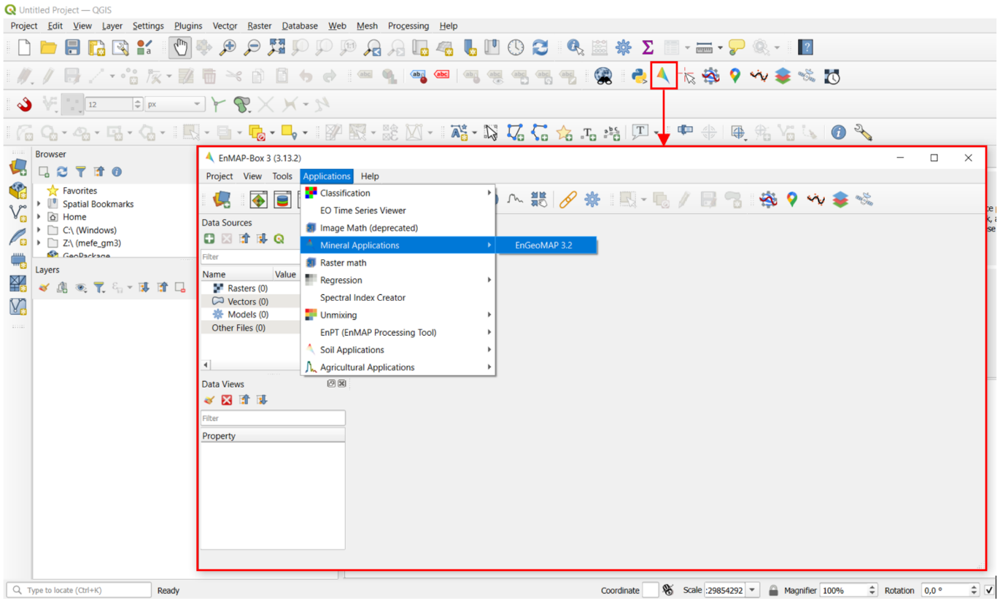
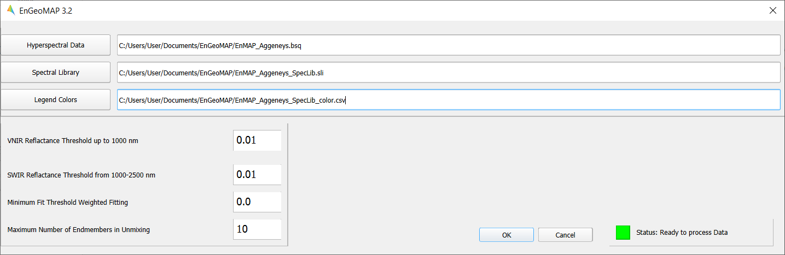
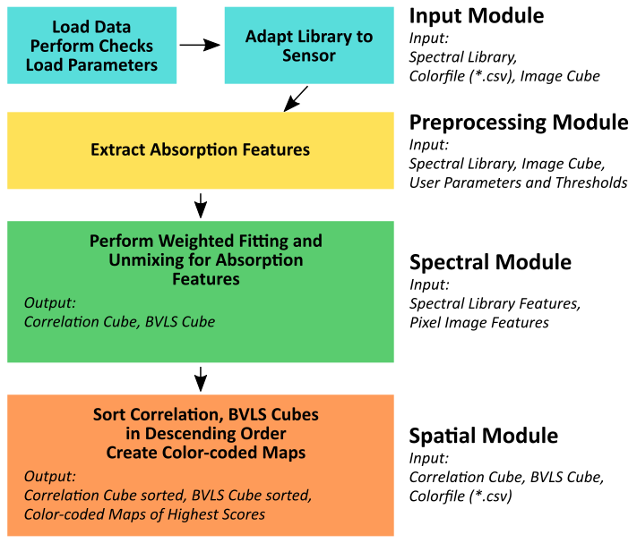

******************************************************************
EnGeoMAP 3.2 Manual
******************************************************************

**EnGeoMAP 3.2 the EnMAP Geological Mapper for Mineral Classification (EnGeoMAP)**

Authors: Helge L. C. Daempfling & Nicole Köllner

Contributions: Christian Mielke, Saeid Asadzadeh, Friederike Koerting, Friederike Klos,
Christian Rogass, Nina K. Boesche, Agnieszka Kuras, Christopher Loy

**Introduction to EnGeoMAP 3.2**
---------------------------------

The EnMAP geological mapper (EnGeoMAP), as part of the EnMAP Box is an expert-system-based tool for the processing and characterization of geologic surface cover types from hyperspectral data in general and EnMAP satellite data in particular. The EnGeoMAP 3.2 algorithm is based on EnGeoMAP 2.0 developed by Christian Mielke (Mielke et al., 2016). 

EnGeoMAP 3.2 is optimized for Windows 10 and 11 and the Windows version of QGIS (LTS) but also runs under Linux and Mac OS.

The software requires a hyperspectral reflectance data cube, a spectral library with user-defined endmembers, and a user-supplied color scheme as inputs to run. The software classifies the hyperspectral data based on the provided endmembers and outputs classification maps according to the supplied color scheme. 
EnGeoMAP has been primarily designed for EnMAP data, yet it works for most full-range hyperspectral sensor suites, given that the data covers the VNIR and SWIR range.

1.   Data Preparation and Requirements
-----------------------------------------------

=====================================
*Hyperspectral Data:*
=====================================

EnGeoMAP requires a hyperspectral data cube in Band Sequential (BSQ) format conforming to L3Harris ENVI header file information (.hdr)
-	Overlapping bands need to be removed from the dataset i.e., the wavelength succession vector in the header file needs to be strictly ascending. 

-	Clipping and interpolation is required in both of the strong water vapor residuals at 940 nm and at 1130 nm to assure an artifact-reduced analysis result.

-	Nanometer (nm) is the recommended wavelength unit and the floating point or unsigned integer (ranging from 0-10000 as is common for many imaging spectrometers) is recommended for the reflectance values.

-	Adaptive filtering is strongly recommended to further reduce noise and artifacts from reflectance data.

=====================================
*Spectral Library File:*
=====================================

The spectral library file has to be in Band Sequential (BSQ) (.sli) format with the according L3Harris ENVI header file information (.hdr). The necessary spectral library file can be prepared with the EnMAP Box spectral library wizard or with any other software that is able to write spectral library files in band sequential (BSQ) format. The entries of the spectral library are plotted according to the RGB color code from the CSV file (see the RGB Color Scheme CSV file section).

-	Overlapping bands need to be removed from the dataset i.e. the wavelength succession vector in the header file needs to be strictly ascending.

-	For field-measured spectral libraries: Clipping and interpolation is required in both of the strong water vapor residuals at 940 nm and at 1130 nm to assure an artifact-reduced analysis result.
 
-	Nanometer (nm) is recommended as wavelength unit, as well as float or unsigned integer from 0-10000 (standard for many imaging spectrometers) for the reflectance values.

-	Adaptive filtering is suggested to further reduce noise and artifacts.

-	The spectral library should be resampled to the spectral resolution of the reflectance data cube for the two datasets to match spectrally.

=====================================
*RGB Color Scheme CSV file:*
=====================================

The RGB (Red, Green, Blue) color scheme needs to be provided by the user in a .csv file format (UTF-8). The entries have to be in the right order and matching to the entries of the spectral library. Through the CSV color file, the user can choose the colors with which EnGeoMAP classifies the according library entries in the hyperspectral image. There are several online tools available to visualize RGB color code for a preview of the chosen colors. CSV files can either be edited with a standard text editor (Figure 1) or spreadsheet editor (Figure 2).

Figure 1: Color scheme CSV file example opened in a text editor. Here the legend includes nine different endmembers.

Figure 2: Color scheme CSV file example opened in a spreadsheet editor. Here the legend includes nine different endmembers.

=====================================
*Example / Test Data:*
=====================================

Test data for EnGeoMAP 3.2 can be found here:

' https://nextcloud.gfz-potsdam.de/s/nFAq8jXGf8r9NwL ' 

The dataset contains a subset of a hyperspectral EnMAP image data cube (Figure 3) which was acquired in December 2022 covering the Gamsberg deposit and the Big Syncline of the Aggeneys deposit in Namaqualand (South Africa), an associated spectral library of ground truth data (Figure 4), and a CSV color file (Figure 1 and 2) defining the color codes of each endmember (library entries) for visual representation. 

Figure 3:  EnMAP image cube covering parts of the Gamsberg Zinc mine (east) and the Big Syncline (north) of the Aggeneys deposit (Namaqualand, South Africa). R: 641 nm, G: 550 nm, B:458 nm.P.

Figure 4: Locations of spectral field sampling.

2. How to use/run the EnGeoMAP toolbox
--------------------------------------

Figure 5 shows how you get access to the EnGeoMAP toolbox.

Figure 5: Access to EnGeoMAP.

The EnMAP-Box provides a graphical user interface (GUI) for EnGeoMAP 3.2 (Figure 6). The three main input fields for the location of the user input files comprise:

-	The hyperspectral image data 

-	The spectral library file

-	The CSV color file

**Please Notice: For the image data and the library file the path to the main files are required. The header (.hdr) files need to be in the same folder and are loaded automatically by the software. Choosing the (.hdr) header files in the data selection will lead to an error!**

The user can choose the minimum reflectance threshold in the VNIR and SWIR regions. The values should be chosen depending on the noisiness of the data. They should be as low as possible for data with a good SNR.

The minimum fit threshold sets the lower cutoff value for the minimum acceptable valid spectral correlation value between the image spectrum and the library spectra. Values below this threshold are set to zero.

For the unmixing data products, the maximum number of endmembers needs to be set by the user. The default is set to 10 (see Results section). This number should not exceed the total number of endmembers embedded in the spectral library file.

**Note: For the test data, the following values produce the best results:**
**VNIR Reflectance Threshold: 				0.02**
**SWIR Reflectance Threshold: 				0.03**
**Minimum Fit Threshold Weighted Fitting: 		0.3**
**Maximum Number of Endmembers in Unmixing: 	9**

Processing is started by pressing the OK button and then pressing OK in the subsequent notification window.

A status indicator in the lower right corner shows if the software is still processing the data or is ready to process new data.

Figure 6: The graphical user interface (GUI) of EnGeoMAP 3.2.

4. The Results
--------------

The preprocessing module within EnGeoMAP extracts the characteristic absorption features of the input spectra (Figure 7). These features are then used in a weighted fitting operation in the spectral module to calculate the material similarity scores of the unknown pixel spectrum compared to the reference library. According to those fit values, a user defined minimum fit threshold may now be applied to only use those library spectra in a B\ ounded V\ alue L\ east S\ quares (BVLS) unmixing meeting the user-defined threshold (see Figure 6 option: Minimum Fit Threshold Weighted Fitting). The resulting unmixing as well as the correlation data cube are then sorted in descending order.

The first band of each of the sorted results is then used in the spatial module together with the CSV file to provide a color-coded best fit (highest correlation score) material map and highest abundance (highest BVLS fraction) map. 

Figure 7: Basic processing workflow for EnGeoMAP 3.2 with modules, input and output highlighted.

EnGeoMAP 3.2 provides 6 data products which are identifiable by their suffixes to the original filename (basename). See Table 1 for an overview of the data products and suffixes.

Table 1: EnGeoMAP 3.2 products and their meaning.

   +-----------------------------------------+----------------------------+
   | **EnGeOMAP 3.2 data product**           | **Product description**    |
   |                                         |                            |
   | **basename**                            |                            |
   +=========================================+============================+
   | *\_feature_fitting_correlation_scores*  | Raw correlation scores     |
   |                                         | from the spectral module   |
   |                                         | for characteristic         |
   |                                         | absorption features.       |
   |                                         |                            |
   |                                         | ENVI standard format with  |
   |                                         | bsq interleave.            |
   +-----------------------------------------+----------------------------+
   | *\_feature_fitting_highest_correlation  | The material / geological  |
   | _result*                                | classification thematic    |
   |                                         | map                        |
   |                                         |                            |
   |                                         | Results relating to the    |
   |                                         | highest correlation score. |
   |                                         | The data product is based  |
   |                                         | on sorted correlation      |
   |                                         | scores (the first band     |
   |                                         | contains the highest score |
   |                                         | values, the second the     |
   |                                         | second highest scores and  |
   |                                         | so on).                    |
   |                                         |                            |
   |                                         | Standard RGB color maps    |
   |                                         | assigned from the sorted   |
   |                                         | Band 1 of the              |
   |                                         | *\_feature_f               |
   |                                         | itting_correlation_scores* |
   |                                         | results using the .csv     |
   |                                         | colorfile.                 |
   |                                         |                            |
   |                                         | ENVI standard format with  |
   |                                         | bsq interleave.            |
   +-----------------------------------------+----------------------------+
   | **\_feature_fitting_highest_correlation | Geotiff format (.tif) of   |
   | _result_geotiff**                       | *\_feature_fitting_h       |
   |                                         | ighest_correlation_result* |
   |                                         |                            |
   |                                         | Can be directly viewed     |
   |                                         | with the image viewer of   |
   |                                         | your choice.               |
   +-----------------------------------------+----------------------------+
   | *\_bvls_unmixing_scores*                | Raw **B**\ ounded          |
   |                                         | **V**\ alue **L**\ east    |
   |                                         | **S**\ quares (BVLS)       |
   |                                         | unmixing scores from the   |
   |                                         | spectral module for        |
   |                                         | characteristic absorption  |
   |                                         | features.                  |
   +-----------------------------------------+----------------------------+
   | *\_bvls_unmixing_highest_abundance      | The (BVLS unmixing)        |
   | _result*                                | abundance map result.      |
   |                                         |                            |
   |                                         | Standard RGB color maps    |
   |                                         | assigned from the sorted   |
   |                                         | Band 1 of the              |
   |                                         | *\_bvls_unmixing_scores*   |
   |                                         | (highest BVLS fraction)    |
   |                                         | results using the .csv     |
   |                                         | color file. Highest        |
   |                                         | abundance (highest BVLS    |
   |                                         | fraction) sorted color     |
   |                                         | map.                       |
   |                                         |                            |
   |                                         | ENVI standard format with  |
   |                                         | bsq interleave.            |
   +-----------------------------------------+----------------------------+
   | **\_bvls_unmixing_highest_abundance     | Geotiff format (.tif) of   |
   | _result_geotiff**                       | *\_bvls_unmixing           |
   |                                         | _highest_abundance_result* |
   |                                         |                            |
   |                                         | Can be directly viewed     |
   |                                         | with the image viewer of   |
   |                                         | your choice.               |
   +-----------------------------------------+----------------------------+

5. Acknowledgements
--------------------

Algorithm, Python code, and GUI was developed by Christian Mielke.
Current version GUI and algorithm product adjustments (EnGeoMAP version
3.2) by Helge L. C. Daempfling. Data preparation and performance check
by Nicole Koellner.

6. Further Reading
--------------------

For theoretical background information on EnGeoMAP algorithm please
consider reading Mielke et al. (2016) EnGeoMAP 2.0—Automated
Hyperspectral Mineral Identification for the German EnMAP Space Mission.

Literature
------------

1. Mielke, C.; Rogass, C.; Boesche, N.; Segl, K.; Altenberger, U. EnGeoMAP 2.0—Automated Hyperspectral Mineral Identification for the German EnMAP Space Mission. Remote Sens. 2016, 8, 127.

2. Clark, R.N.; Swayze, G.A.; Livo, K.E.; Kokaly, R.F.; Sutley, S.J.; Dalton, J.B.; McDougal, R.R.; Gent, C.A. Imaging spectroscopy: Earth and planetary remote sensing with the USGS Tetracorder and expert systems. J. Geophys. Res. Planets 2003, 108.

3. Kokaly, R.F. Spectroscopic remote sensing for material identification, vegetation characterization, and mapping. Proc. SPIE 2012, 8390.

4. Clark, R.N.; Swayze, G.A.; Wise, R.; Livo, E.; Hoefen, T.M.; Kokaly, R.F.; Sutley, S.J. USGS Digital Spectral Library Splib06a; U.S. Geological Survey: Denver, CO, USA, 2007.

