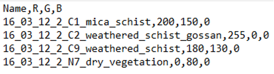
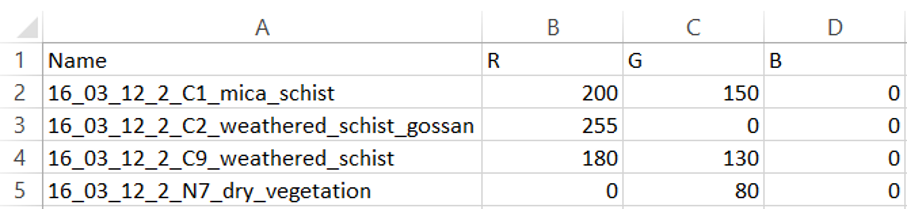
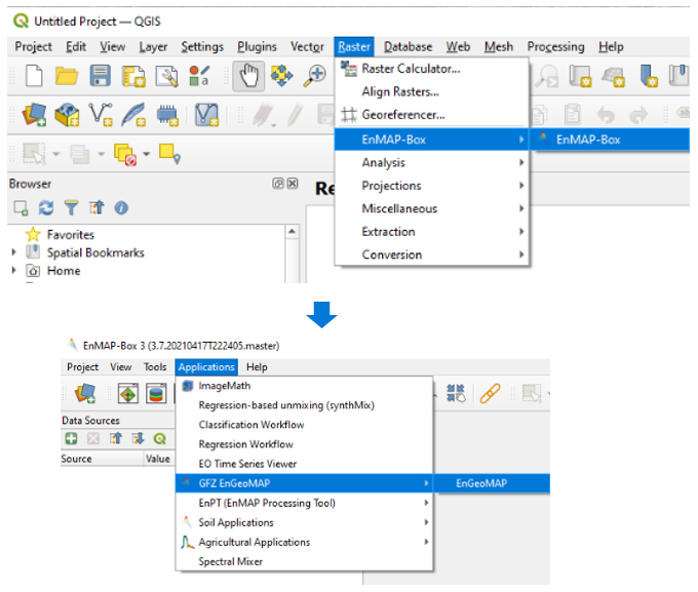
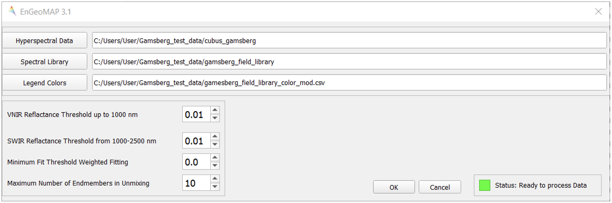
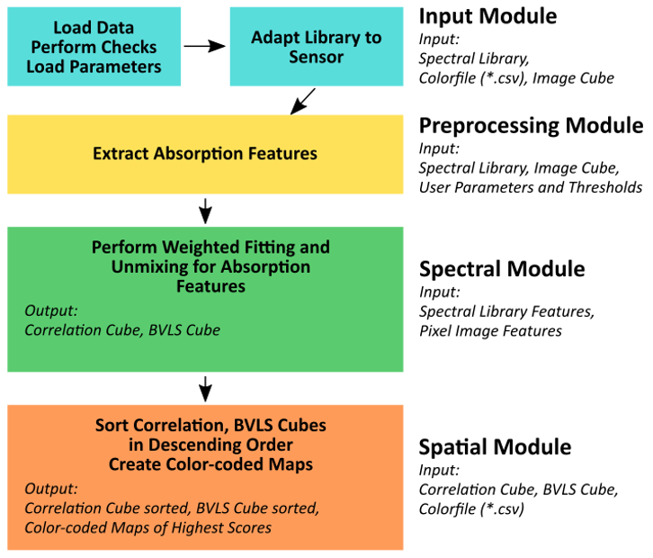

******************************************************************
EnGeoMAP 3.1 Tutorial
******************************************************************

**EnGeoMAP 3.1 the EnMAP Geological Mapper for Mineral Classification (EnGeoMAP)**

Authors: Helge L. C. Daempfling, Nicole Köllner, Saeid Asadzadeh

Contributions: Christian Mielke, Friederike Koerting, Friederike Klos,
Christian Rogass, Nina K. Boesche, Agnieszka Kuras, Christopher Loy

**Introduction to EnGeoMAP 3.1**
---------------------------------

The EnMAP geological mapper (EnGeoMAP), as part of the EnMAP Box, is
an expert-system-based tool for the processing and characterization
of geologic surface cover types from hyperspectral data in general
and EnMAP satellite data in particular. EnGeoMAP 3.1 is
based on the EnGeoMAP 2.0 algorithm developed by Christian Mielke (Mielke et al., 2016).

EnGeoMAP 3.1 is optimized for Windows 10 and 11 and the Windows version of QGIS (LTS).

The software requires a hyperspectral reflectance data cube, a
spectral library with user-defined endmembers, and a user-supplied
color scheme as inputs to run. The software then classifies the
hyperspectral data based on the provided endmembers and represents it
according to the supplied color scheme.

EnGeoMAPhas been primarily designed for EnMAP data, yet it works for
most full-range hyperspectral sensor suites, provided that VNIR and
SWIR data are all available.

1.   Data Preparation and Requirements
-------------------------------------

=====================================
*Hyperspectral Data:*
=====================================

The hyperspectral data cubes must be in the Band Sequential (BSQ)
format conforming to L3Harris ENVI header file information (.hdr)

- Overlapping bands need to be removed from the dataset i.e., the wavelength succession vector in the header files need to be strictly ascending.

- Clipping and interpolation are required in both strong water vapor residuals at 940 nm and 1130 nm to assure an artifact-reduced analysis result.

- Nanometer (nm) is the recommended wavelength unit, and the floating-point or unsigned integer (ranging from 0-10000, as is common for many imaging spectrometers) is recommended for the reflectance values.

- Adaptive filtering is suggested to further reduce noise and artifacts from reflectance data.

=====================================
*Spectral Library Files:*
=====================================

The spectral library files also must be in Band Sequential (BSQ)
format according to the L3Harris ENVI header file information (.hdr).
The necessary spectral library files can be prepared with the EnMAP
Box spectral library wizard or with any other software that is able
to write spectral library files in band sequential (BSQ) format. The
entries of the spectral library are plotted according to the RGB
color code from the CSV file (see the RGB Color Scheme CSV file
section).

- Overlapping bands need to be removed from the dataset i.e., the wavelength succession vector in the header files need to be strictly ascending.

- For field-measured spectral libraries: Clipping and interpolation are required both strong water vapor residuals at 940 nm and at 1130 nm to assure an artifact-reduced analysis result.

- Nanometer (nm) is recommended as wavelength unit, as well as float or an unsigned integer from 0-10000 (standard for many imaging spectrometers) for the reflectance values.

- Adaptive filtering is suggested to further reduce noise and artifacts.

- The spectral library should be resampled to the spectral resolution of the reflectance data cube for the two datasets to match spectrally.

=====================================
*RGB Color Scheme CSV file:*
=====================================

The RGB (R\ ed, G\ reen, B\ lue) color scheme needs to be provided by
the user in a CSV file format (UTF-8). The entries have to be in the
right order and matching to the entries of the spectral library.
Through the CSV color file, the user can choose the colors with which
EnGeoMAP classifies the according library entries in the
hyperspectral image. There are several online tools available to
visualize RGB color code for a preview of the chosen colors. CSV
files can either be edited with a standard text editor (Figure 1) or
spreadsheet editor (Figure 2).

Figure 1: Color scheme CSV file example opened in a text editor. Here the legend includes four different endmembers.

Figure 2: Color scheme CSV file example opened in a spreadsheet
editor. Here the legend includes four different endmembers.

=====================================
*Example / Test Data:*
=====================================

Test data for EnGeoMAP can be downloaded here:

' https://nextcloud.gfz-potsdam.de/s/oWF6GHdRGBk4e6y ' 

The dataset contains a hyperspectral EO-1 Hyperion image data cube
which was acquired over the Gamsberg Mine (South Africa) prior to its
opening, a field-based spectral library, and a CSV color file defining the color codes
of each endmember for visual representation.

2. How to use/run the EnGeoMAP toolbox
--------------------------------------

Figure 3 shows how you get access to the EnGeoMAP toolbox.

Figure 3: Access to EnGeoMAP.

The EnMAP-Box provides a graphical user interface (GUI) for EnGeoMAP
3.1 (Figure 4). The three main input fields for the location of the
user input files comprises:

- The hyperspectral image data

- The spectral library file

- The CSV color file

Note: For the hyperspectral data and the library file only the path
to the main files are required. The header (.hdr) files need to be in
the same folder as the reflectance data files and are loaded
automatically by the software. Choosing the header files in the data
selection will lead to an error.

The user can choose the minimum reflectance threshold in the VNIR and
SWIR regions. The values should be chosen depending on the noisiness
of the data. They should be as low as possible for data with a good
SNR. - Standard settings are recommended according to Figure 5.

The minimum fit threshold sets the lower cutoff value for the minimum
acceptable valid spectral correlation value between the image
spectrum and the library spectra. Values below this threshold are set
to zero.

For the unmixing data products, the maximum number of endmembers
needs to be set by the user. The default is set to 10 (see Results
section). This number should not exceed the total number of
endmembers embedded in the spectral library file.

Processing is started by pressing the OK button and then pressing OK
in the subsequent notification window.

A status indicator in the lower right corner shows if the software is
still processing the data or is ready to process new data.

Figure 4: The graphical user interface (GUI) of EnGeoMAP 3.1.

4. The Results
--------------

The preprocessing module within EnGeoMAP extracts the characteristic
absorption features of the input spectra (Figure 5). These features
are then used in a weighted fitting operation in the spectral module
to calculate the material similarity scores of the unknown pixel
spectrum compared to the reference library. According to those fit
values, a user defined minimum fit threshold may now be applied to
only use those library spectra in a B\ ounded V\ alue L\ east
S\ quares (BVLS) unmixing meeting the user-defined threshold (see
Figure 4 option: Minimum Fit Threshold Weighted Fitting). The
resulting unmixing as well as the correlation data cube are then
sorted in descending order.

The first band of each of the sorted results is then used in the
spatial module together with the CSV file to provide a color-coded
best fit (highest correlation score) material map and highest
abundance (highest BVLS fraction) map.

Figure 5: Basic processing workflow for EnGeoMAP 3.1 with modules,
input and output highlighted.

EnGeoMAP3.1 provides  6 data products which are identifiable by their
suffixes to the original filename (basename). See Table 1 for an
overview of the data products and suffixes.

+-----------------------------------+-----------------------------------+
| *\_correlation_result*            | Raw correlation scores from the   |
|                                   | spectral module for               |
|                                   | characteristic absorption         |
|                                   | features.                         |
|                                   |                                   |
|                                   |                                   |
+-----------------------------------+-----------------------------------+
| *\_best_matches_best_fit_coleur*  | Results relating to the highest   |
|                                   | correlation score. The data       |
|                                   | product is based on sorted        |
|                                   | correlation scores (the first     |
|                                   | band contains the highest score   |
|                                   | values, the second the second     |
|                                   | highest scores and so on)         |
|                                   |                                   |
|                                   |                                   |
+-----------------------------------+-----------------------------------+
|                                   | The material / geological         |
| *\_best_fit_coleur_class_geotiff* | classification thematic map       |
|                                   |                                   |
|                                   | Standard RGB color maps assigned  |
|                                   | from the sorted Band 1 of the     |
|                                   | best_matches results using the    |
|                                   | .csv colorfile. It can be         |
|                                   | directly viewed with the image    |
|                                   | viewer of your choice.            |
|                                   |                                   |
|                                   | Class images,can be used for a    |
|                                   | quick legend generation within    |
|                                   | the QGIS map composer.            |
|                                   |                                   |
|                                   |                                   |
+-----------------------------------+-----------------------------------+
| *\_abundance_result*              | Raw B\ ounded V\ alue L\ east     |
|                                   | S\ quares (BVLS) unmixing scores  |
|                                   | from the spectral module for      |
|                                   | characteristic absorption         |
|                                   | features.                         |
|                                   |                                   |
|                                   |                                   |
+-----------------------------------+-----------------------------------+
| *\_abundance_unmix_best_unmix*    | Highest abundance (highest BVLS   |
|   *_coleur*                       | fraction) sorted color map.       |
|                                   |                                   |
|                                   |                                   |
|                                   |                                   |
+-----------------------------------+-----------------------------------+
| **\_abundance_unmix_\_            | The (BVLS unmixing) abundance map |
| best_unmix_coleur_class_geotiff** | result.                           |
|                                   |                                   |
|                                   | Standard RGB color maps assigned  |
|                                   | from the sorted Band 1 of the     |
|                                   | best_unmix (highest BVLS          |
|                                   | fraction) results using the .csv  |
|                                   | color file. It can be directly    |
|                                   | viewed with the image viewer of   |
|                                   | your choice.                      |
|                                   |                                   |
|                                   | Class images,can be used for a    |
|                                   | quick legend generation within    |
|                                   | the QGIS map composer.            |
|                                   |                                   |
|                                   |                                   |
+-----------------------------------+-----------------------------------+

5. Acknowledgements
--------------------

Algorithm, Python code, and GUI was developed by Christian Mielke.
Current version GUI and algorithm product adjustments (EnGeoMAP version 3.1) by Helge L. C. Daempfling.

6. Further Reading
--------------------

For theoretical background information on EnGeoMAP algorithm please
consider reading Mielke et al. (2016) EnGeoMAP 2.0 Automated
Hyperspectral Mineral Identification for the German EnMAP Space
Mission.

Literature
------------

1. Mielke, C.; Rogass, C.; Boesche, N.; Segl, K.; Altenberger, U. EnGeoMAP 2.0—Automated Hyperspectral Mineral Identification for the German EnMAP Space Mission. Remote Sens. 2016, 8, 127.

2. Clark, R.N.; Swayze, G.A.; Livo, K.E.; Kokaly, R.F.; Sutley, S.J.; Dalton, J.B.; McDougal, R.R.; Gent, C.A. Imaging spectroscopy: Earth and planetary remote sensing with the USGS Tetracorder and expert systems. J. Geophys. Res. Planets 2003, 108.

3. Kokaly, R.F. Spectroscopic remote sensing for material identification, vegetation characterization, and mapping. Proc. SPIE 2012, 8390.

4. Clark, R.N.; Swayze, G.A.; Wise, R.; Livo, E.; Hoefen, T.M.; Kokaly, R.F.; Sutley, S.J. USGS Digital Spectral Library Splib06a; U.S. Geological Survey: Denver, CO, USA, 2007.

