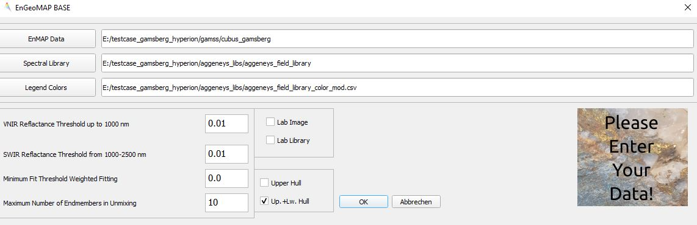
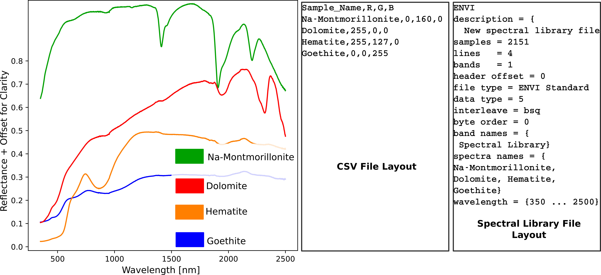
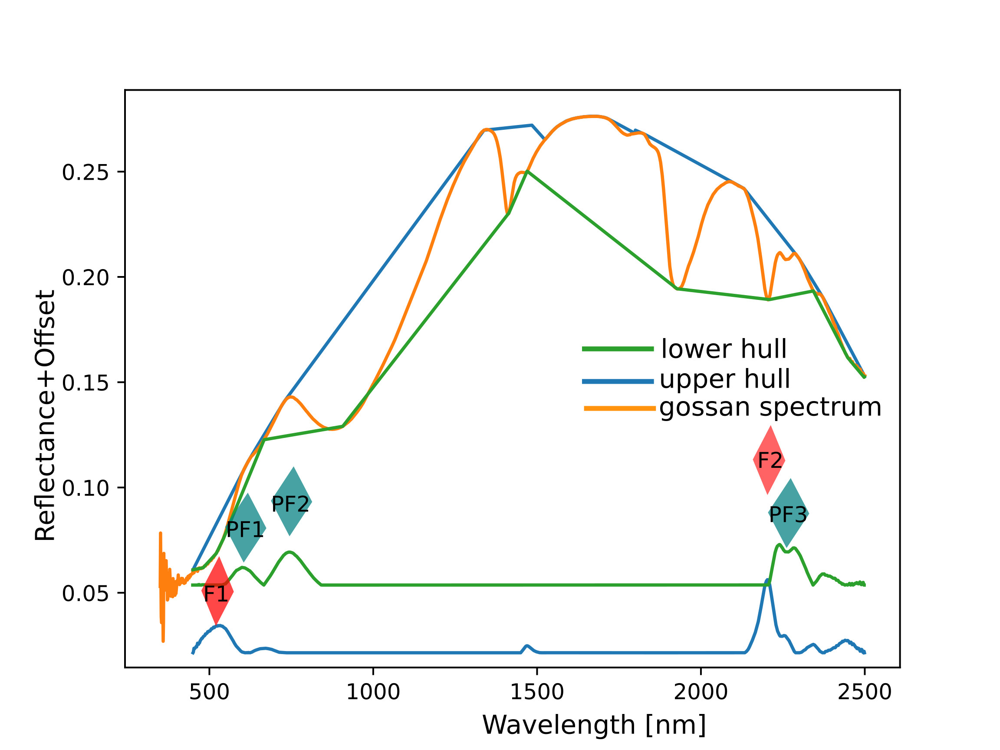
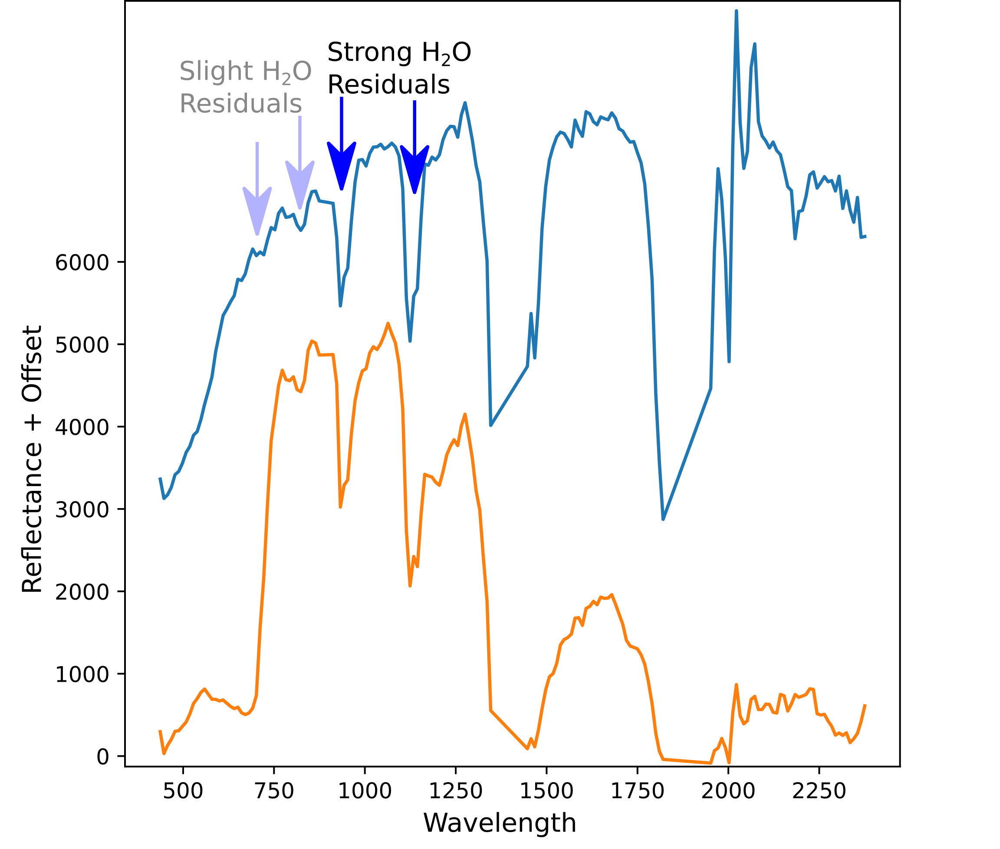
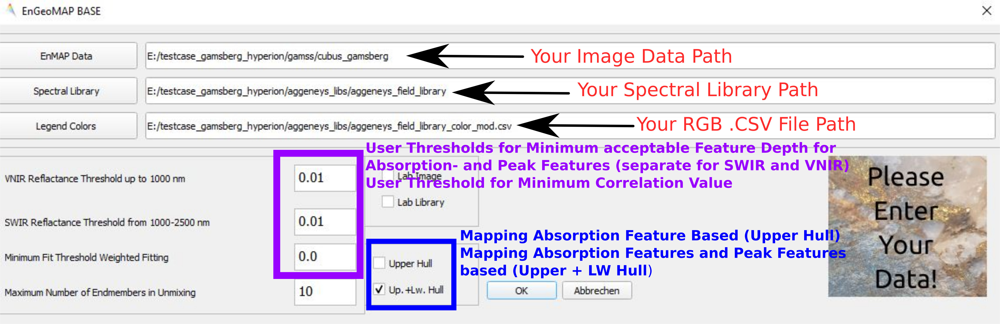

******************************************************************
EnGeoMAP Tutorial
******************************************************************

=========================
EnGeoMAP Base (ver. 3.0) 
=========================
=================================================================
The EnMAP Geological Mapper for Mineral Classification (EnGeoMAP)
=================================================================

Authors: Christian Mielke, Friederike Koerting, Friederike Klos, Nicole Koellner, Christian Rogass, Nina K. Boesche, Helge Daempfling, Saeid Asadzadeh

Contributions from Agnieszka Kuras

========================
Introduction to EnGeoMAP
========================

1. Background
--------------

The EnMAP geological mapper (EnGeoMAP), as part of the EnMAP Box (see Figure 1) is an expert-system-based tool for the characterization of surface cover types from hyperspectral EnMAP data. The software requires as user input spectral reflectance data cubes, a spectral library of endmembers that are to be identified, and a user supplied color scheme as shown in Figure 2. It has to be noted that EnGeoMAP is optimized for the Windows 10 Version of QGIS. There is currently no guarantee for it to function under different platforms. The necessary spectral library files may be prepared by the EnMAP Box spectral library wizard or by any software that is able to write spectral library files as band sequential (BSQ). Please see Figure 2 for a generic template of the spectral library header file and the corresponding color legend file. The entries of the spectral library are plotted as well according to the RGB color code from the CSV file. EnGeoMAP uses a partitioned geometric method and continuum removal for feature retrieval from the spectral library file as well as the for the image spectra. Therefore, additional atmospheric features in the reflectance data from over or underestimation of the atmospheric water vapor (e.g. at 940 nm and at 1130 nm) need to be clipped and interpolated in both: the image spectra and the spectral library. Otherwise they would also be incorporated in the geometric feature retrieval process (see Figure 3) and may lead to erroneous results in the material similarity scores and resulting data products.

   Figure 1 EnGeoMAP user interface with example setup.
   
2. Requirements
----------------

This tutorial requires at least version 3.7.2.XX of the EnMAP-Box.

3. References and Further Reading
----------------------------------

1. Clark, R.N.; Swayze, G.A.; Livo, K.E.; Kokaly, R.F.; Sutley, S.J.; Dalton, J.B.; McDougal, R.R.; Gent, C.A. Imaging spectroscopy: Earth and planetary remote sensing with the USGS Tetracorder and expert systems. J. Geophys. Res. Planets 2003, 108.

2. Kokaly, R.F. Spectroscopic remote sensing for material identification, vegetation characterization, and mapping. Proc. SPIE 2012, 8390.

3. Clark, R.N.; Swayze, G.A.; Wise, R.; Livo, E.; Hoefen, T.M.; Kokaly, R.F.; Sutley, S.J. USGS Digital Spectral Library Splib06a; U.S. Geological Survey: Denver, CO, USA, 2007.

4. Mielke, C.; Rogass, C.; Boesche, N.; Segl, K.; Altenberger, U. EnGeoMAP 2.0—Automated Hyperspectral Mineral Identification for the German EnMAP Space Mission. Remote Sens. 2016, 8, 127.

4. Data
---------

For a template on how the data should look like please download the test data here: 
‘ https://nextcloud.gfz-potsdam.de/s/y4FsWzSPBpAW4Aj’
The dataset contains a hyperspectral EO-1 Hyperion image showing the Gamsberg Mine prior to its opening and a spectral field library and csv file.
The spectral library header (*.hdr) is already modified so that the file type parameter (file type=) is set to “ENVI Standard”.

Figure 2 shows a standard layout for the .csv-file and the spectral library. 

   Figure 2 Illustration of the basic input data type requirements for the spectral library and the csv legend color file.

   Figure 3  Field spectrum of a weathered shist from Gamsberg, showing the extracted characteristic absorption features (F) as well as reflectance peaks (PF) of the spectrum in addition to the upper and lower hulls that have been used for the extraction of the features.

===============
The Software
===============

This section describes the necessary requirements to the input data and potential pitfalls during the processing. EnGeoMAP has been designed to work with EnMAP data only. However, it works for most full range hyperspectral sensor suites as well, provided that VNIR and SWIR data is available. More experienced users are encouraged to modify the source code to their own needs to adapt for special sensor setups (e.g. VNIR sensor only data). The general workflow is shown in Figure 4.

 .. figure:: img/figure4.jpg

    Figure 4 Basic processing workflow for EnGeoMAP with modules, input and output highlighted.

1. Theoretical Background
-------------------------

This is a basic process for any laboratory technician working with spectroscopy. The comparisons and material characterization have mostly been done by visual inspection and interpretation in the past. Therefore, systems that built on top of this expert knowledge, have been termed expert systems e.g. USGS Tetracorder and MICA [1,2]. They are a basic necessity to process the vast amount of spectra from imaging and non-imaging spectroscopy systems today. A key to the success of these expert systems, such as the USGS Tetracorder and MICA [1,2] are the accompanying standard spectral libraries [3] that may be used for the material characterization process, together with their characteristic absorption feature tables that define the position of the characteristic absorption features of each of the spectral library entries. The table, as well as the spectral library need to be extended manually each time new reference spectra are added. EnGeoMAP [4] with its automatic feature extraction algorithm does not require an expert table for feature retrieval. It only requires a user supplied reference library, as described above. It may, therefore, be seen as an automated expert system that aims to formalize the feature extraction skill of a trained spectral laboratory technician. In its last version EnGeoMAP only used the characteristic absorption features, for a spectral characterization of the material. Its current version also provides the user with the possibility to extract and use local reflectance peaks in the material characterization process in addition to the absorption features (please tick upper + lower hull as in Figure 1). The option upper hull on its own extracts absorption features only and corresponds to the previous version of EnGeoMAP (v 2.0). Figure 4 shows a diagram with the basic workflow of EnGeoMAP. The preprocessing module extracts the characteristic absorption features and, if chosen by the user, additional characteristic reflectance peaks. These are then used in a weighted fitting operation in the spectral module, to calculate the material similarity scores of the unknown pixel spectrum to the reference library. According to those fit values a user defined minimum fit threshold may now be applied to only use those library spectra in a bound value least squares unmixing that are above that threshold (see Figure 1 option: Minimum threshold weighted fitting). The resulting unmix result as well as the correlation data cube are sorted in descending order. The first band of each of the sorted results is then used in the spatial module together with the csv file to provide a best fit (highest correlation score) material map and highest abundance (highest bvls fraction) to provide a color coded map of the best fit and highest abundance results from the data. Additional ancillary data for further data processing is provided as well (e.g.: spectral contrast, bvls residuals, etc.), see Table 1 for an overview over the provided data products.

2. Data Preparation
---------------------

The reflectance data for processing with EnGeoMAP has to be of high quality, as already stated above. Any form of atmospheric processing residual, or sensor overlap will have a direct negative impact on the data products of EnGeoMAP. Overlapping bands need to be removed from the dataset i.e. the wavelength succession vector in the header files need to be strictly ascending. Figure 5 shows problems related to image spectra from hyperspectral data, that may occur in your data as well and that need to be mitigated prior to the analysis with EnGeoMAP. Here we see two overall noisy spectra, which have been acquired during unfavorable acquisition conditions (e.g. low sun angle, considerable off-NADIR pointing of the sensor). Clipping and interpolation need to be done in both water vapor residuals at 940nm and at 1130nm to assure an artifact-reduced analysis result. Adaptive filtering may also be a good advice to further reduce noise and slighter artifacts. The spectral library header (*.hdr) needs to be modified in the sense that the file type parameter (file type=) should be set to “ENVI Standard” to avoid File I/O errors with GDAL. Please also note that the scaling of your data is correct: nm is recommended for the wavelength units, as well as float or unsigned integer from 0-10000 (standard for many imaging spectrometers) for the reflectance values. 

   Figure 5: Illustration of residual atmospheric water vapor in overall noisy spectra, which have been acquired under unfavorable acquisition conditions.
   
3. The Front End
--------------------

The GUI provides users with the possibility for basic data input and parameter settings. The three main input fields are for the location of the user input files. As shown in Figure 6 below. The user preference parameters are minimum reflectance threshold in the VNIR and SWIR regions. They should be as low as possible for data with a good SNR. The minimum fit threshold describes the lower cutoff value for the minimum acceptable valid spectral correlation value between the image spectrum and the library spectra. Values below the threshold are set to zero. The upper hull option only uses concave features in the weighted fitting process only, which corresponds to the standard version of EnGeoMAP (v 2.0), whilst the upper and lower hull takes into account both concave and convex features, as shown in Figure 3.

   Figure 6 Illustration of the GUI with the most important user inputs explained.

4. The Results
--------------

Data products of EnGeoMAP are identifiable by their suffixes to the original filename (basename), see Table 1 for a short overview over the suffixes. The important part is to identify the major data products that are of use to basic users. These products are named (correlation_result, corresponding to a cube of correlation layers to the spectral library entries) and (abundance, corresponding to a cube of abundance layers to the spectral library entries), together with the corresponding RGB images in Tiff format. All other data products are aimed at more experienced users in imaging spectroscopy (e.g. the contrast measures). They may directly explain potentially erroneous results in the best fit and abundance maps. No data values are visible via -999 in parts of the data, as already highlighted in Table 1. 

.. csv-table:: Table 1 EnGeoMAP Data Product Specifications
   :header-rows: 1
   :file: img/table1.csv

.. .. figure:: img/table1.jpg
   
Literature
------------

1.  Clark, R.N.; Swayze, G.A.; Livo, K.E.; Kokaly, R.F.; Sutley, S.J.; Dalton, J.B.; McDougal, R.R.; Gent, C.A. Imaging spectroscopy: Earth and planetary remote sensing with the USGS Tetracorder and expert systems. J. Geophys. Res. Planets 2003, 108.

2. Kokaly, R.F. Spectroscopic remote sensing for material identification, vegetation characterization, and mapping. Proc. SPIE 2012, 8390.

3. Clark, R.N.; Swayze, G.A.; Wise, R.; Livo, E.; Hoefen, T.M.; Kokaly, R.F.; Sutley, S.J. USGS Digital Spectral Library Splib06a; U.S. Geological Survey: Denver, CO, USA, 2007.

4. Mielke, C.; Rogass, C.; Boesche, N.; Segl, K.; Altenberger, U. EnGeoMAP 2.0—Automated Hyperspectral Mineral Identification for the German EnMAP Space Mission. Remote Sens. 2016, 8, 127.
