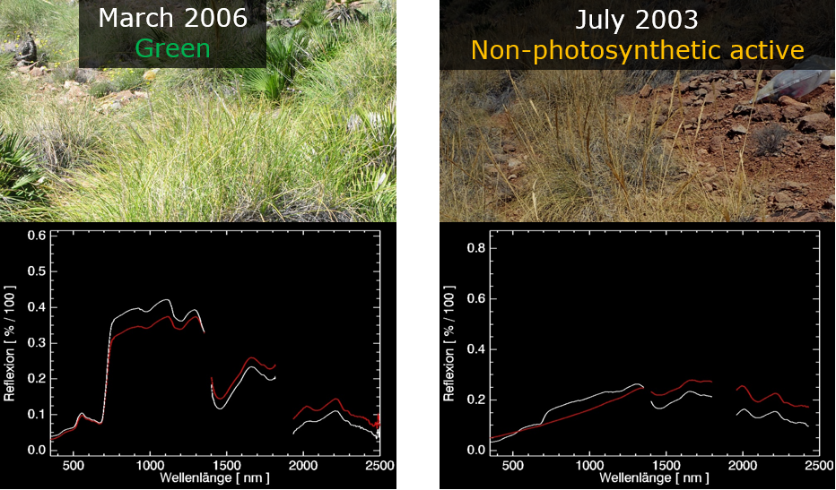
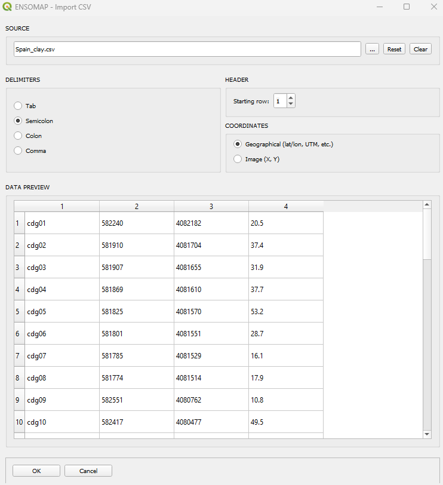
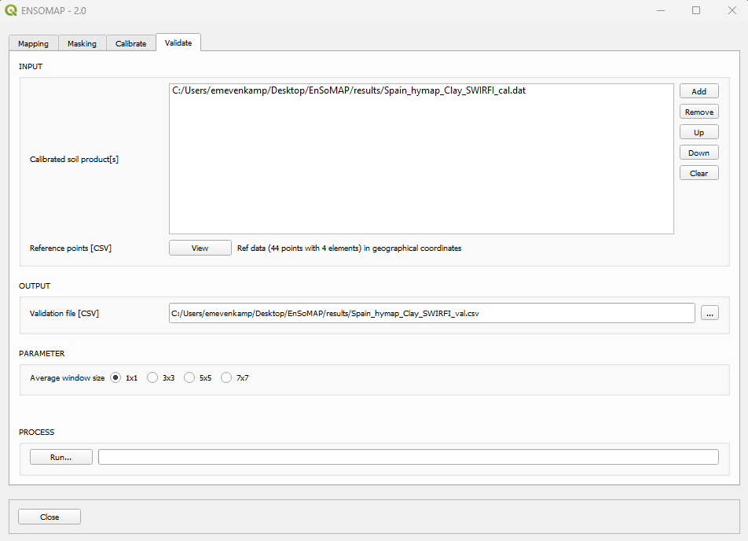
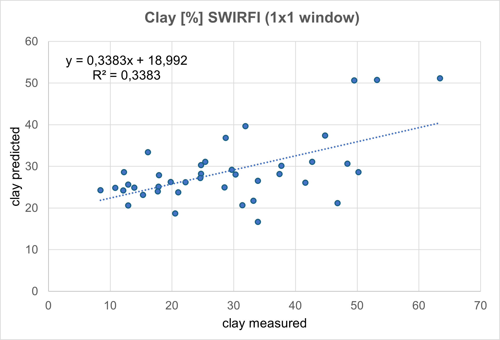
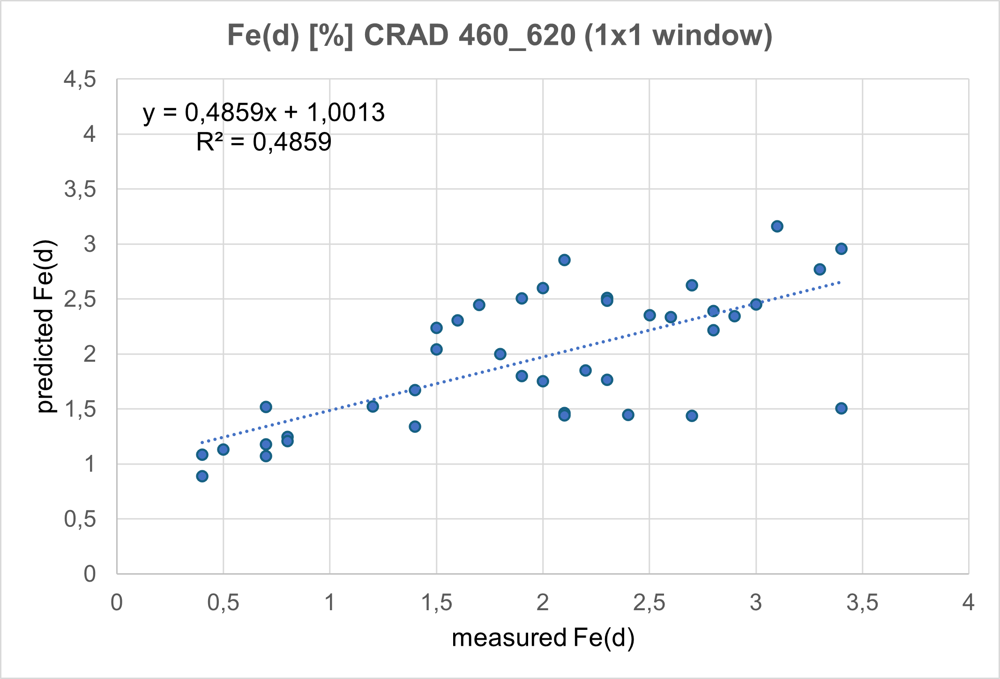

EnSoMap - Tutorial
===================
In this tutorial we will generate and validate maps of topsoil properties from hyperspectral data using the EnSoMAP tool within the EnMAP-Box. 
The tutorial can also be found as screencast on YouTube_.

.. _YouTube. https://www.youtube.com/watch?v=An3ufed4_OM&list=PLh17102P1ko3UOvjNCs4FGdm5OGfeEx8y

Requirements
-------------
Software  
"""""""""
This tutorial requires some software to be installed on your machine:    

    - QGIS_ and the EnMAP-Box_

.. _QGIS: https://www.qgis.org/de/site/
.. _EnMAP-Box: https://www.enmap.org/data_tools/enmapbox/

Data
"""""
You can download a subset of HyMap airborne imagery `here <https://doi.org/10.5880/enmap.2024.002>`_,  which can be used to reproduce this tutorial.

The data was acquired over agricultural areas in the Cabo de Gata-Níjar Natural Park, a semi-arid Mediterranean area in southern Spain. The region is only sparsely populated and offers a range of landscape patterns, from Mediterranean steppe, dunes, and salt mines to cliffs. The vegetation cover experienced a decline, followed by a recovery of climax types like Stipa and Palmito in the past 50 years. Today, the area is mainly used for agricultural practices, mining, tourist activities as well as a few built-up areas. The soils developed on volcanic and carbonatic bedrocks are highly variable in their textural and mineralogical composition, thus we can observe an interesting spectral variability.

Deriving the soil maps, we will focus on soil properties of interest in the Cabo de Gata area, which are clay and iron oxides. In the following steps we will first create a soil mask, map the soil properties based on different algorithms and derive different soil maps. Lastly, you can analyze and validate the derived soil maps. 

Explore and display the airborne imagery
-----------------------------------------
Open QGIS and start the EnMAP-Box by clicking on the EnMAP-Box icon. Then, look at the data provided for download. Open the first folder containing the airborne data. Drag and drop the raster image in BSQ format :file:`Spain_hymap.bsq` into the EnMAP-Box. 

Unfold the respective entry in the **Data sources** panel to explore some metadata of the image. The image contains 126 bands and 828 x 829 pixels with a spatial resolution of 5m. 

To display the scene: right click on the raster layer in the **Data sources** panel, select :menuselection:`open in new map` and chose one of the display options. The EnMAP-Box offers a range of pre-configured visualization options, but you can also define your own combination of bands. You may need to improve the contrast of the image for example through the mean standard deviation option. This can be done in the **Data view** panel by right-clicking on :menuselection:`Layer properties > Symbology > Min/Max > mean standard deviation`.

.. image:: img/fig5.png
    :width: 800px

To show the spectrum of a pixel click on the **Spectrum icon** in the menu above and then into the data display. Thereby you can automatically open a graph showing the spectrum of the corresponding pixel. Now you can explore the different surface materials and associated spectra.  

.. image:: img/fig6.png
    :width: 800px

Calculate soil masks
---------------------
As sensors operating in the optical domain can only sense the surface and our algorithms only work on bare or at least almost bare soil we calculate masks to discard any pixels that are not bare soil before starting the actual analysis.

We will use robust narrow-band spectral indices to rule out several typical ground cover types such as water, green and dry vegetation as you probably have no inside information about the situation in the area there. 

Start EnSoMAP under :menuselection:`Applications > Soil Applications > EnSoMAP 2.0`. In the window that pops up, select the **Masking tab**, chose the hyperspectral input file and set the output directory. To generate a soil dominated mask file select all three indices:    

    - The **NDRBI** (Normalized Difference Red Blue Index) identifies water
    - The **NDVI** (Normalized Difference Vegetation Index) reacts to green photosynthetic vegetation
    - The **nCAI** (normalized Cellulose Absorption Index) is sensitive to dry non-photosynthetic vegetation (NPV) cover such as crop residues

Click **Run** to calculate the soil masks.

.. image:: img/fig7.png
    :width: 800px

The logical sum of the water and vegetated pixels is used to create a soil mask which is called :file:`*_soildom_mask.dat` and serves to select dry bare soil pixels. Additionally, two raster files are created for each method showing the index values and the mask created based on a threshold set automatically in the corresponding index.

Load the original image file as well as all the output files in separate map windows and link them.

To look at the index values and mask values use the **Identify cursor location value** button. As you can see, bare soil pixels are assigned 1 and all other masked surfaces are 0. 

Have a look at the quality of the masks. Were all pixels containing non-bare soil, e.g. green or dry vegetation, or water masked out? Are there limitations you observe?

Well, as surface cover types change gradually in a landscape, it is difficult to work with fixed index values. Therefore, the indices were set to average values that work in different environments and might perform better in some areas than in others. You probably noticed that in our scene, for example a small water pond was not masked. Indeed, the water index used discriminates clear waters, and is less performant with shallow waters full of sediments or from the shore. 

Calculate soil properties and visualize soil maps
--------------------------------------------------
Select the tab **Mapping** in the EnSoMAP 2.0 window. Chose the hyperspectral input file, set the soil dominant mask :file:`*_soildom_mask.dat` and the output directory. 

The goal is to derive clay and iron soil maps. Therefore, select all algorithms available for these properties.  As we only have ground reference information for clay and iron soil to validate our results in the end, we did not calculate other soil properties. Click on **Run** to launch the process. 

In the background EnSoMAP calculated two clay absorption features and three iron absorption features. The clay continuum removed absorption depth (CRAD) performs a continuum removal of the spectrum between 2120 nm and 2250 nm and calculates the absorption depth. The Clay Content SWIR Fine particle index makes use of the same clay absorption feature around 2200 nm (if you want to learn more about the parameterization of absorption features, we recommend `this video <https://youtu.be/UtaqBlyGkaY>`_).

For iron we use different absorption features: EnSoMAP performs a continuum removal absorption depth between 460 nm and 620 nm as well as 760 nm and 1050 nm. The Iron oxide content redness index is also calculated from the first feature. 

Load all output files, the overall soil mask and the image file in separate map windows and link them.

Change from greyscale to color ramps by right clicking on the file name in the **Data views** panel and selecting :menuselection:`Layer Properties > Symbology`. Here, you can change the band rendering to :menuselection:`singleband pseudocolor` and select your favorite color ramp. To look at the map values in the soil and mask pixels use the **Identify cursor location value** button.

.. image:: img/fig9.png
    :width: 800px

Compare the different soil maps: Why are the map values different? What do the pixel values mean using the Identify cursor location value button? Is one algorithm working better than the other?

For now, the pixel values are only the result calculated by the algorithms without reference values. This means they are relative values and have different units depending on the algorithm chosen. In order to relate the map values to real soil property values, we need in-situ data, which takes us to the next step of this tutorial.

Derive quantitative soil maps and analyze the results
------------------------------------------------------
In this chapter we will extract predicted soil properties values from the calibrated image using EnSoMAP. 

Select the tab **Calibrate** in the EnSoMAP window. As input select one of the semi-quantitative soil product files derived in the previous step, for example the file ending with :file:`clay_SWIRFI.dat`. Then set the output directory. 

There are different options to calibrate a linear regression between the index values and the measured soil property. The Gain and Offset parameters can be…    

    - … entered directly, if known
    - … estimated from image data and reference field data
    - … estimated from a soil spectral library in ENVI format and a parameter file in ASCII format

In our case we have reference data available. Therefore, chose the second option (Estimated from image data) and click on :menuselection:`Load` to import a CSV file that was provided for download. For clay this is :file:`Spain_clay_csv`. 

The clay content data are texture information, and the iron content data are iron oxides (obtained by the dithionite extraction method). Both in-situ datasets are in percent. The first four columns of this file must indicate sample name, latitude, longitude and soil property. The geographical coordinate system must match that of the image. In this case, select semicolon as delimiter and start from row one to exclude the header. Check the table in the **Data preview**. Then click on **OK**.

To calculate the Gain and Offset click on :menuselection:`Estimate`. This will open a Scatter Plot where you click on :menuselection:`Select and Close`. In the EnSoMAP window click **Run** to create a quantitative map.

Visualize the SWIRFI map from the previous step and the newly derived SWIRFI_calibrated quantitative clay map. Use the same color palette as before. After the calibration with reference data, the pixel values now represent absolute values, and the units correspond to those in the reference data table which is in percent for both clay and iron. 

What are the differences between the spatial mapping before calibration and after calibration? The values of the semi-quantitative map (from the last step) were calibrated using reference samples by means of a linear transformation. Hence the maps appearances are the same but the values of the semi-quantitative and the quantitative map are totally different.

Now repeat the procedure for another soil product and the corresponding reference data, for example for iron with the :file:`Spain_fe.csv` file.

Extract predicted soil properties values
-----------------------------------------
To extract predicted soil properties values from the calibrated image using EnSoMAP select the tab **Validate** in the EnSoMAP window. As input chose any quantitative soil product from the previous calibration exercise and select the corresponding reference data csv file. The first four columns of this table must indicate sample name, latitude, longitude and soil property. Again, select semicolon as delimiter and start from row 1 to exclude the header and check the table in the **Data preview** to review your entries. Then set the output directory and specify the name of the output file.

Now, we need to select an average window size. Depending on this choice, EnSoMAP will extract the value of the pixel where the coordinate is indicated – that would be 1x1 – or calculate an average of the pixel values around that pixel using either a square of 3x3, 5x5, or 7x7 pixels. Since the HyMap airborne data are already 5x5 m, select the 1x1 option.

By clicking on **Run**, a CSV file is generated including the sample name, clay or iron content from the reference in-situ data and the estimated clay or iron content extracted from the remote sensing image. You can open the validation file in a text editor or, by import in Microsoft Excel or open office calculator.

To visualize the quality of the prediction, plot the predicted versus the measured values in a software of your choice. Make sure to delete the empty rows indicated by not-a-number (nan).

Which algorithm is performing best for iron and which for clay prediction? With the proposed options the CRAD at 2120 to 2250 nm performed best for clay and the CRAD 760 to 1050 nm performed best for iron in the Cabo de Gata hematitic soils. But results may differ, for example, through working with a different average window size, or even more if algorithms are applied to a different study area and depending on the respective in-situ data. So, one algorithm will provide better results than the others, depending on the test site, on environmental factors, on soil composition in terms of e.g. type of iron oxides, amount of clay regarding the texture or clay minerals.

To give you a quicker insight to the overall results we prepared a `results table <Link>`_.

The R square values, which are often used to grade the performance of a regression are not exceedingly high, compared to the performance of models from laboratory data. But from the perspective of remote sensing soil spectroscopy, we are satisfied with the results, especially concerning the iron oxide mapping. There are so many constraints, like the sensor signal integrating the whole landscape (plants and stones) and not only the tiny soil fraction of the pixel, which is at a scale way smaller than the remote sensing scale of observation. Also, soils have to be exposed and dry, and you are looking at a rather large area of 5x5 m from a distance of several hundred meters, besides soils being highly complex in their interaction with light. With only few reference data, we now have a pretty good impression of the spatial distribution of clay and iron in surface soils in the Cabo de Gata National Park, also accurately including the value ranges to expect.

That concludes our feature analysis in EnSoMAP, a comfortable tool to handle soil mapping from hyperspectral imagery. If you would like to learn more, please check out our `massive open online course (MOOC) on hyperspectral soil applications <https://eo-college.org/courses/beyond-the-visible-imaging-spectroscopy-for-soil-applications/>`_, our other exercises on `readthedocs <https://enmap-box.readthedocs.io/en/latest/usr_section/application_tutorials/index.html>`_  as well as `YouTube <https://www.youtube.com/@HYPERedu_GFZ/playlists>`_ and experiment with your own data. In future, EnSoMAP will include Machine Learning as well. So, stay tuned!

