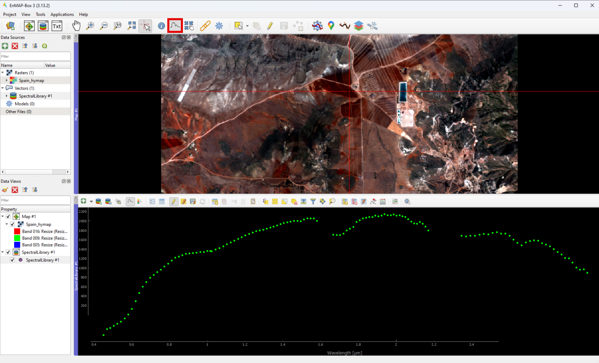

EnSoMap - Tutorial
===================
In this tutorial we will generate and validate maps of topsoil properties from hyperspectral data using the EnSoMAP tool within the EnMAP-Box. 
The tutorial can also be found as screencast on YouTube_:

.. _YouTube: 

Requirements
-------------
Software  
"""""""""
This tutorial requires some software to be installed on your machine:
    - QGIS_ and the EnMAP-Box_
    - EnSoMAP

.. _QGIS: https://www.qgis.org/de/site/
.. _EnMAP-Box: https://www.enmap.org/data_tools/enmapbox/

Data
"""""
You can download a subset of HyMap airborne imagery `here <Link>`_,  which can be used to reproduce this tutorial.

The data was acquired over agricultural areas in the Cabo de Gata-Níjar Natural Park, a semi-arid Mediterranean area in southern Spain. The region is only sparsely populated and offers a range of landscape patterns, from Mediterranean steppe, dunes, and salt mines to cliffs. The vegetation cover experienced a decline, followed by a recovery of climax types like Stipa and Palmito in the past 50 years. Today, the area is mainly used for agricultural practices, mining, tourist activities as well as a few built-up areas. The soils developed on volcanic and carbonatic bedrocks are highly variable in their textural and mineralogical composition, thus we can observe an interesting spectral variability.

.. image:: img/fig1.png
    :width: 400px
.. image:: img/fig2.png
    :width: 400px
.. image:: img/fig3.png
    :width: 400px

Deriving the soil maps, we will focus on soil properties of interest in the Cabo de Gata area, which are clay and iron oxides. In the following steps we will first create a soil mask, map the soil properties based on different algorithms and derive different soil maps. Lastly, you can analyze and validate the derived soil maps. 

Explore and display the airborne imagery
-----------------------------------------
Open QGIS and start the EnMAP-Box by clicking on the EnMAP-Box icon. Then, look at the data provided for download. Open the first folder containing the airborne data. Drag and drop the raster image in BSQ format :file:`Spain_hymap.bsq` into the EnMAP-Box. 

.. image:: img/fig4.png
    :width: 800px

Unfold the respective entry in the **Data sources** panel to explore some metadata of the image. The image contains 126 bands and 828 x 829 pixels with a spatial resolution of 5m. 

To display the scene: right click on the raster layer in the **Data sources** panel, select :menuselection:`open in new map` and chose one of the display options. The EnMAP-Box offers a range of pre-configured visualization options, but you can also define your own combination of bands. You may need to improve the contrast of the image for example through the mean standard deviation option. This can be done by right-clicking on :menuselection: `Layer properties > Symbology > Min/Max > mean standard deviation`.

To show the spectrum of a pixel click on the **Spectrum icon** in the menu above and then into the data display. Thereby you can automatically open a graph showing the spectrum of the corresponding pixel. Now you can explore the different surface materials and associated spectra.  

Calculate soil masks
---------------------
As sensors operating in the optical domain can only sense the surface and our algorithms only work on bare or at least almost bare soil we calculate masks to discard any pixels that are not bare soil before starting the actual analysis.

We will use robust narrow-band spectral indices to rule out several typical ground cover types such as water, green and dry vegetation as you probably have no inside information about the situation in the area there. 

Start EnSoMAP under :menuselection:`Applications > Soil Applications > EnSoMAP 2.0`. In the window that pops up, select the **Masking tab**, chose the hyperspectral input file and set the output directory. To generate a soil dominated mask file select all three indices:
    - The **NDRBI** (Normalized Difference Red Blue Index) identifies water
    - The **NDVI** (Normalized Difference Vegetation Index) reacts to green photosynthetic vegetation
    - The **nCAI** (normalized Cellulose Absorption Index) is sensitive to dry non-photosynthetic vegetation (NPV) cover such as crop residues

The logical sum of the water and vegetated pixels is used to create a soil mask which is called :file:`*_soildom_mask.dat` and serves to select dry bare soil pixels. Additionally, two raster files are created for each method showing the index values and the mask created based on a threshold set automatically in the corresponding index.

Load the original image file as well as all the output files in separate map windows and link them.

.. image:: img/fig8.png
    :width: 800px

To look at the index values and mask values use the **Identify cursor location value** button. As you can see, bare soil pixels are assigned 1 and all other masked surfaces are 0. 

Have a look at the quality of the masks. Were all pixels containing non-bare soil, e.g. green or dry vegetation, or water masked out? Are there limitations you observe?

Well, as surface cover types change gradually in a landscape, it is difficult to work with fixed index values. Therefore, the indices were set to average values that work in different environments and might perform better in some areas than in others. You probably noticed that in our scene, for example a small water pond was not masked. Indeed, the water index used discriminates clear waters, and is less performant with shallow waters full of sediments or from the shore. 

Calculate soil properties and visualize soil maps
--------------------------------------------------
Select the tab **Mapping** in the EnSoMAP 2.0 window. Chose the hyperspectral input file, set the soil dominant mask and the output directory. 

The goal is to derive clay and iron soil maps. Therefore, select all algorithms available for these properties.  As we only have ground reference information for clay and iron soil to validate our results in the end, we did not calculate other soil properties. Click on **Run** to launch the process. 

In the background EnSoMAP calculated two clay absorption features and three iron absorption features. The clay continuum removed absorption depth (CRAD) performs a continuum removal of the spectrum between 2120 nm and 2250 nm and calculates the absorption depth. The Clay Content SWIR Fine particle index makes use of the same clay absorption feature around 2200 nm (if you want to learn more about the parameterization of absorption features, we recommend `this video <Link>`_).

For iron we use different absorption features: EnSoMAP performs a continuum removal absorption depth between 460 nm and 620 nm as well as 760 nm and 1050 nm. The Iron oxide content redness index is also calculated from the first feature. 

