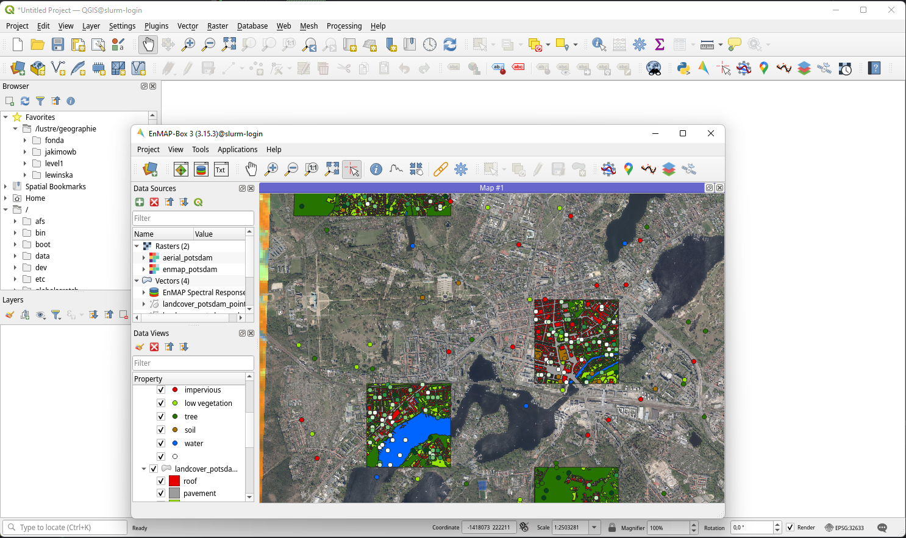
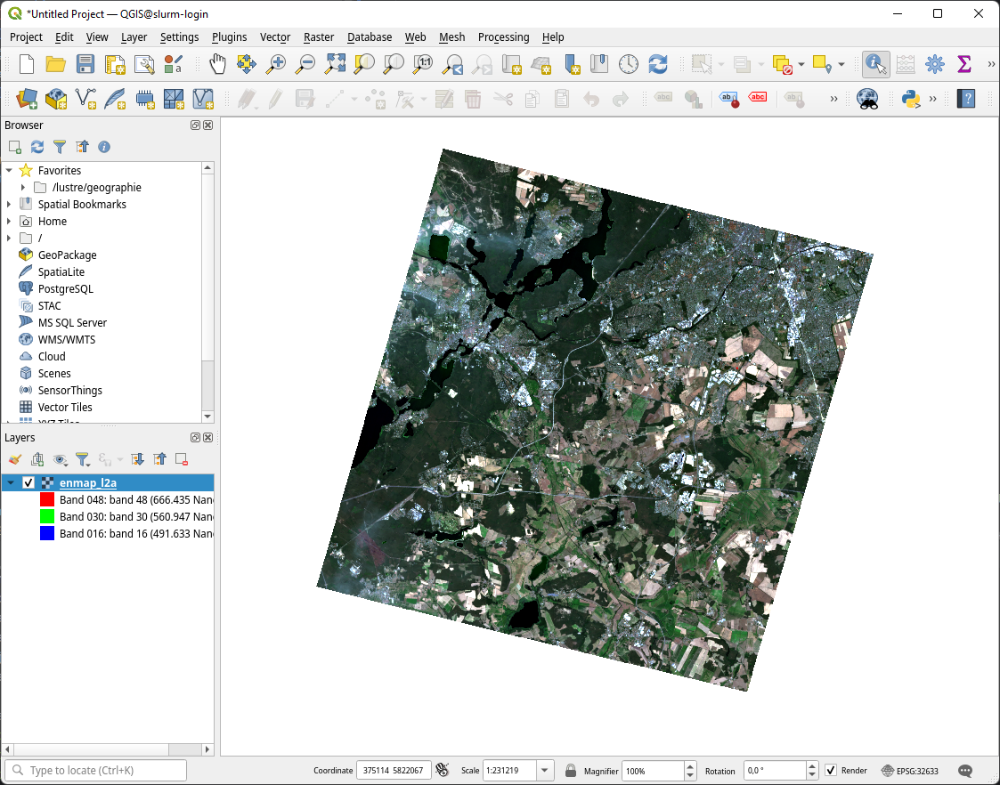
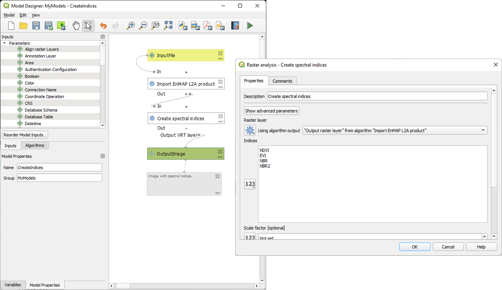
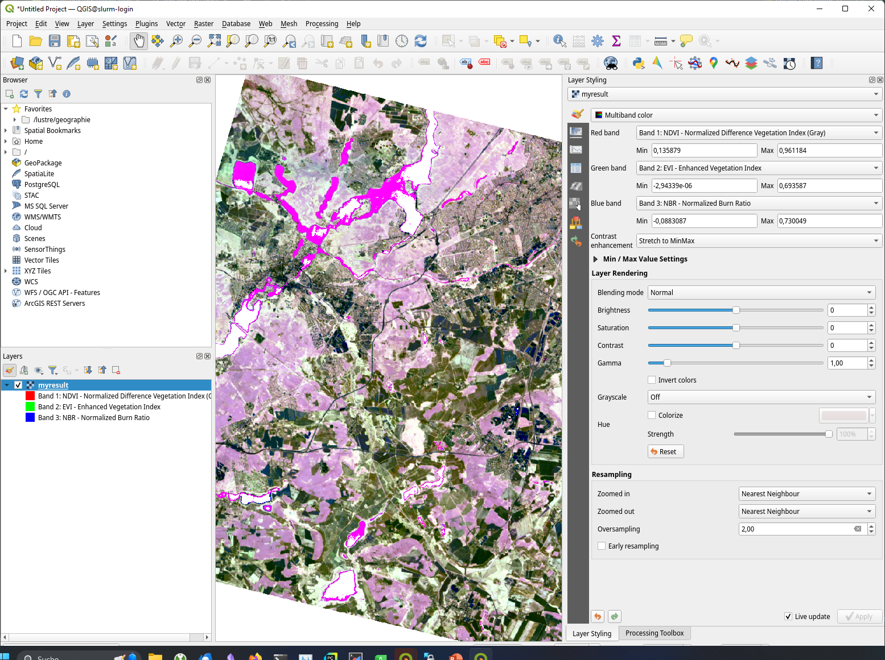

.. _run_on_hpc:

EnMAP-Box in High Performance Computing (HPC) environments
==========================================================

**Author:**  Benjamin Jakimow

**Publication date:** 06/01/2025

**Latest update:** 13/01/2025

Introduction
------------

.. image:: https://slurm.schedmd.com/slurm_logo.png
   :alt: SLURM logo
   :align: right
   :width: 30%

This tutorial provides a guide for installing, configuring, and using QGIS and the EnMAP-Box on a
High-Performance Computing (HPC) Linux environment to process hyperspectral remote sensing data.

We cover the following steps:

* How to install QGIS and the EnMAP from the command line interface (CLI)
* How you can use QGIS and the EnMAP-Box to display, process, and analyze EnMAP data
* How you can use the QGIS processing framework to run QGIS and EnMAP-Box processing algorithms and
  processing models from the CLI,
* How the `SLURM Workload Manager <https://slurm.schedmd.com>`_ can be use to schedule and observe jobs,
  that use QGIS and EnMAP-Box algorithms

Our tutorial addresses users who are familiar with a linux command line. It was tested on
the High-Performance Computing Platform (HPC) of the `Humboldt-Universität
zu Berlin <https://hu.berlin/hpc>`_.

Installation
------------

First of all, we need to install QGIS, the EnMAP-Box and all of its dependencies on the HPC environment.

1. Login to your HPC shell

2. Ensure that conda / `miniconda <https://docs.anaconda.com/miniconda/>`_ is installed and available to you.
   See `miniforge3 <https://github.com/conda-forge/miniforge>`_ for installation instructions.

   Example: to activate conda on the HU HPC, you need to load the miniforge3 module.

   .. code-block:: bash

      module load miniforge3

3. Create a conda environment *enmapbox* with all dependencies that are needed to run the EnMAP-Box:

   .. code-block:: bash

      conda env create -n enmapbox -f https://raw.githubusercontent.com/EnMAP-Box/enmap-box/main/.env/conda/enmapbox_full_latest.yml

4. Activate *enmapbox* and ensure that the local QGIS installation is setup right:

   .. code-block:: bash

      # activate EnMAP-Box environment
      conda activate enmapbox

      # show version infos
      qgis_process --version

      # list qgis plugins
      qgis_process plugins # list plugins
      qgis_process list # list available processing algorithms

   To visualize geo-data on the HPC, you can start QGIS in a X-Window:

   .. code-block:: bash

      qgis&

5. Install and activate the EnMAP-Box QGIS plugin. Either start the QGIS GUI and use the QGIS plugin manager, or use
   the `3Liz qgis-plugin-manager <https://github.com/3liz/qgis-plugin-manager>`_ to manage QGIS plugins from the command line.

    .. tabs::

        .. tab:: QGIS GUI

            1. Call ``qgis&`` to open QGIS in an X-Window
            2. Go to Plugins -> Manage and Install Plugins
            3. Search for 'EnMAP-Box'
            4. Click on 'Install Plugin'

            .. figure:: img/qgis_plugin_manager.png
               :align: center

        .. tab:: Command Line (Bash)

            To install QGIS plugins from CLI only, we fist install the https://github.com/3liz/qgis-plugin-manager

            .. code-block:: bash

                # define the path where your plugins are stored
                export QGIS_PLUGINPATH=~/.local/share/QGIS/QGIS3/profiles/default/python/plugins
                mkdir $QGIS_PLUGINPATH

                # install the 3Liz qgis-plugin-manager
                conda install qgis-plugin-manager
                qgis-plugin-manager init
                qgis-plugin-manager update

                # install the EnMAP-Box
                qgis-plugin-manger install 'EnMAP-Box 3'

6. Check that the EnMAP-Box is installed and their processing algorithms available on your CLI:

   Call ``qgis_process plugins list`` to see which plugins are loaded and available.

   .. code-block:: bash

      jakimowb@slurm-login:~> qgis_process plugins list
      load /home/geographie/jakimowb/.local/share/QGIS/QGIS3/profiles/default/python/plugins/enmapboxplugin/enmapbox/enmapboxresources_rc.py
      load /home/geographie/jakimowb/.local/share/QGIS/QGIS3/profiles/default/python/plugins/enmapboxplugin/enmapbox/coreapps/enmapboxapplications/ressources_rc.py
      load /home/geographie/jakimowb/.local/share/QGIS/QGIS3/profiles/default/python/plugins/enmapboxplugin/enmapbox/qgispluginsupport/qps/qpsresources_rc.py
      <frozen importlib._bootstrap>:488: RuntimeWarning: numpy.ufunc size changed, may indicate binary incompatibility. Expected 216 from C header, got 232 from PyObject
      Problem with GRASS installation: GRASS was not found or is not correctly installed
      Available plugins
      (* indicates loaded plugins which implement Processing providers)

       enmapboxplugin
      * grassprovider
      * processing

   If necessary, enable the EnMAP-Box plugin with ``qgis_process plugins enable enmapboxplugin``:

   .. code-block:: bash

     jakimowb@slurm-login:~> qgis_process plugins enable enmapboxplugin
     Enabling plugin: "enmapboxplugin"
     load /home/geographie/jakimowb/.local/share/QGIS/QGIS3/profiles/default/python/plugins/enmapboxplugin/enmapbox/enmapboxresources_rc.py
     load /home/geographie/jakimowb/.local/share/QGIS/QGIS3/profiles/default/python/plugins/enmapboxplugin/enmapbox/coreapps/enmapboxapplications/ressources_rc.py
     load /home/geographie/jakimowb/.local/share/QGIS/QGIS3/profiles/default/python/plugins/enmapboxplugin/enmapbox/qgispluginsupport/qps/qpsresources_rc.py
     <frozen importlib._bootstrap>:488: RuntimeWarning: numpy.ufunc size changed, may indicate binary incompatibility. Expected 216 from C header, got 232 from PyObject
     Enabled enmapboxplugin (EnMAP-Box 3)

     Available plugins
     (* indicates enabled plugins which implement Processing providers)

     * enmapboxplugin
     * grassprovider
     * processing

   Now list the processing algorithms provided by the EnMAP-Box:

   .. code-block:: bash

     qgis_process list | grep 'enmapbox'
     <frozen importlib._bootstrap>:488: RuntimeWarning: numpy.ufunc size changed, may indicate binary incompatibility. Expected 216 from C header, got 232 from PyObject
     Problem with GRASS installation: GRASS was not found or is not correctly installed
     enmapbox:AggregateRasterLayerBands      Aggregate raster layer bands
     enmapbox:AggregateRasterLayers  Aggregate raster layers
     enmapbox:ApplyMaskLayerToRasterLayer    Apply mask layer to raster layer
     enmapbox:Build3DCube    Build 3D Cube
     enmapbox:ClassFractionLayerFromCategorizedLayer Class fraction layer from categorized layer
     enmapbox:ClassSeparabilityReport        Class separability report
     enmapbox:ClassificationLayerAccuracyAndAreaReportForStratifiedRandomSampling    Classification layer accuracy and area report (for stratified random sampling)
     enmapbox:ClassificationLayerAccuracyReport      Classification layer accuracy report
     enmapbox:ClassificationLayerFromClassProbabilityfractionLayer   Classification layer from class probability/fraction layer
     enmapbox:ClassificationLayerFromRenderedImage   Classification layer from rendered image
     enmapbox:ClassificationWorkflow Classification workflow
     enmapbox:ClassifierFeatureRankingPermutationImportance  Classifier feature ranking (permutation importance)
     enmapbox:ClassifierPerformanceReport    Classifier performance report
     enmapbox:ConvexHullAndContinuumremoval  Convex hull and continuum-removal
     enmapbox:CreateClassificationDatasetFromCategorizedRasterLayerAndFeatureRaster  Create classification dataset (from categorized raster layer and feature raster)
     enmapbox:CreateClassificationDatasetFromCategorizedSpectralLibrary      Create classification dataset (from categorized spectral library)
     enmapbox:CreateClassificationDatasetFromCategorizedVectorLayerAndFeatureRaster  Create classification dataset (from categorized vector layer and feature raster)
     enmapbox:CreateClassificationDatasetFromCategorizedVectorLayerWithAttributeTable        Create classification dataset (from categorized vector layer with attribute table)
     enmapbox:CreateClassificationDatasetFromJsonFile        Create classification dataset (from JSON file)
     enmapbox:CreateClassificationDatasetFromPythonCode      Create classification dataset (from Python code)
     enmapbox:CreateClassificationDatasetFromTableWithCategoriesAndFeatureFields     Create classification dataset (from table with categories and feature fields)
     enmapbox:CreateClassificationDatasetFromTextFiles       Create classification dataset (from text files)
     . . .

Run EnMAP-Box GUI
-----------------

Now we like to start the EnMAP-Box GUI:

1. Call ``qgis&`` to open QGIS in an X-Window.
2. Click the EnMAP-Box icon |enmapbox| to start the EnMAP-Box
3. Click *Project->Add Exampledata* to download and visualize the EnMAP-Box example data.

Run Processing Algorithms
-------------------------

Let's create a working directory and download some example data:

.. code-block:: bash

    DIR_DATA=/lustre/geographie/jakimowb/data
    mkdir -p $DIR_DATA
    cd $DIR_DATA
    wget -O enmapdata.zip https://box.hu-berlin.de/f/c35a6b0655c54d518aab/?dl=1
    unzip enmapdata.zip -d enmapdata

    # list all *METADATA.XML files
    find . -type f -name '*METADATA.XML'

Select the METADATA.XML path and run the *EnMAP-Box import EnMAP L2A* algorithm. It will create a single raster file from the L2A product that
contains the reflectance values of the EnMAP bands and enriches this raster with metadata for QGIS and the EnMAP-Box.

.. code-block:: bash

   PATH_L2A=enmapdata/ENMAP01-____L2A-DT0000001867_20220724T104526Z_008_V010302_20230628T165614Z-METADATA.XML
   qgis_process run enmapbox:ImportEnmapL2AProduct \
      --detectorOverlap=1 \
      --file=$PATH_L2A \
      --outputEnmapL2ARaster=$DIR_DATA/enmap_l2a.vrt

The output should look like:

.. code-block:: bash

   load /home/geographie/jakimowb/.local/share/QGIS/QGIS3/profiles/default/python/plugins/enmapboxplugin/enmapbox/enmapboxresources_rc.py
   load /home/geographie/jakimowb/.local/share/QGIS/QGIS3/profiles/default/python/plugins/enmapboxplugin/enmapbox/coreapps/enmapboxapplications/ressources_rc.py
   load /home/geographie/jakimowb/.local/share/QGIS/QGIS3/profiles/default/python/plugins/enmapboxplugin/enmapbox/qgispluginsupport/qps/qpsresources_rc.py
   <frozen importlib._bootstrap>:488: RuntimeWarning: numpy.ufunc size changed, may indicate binary incompatibility. Expected 216 from C header, got 232 from PyObject
   Problem with GRASS installation: GRASS was not found or is not correctly installed

   ----------------
   Inputs
   ----------------

   file:   enmapdata/ENMAP01-____L2A-DT0000001867_20220724T104526Z_008_V010302_20230628T165614Z-METADATA.XML
   outputEnmapL2ARaster:   /lustre/geographie/jakimowb/data/enmap_l2a.tif

   Create Raster [1275x1240x206](Float32) -co INTERLEAVE=BAND COMPRESS=LZW TILED=YES BIGTIFF=YES /lustre/geographie/jakimowb/data/enmap_l2a.tif
   0...10...20...30...40...50...60...70...80...90...100 - done.
   Execution completed in 19.3 seconds
   Results: {'outputRaster': '/lustre/geographie/jakimowb/data/enmap_l2a.tif'}
   Execution completed in 22.61 seconds

   ----------------
   Results
   ----------------

   outputEnmapL2ARaster:   /lustre/geographie/jakimowb/data/enmap_l2a.tif

Now open the image in QGIS:

.. code-block:: bash

    qgis $DIR_DATA/enmap_l2a.vrt&

Run Processing Models
---------------------

The QGIS Model Designer allows you to create QGIS Processing Models to describe comprehensive workflows that combine EnMAP-Box and other
QGIS algorithms.

These models can be saved an shared in \*.model3 files. Download the :download:`CreateSpectralIndices.model3 <models/CreateSpectralIndices.model3>`
and show its parameters:

.. code-block:: bash

   >qgis_process help ~/CreateSpectralIndices.model3

      CreateIndices (CreateIndices)

   ----------------
   Description
   ----------------

   ----------------
   Arguments
   ----------------

   inputfile: InputFile
           Argument type:  file
           Acceptable values:
                   - Path to a file
   outputimage: OutputImage
           Argument type:  rasterDestination
           Acceptable values:
                   - Path for new raster layer

   ----------------
   Outputs
   ----------------

   outputimage: <outputRaster>
           OutputImage

To run it, call:

.. code-block:: bash

   > qgis_process run ~/CreateSpectralIndices.model3 \
         -- inputfile=ENMAP01-____L2A-DT0000001867_20220724T104526Z_008_V010302_20230628T165614Z-METADATA.XML \
            outputimage=~/myresult.tif

   ----------------
   Inputs
   ----------------

   inputfile:      ENMAP01-____L2A-DT0000001867_20220724T104526Z_008_V010302_20230628T165614Z-METADATA.XML
   outputimage:    /home/geographie/jakimowb/myresult.vrt

   Create Raster [1275x1240x218](Float32) -co INTERLEAVE=BAND COMPRESS=LZW TILED=YES BIGTIFF=YES /tmp/processing_zzyKzi/0854a4cf4d624d69803deeb2ce382e00/outputEnmapL2ARaster.tif
   0...10...20...30...40...50
   Execution completed in 18.73 seconds
   Results: {'outputRaster': '/tmp/processing_zzyKzi/0854a4cf4d624d69803deeb2ce382e00/outputEnmapL2ARaster.tif'}
   Execution completed in 21.99 seconds
   gdal_vrt_module_0x557a0e002550:12: RuntimeWarning: invalid value encountered in divide
   gdal_vrt_module_0x557a0aca6bc0:12: RuntimeWarning: invalid value encountered in divide
   gdal_vrt_module_0x557a12d68350:12: RuntimeWarning: invalid value encountered in divide
   gdal_vrt_module_0x557a0dfdbec0:12: RuntimeWarning: invalid value encountered in divide
   Execution completed in 2.37 seconds
   ...60...70...80...90...100 - done.
   Model processed OK. Executed 2 algorithm(s) total in 24.479 s.

   ----------------
   Results
   ----------------

   outputimage:    /home/geographie/jakimowb/myresult.tif

Call ``qgis ~/myresult.tif`` to visualize the created image in QGIS:

SLURM Workload Manager
----------------------

The SLURM workload manager allows to schedule and execute processing jobs for large and small Linux clusters.
To cite from the `SLURM project <https://slurm.schedmd.com/overview.html>`_:

   * *First, it allocates exclusive and/or non-exclusive access to resources (compute nodes) to users for some
     duration of time so they can perform work.*

   * *Second, it provides a framework for starting, executing, and monitoring work (normally a parallel job) on the set
     of allocated nodes.*

   * *Finally, it arbitrates contention for resources by managing a queue of pending work.*

In the next section we use SLURM to schedule and run the time-consuming processes of EnMAP-data extraction and
import.

Example: Import EnMAP L2A data
------------------------------

Download EnMAP products
.......................

We assume that a lot of EnMAP Level 2 data has been ordered in the `EnMAP Data Access Portal <https://planning.enmap.org/>`_.
are now several tar.gz file are ready to be downloaded from ``download.dsda.dlr.de``.

First, we create a folder to download these files. As we will refer to in the next steps, we save the folder path in a
variable:

.. code-block:: bash

    mkdir -p ~/mydata/enmap_input

To download the data from the FTP server we can use
the `Sophisticated file transfer program - lftp <https://linux.die.net/man/1/lftp>`_ command.
Replace `<user>` with your personal user account in the EnMAP Data Access Portal:

.. code-block:: bash

    # connect to FTP server and enter your password
    lftp -u <user>@download.dsda.dlr.de
    Password: <type your password>

    # list files available for download
    lftp <user>@download.dsda.dlr.de:~>ls
    -rw-r--r--   1 7385     7385     1089871343 Jan  3 13:49 dims_op_oc_oc-en_702052263_1.tar.gz
    -rw-r--r--   1 7385     7385     4871929662 Jan  3 13:53 dims_op_oc_oc-en_702052263_2.tar.gz
    -rw-r--r--   1 7385     7385     1419200394 Jan  2 15:18 dims_op_oc_oc-en_702052361_1.tar.gz
    -rw-r--r--   1 7385     7385     2779919913 Jan  2 20:08 dims_op_oc_oc-en_702052407_1.tar.gz
    -rw-r--r--   1 7385     7385     4662669786 Jan  2 20:10 dims_op_oc_oc-en_702052407_2.tar.gz

    # download all *.tar.gz files with 4 file at the same time to your local $INPUT_DIR
    lftp <user>@download.dsda.dlr.de:~>mirror --parallel=4 -v . ~/mydata/enmap_input
    Transferring file `dims_op_oc_oc-en_702052263_1.tar.gz'
    Transferring file `dims_op_oc_oc-en_702052263_2.tar.gz'
    Transferring file `dims_op_oc_oc-en_702052361_1.tar.gz'
    Transferring file `dims_op_oc_oc-en_702052407_1.tar.gz'
    Transferring file `dims_op_oc_oc-en_702052407_2.tar.gz'
    `dims_op_oc_oc-en_702052263_2.tar.gz' at 1758625792 (36%) 44.45M/s eta:69s [Receiving data/TLS]

    # finally call exit to leave the lftp shell
    lftp <user>@download.dsda.dlr.de:~>exit

Now check the *\*.tar.gz* files in `INPUT_DIR`:

.. code-block:: bash

   > $INPUT_DIR=~/mydata/enmap_input
   > ls -lh $INPUT_DIR
   total 185G
   -rw-r--r-- 1 jakimowb zwei 4.5G Aug 13 17:37 dims_op_oc_oc-en_701696243_2.tar.gz
   -rw-r--r-- 1 jakimowb zwei 1.8G Aug 13 17:29 dims_op_oc_oc-en_701696349_1.tar.gz
   -rw-r--r-- 1 jakimowb zwei 4.7G Aug 13 17:31 dims_op_oc_oc-en_701696349_2.tar.gz
   -rw-r--r-- 1 jakimowb zwei 2.1G Aug 13 17:26 dims_op_oc_oc-en_701696455_1.tar.gz
   -rw-r--r-- 1 jakimowb zwei 4.4G Aug 13 17:28 dims_op_oc_oc-en_701696455_2.tar.gz
   -rw-r--r-- 1 jakimowb zwei 1.7G Aug 13 17:21 dims_op_oc_oc-en_701696615_1.tar.gz
   # <many more>

Each ``*.tar.gz`` file contains one or more EnMAP Level 2 products and auxiliary information.
These files can be listed with:

.. code-block:: bash

   > tar -tzf dims_op_oc_oc-en_701696137_1.tar.gz
   dims_op_oc_oc-en_701696137_1/
   dims_op_oc_oc-en_701696137_1/tools/
   dims_op_oc_oc-en_701696137_1/tools/defcopyright.html
   dims_op_oc_oc-en_701696137_1/tools/EnMAP_Data_License_v1.1_final.pdf
   dims_op_oc_oc-en_701696137_1/tools/EnMAP_Data_License_v1.1_final.pdf.tooldes
   dims_op_oc_oc-en_701696137_1/tools/iif.xsd
   dims_op_oc_oc-en_701696137_1/tools/iif.xsd.tooldes
   dims_op_oc_oc-en_701696137_1/tools/tf.xsd
   dims_op_oc_oc-en_701696137_1/tools/tf.xsd.tooldes
   dims_op_oc_oc-en_701696137_1/tools/leiste.gif
   dims_op_oc_oc-en_701696137_1/tools/logo_dlr.jpg
   dims_op_oc_oc-en_701696137_1/tools/logo_dfd.jpg
   dims_op_oc_oc-en_701696137_1/tools/erde_weiss_small.gif
   dims_op_oc_oc-en_701696137_1/ENMAP.HSI.L2A/
   dims_op_oc_oc-en_701696137_1/ENMAP.HSI.L2A/ENMAP01-____L2A-DT0000014911_20230428T093524Z_016_V010402_20240809T151155Z.ZIP
   dims_op_oc_oc-en_701696137_1/ENMAP.HSI.L2A/ENMAP01-____L2A-DT0000014911_20230428T093533Z_018_V010402_20240809T145654Z.ZIP
   dims_op_oc_oc-en_701696137_1/ENMAP.HSI.L2A/ENMAP01-____L2A-DT0000014911_20230428T093520Z_015_V010402_20240809T151634Z.ZIP
   dims_op_oc_oc-en_701696137_1/ENMAP.HSI.L2A/ENMAP01-____L2A-DT0000014911_20230428T093529Z_017_V010402_20240809T145835Z.ZIP
   dims_op_oc_oc-en_701696137_1/ENMAP.HSI.L2A/ENMAP01-____L2A-DT0000014911_20230428T093506Z_012_V010402_20240809T152833Z.ZIP
   dims_op_oc_oc-en_701696137_1/iif/
   dims_op_oc_oc-en_701696137_1/iif/dims_nz_pl_dfd_XXXXB00000000681141327206_iif.xml
   dims_op_oc_oc-en_701696137_1/iif/dims_nz_pl_dfd_XXXXB00000000681141326695_iif.xml
   dims_op_oc_oc-en_701696137_1/iif/dims_nz_pl_dfd_XXXXB00000000681141327597_iif.xml
   dims_op_oc_oc-en_701696137_1/iif/dims_nz_pl_dfd_XXXXB00000000681141326969_iif.xml
   dims_op_oc_oc-en_701696137_1/iif/dims_nz_pl_dfd_XXXXB00000000681141328372_iif.xml
   dims_op_oc_oc-en_701696137_1/readme.html

Extract, Import, Queue
......................

In order to visualize and analyze the EnMAP data, we would like for each *\*.tar.gz* file to:

1. extract all ENMAP01_*.ZIP files,
2. unzip each extracted *ENMAP01_\*.ZIP* file,
3. create a single raster image with reflectance values and band-metadata that can be used in QGIS and the EnMAP-Box,
4. cleanup unzipped *\*.tar.gz* and *ENMAP01_\*.ZIP* files.

We can use the ``extract_enmap_tgz.sh`` script to run step 1-4 for a single *\*.tar.gz* file.
However, as the extraction and import can take a while, we do not like to simply loop over all files, but extract them
in parallel. We can do so using two other scripts: ``extract_all.slurm`` defines a SLURM job and ``extract_all.sh`` that starts it.

   .. tabs::

      .. tab:: extract_enmap_tgz.sh

         This script extracts a single *\*.tar.gz* file and uncompresses the contained ZIP files that contain EnMAP image
         data. After that, the EnMAP-Box :ref:`enmapbox:ImportEnmapL2AProduct <alg-enmapbox-ImportEnmapL2AProduct>`
         algorithm is used to create an image that is easy to visualize in QGIS and the EnMAP-Box.

         .. code-block:: bash

            #!/bin/bash
            # A script to extract EnMAP Level 2A *.tar.gz archives

            if [ "$#" -ne 2 ]; then
                echo "Usage: $0 FILE OUTPUT_DIR"
                exit 1
            fi

            # Assign arguments to variables
            FILE=$1
            OUTPUT_DIR=$2

            # Validate FILE
            if [ ! -f "$FILE" ]; then
                echo "Error: FILE '$FILE' does not exist or is not a regular file."
                exit 2
            fi

            # Validate OUTPUT_DIR
            if [ ! -d "$OUTPUT_DIR" ]; then
                echo "Error: OUTPUT_DIR '$OUTPUT_DIR' does not exist or is not a directory."
                exit 3
            fi

            DIR_TMP="$OUTPUT_DIR/$(basename "$FILE" .tar.gz)"
            mkdir -p $DIR_TMP
            echo "DIR_TMP=$DIR_TMP"

            echo "# Step 1: Extract $FILE to $DIR_TMP..."
            tar -xzvf "$FILE" -C $DIR_TMP --wildcards '*.ZIP'

            ls -a $DIR_TMP

            echo "# Step 2: Unzip zip files below $DIR_TMP"
            find -L "$DIR_TMP" -name "ENMAP01*.ZIP" -type f

            mapfile -t ZIPFILES < <(find -L "$DIR_TMP" -name "ENMAP01*.ZIP" -type f)
            DIR_UNZIPPED="$DIR_TMP/unzipped"
            mkdir -p $DIR_UNZIPPED
            echo "DIR_UNZIPPED=$DIR_UNZIPPED"

            for zip_file in "${ZIPFILES[@]}"; do
              echo "unzip $zip_file..."
              unzip -o "$zip_file" -d "$DIR_UNZIPPED"
            done

            echo "# Step 3: import the L2A product as image to be used with QGIS / EnMAP-Box"
            mapfile -t METADATAFILES < <(find "$DIR_UNZIPPED" -name "ENMAP01*-METADATA.XML" -type f)
            echo "Found ${#METADATAFILES[@]} *.METADATA.XML files:"

            for xml_file in "${METADATAFILES[@]}"; do
              tif_file="${xml_file%METADATA.XML}-IMAGE_L2A.tif"

              printf "Import $xml_file \nto $tif_file"

              qgis_process run enmapbox:importenmapl2aproduct -- \
                       file=$xml_file \
                       setBadBands=true \
                       excludeBadBands=true \
                       detectorOverlap=0 \
                       outputEnmapL2ARaster=$tif_file

            done

            echo "# Step 4: move the EnMAP Scene folder to output directory and cleanup everything"
            rsync -a "$DIR_UNZIPPED/" "$OUTPUT_DIR"
            rm -r $DIR_TMP

      .. tab:: extract_all.slurm

         This script defines the SLURM job that extracts each \*.tar.gz in a separated slurm
         `job array task <https://slurm.schedmd.com/job_array.html>`_:

         .. code-block:: bash

            #!/bin/bash
            #SBATCH --ntasks=1                    # Run on a single CPU
            #SBATCH --mem=4gb                     # Job memory request
            #SBATCH --partition=standard
            #SBATCH --account=jakimowb
            #SBATCH --output=job_output_%A_%a.log
            #SBATCH --error=job_error_%A_%a.log
            #SBATCH --cpus-per-task=1             # CPUs per task

            JOBLIST=$1
            OUTPUT_DIR=$2

            # ensure that the standard environmental settings are available
            source ~/.bashrc

            # activate the enmapbox conda environment
            module load miniforge3
            conda activate enmapbox
            export QT_QPA_PLATFORM=offscreen
            mkdir -p $OUTPUT_DIR

            FILE=$(sed -n "$((SLURM_ARRAY_TASK_ID + 1))p" "$JOBLIST")
            if [ -z "$FILE" ]; then
                echo "No file found for SLURM_ARRAY_TASK_ID=$SLURM_ARRAY_TASK_ID"
                exit 1
            fi

            # Process the file
            echo "Import EnMAP images from $FILE"
            source extract_enmap_tgz.sh "$FILE" "$OUTPUT_DIR"
            echo "SLURM job finished"

      .. tab:: extract_all.sh

         This script adds the slurm job and all its sub-tasks to the SLURM job queue.

         The last line of the ``extract_all.sh`` script calls `sbatch <https://slurm.schedmd.com/sbatch.html>`_ to send the
         ``extrac.slurm`` to the slurm cluster. The parameter ``--array=0-$(($NUM_FILES - 1))%4`` creates a
         `job array <https://slurm.schedmd.com/job_array.html>`_ for *n=$NUM_FILES* jobs,
         of which up to 4 are processed in parallel.

         .. code-block:: bash

            #!/bin/bash

            DIR_INPUT=~/mydata/enmap_input
            DIR_OUTPUT=~/mydata/enmap_l2_tif
            DIR_LOGS=~/SLURM_LOGS
            JOBLIST=~/joblist.txt

            mkdir -p $DIR_LOGS
            mkdir -p $DIR_OUTPUT

            # create a joblist
            find "$DIR_INPUT" -name "*.tar.gz" -type f > "$JOBLIST"

            NUM_FILES=$(wc -l < "$JOBLIST")
            echo "Found $NUM_FILES *.tar.gz files."

            if [ "$NUM_FILES" -eq 0 ]; then
                echo "No *.tar.gz files found. Exiting."
                #exit 1
            fi

            # Submit the Slurm job array
            echo "Submitting Slurm job array with $NUM_FILES files..."
            sbatch \
              --array=0-$(($NUM_FILES - 1))%4 \
              --output=$DIR_LOGS/job_output_%A_%a.log \
              --error=$DIR_LOGS/job_error_%A_%a.log \
              extract.slurm "$JOBLIST" "$DIR_OUTPUT"

.. note::

   SLURM jobs are executed on nodes. These nodes may provide a different environment that that where you tested
   your processing script. To inspect the environment on which SLURM will processes your script, you can create
   a new node with `srun <https://slurm.schedmd.com/srun.html>`_ and open an interactive shell:

   .. code-block:: bash

        >srun --nodes=1 --exclusive --slurmd-debug debug2 --pty bash -i
        user@slurm-exec-019:~> which unzip
        /usr/bin/unzip

   Obviously the unzip command is available on this slurm execution node slurm-exec-019.

Monitor job status
..................

The `squeue <https://slurm.schedmd.com/squeue.html>`_ command can be used to inspect the job status:

.. code-block:: bash

   > squeue -u $USER
   JOBID PARTITION     NAME     USER ST       TIME  NODES NODELIST(REASON)
   19523_0  standard extract. jakimowb  R       9:45      1 slurm-exec-029
   19523_1  standard extract. jakimowb  R       9:45      1 slurm-exec-029
   19523_2  standard extract. jakimowb  R       9:45      1 slurm-exec-029
   19523_3  standard extract. jakimowb  R       9:45      1 slurm-exec-029

Actually 4 jobs are running in parallel (ST = *R*), as defined when starting
the job with ``--array=0-$(($NUM_FILES - 1))%4``.

Using the job id ``JOB_ID=19523``, we can log-in to a job session with `srun <https://slurm.schedmd.com/srun.html>`_:

.. code-block:: bash

   user@slurm-login:~> srun --jobid $JOB_ID --pty bash
   user@slurm-exec-013:~>

Similar, jobs can be canceled with `scancel <https://slurm.schedmd.com/scancel.html>`_:

.. code-block:: bash

   user@slurm-login:~> scancel $JOB_ID     # to cancel the entire job
   user@slurm-login:~> scancel $JOB_ID_3   # to cancel the the job set with sub-id 3

The `saact <https://slurm.schedmd.com/sacct.html>`_ command allows you to display statistics for all jobs
and job steps:

.. code-block:: bash

   >user@slurm-login:~> sacct -j $JID
   JobID           JobName  Partition    Account  AllocCPUS      State ExitCode
   ------------ ---------- ---------- ---------- ---------- ---------- --------
   19667_0      extract.s+   standard   user          1    RUNNING      0:0
   19667_0.bat+      batch              user          1    RUNNING      0:0
   19667_1      extract.s+   standard   user          1    RUNNING      0:0
   19667_1.bat+      batch              user          1    RUNNING      0:0
   19667_2      extract.s+   standard   user          1    RUNNING      0:0
   19667_2.bat+      batch              user          1    RUNNING      0:0
   19667_3      extract.s+   standard   user          1    RUNNING      0:0
   19667_3.bat+      batch              user          1    RUNNING      0:0
   19667_4      extract.s+   standard   user          1  COMPLETED      0:0
   19667_4.bat+      batch              user          1  COMPLETED      0:0
   19667_5      extract.s+   standard   user          1    RUNNING      0:0
   19667_5.bat+      batch              user          1    RUNNING      0:0
   19667_6      extract.s+   standard   user          1    RUNNING      0:0
   19667_6.bat+      batch              user          1    RUNNING      0:0

The ``--format`` parameter allows to specify the outputs, e.g. to show how long each single step took:

.. code-block: bash

   user@slurm-login:~> sacct -j $JID --format=JobID,JobName,End,Elapsed,State
   JobID           JobName                 End    Elapsed      State
   ------------ ---------- ------------------- ---------- ----------
   19667_0      extract.s+             Unknown   00:13:21    RUNNING
   19667_0.bat+      batch             Unknown   00:13:21    RUNNING
   19667_1      extract.s+             Unknown   00:13:21    RUNNING
   19667_1.bat+      batch             Unknown   00:13:21    RUNNING
   19667_2      extract.s+             Unknown   00:13:21    RUNNING
   19667_2.bat+      batch             Unknown   00:13:21    RUNNING
   19667_3      extract.s+             Unknown   00:13:21    RUNNING
   19667_3.bat+      batch             Unknown   00:13:21    RUNNING
   19667_4      extract.s+ 2025-01-07T15:29:49   00:09:58  COMPLETED
   19667_4.bat+      batch 2025-01-07T15:29:49   00:09:58  COMPLETED
   19667_5      extract.s+ 2025-01-07T15:32:58   00:13:07  COMPLETED
   19667_5.bat+      batch 2025-01-07T15:32:58   00:13:07  COMPLETED
   19667_6      extract.s+             Unknown   00:13:21    RUNNING
   19667_6.bat+      batch             Unknown   00:13:21    RUNNING

Notes
-----

QT_QPA_PLATFORM
...............

Qt apps like QGIS and the EnMAP-Box expect a graphical interface where they can draw a graphical user interface
(windows, widgets, pixel). If your Qt app raises an error like:

.. code-block:: bash

   qt.qpa.xcb: could not connect to display localhost:14.0
   qt.qpa.plugin: Could not load the Qt platform plugin "xcb" in "" even though it was found.
   This application failed to start because no Qt platform plugin could be initialized. Reinstalling the application may fix this problem.

   Available platform plugins are: eglfs, minimal, minimalegl, offscreen, vnc, webgl, xcb.

it means that Qt can't connect to the expected graphical interface. In this case the expected
Qt Platform Abstraction (QPA) layer - the `QXcbIntegrationPlugin `xcb` plugin
`for Linux/X11 <https://doc.qt.io/qt-5/linux.html>`_, is not available, because no X Server has been started.

If screen devices are not available or not needed, as on SLURM nodes, it may be required to change the defauls *QT_QPA_PLATFORM*:

.. code-block:: bash

    export QT_QPA_PLATFORM=offscreen

Be aware that if set to `offscreen`, Qt applications won't show any GUI interface.
This may cause errors like the following, when starting QGIS:

.. code-block:: bash

   >export QT_QPA_PLATFORM=offscreen
   >qgis
   [New LWP 9667]
   [New LWP 9673]
   [Thread debugging using libthread_db enabled]
   Using host libthread_db library "/lib64/libthread_db.so.1".
   0x00007f0568e9ec1f in wait4 () from /lib64/libc.so.6
   [Current thread is 1 (Thread 0x7f055857ea00 (LWP 9513))]
   #0  0x00007f0568e9ec1f in wait4 () from /lib64/libc.so.6
   No symbol table info available.
   #1  0x0000562ff9884824 in qgisCrash(int) ()
   No symbol table info available.
   #2  <signal handler called>
   No symbol table info available.
   #3  0x00007f056e61268c in QgsClipboard::hasFormat(QString const&) const () from /mnt/lustre/scratch/geographie/jakimowb/conda_envs/enmapbox/bin/../lib/libqgis_app.so.3.40.1
   No symbol table info available.
   #4  0x00007f056e58bea5 in QgisApp::activateDeactivateLayerRelatedActions(QgsMapLayer*) () from /mnt/lustre/scratch/geographie/jakimowb/conda_envs/enmapbox/bin/../lib/libqgis_app.so.3.40.1
   No symbol table info available.
   #5  0x00007f056e59ec11 in QgisApp::QgisApp(QSplashScreen*, bool, bool, bool, QString const&, QString const&, QWidget*, QFlags<Qt::WindowType>) () from /mnt/lustre/scratch/geographie/jakimowb/conda_envs/enmapbox/bin/../lib/libqgis_app.so.3.40.1
   No symbol table info available.
   #6  0x0000562ff987ffa1 in main ()
   No symbol table info available.
   [Inferior 1 (process 9513) detached]
   gdb returned 0

To reset *QT_QPA_PLATFORM* to its system default, call::

    unset QT_QPA_PLATFORM

Inspect a SLURM node
....................

SLURM job are executed on SLURM nodes. These nodes may provide an environment that differs to that
where you have tested your tasks before. Therefore, it can be useful to log-in to node and inspect its environment
interactively, e.g. to find our why your slurm script does not run on a SLURM node.

To create a new SLURM node and connect an interactive shell, call::

   srun --nodes=1 --exclusive --pty bash -i

..
 XGD_RUNTIME_DIR
   ...............

   If you want to start a Qt app like ``qgis_process`` but get an error like::

      > qgis_process plugins list
      QStandardPaths: error creating runtime directory '/run/user/8169' (Permission denied)

References
----------

This tutorial is largely based on own experience and the following documentations:

.. list-table:: References
   :widths: 20 80
   :header-rows: 1

   * - Source
     - Link

   * - EnMAP-Box Installation Guide
     - :ref:`Linux installation <usr_installation>`

   * - QGIS processing framework
     - https://docs.qgis.org/3.34/en/docs/user_manual/processing/index.html

       Graser & Olaya 2015, *Processing: A Python Framework for the Seamless Integration of Geoprocessing Tools in QGIS*
       https://doi.org/10.3390/ijgi4042219 .

   * - Qt 5.15
     - https://doc.qt.io/qt-5/

   * - SLURM Workload Manager
     - https://slurm.schedmd.com/overview.html

   * - High Performance Computing HU-Berlin
     - https://wikis.hu-berlin.de/hpc/

.. AUTOGENERATED SUBSTITUTIONS - DO NOT EDIT PAST THIS LINE

.. |enmapbox| image:: /img/icons/enmapbox.svg
   :width: 28px
