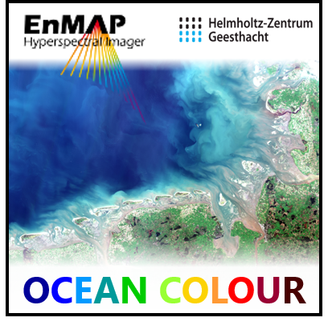
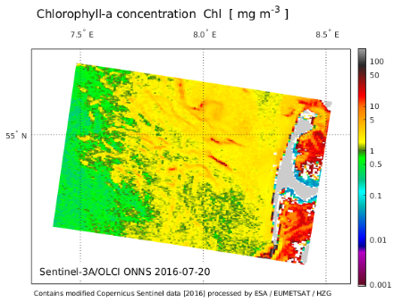

===============================
Ocean Colour analysis with ONNS
===============================

**Ocean Colour analysis with the OLCI Neural Network Swarm (ONNS)**

Overview
========

About
-----

Satellites observe the oceans, coasts and inland waters. Water quality parameters can be estimated from ocean colour
using the in-water algorithm ONNS, which has been developed at the `Institute of Coastal Research at the Helmholtz-Zentrum
Geesthacht <https://hzg.de/institutes_platforms/coastal_research/operational_systems/remote_sensing/index.php.en>`_.
The EnMAP-Box is a free and open source plug-in for QGIS to visualize
and process satellite remote sensing data with special emphasis to the hyperspectral `EnMAP <http://www.enmap.org/>`_ sensor.
The following tutorial describes the usability and functionality of the Python-based ONNS processing tool in the EnMAP-Box.

Background
----------

In opposite to most other remote sensing applications it is not the water surface itself that determines the reflectance
(ocean colour), it is the upper layer of the water body beneath. Water is transparent for light in the visible spectral
range. Sunlight is absorbed and scattered along the water column, whereby four constituents are usually differentiated:
pure water itself, phytoplankton particles, sediments, and coloured dissolved organic matter (CDOM). The composition of
the water constituents determines the light penetration depth and portion of the backscattered light. The remote sensing
signal contains the backscattered light from the top layer only, approximately until a depth where only 90 % of the
spectral sunlight is still present (the 90%-depth). This information-containing water depth can be up to 60 m for clear
oceanic waters (spectral maximum around 450 nm), few metres for coastal waters (spectral maximum at 600 nm) or even few
centimetres for very turbid waters. By the way – photosynthesis of phytoplankton is only possible with sufficient
sunlight roughly until the 1%-depth, also referred to as euphotic depth.

The primary aim of ocean colour remote sensing is to quantify the water constituents, i.e. the phytoplankton biomass in
terms of their Chlorophyll-a pigment content, Chl [mg m :sup:`−3`], total (organic + inorganic) suspended matter concentration,
TSM [g m :sup:`-3`], and CDOM absorption at 440 nm, a :sub:`cdom` (440) [m :sup:`-1`]. Beyond
this, additional water mass-characterizing optical parameters, e.g. absorption and scattering properties, can be estimated.
Hyperspectral information, as provided by the EnMAP mission, allow further differentiation of spectral features associated
to algae types (phytoplankton groups) or sediment properties.

The present tutorial is an overview about the usage and functionality of the water algorithm implemented in the EnMAP-Box.
The processor contains three main steps: the atmospheric correction, an optical water type classification, and the
application of suitable in-water algorithms. Ocean, coastal and inland water bodies can be characterized by means of
these algorithms. The core in-water processor including optical water type classification is the ONNS
(OLCI Neural Network Swarm) algorithm [1]_ version 0.9. It is an EnMAP-precursor algorithm, which is specially developed
for data evaluation of the multi-spectral Ocean and Land Colour Instrument (OLCI) on board
`Sentinel-3 <https://sentinel.esa.int/web/sentinel/missions/sentinel-3/overview/mission-summary>`_.
Satellite data from other ocean colour sensors can be analysed as well by means of an intermediate band-shifting procedure [2]_.
Atmospheric correction must be provided before utilization of the in-water algorithm, different models are available
for this, e.g. Polymer [3]_ or C2RCC [4]_ (but may lead to different retrieval results). Alternatively, in situ
remote-sensing reflectance data (in a txt-format) can be processed.

The ONNS algorithm itself consists of several blended neural networks that are specialized for 13 different optical
water classes. These comprise clearest natural waters but also extreme absorbing or scattering waters.
Considered Chlorophyll-a concentrations reach up to 200 mg m :sup:`−3`, non-algae particle concentrations up to 1,500 g m :sup:`−3`,
and CDOM absorption coefficient at 440 nm is up to 20 m :sup:`−1`. The algorithm generates different concentrations of water
constituents, inherent and apparent optical properties, and a color index. In addition, all products are delivered
with an uncertainty estimate.

References
----------

.. [1] Hieronymi, M., D. Müller, and R. Doerffer (2017), The OLCI Neural Network Swarm (ONNS): A bio-geo-optical algorithm for open ocean and coastal waters, Frontiers in Marine Science, 4 (140). (https://www.frontiersin.org/articles/10.3389/fmars.2017.00140/full)
.. [2] Hieronymi, M. (2019), Spectral band adaptation of ocean color sensors for applicability of the multi-water biogeo-optical algorithm ONNS, Optics Express, 27 (12), A707-A724. (https://www.osapublishing.org/oe/abstract.cfm?uri=oe-27-12-A707)
.. [3] Steinmetz, F., P. Y. Deschamps, and D. Ramon (2011), Atmospheric correction in presence of sun glint: application to MERIS, Optics Express, 19(10), 9783-9800. (https://www.osapublishing.org/oe/abstract.cfm?uri=oe-19-10-9783)
.. [4] Brockmann, C., R. Doerffer, M. Peters, K. Stelzer, S. Embacher, and A. Ruescas (2016), Evolution of the C2RCC neural network for Sentinel 2 and 3 for the retrieval of ocean colour products in normal and extreme optically complex waters, In Proc. Of the Living Planet Symposium, Vol. 740, p. 54. (https://www.brockmann-consult.de/wp-content/uploads/2017/11/sco1_12brockmann.pdf)

|

Data
====

Test data
---------

You can download the test data here: https://bitbucket.org/janzandr/onns_for_enmap-box/downloads/S3A_OL_2_WFRC8R_20160720T093421_20160720T093621_20171002T063739_0119_006_307______MR1_R_NT_002_sylt.nc

The present version of the ONNS algorithm is able to process atmospherically corrected data of different ocean
colour sensors, namely OLCI, MERIS, MODIS and VIIRS. The corresponding data format must be NETCDF4. Moreover, ONNS
can handle tabulated remote-sensing reflectances at selected wavebands of OLCI, SeaWiFS, MODIS, MERIS, OCM-2, VIIRS,
SGLI, GOCI-2, EnMAP or PACE/OCI (text format).

One example of (C2RCC) atmospherically corrected Sentinel-3A/OLCI data is provided. The sub-scene shows the coastal
waters off the island Sylt in the German Bight, North Sea (2016-07-20, 09:34 UTC):
:file:`S3A_OL_2_WFRC8R_20160720T093421_20160720T093621_20171002T063739_0119_006_307______MR1_R_NT_002_sylt.nc`

Note that processing of a satellite scenes may take a long time depending on the number of valid water pixels.

   Figure 1: Sentinel-3A/OLCI top-of-atmosphere image with marked area of provided sub-scene (contains modified Copernicus Sentinel data [2016] processed by ESA/EUMETSAT/HZG).

ONNS output
-----------

The minimum output of the water algorithm ONNS contains 12 typical ocean colour products each with an estimate of
their associated uncertainties:

#. Concentration of Chlorophyll-a, Chl [mg m :sup:`−3`],
#. Concentration of inorganic suspended matter (minerals), ISM [g m :sup:`-3`],
#. Absorption coefficient of CDOM at 440 nm, a :sub:`cdom` (440) [m :sup:`-1`],
#. Absorption coefficient of phytoplankton particles at 440 nm, a :sub:`p` (440) [m :sup:`-1`],
#. Absorption coefficient of minerals at 440 nm, a :sub:`m` (440) [m :sup:`-1``],
#. Absorption coefficient of detritus plus gelbstoff at 412 nm, a :sub:`dg` (412) [m :sup:`-1`],
#. Scattering coefficient of phytoplankton particles at 440 nm, b :sub:`p` (440) [m :sup:`-1`],
#. Scattering coefficient of minerals at 440 nm, b :sub:`m` (440) [m :sup:`-1`]`,
#. Total backscattering coefficient of all particles (organic and inorganic) at 510 nm, b :sub:`bp` (510) [m :sup:`-1`],
#. Downwelling diffuse attenuation coefficient at 490 nm, K :sub:`d` (490) [m :sup:`-1`],
#. Upwelling diffuse attenuation coefficient at 490 nm, K :sub:`u` (490) [m :sup:`-1`] and
#. Forel-Ule number, FU [-].

The standard output contains additional derived properties, such as total absorption and scattering coefficients
at 440 nm, optical dominance at 440 nm as well as estimated concentration of dissolved organic carbon (DOC [mg m :sup:`-3`]).
In addition, input remote-sensing reflectances and some information on the optical water types (OWT) are provided.
In a third saving option, excessive information on OWT classification can be stored.

   Estimated Chlorophyll-a concentration, CDOM absorption and particulate backscattering from the Sentinel-3 OLCI test scene

|

Usage
=====

ONNS GUI
--------

Satellite data, e.g. Level-2 products of Sentinel-3/OLCI, are often available in NETCDF4 format, which can be
visualized and processed by means of the QGIS/EnMAP-Box as raster layer. It is possible to process atmospherically
corrected satellite ocean colour data with the ONNS algorithm via the EnMAP-Box processing tools (:menuselection:`EnMAP-Box --> Water --> ONNS`).

.. figure:: img/Screenshot_EnMAP-Box_with_ONNS.png

   Overview of available processing tools in the EnMAP-Box. The raster layer data show remote-sensing reflectance at 510 nm.

   GUI of the ONNS algorithm

   GUI of the ONNS algorithm upon completion of the processing.

Depending on the size of the satellite scene, processing may take a few minutes up to some hours. The results are
saved in NETCDF4 format and can be viewed and transferred for example as raster layer.

Credits
=======

Development Lead
----------------

Martin Hieronymi (martin.hieronymi@hzg.de)

`Institute of Coastal Research, Helmholtz-Zentrum Geesthacht <https://hzg.de/institutes_platforms/coastal_research/operational_systems/remote_sensing/index.php.en>`_

Contributors
------------

Hajo Krasemann (Helmholtz-Zentrum Geesthacht)

Andreas Rabe (Humboldt-Universität zu Berlin)

Funding
-------

.. |esa| image:: img/03_logo_dark_blue.bmp

.. |enmap| image:: img/Enmap_logo.jpg

.. csv-table::

   |hzg|,|esa|,|enmap|,|bmwi|

