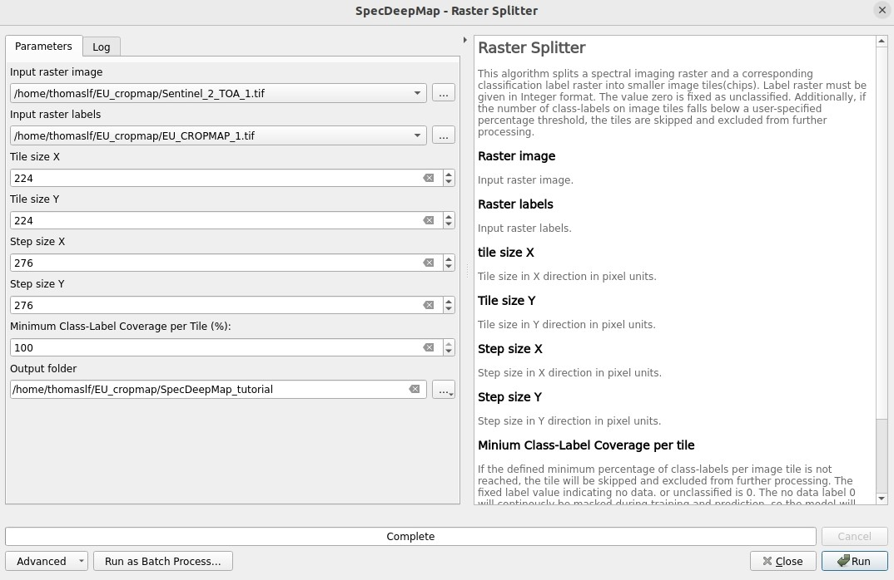
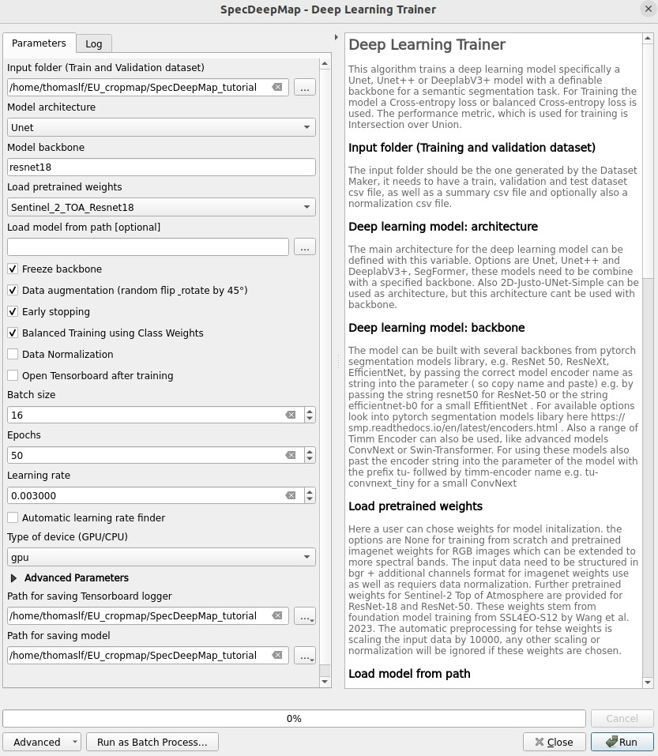
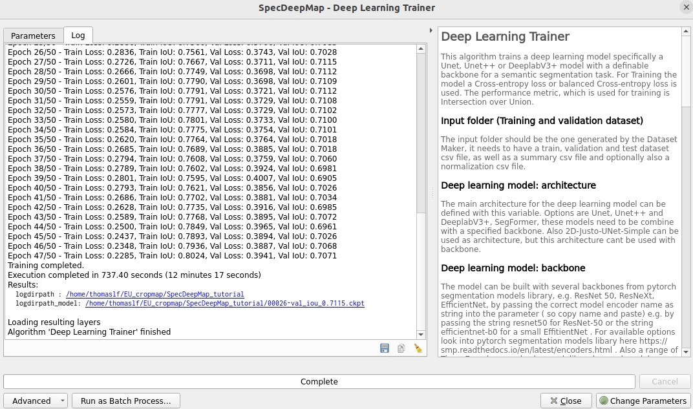

Spectral Imaging Deep Learning Mapper (SpecDeepMap): A Tutorial for Semantic Segmentation 
#########################################################################################

**Authors:** Leon-Friedrich Thomas

**Publication date:** 01/04/2025

This tutorial give an introduction to the Processing Algorithms of the Spectral Imaging Deep Learning Mapper (SpecDeepMap) application.
It is designed for EnMAP-Box 3.16 or higher. Minor changes may be present in subsequent versions, such as modified menu labels or added parameter options.

In this Tutorial we will fine-tune a pretrained Resnet18 backbone for Sentinel-2 Top of Atmosphere reflectance imagery with European Union Crop type Map (EUCROPMAP) labels for a semantic segmentation task.

Introduction to SpecDeepMap
===========================

* The SpecDeepMap applictaion consists of six QGIS processing algorithms and is designed for Semantic Segmentation tasks (pixel classification). With this application a user can train  deep-learning architectures U-Net, U-Net++, DeepLabV3+, and SegFormer with a variety of encoder backbones, such as ResNet-18 and -50, EfficientNet, MobileNet, ConvNext, and Swin-Transformer. SpecDeepMap is designed for multispectral and hyperspectral images and takes geospatial data characteristics into account. A highlight is the integration of the foundation model backbones ResNet-18 and ResNet-50 trained for Sentinel-2 Top of Atmosphere Reflectance Imagery.

    .. figure:: img/1_SpecDeepMap_Overview.png

SpecDeepMap Menu
****************

* Launch QGIS and click the enmapbox icon in the toolbar to open the EnMAP-Box. In the EnMAP-Box GUI you can find the SpecDeepMap application in the algorithms in the **EnMAP-Box Processing Algorithms**.

Download Example Data
*********************

* Download the imagery data and example label rasters from here:
Sentienl-2 TOA imagery: :download:`Sentinel-2 TOA imagery.
EUCropmap labels: :download:`EUCropmap labels.*

1. Raster Splitter
==================

The Raster Splitter split a spectral imagery raster and a corresponding label raster with the same size into smaller image and label chips.
Classification Label raster should be expressed in any numeric values in range 0-255. The value 0 is reserved for unclassified or no-data.
The software user can define the chip size in X and y direction by the parameter tile size X and tile size Y. And also a step size X and step size Y.
In this example we split the Sentienl-2TOA image and the EUCROPMAP labels into smaller chips.

* Use the following inputs:  Input raster image: Sentinel_2_TOA_1.tif and Input raster labels: EUCROPMAP_1.tif .

* Set tile size X to 224 and tile size Y to 224 and step size X to 275 and step size Y to 275, to avoid spatial autocorrelation of the chips.

* By the parameter : % of valid class labels we can define if we want only image chips with full label coverage or also partial covered label. In our case we use only fully covered labels chips so, set the parameter to 100.

* Create a new main folder for the output and call it SpecDeepMap_tutorial , chose the folder for the raster splitter output.*

* Run the algorithm with the given parameters this results in 2328 image and label chips. These are now stored in sub folder 'images' and 'labels' in the created folder 'SpecDeepMap_tutorial'.

2. Dataset Maker
================

The Dataset Maker takes the created folder as Input and generates a training, validation and test datatsets with similar class distributions in form of CSV files with stored relative file paths to the image chips.
As well as a summary CSV file which show class distribution per dataset as well as suitable class weights for balanced training.

* As Data folder use the created  SpecDeepMap_tutorial folder.
* A default class split is 80% training, 10% test and 10% validation. You can change this to a subset, if you have less computing power e.g. 10, 5, 5.

* As Output parameter also just use the SpecDeepMap_tutorial folder.

.. figure:: img/2_Dataset_Maker.jpeg

* Run the algorithm with the default split percentages of train images 80%, percentage of test image 10%, percentage of validation images 10%.

* After the algorithm run it displays all created CSV files in a window. If you feel like inspecting one you can click on it and it will be added to the file menus. Otherwise you can just close the window.
* Optionally if you want to later inspect a csv file e.g. the summary table in the enmapbox and load the 'Summary_train_val.csv' located in the SpecDeepMap_tutorial folder and open the attribute table.

.. figure:: img/2_Dataset_Maker_Output.jpeg

3. Deep Learning Trainer
========================

The Deep Learning Trainer algorithm,  trains a deep-learning model in a supervised manner for a semantic segmentation task. It offers flexibility by enabling the training of various architectures, like U-Net, U-Net++, DeeplabV3+, and SegFormer paired with diverse backbones such as ResNet-50. A list of natively supported backbones can be found at https://smp.readthedocs.io/en/latest/encoders.html. Moreover, approximately 500 backbones from Pytorch Image Model Library, also known as Timm, are available, such as ConvNext and Swin-Transformers. A complete list of available Timm Encoders backbones is provided here: https://smp.readthedocs.io/en/latest/encoders_timm.html . To use any of the timm encoders 'tu-' must be added before the model string name.

* As Input folder (Train and Validation dataset) use the SpecDeepMap_tutorial folder. By model architecture and backbone you can define possible model combinations. For this example leave the default values.
* Change the Load pretrained weights parameter to Sentinel_2_TOA_Resnet18 to load the pretrained weights for Sentinel-2 TOA imagery stemming from Wang et al 2023 (https://arxiv.org/abs/2211.07044).
* We will use the default parameter (freeze backbone, data augumentation, early stopping and balanced Training using class weights)

* As Batch size we use 16 and for Epochs 50. ( If you have less computational resources you can use als a batch size of 4 or 8 and only train for 5-8 epochs.
* As Learning rate we will use 0.003.
* As type of device use GPU if available and installed for the enmapbox python environment. Otherwise use CPU, you can also just reduce the epochs to 2 if you run it on CPU.

* As Path for saving tensorboard logger use the SpecDeepMap_tutorial folder.
* As Path for saving model use the SpecDeepMap_tutorial folder.

* Lest run the model. During training in the Logger Interface the progress of the training is printed after each epoch. (epoch means one loop through the training dataset). In the logger the train and validation loss is displayed, which should reduce during training and the train IoU and val IoU should increase.
* The model uses the training data for learning the weights and the validation data is just used to check if the model over or underfits. ( if train and validation values are very different)

* After training the logger displays the best model path for the best model. In general you want to use the model with the highest IoU score on the validation dataset. This is also written into the model file name, so you can find it later again at any time.
* Here a logger visualization of the training we just performed. In our case with GPU 47 epochs took around 12 min. 47 because of early stopping ( stops training if not val Iou doenst increase for 20 epochs).

4. Tensorboard visualizer (optional)
************************************

*If you want to inspect the model behavior in more detail after the trianing, you can use this algorithm and the logger location to open a Tensorboard, which is an interactive graphical environment to inspect model training behavior.

*

5. Deep Learning Tester
=======================

input test dataset csv

model checkpoint epoch 26 or yours with highet val iou. or load this checpoint here.

use device gpu or cpu

leave other default parameter

and create test_score.csv in the SpecDeepMap_tutorial folder.

If you load test_score.csv in enmapbox you can inspect the  iou score per class and mean on test dataset.

Mean Iou 0.56 in line with other foundation model fine tuning. Nice!

6. Deep learning Mapper
============================

this algo takes in the a whole ortomosai and extract with overlap image chips crops t and stiches it back to one entrie scense.
Easy employment and boundary effect correction.

if you have small compute use Sentienl-2_tiny and EU_CROPMAP_2_tiny . still need to make that crop !

interface

Input Sentinel-2 2 and eu crop map 2

model checkpoint 26

20 % overlap

define output prediction as Raster : EU_CROPMAP_2_prediction.tif in the SpecDeepMap_tutorial folder.
define output IoU CSV :EU_CROPMAP_2_score.csv in the SpecDeepMap_tutorial folder.

interface

run algo and here output

iou visualize

map visualize

.. Substitutions definitions - AVOID EDITING PAST THIS LINE
   This will be automatically updated by the find_set_subst.py script.
   If you need to create a new substitution manually,
   please add it also to the substitutions.txt file in the
   source folder.

.. |enmapbox| image:: /img/icons/enmapbox.png
   :width: 28px
.. |mActionDeleteSelected| image:: /img/icons/mActionDeleteSelected.svg
   :width: 28px
.. |mActionDeselectAll| image:: /img/icons/mActionDeselectAll.svg
   :width: 28px
.. |mActionInvertSelection| image:: /img/icons/mActionInvertSelection.svg
   :width: 28px
.. |mActionNewAttribute| image:: /img/icons/mActionNewAttribute.svg
   :width: 28px
.. |mActionSaveAllEdits| image:: /img/icons/mActionSaveAllEdits.svg
   :width: 28px
.. |mActionSaveEdits| image:: /img/icons/mActionSaveEdits.svg
   :width: 28px
.. |mActionSelectAll| image:: /img/icons/mActionSelectAll.svg
   :width: 28px
.. |mActionToggleEditing| image:: /img/icons/mActionToggleEditing.svg
   :width: 28px
.. |mSourceFields| image:: /img/icons/mSourceFields.svg
   :width: 28px
.. |plus_green_icon| image:: /img/icons/plus_green_icon.svg
   :width: 28px
.. |profile| image:: /img/icons/profile.svg
   :width: 28px
.. |profile_add_auto| image:: /img/icons/profile_add_auto.svg
   :width: 28px
.. |select_location| image:: /img/icons/select_location.svg
   :width: 28px
.. |speclib_add| image:: /img/icons/speclib_add.svg
   :width: 28px
.. |speclib_save| image:: /img/icons/speclib_save.svg
   :width: 28px
.. |viewlist_spectrumdock| image:: /img/icons/viewlist_spectrumdock.svg
   :width: 28px
