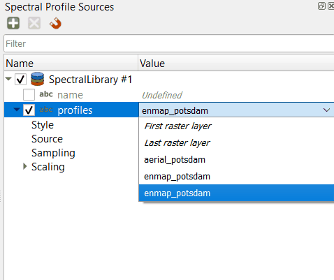

.. include:: /icon_links.rst

Spectral Libraries: An Introduction
###################################

**Author:** Klara Busse

**Publication date:** 09/04/2024

Getting Started
***************

Requirements
=============
This introduction is designed for EnMAP-Box 3, version 3.13.0 or higher. Minor changes may be present in subsequent versions, such as modified menu labels or added parameter options.

Start the EnMAP-Box
====================

* Launch QGIS and click the |enmapbox| icon in the toolbar to open the EnMAP-Box. The EnMAP-Box GUI comprises a **Menu** and a **Toolbar**, panels for **Data Sources** and **Data Views**, and the **QGIS Processing Toolbox**, which includes the **EnMAP-Box Processing Algorithms**.

    .. figure:: img/01_EnMap-Box_surface.png

        The EnMAP-Box main GUI.

Load the Example Data
=====================

For this introduction the Example Data of the EnMap-Box will be used.

* To load the Example Data, click on **Project** in the menu, then **Add Example Data**.
* If you never worked with the Example Data before, a window will appear and you have to download the test data to your explorer.
* After clicking **yes** you can save the data.

    .. figure:: img/02_add_expldt.gif

        Loading the EnMAP-Box example data.

* The example data will appear automatically in a new map window.
* Now, the example data is loaded and you can work with it.
* For clarity, close the map window by clicking on the (x) icon on the blue **Map #1** title bar. The data views panel will be empty afterwards.
* To load an (own) existing file, you can drag and drop the file from your explorer to the **Data Sources** panel.

Load a Spectral Library from the Example Data
=============================================

* Open the spectral library  :file:`EnMAP Spectral Response Function (224 Bands)` from the Example Data, using drag and drop:

    .. figure:: img/03_load_spec_lib.gif

        Opening a spectral library with EnMAP spectral response functions.

Import a Spectral Library
==========================

If you already have a spectral library you can directly import it from your data explorer.
Depending on your file format there are multiple possibilities to import a spectral library.
The following formats will be explained below:

* Geopackage
* ASD Field Spectrometer
* Raster Layer
* Using the Field Calculator

Geopackage & ASD Field Spectrometer
-----------------------------------

* To import a spectral library with the data format **Geopackage** or **ASD Field Spectrometer**, open a spectral library window |speclib|
* Click on |speclib_add| to open the **Import Spectral Profiles** window.

    .. figure:: img/import_a_speclib.gif

        The dialog to import spectral profiles into a spectral library.

* Choose the correct format and the directory.
* To import the columns of your choice, click on |mSourceFields| and select the columns.
* Click **OK**

Raster Layer
------------

* To import a **Raster Layer**, drag and drop your raster file into a new map window.
* Now, when you open the **Import Spectral Profiles** window and choose **Raster Layer**, the Raster File will automatically appear in the **Options**. If several Raster Layers are open, you can select one.
* To import the columns of your choice, click on |mSourceFields| and select the columns.
* Click **OK**

Field Calculator
----------------

* The field calculator helps to create spectral profiles for points, that have no spectral information.
* Open the :file:`enmap_potsdam` raster layer and the :file:`landcover_potsdam_point` layer in a new map window.
* Click on the :file:`landcover_potsdam_point` with the right mouse button and select **Open Spectral Library Viewer**. A new spectral library window opens. The points are in the attribute table, but not yet associated with any spectral information.

    .. figure:: img/field_calculator.gif

        Any vector layer can be opened in a Spectral Library View and edited with the QGIS Field Calculator.

* Open the Field Calculator and make the following settings to link the points to spectral profiles:

..

    * Create a new field
    * Set an output field name
    * Output field type: Text(string)
    * In the expression field write the command: raster_profile('enmap_potsdam') to connect the points to the spectral information.
    * Click **OK** and your profiles are visible in the attribute table now.

    .. figure:: img/calculator_settings.png

        EnMAP-Box functions to manage spectral profiles with the QGIS Field Calculator.

* To show the spectral profiles, click on **Update Profiles** on the left hand side of the toolbar.

Work with a Spectral Library
****************************
The following shows how to edit and export a spectral library

Instead of the *EnMAP Spectral Response* library from the EnMAP-Box example data you can also download the
:download:`speclib_potsdam.gpkg <speclib_potsdam.zip>` Library.

Basic Visualization Steps
===========================

* The spectral library viewer should look like this:

    .. figure:: img/04_spec_lib_window_explained.png

        Overview Spectral Library Viewer

* There are various functions in the **toolbar** that can be used to create, edit them and export a spectral library.
* The **spectral profiles window** shows the spectral profiles of the points, that are collected in the spectral library.
* The **attribute table** shows information for the different profiles.

..
* Let's have a closer look at the toolbar:

    .. image:: img/05_spec_lib_toolbar.png

* While being in the editing mode |mActionToggleEditing|, additional options are unlocked to modify your attribute table:

    .. image:: img/06_spec_lib_toolbar_more_options.png

* These are the tools you already know from the QGIS attribute table (`here is a link to the website  <https://docs.qgis.org/3.34/en/docs/user_manual/working_with_vector/attribute_table.html>`_)
* Some functions of the toolbar are shown below. There are multiple possibilities, to organize and edit the different profiles in the **Attribute Table**:

    .. figure:: img/07_functions_speclib_toolbar.gif

        Selecting spectral profiles from attribute table.

* Select every profile |mActionSelectAll|
* Deselect all profiles |mActionDeselectAll|
* You can highlight multiple profiles at once: Press the shift key and select 2 profiles - all profiles in between will also be selected.
* With |mActionInvertSelection| the opposite profiles can be highlighted.
* Delete selected profiles |mActionDeleteSelected|
* Save your changes |mActionSaveAllEdits| and turn off the toggle editing mode |mActionToggleEditing| afterwards.

Export the Spectral Library
============================
* To apply all changes, save the spectral profiles.
* The spectral profiles can be exported into different data formats (Geopackage, GeoJSON, ENVI spectral library).
* Click on the |speclib_save| symbol. The **Export Spectral Library** window will open.

    .. figure:: img/08_export_speclib.png

        Dialog to export spectral profiles into other formats.

* Choose between Geopackage, GeoJSON or ENVI spectral library.

    * Geopackage:
    * GeoJSON:
    * ENVI spectral library:

..
* Choose a file name and path and click **OK**

Create a Spectral Library
***********************************
This introduction shows you how to create a spectral library by your own.

Change the RGB Composite
============================
* Open the :file:`aerial_potsdam.tif`, by drag and drop. It will automatically be displayed in a new map window.
* To open the **Layer Properties**, click on the raster file in the **Data Views** panel with your right mousekey.
* Under **Symbology** you can change the RGB composite. Display :file:`aerial_potsdam.tif` as an RGB composite of your choice.

* For this example the following settings are used:

    .. csv-table::
       :delim: ;
       :widths: auto

        Red band; Band 4: Near-infrared
        Green band; Band 3: Red
        Blue band; Band 2: Green

Add Profiles to a Spectral Library
====================================

* Zoom into the tif and make yourself familiar with the image.
* In this introduction 5 points for each of the following classes will be collected:

  * Vegetation
  * Concrete
  * Water

..
* Search for areas with that kind of surface coverage.
* Next, click on |select_location| then on |profile|. When you choose a point in the image, a spectral library window will open and show you the spectral profiles of that point.
* By clicking on |plus_green_icon| you can save that point with its spectral information into your spectral library.
* For a clearer organization you can add columns to add information.

    .. figure:: img/09_add_profiles.gif

        Collecting and describing spectral profiles from image data.

* With |profile_add_auto| the spectral profiles can be collected automatically.

    .. figure:: img/10_add_profiles_automatically_aerial_potsdam.gif

        Automatic profile collection.

Spectral Profile Source Panel
=============================
* The **Spectral Profile Source** panel allows you to specify how spectral profiles are collected from the raster data and what profile metadata is included in Spectral Libraries.
* It allows you to define the new values for each column of a Spectral Library Vector Layer, that will be added when a new feature is added.
* If you select |select_location| and |profile|, the **Spectral Profiles Source** panel will open automatically when you click on a pixel in the map for the first time.
* To open the **Spectral Profiles Source** panel manually, click on **View** in the menu, select **Panels**, and then choose **Spectral Profiles Source**.

    .. figure:: img/spec_profiles_source_panel.png

        The Spectral Profile Source panel (right) specifies how profiles are collected, described
        and displayed when overlaid in a linked Spectral Library View.

* To add a new relation that describes raster image sources and spectral library vector fields click on |plus_green_icon|.

..

Let us first focus on defining how spectral profiles are collected:

* **Profiles** specifies how the profiles are stored in the Profiles field in the spectral library attribute table.
* You can specify the raster source from which the profile is sampled. Choose :file:`enmap_potsdam`.

    .. image:: img/spec_prof_pan_col.gif

* **Style** lets you specify how the sampled profiles are displayed when overlaid in the Spectral Library view.

    .. image:: img/spec_prof_pan_sampling.gif

* **Sample** can be used to define how the profiles are sampled around the mouse coordinate.

Now let's look at how other vector attributes are created:

* Make sure the first row is checked. Then you can write an expression for one of the columns in your spetral library.

    .. image:: img/oth_vec_attr.png

* Double Click to edit, or open the **Expression Builder** with ε
* With the **Expression Builder** you can design a field expression:

    .. image:: img/Expression_Builder.png

Change the Colours of the Spectra
=================================

* After collecting the points you can organize them by color, for a better separation.
* Go to the **Layer Properties** of your spectral library in the **Data Views** panel. With **Symbology** you can set the colors.

    .. figure:: img/11_symbology_colors.png

        The vector layer symbology panel defines the feature symbols...

* Choose **Categorized**, for **Value**, select the column according to which the classes are to be differentiated. Press **Classify**.
* You can change the colors by double-clicking on the color you want to change.
* Press **OK**. Now your spectra have different colors and your graph is more clear.

    .. figure:: img/12_spec_lib_new_colors.png

        ... whose colors can be used as profile color.

Export the Spectral Library and its Style
==========================================

* Export the spectral library |speclib_save| as *.gpkg and choose a file path and name.
* The style can be saved at symbology. Click on **Style**, then on **Save Style**. Select the file path and save the style.

    .. figure:: img/13_save_style.gif

        Saving a layer style into a *.qml file

* You can import your spectral library by dragging and dropping the file from your data explorer into the **Data Sources** panel.
* To import the style you have to open the spectral library in a **Spectral Library Window** or **Map Canvas** (drag and drop).
  Then go to **Layer Properties**, **Style** and click on **Load Style**. Choose the file directory to your saved style and **Load Style**.

    .. image:: img/14_export_speclib.png

* Two files are saved: the geopackage file contains the points with their spectral information, and the QML file contains all layer information.