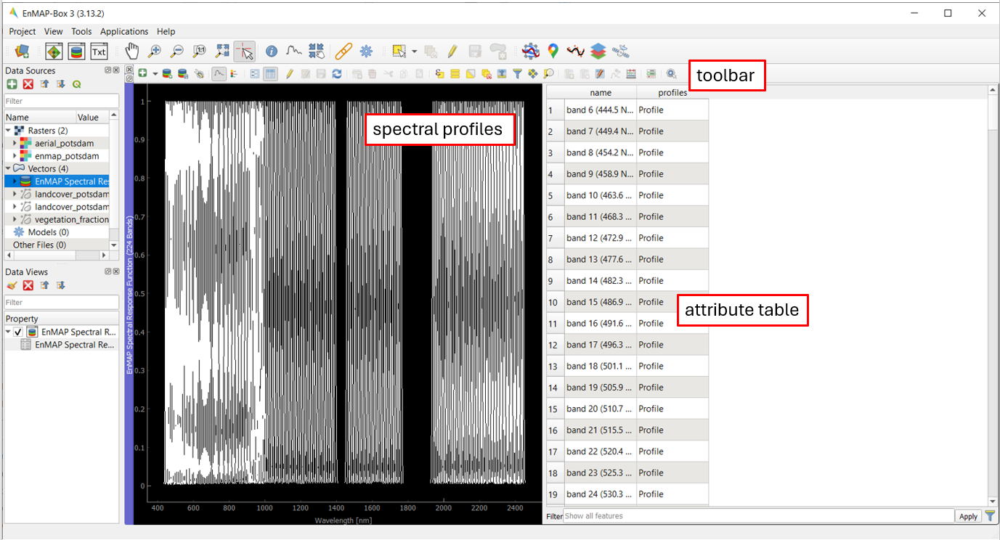

.. include:: /icon_links.rst

Work with a Spectral Library: An Introduction
#############################################

**Author:** Klara Busse, Akpona Okujeni

**Publication date:** 01/03/2024

Getting Started
***************

Requirements
============
This tutorial is designed for EnMAP-Box 3, version 3.13.0 or higher. Minor changes may be present in subsequent versions, such as modified menu labels or added parameter options.

Start the EnMAP-Box
==================

* Launch QGIS and click the |enmapbox| icon in the toolbar to open the EnMAP-Box. The EnMAP-Box GUI comprises a **Menu** and a **Toolbar**, panels for **Data Sources** and **Data Views**, and the **QGIS Processing Toolbox**, which includes the **EnMAP-Box geoalgorithms**.

.. image:: img/01_gui.png
   :width: 100%

Load the Example Data
==================

For this introduction the Example Data of the EnMap-Box will be used.

* To load the Example Data, click on **Project** in the menu, then **Add Example Data**.
* If you never worked with the Example Data before, a window will appear and you have to download the test data to your explorer.
* After clicking **yes** you can choose the directory and save the data.

* The example data will appear automatically in a new map window.
* Now, the example data is loaded and you can work with it.
* For clarity, close the map window by clicking on the (x) icon on the blue **Map #1** title bar. The data views panel will be empty afterwards.
* To load an (own) existing file, you can drag and drop the file from your explorer to the **Data Sources** panel.
* As the example data from the EnMap box will be used for this introduction, this step can be omitted.

Work with a Spectral Library
***********************************
This tutorial shows you how to load, edit and export a spectral library.

Load an Existing Spectral Library
=====================

* Open the spectral library  :file:`EnMAP Spectral Response Function (224 Bands)`, using drag and drop:

* The spectral library viewer should look like this:

* There are various functions in the **Toolbar** which you can create points for a spectral library with, edit them and export the spectral library.
* The **Spectral Profiles Window** shows the spectral profiles of the points, that are collected in the spectral library.
* The **Attribute Table** shows information for the different profiles.

Basic Visualization Steps
===========================
* Let's have a closer look at the toolbar:

* While being in the editing mode |mActionToggleEditing|, additional options are unlocked to modify your attribute table:

* Some functions of the toolbar are shown below. There are multiple possibilities, to organize and edit the different profiles in the **Attribute Table**:

* Select every profile |mActionSelectAll|
* Deselect all profiles |mActionDeselectAll|
* You can highlight multiple profiles at once: Press the shift key and select 2 profiles - all profiles in between will also be selected.
* With |mActionInvertSelection| the opposite profiles can be highlighted.
* Delete selected profiles |mActionDeleteSelected|
* Save your changes |mActionSaveAllEdits| and turn off the toggle editing mode |mActionToggleEditing| afterwards.

Export the Spectral Library
======================
* To apply all changes, save the spectral profiles.
* The spectral profiles can be exported into different data formats (Geopackage, GeoJSON, ENVI spectral library).
* Click on the |speclib_save| symbol. The **Export Spectral Library** window will open.

.. image:: img/08_export_speclib.png

* Choose between Geopackage, GeoJSON or ENVI spectral library.
    * Geopackage:
    * GeoJSON:
    * ENVI spectral library:
* Choose a file name and path and click **OK**

Create a Spectral Library
***********************************
This tutorial shows you how to create a spectral library by your own.

Change the RGB Composite
============================
* Open the :file:`aerial_potsdam.tif`, by drag and drop. It will automatically be displayed in a new map window.
* To open the **Layer Properties**, click on the raster file in the **Data Views** panel with your right mousekey.
* Under **Symbology** you can change the RGB composite. Display :file:`aerial_potsdam.tif` as an RGB composite of your choice.

  * For this example the following settings are used:

.. csv-table::
   :delim: ;
   :widths: auto

    Red band; Band 4: Near-infrared
    Green band; Band 3: Red
    Blue band; Band 2: Green

Add Profiles to a Spectral Library
==================================

* Zoom into the tif and make yourself familiar with the image.
* In this introduction 5 points for each of the following classes will be collected:

  * Vegetation
  * Concrete
  * Water

* Search for areas with that kind of surface coverage.
* Next, click on |select_location| then on |profile|. When you choose a point in the image, a spectral library window will open and show you the spectral profiles of that point.
* By clicking on |plus_green_icon| you can save that point with its spectral information into your spectral library.
* For a clearer organization you can add columns to add information.

.. image:: img/09_add_profiles.gif

* With |profile_add_auto| the spectral profiles can be collected automatically.

.. image:: img/10_add_profiles_automatically_aerial_potsdam.gif

Change the Colours of the Spectra
=================================

* After collecting the points you can organize them by color, for a better separation.
* Go to the **Layer Properties** of your spectral library in the **Data Views** panel. With **Symbology** you can set the colors.

* Choose **Categorized**, for **Value**, select the column according to which the classes are to be differentiated. Press **Classify**.
* You can change the colors by double-clicking on the color you want to change.
* Press **OK**. Now your spectra have different colors and your graph is more clear.

Export the Spectral Library and its Style
===============================

* Export the spectral library |speclib_save| and choose a file path and name.
* The style can be saved at symbology. Click on **Style**, then on **Save Style**. Select the file path and save the style.

* You can import your spectral library by dragging and dropping the file from your data explorer into the **Data Sources** panel.
* To import the style you have to open the spectral library in a new **Spectral Library Window** (drag and drop). Then go to **Layer Properties**, **Style** and click on **Load Style**. Choose the file directory to your saved style and **Load Style**.
