.. include:: /icon_links.rst

.. _tut_urban_unmixing:

=============================================
Regression-based unmixing of urban land cover
=============================================

**Authors:**  Akpona Okujeni, Sam Cooper, Patrick Hostert, Clemens Jaenicke, Benjamin Jakimow, Andreas Rabe, Fabian Thiel,
Sebastian van der Linden & Klara Busse

**Publication date:** 05/02/2019

**Latest update:** XX/XX/2023

Introduction
============

.. TODO Slide Collection Link once on EOC or directly link here

1. Background
-------------

.. image:: /img/hyperedu_logo.png
   :alt: hyperEDU logo
   :align: right
   :width: 30%

This tutorial is part of the `HYPERedu online learning platform <https://eo-college.org/resource-spectrum/hyperspectral/>`_,
an education initiative within the `EnMAP mission <https://www.enmap.org/>`_ hosted
on EO College. HYPERedu provides annotated slide collections and hands-on tutorials using the open-source EnMAP-Box software,
targeting basic principles, methods as well as applications of imaging spectroscopy.

Annotated slide collections for the tutorial *Regression-based unmixing of urban land cover* and a software description unit for the EnMAP-Box are provided here:

* `Slide collection <https://eo-college.org/resource/regression-based-unmixing-of-urban-land-cover/>`_
* `Software description <https://eo-college.org/resource/enmap-box/>`_

2. Content
----------

Land cover fraction mapping based on unmixing is well suited to describe the composition of surface
types in heterogeneous environments. Especially when using coarser spatial resolution satellite data
with a high share of mixed pixels, fraction mapping is more useful than a discrete classification. This,
for example, applies to the use of 30 m resolution imagery from the forthcoming spaceborne imaging
spectrometer mission EnMAP for urban mapping.

This tutorial focuses on regression-based unmixing of urban land cover using synthetically mixed
training data from spectral libraries. Hyperspectral images from the airborne HyMap and the
spaceborne EnMAP sensor (here simulated from HyMap), a corresponding spectral library, and
reference land cover information are used for different exercises within this tutorial. These aim at
providing both a theoretical background related to challenges in urban mapping and a hands-on
training for working with the EnMAP-Box.

3. Requirements
---------------

This tutorial requires at least version 3.6 of the EnMAP-Box 3.
There might be some minor changes for higher versions (e.g., changed menu labels, added parameter options, etc.).

4. Further Reading
------------------

We recommend [1]_ for a comprehensive overview on imaging spectroscopy of urban environments
and [2]_ & [3]_ for detailed introductions into the regression-based unmixing approach using synthetically
mixed training data from spectral libraries.

.. [1] van der Linden, et al. (2018). Imaging Spectroscopy of Urban Environments. Surveys in Geophysics, 1–18.
.. [2] Okujeni, A., et al. (2013). Support vector regression and synthetically mixed training data for quantifying urban land cover. Remote Sensing of Environment, 137, 184-197
.. [3] Okujeni, A., et al. (2017). Ensemble learning from synthetically mixed training data for quantifying urban land cover with support vector regression. IEEE Journal of Selected Topics in Applied Earth Observations and Remote Sensing, 10, 1640-1650

4. Data
-------

:download:`You can download the data here:`
https://box.hu-berlin.de/f/3c3f7b76d91b4bd2a688/?dl=1

The tutorial dataset contains an EnMAP-image (simulation) covering an area along the urban gradient of Berlin, Germany,
a second hyperspectral image at higher spatial resolution (HyMap, 3.6 m), a spectral library and detailed land cover
reference information.

.. csv-table::
   :header-rows: 1
   :delim: ;
   :widths: auto

   Data type; Filename; Description
   Raster; :file:`hymap_berlin.bsq`; Airborne hyperspectral data from the HyMap sensor with a spatial resolution of 3.6m, 111 bands and 346x3200 pixels (ENVI Standard Band Sequential ``bsq``)
   Raster; :file:`enmap_berlin.bsq`; Spaceborne hyperspectral data from the EnMAP sensor (here simulated from HyMAP) with a spatial resolution of 30m, 177 bands and 220x400 pixels (ENVI Standard Band Sequential ``bsq``)
   Spectral library; :file:`library_berlin.sli`; Urban spectral library with 75 pure surface materials categorized in a hierarchical class scheme. The Library was developed from the HyMap image and spectrally resampled to the EnMAP sensor (ENVI spectral library ``sli`` with metadata extensions ``csv`` & ``json``)
   Vector; :file:`landcover_berlin.shp`; Detailed land cover reference information categorized in a hierarchical class scheme (ESRI Shapefile ``shp`` with QGIS layer style file ``qml`` and metadata extension ``json``)

.. .. image:: tut_img/data_table.png

The tutorial dataset is a subset extracted from the Berlin-Urban-Gradient dataset [4]_.
Please cite the dataset as follows:

.. [4] Okujeni, Akpona; van der Linden, Sebastian; Hostert, Patrick (2016): Berlin-Urban-Gradient dataset 2009 -
       An EnMAP Preparatory Flight Campaign (Datasets). V. 1.2. GFZ Data Services. https://doi.org/10.5880/enmap.2016.008

|

Exercise A: Urban land cover
============================

.. admonition:: Description

   Airborne imaging spectroscopy data is well suited for urban mapping. The high spectral and spatial resolution
   enhances the separability of surface types and preserves the spatial detail of many urban features. This exercise…

   * provides an insight into how urban areas are depicted by airborne hyperspectral images and introduces a hierarchical
     classification scheme commonly adopted for urban mapping
   * introduces basic functionalities of the EnMAP-Box. You will get to know the graphical user interface, and
     you will learn how to load data, visualize raster and vector data, and use the basic navigation tools

   Duration: 15 min

1. Start the EnMAP-Box
----------------------

* Start QGIS and click the |enmapbox| icon in the toolbar to open the EnMAP-Box. The GUI of the EnMAP-Box consists of a **Menu**
  and a **Toolbar**, panels for **Data Sources** and **Data Views**, and the **QGIS Processing Toolbox** including the **EnMAP-Box geoalgorithms**.

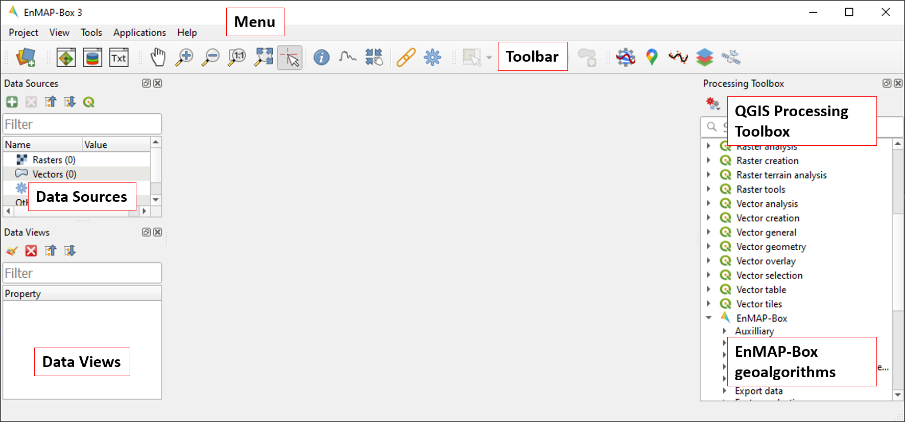

2. Load data
------------

* The EnMAP-Box offers simple drag & drop capabilities to load data from an external explorer.
  Drag the following datasets from your explorer into the :guilabel:`Data Sources` panel:

  * Raster: :file:`hymap_berlin.bsq`, :file:`enmap_berlin.bsq`
  * Vector: :file:`landcover_berlin.shp`
  * Spectral library: :file:`library_berlin.sli`

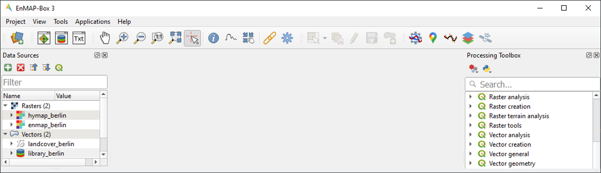

3. Visualize raster and vector data
-----------------------------------

* The EnMAP-Box offers **Map Windows (Map #)** for visualizing raster and vector data. Click the |viewlist_mapdock| icon
  and drag the following datasets from the :guilabel:`Data Sources` panel into Map #1:

   * :file:`hymap_berlin.bsq`
   * :file:`landcover_berlin.shp`

* Map #1 now appears in the :guilabel:`Data Views` panel, where the visibility, order and properties of datasets can be modified. Unfold Map #1:

  * To change the order of stacked layers, drag one layer on top or below another one. Arrange the layer stack so that
    :file:`landcover_berlin.shp` is displayed on top of :file:`hymap_berlin.bsq`.
  * To assign a multibandcolor RGB combination to a raster image, right click on the dataset, select :guilabel:`Layer Properties` and
    navigate to :guilabel:`Symbology`. Now select your bands using the dropdown lists.
    Display :file:`hymap_berlin.bsq` as true color composite, by selecting R-G-B.

.. csv-table::
   :delim: ;
   :widths: auto

   Red; Band 15 (0.660900 Micrometers)
   Green; Band 9 (0.573100 Micrometers)
   Blue; Band 3 (0.484300 Micrometers)

..

 * You can also specify things like contrast enhancement and data stretch under :menuselection:`Symbology --> Layer Rendering`.
 * The symbology of :file:`landcover_berlin.shp` is predefined by a QGIS layer style file (:file:`.qml`). To change this symbology,
   right click on the vector layer, select :guilabel:`Layer Properties` and navigate to :guilabel:`Symbology` in the :guilabel:`LayerProperties` window.
   You can now change the symbology in accordance to the QGIS functionality. Use the :guilabel:`Column` and :guilabel:`Classify` options to explore the
   information content of the attribute table :file:`landcover_berlin.shp`.

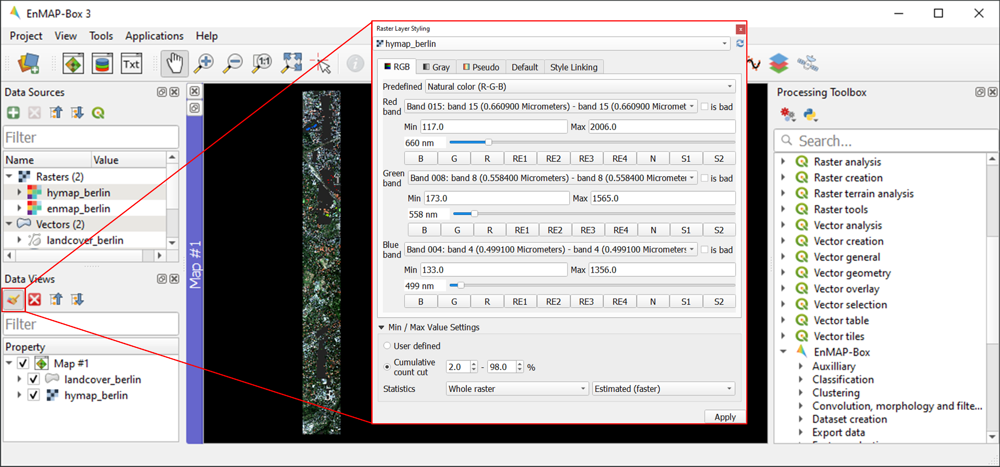

4. Basic navigation tools
=========================

* The Toolbar offers common navigation tools for exploring visualized datasets. Make yourself familiar with the
  following navigation tools: |navtools|
* Note that the mouse wheel can be used alternatively for zooming
  (roll mouse wheel forward/backward) and panning (press and hold mouse wheel).
* For a better orientation when exploring visualized raster images, you may switch on the crosshairs (right click into
  Map View and activate :menuselection:`Crosshair --> Show`.
* Make yourself familiar with the |cursorlocationinfo| icon on the toolbar to view pixel values of the displayed raster.
  Note: |select_location| :sup:`Identify Cursor Info` must be activated to access this tool. When activated and used, a new
  Cursor Location Values window will open displaying data from the selected pixel. This tool similarly works for
  viewing attribute information of displayed vector data.

Exercise B: Spectral mixing
===========================

.. admonition:: Description

   Forthcoming spaceborne imaging spectroscopy missions create new opportunities for global urban mapping. However,
   the step to satellite observations brings with it coarser spatial resolution, resulting in a loss in spatial detail and
   an increase in the number of mixed pixels. This exercise…

   * provides an insight into how urban areas will be depicted by spaceborne hyperspectral images and illustrates
     challenges related to spectral mixing when using such data for urban mapping
   * introduces additional basic functionalities of the EnMAP-Box. You will learn how to work with multiple map views,
     and how to visualize image spectra using Spectral Library Windows

   Duration: 15 min

1. Multiple map views
---------------------

* Close Map #1 from the previous exercise by using the |closemapview| icon on the blue Map #1 title bar.
* The EnMAP-Box enables users to work with multiple Map Windows, which can be flexibly organized and geospatially linked.
  Open two new Map Windows. For horizontal arrangement, click and hold on the blue Map #2 title bar and drag it to the
  right edge of Map #1. A transparent blue rectangle appears indicating the docking position once you stop holding the mouse button.

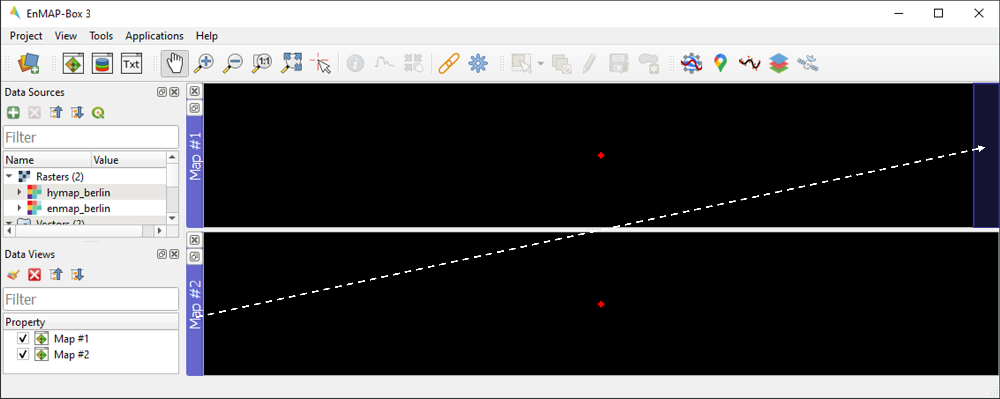

* Display :file:`hymap_berlin.bsq` and :file:`enmap_berlin.bsq` as RGB composite of your choice in Map #1 and Map #2, respectively.
* For geospatial linking, click on :guilabel:`View` in the Menu and select :guilabel:`Set Map Linking`. In the :guilabel:`Map Linking`
  window, select the |link_all_mapscale_center| :sup:`Link Map Scale and Center` option and close the dialog.

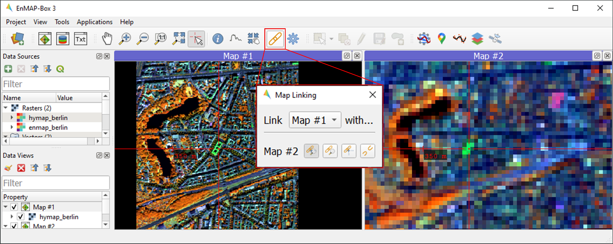

2. Visualize image spectra
--------------------------

* The EnMAP-Box offers **Spectral Library Windows (SpectralLibrary #)** for visualizing spectra and handling their
  metadata. To visualize image spectra, activate the **Identify** tool together with the **Identify raster profiles**
  |identifytools| option. Click on an image pixel. SpectralLibrary #1 opens automatically displaying the respective
  pixel spectrum (green line). The plotted spectrum always refers to the top-most raster layer of the respective Map
  Window you click on (unless you change this in the :ref:`Spectral Profile Sources <spectral_profile_sources>` panel).

* Make yourself familiar with the following tools in the Spectral Library #1 toolbar:

  * The |plus_green| icon adds a plotted spectrum to a collection. Each collected spectrum (white line) gets an entry in the attribute table with a predefined name (filename and id).
  * By clicking |mIconCollapse| next to the |plus_green| icon you can activate the |profile_add_auto| :sup:`Add Profiles automatically` mode, which will automatically add spectra to the collection when clicking on image pixels.
  * The |mActionToggleEditing| icon switches on the editing mode. You can now edit the attribute table (e.g. edit the name of a spectrum), add or delete colums using the |mActionNewAttribute| |mActionDeleteAttribute| icons, etc.
  * You can delete selected spectra in editing mode using the |mActionDeleteSelected| icon (hold :kbd:`Ctrl` or :kbd:`Shift` to select multiple rows).
  * The |speclib_save| icon saves a spectrum or a collection of spectra as a spectral library. Further information on spectral libraries and library formats will follow in Exercise C.

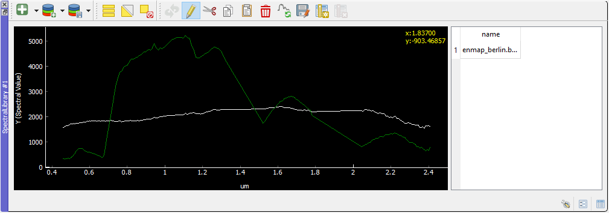

.. admonition:: Learning activities

   * **B1**: Visually compare the airborne and spaceborne hyperspectral images (:file:`hymap_berlin.bsq`, :file:`enmap_berlin.bsq`). How much of the spatial detail is lost when stepping from airborne to spaceborne scale?

     .. raw:: html

        

 
 click to expand... 

        
The spatial detail of most urban features (e.g., buildings, streets, trees along streets or in private gardens)
        disappears due to spatial aggregation at spaceborne scale. However, large homogenous urban features (e.g., waterbodies, sport grounds, tree stand in parks) remain apparent.

        

         

   * **B2**: Provide an average estimate on the percentage of pixels covered by 1, 2, 3, and 4 or more land cover classes for both images. Use level 3 of the classification scheme for your estimate. You may use the reference land cover information (:file:`landcover_berlin.shp`) for orientation.

     .. raw:: html

        

 
 click to expand... 

        
        

         

   * **B3**: Compare pairs of spectra from the airborne and spaceborne hyperspectral images (:file:`hymap_berlin.bsq`, :file:`enmap_berlin.bsq`). For which urban surface materials is it still possible to collect pure spectra at spaceborne scale, and for which not?

     .. raw:: html

        

 
 click to expand... 

        
Pure spectra can be collected for homogenous urban surfaces with a patch size of ~100 x 100 m
        and larger (e.g., roofing material spectra for large industrial buildings, ground paving material spectra for yards
        of industrial complexes, grass spectra on lawns or soccer fields, tree spectra in dense stands, water spectra from water bodies).
        Pure spectra cannot be collected for urban surfaces with a patch size below ~100 x 100 m (i.e., for most roofing materials, street asphalt, street trees).

        

         

|

Exercise C: Urban spectral libraries
====================================

.. admonition:: Description

   Urban spectral libraries are collections of pure surface spectra (endmembers) representing the spectral diversity
   and variability of urban land cover types at high spectral resolution. Library spectra are commonly based on laboratory, field, or image data,
   and are well suited for library-based mapping approaches such as unmixing. This exercise…

   * provides an insight into the design of urban spectral libraries and illustrates challenges related to within-class
     variability and between-class similarity during urban mapping
   * targets the handling of spectral libraries in the EnMAP-Box. You will get to know the spectral library format used in the EnMAP-Box,
     and learn how to load and visualize external urban spectral libraries and associated metadata

   Duration: 15 min

1. Labeled spectral libraries
-----------------------------

* The EnMAP-Box makes use of labeled spectral libraries, which extend the standard ENVI Spectral Library (SLI) and associated header (HDR) by additional attribute information, e.g., class labels, class colors, description, etc. This information is stored in an ASCII Comma Separated Value (CSV) file and in a JavaScript Object Notation (JSON) file. The CSV file includes an attribute table for each library spectrum (the column ‘spectra names’ links the CSV with the HDR). The JSON file contains the unique attributes of given attribute columns.
* Open the :file:`library_berlin.hdr`, :file:`library_berlin.csv`, and :file:`library_berlin.json` files with a text editor and get familiar with the spectral library format used in the EnMAP-Box and the hierarchical classification scheme stored in the attribute information.

2. Spectral library handling
----------------------------

* Close all Map and Spectral Library Windows from the previous exercise.
* To load the urban spectral library, click on the |viewlist_spectrumdock| icon to open a new Spectral Library Window and drag :file:`library_berlin.sli` from the :guilabel:`Data Sources` panel into SpectralLibrary #1. Get familiar with the representation of the spectral library and the attribute table.
* By default, only 64 spectra will be displayed at once in the plot window. To change this number, right-click in the plot
  area, go to :menuselection:`Others --> Max. Profiles` and enter a higher number, e.g. ``75`` (total number of spectra in :file:`library_berlin.sli`)
* To display a subset of spectra in a separate Library Window…

  * Select the spectra of interest by clicking on their corresponding row numbers (use :kbd:`Ctrl` or :kbd:`Shift` to select multiple rows). To select spectra with the same attributes, prior sorting of the attribute table by clicking on the corresponding column header is recommended. You can also select the spectra directly in the plot window.
  * Click on the |mActionEditCopy| icon in the toolbar (or :kbd:`Ctrl+C`) to copy the selected spectra to clipboard.
  * Open a second Spectra Library Window. Similar to the work with multiple Map Windows, Spectral Library Windows can be arranged according to the user needs.
  * Switch on the editing mode |mActionToggleEditing| in the SpectralLibrary #2 toolbar and use the |mActionEditPaste| icon (or :kbd:`Ctrl+V`) to paste the copied spectra into SpectralLibrary #2. Switch off the editing mode.

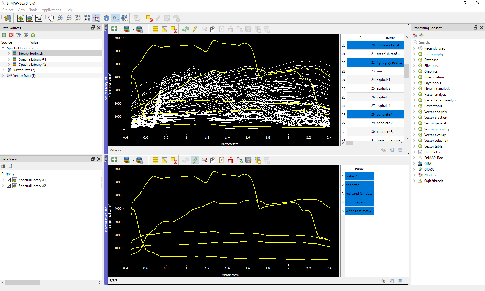

.. admonition:: Learning activities

   * **C1**: Load the urban spectral library (:file:`library_berlin.sli`) and display each level 3 class in a separate Spectral Library Window. How diverse is each class with regard to within-class variability?

     .. raw:: html

        

 
 click to expand... 

        
        
The roof class shows a very high within-class variability. The classes pavement, low vegetation,
        and tree show a high within-class variability. The classes soil and water show a rather low within-class variability.

        

         

   * **C2**: List classes which show a high between-class similarity and provide an explanation.

     .. raw:: html

        

 
 click to expand... 

        
The classes roof and pavement are highly similar with regard to the following surface materials:
        bitumen vs. asphalt, red clay tiles vs. red sand, grey roofing materials (most likely concrete) vs concrete. The classes
        roof and soil are highly similar with regard to the following surface materials: concrete vs. bare soil, red clay tiles vs.
        bare soil. The classes low vegetation and tree are highly similar regarding the following vegetation types: darker grass types
        (clover, agricultural grassland) vs. brighter trees.

        

         

|

Exercise D: Regression-based unmixing
=====================================

.. admonition:: Description

   To utilize data from forthcoming spaceborne imaging spectrometer missions for mapping the land cover composition of urban areas,
   unmixing is more useful than a discrete classification. This exercise…

   * introduces a regression-based unmixing approach for land cover fraction mapping. The approach successfully copes with
     spectral diversity, variably and mixing, and makes use of synthetic mixtures from spectral libraries for regression model training
   * demonstrates the work with the ‘Regression-based unmixing (synthMix)’ application of the EnMAP-Box

   Duration: 30 min

1. Introduction
---------------

The training of regression models with synthetically mixed data from spectral libraries for land cover fraction mapping is
implemented as the **Regression-based unmixing (synthMix)** application in the EnMAP-Box 3. The workflow of the unmixing approach comprises the following steps:

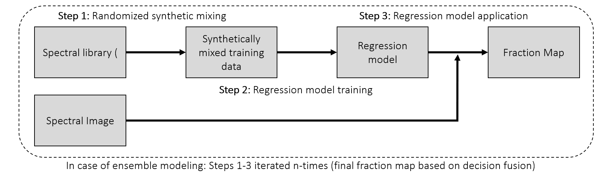

**Step 1**: An endmember library with associated class labels is used to randomly create a synthetically mixed dataset, i.e., pairs of mixed spectra and mixing fractions, for each class.

**Step 2**: The synthetically mixed dataset is used to train a regression model for each class.

**Step 3**: The regression model is applied to an image to derive a fraction map for each class.

The approach can be embedded into an ensemble framework, i.e., steps 1-3 are iterated n-times and the final fraction map for each class is created by combining the intermediate maps. The ensemble modeling allows the inclusion of a multitude of different types of synthetic mixtures into the unmixing process while keeping the training sample size low.

2. Start the application
------------------------

* Click on :guilabel:`Applications` in the Menu and select :guilabel:`Regression-based unmixing (synthMix)`. The graphical widget of the **Regression-based unmixing (synthMix)**
  consists of sections for specifying :guilabel:`Inputs`, for target :guilabel:`Class Selection`, for setting :guilabel:`Mixing Parameters`,
  for selecting the :guilabel:`Regression Algorithm`, and for specifying the :guilabel:`Outputs`.

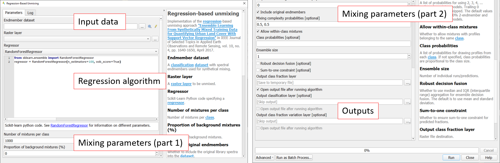

3. Inputs and class selection
-----------------------------

* The specification of input data is the start of the unmixing process. This includes an :guilabel:`Endmember Library` with associated class labels
  (see Exercise 3), where the :guilabel:`Class Attribute` drop menu specifies the attribute column associated with the class labels, and the :guilabel:`Spectral Image` to unmix.
* Select / specify the following inputs:

  * :guilabel:`Endmember Library`: :file:`library_berlin.sli`
  * :guilabel:`Class Attribute`: level_1
  * :guilabel:`Spectral Image`: :file:`enmap_berlin.bsq`

* The selection of the classes of interest, i.e., :guilabel:`Target Classes`, is the next step of the unmixing process. Synthetically
  mixed data, regression models, and fraction maps are only created for target classes. Spectra of excluded classes are still
  used as background signatures in the synthetic mixing process.
* Select the following :guilabel:`Target Classes`: impervious, vegetation, soil, water (all level 1 classes)

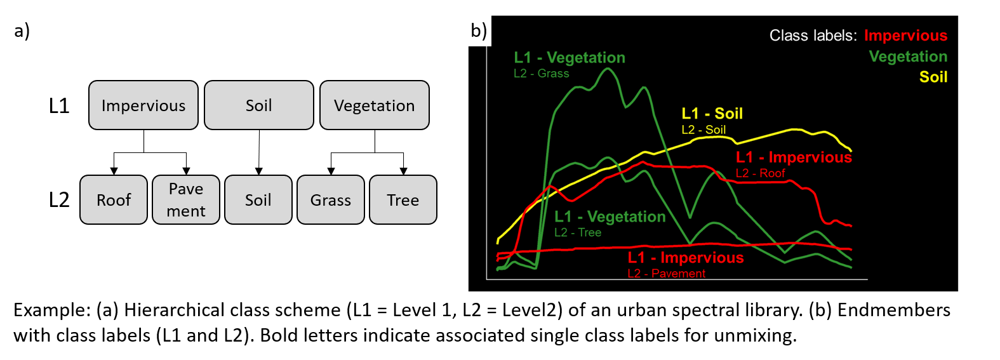

4. Mixing parameters
--------------------

* The mixing parameters steer the process of generating the synthetically mixed data from the endmember library. The :guilabel:`Number of Synthetic Mixtures per Class`
  specifies the total number of mixtures per class to be created. The check option to |cb1| :guilabel:`Include Original Library Endmembers`
  allows to append the endmember library to the synthetically mixed data, with fractions of either 0% or 100% of a respective target class.

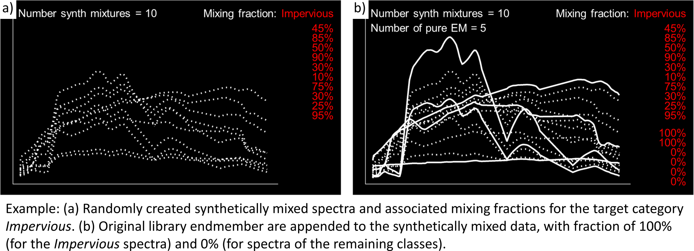

* The synthetic mixing process itself is randomized. That is, to generate a synthetic mixture…

  * … a mixing complexity is randomly assigned. The mixing complexity defines the number of endmembers contributing to a mixture (e.g., 2EM, 3EM).
    The random selection is steered by user-defined :guilabel:`Mixing Complexity Probabilities` (e.g., 2EM=0.6, 3EM=0.4 means that there is a 60%
    likelihood that the mixture is made up of two endmembers and a 40% likelihood that the mixture is made up of three endmembers).
    The implementation allows the definition of probabilities for 2EM, 3EM and 4EM. Note that probabilities must sum up to 1.
  * … endmembers are randomly drawn from the library. The number of endmembers is based on the previously assigned mixing complexity.
    The first endmember is always drawn from the target class. The following endmembers are drawn based on :guilabel:`Class Probabilities`,
    which are either proportional (class proportions within the library) or equalized (all classes with the same likelihood).
    The |cb1| :guilabel:`Allow Within-Class Mixtures` check option allows the user to decide whether multiple endmembers of the same class can be drawn to create a mixture.
  * … random mixing fractions between 0 and 1 (0-100%) are randomly assigned to the previously drawn endmembers. The total sum of fractions is always 1 (100%).
  * … endmembers are linearly mixed based on the mixing fractions to create the mixture.

.. todo delete old images from repo

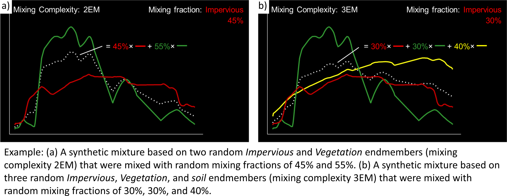

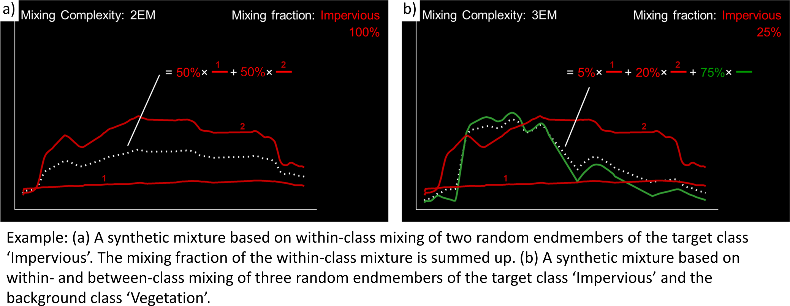

* Select the following mixing parameters:

  * :guilabel:`Number of Synthetic Mixtures per Class`: ``1000`` (default)
  * :guilabel:`Include Original Library Endmembers`: Yes (default)
  * :guilabel:`Mixing Complexity Probabilities`: 2EM= ``0.4``, 3EM= ``0.4``, 4EM= ``0.2``
  * :guilabel:`Allow Within-Class Mixtures`: Yes (default)
  * :guilabel:`Class Probabilities`: Proportional (default)

5. Regression Algorithm
-----------------------

* The selection of the regression algorithm and the setting up of the ensemble are the next steps in the unmixing process. The EnMAP-Box makes
  use of the scikit-learn library (see https://scikit-learn.org/stable/index.html) to implement several state-of-the-art algorithms offered in the :guilabel:`Regressor`
  drop menu. Note that the different algorithms lead to varying accuracies and processing times,
  particularly when embedding the unmixing process into an ensemble. To do so, activate |cb1| :guilabel:`Use Ensemble` and set the :guilabel:`Ensemble Size`.

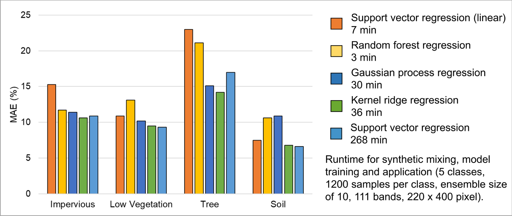

* Select the following regression settings:

  * :guilabel:`Regressor`: RandomForestRegression (default, due to the low processing time)
  * :guilabel:`Use Ensemble`: Yes (default), :guilabel:`Ensemble Size`: ``3`` (default)

6. Outputs
----------

* The specification of the outputs is the final step in the unmixing process. By default, the final fraction map is the only output:

  * :guilabel:`Folder`: Specifies the output folder where results are saved.
  * :guilabel:`Name`: Specifies the base name of the final fraction map. We add the suffix ‘_mean’ to this file as the default ensemble decision fusion is based on averaging.

* The advanced options allow user to save additional files created during the unmixing process, and to derive additional maps from the final fraction map.

  * :guilabel:`Decision Fusion (Ensemble)`: Selection of different statistics to evaluate the ensemble output. The following statistics are implemented: mean (default, suffix ‘_mean’), median (suffix ‘_median’), inter quartile range (suffix ‘_iqr’), and standard deviation (suffix ‘_std’).
  * :guilabel:`Save`: Check to save Training Samples, Predictions, and Models. These outputs will be stored for each class and with a suffix ‘_run’ for each ensemble iteration in separate subfolders.
  * :guilabel:`Create Class Fraction RGB`: Check to create a RGB class representation of the final fraction map. The RGB color of a specific pixel is the weighted mean value of the original class colors, where the weights are given by the corresponding class fractions.
  * :guilabel:`Derive Classification from Fraction Map`: Check to derive a discrete classification map from the final fraction map. The winner class per pixel corresponds to the maximum class fraction.

* Specify the following outputs (and skip the advanced options):

  * :guilabel:`Folder`: *path to your working folder*
  * :guilabel:`Name`: :file:`fraction_level1_estimation.bsq`

7. Run the application
----------------------

* Click on the |action| button to run the application. The outputs appear in the Data Sources panel.

8. Visualize the urban land cover fraction map
----------------------------------------------

* Display the newly created :file:`fraction_level1_estimation.bsq`. The file consists of 4 bands, where each band represents a fraction map of the defined target classes. Display the fraction map in a useful render style and appropriate contrast stretch:

  * e.g., as **multibandcolor** RGB composite of three target classes in a single Map Window. For stretching fraction maps to the full range of possible fraction, set :guilabel:`Min` = 0 and :guilabel:`Max` = 1.
  * e.g., as **singlegray** image per target class in multiple Map Windows. For stretching fraction maps to the full range of possible fraction, set :guilabel:`Min` = 0 and :guilabel:`Max` = 1.

* Visually explore your fraction map. You may open :file:`enmap_berlin.bsq` in a separate Map Window for comparison. You may use the **Identify** tool together with the **Identify cursor location values option to display fraction values** |identifytools2| of pixels.

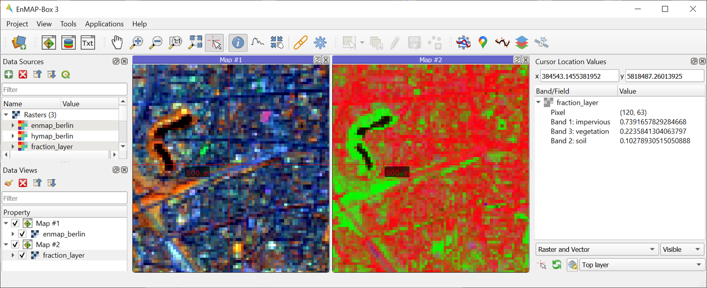

.. admonition:: Learning activities

   * **D1**: Visually explore the fraction map (:file:`fraction_level1_estimation.bsq`). How are level 1 land cover distributed across the urban gradient. Are the fraction values physically plausible?

     .. raw:: html

        

 
 click to expand... 

        
High impervious fractions can be observed in the city center. A general increase in vegetation
        cover and decrease in impervious cover is observed when moving towards suburban areas. Soil is only abundant on single patches,
        e.g., along rail tracks or on construction sites. Fractions for each class are in the physically meaningful range between 0 and 1.
        The sum of fractions per pixel over all classes is, however, often larger than 1.

        

         

   * **D2**: Do you observe an over- or underestimation of fractions for specific land cover types indicating errors in map?

     .. raw:: html

        

 
 click to expand... 

        
Soil fractions are overestimated by around 20%, particularly for areas where red clay tiles /
        bitumen / asphalt mixtures are apparent but no soil surfaces. Water fractions are overestimated by around 20%
        throughout the city on all impervious surfaces.

        

         

|

Exercise E: Validation of fraction maps
=======================================

.. admonition:: Description

   Validation of fraction maps is commonly conducted by comparison of estimated and reference fractions using scatterplots and statistical measures (e.g., mean absolute error, root mean squared error, R², slope and intercept of a linear fitted regression model). This exercise……

   * illustrates the validation procedure for fraction maps
   * introduces EnMAP-Box geoalgorithms for producing reference fractions from high resolution land cover information and for statistical accuracy assessment of fraction maps.

   Duration: 15 min

1. Create reference fraction map
--------------------------------

* A reference fraction map is created by rasterizing available reference land cover information to the pixel grid of the estimated fraction map. To obtain reasonable fractions, the reference land cover information needs to be at a significantly higher spatial resolution than the pixel grid. To create reference fractions, use the following processing algorithm :menuselection:`Create Raster --> Fraction from Vector`.
* Enter the following data / parameters (use the tool tips for their description):

  * :guilabel:`Pixel Grid`: :file:`fraction_level1_estimation.bsq`
  * :guilabel:`Vector`: :file:`berlin_landcover.shp`
  * :guilabel:`Class id attribute`: level_1_id
  * :guilabel:`Minimal overall coverage`: 0.95
  * :guilabel:`Oversampling factor`: 5
  * :guilabel:`Output fraction`: :file:`{...path to your working folder...}/fraction_level1_reference.bsq`

* Run the process.

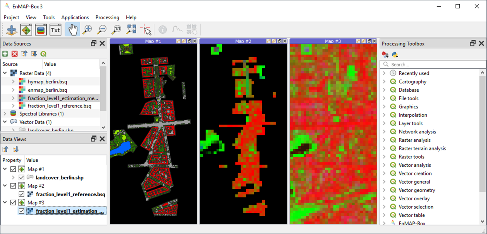

2. Statistical validation of fraction maps
------------------------------------------

* The **Regression Performance** algorithm in the **Accuracy Assessment** tools of the EnMAP-Box geoalgorithms implements the accuracy assessment for quantitative data. Scatterplots and statistical measures are reported in an HTML report. Run the **Regression Performance** algorithm with the following inputs:

  * :guilabel:`Prediction`: :file:`fraction_level1_estimation.bsq`
  * :guilabel:`Reference`: :file:`berlin_level1_reference.bsq`

* Make yourself familiar with the HTML report.

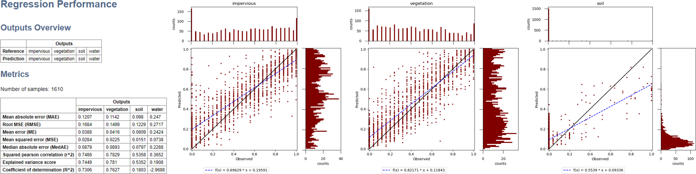

.. admonition:: Learning activities

   * **E1**: Visually compare your estimated fraction map (:file:`fraction_level1_estimation.bsq`) with the reference fraction map (:file:`berlin_level1_reference.bsq`). Do both maps show a good agreement in terms of spatial patterns or are there areas with large differences?
   * **E2**: Discuss the accuracy of your fraction map. What are the accuracies for the different classes and which classes show striking errors like underestimation or overestimations of fractions?

|

Additional Exercises
====================

.. admonition:: Additional learning activities

   * **AE1**: Repeat Exercises D & E using the two other class schemes (level 2, level 3) stored in the spectral library metadata and the land cover reference information. How do the accuracies vary and where are the limitations in mapping the more detailed class levels?
   * **AE2**: Explore the effects of changing the mixing parameters on the mapping accuracy of the level 2 classes. For more direct comparison, we recommend to alter only one parameter at a time. We further recommend to use the Random Forest Regression due to the low processing time. For example, …

     * change the **Number of Synthetic Mixtures per Class**: e.g. 10 vs. 1000 vs. 2000
     * do not **Include Original Library Endmembers**
     * change the **Mixing Complexity Probabilities**: e.g. only 2EM vs. only 3EM vs. only 4EM
     * change the **Ensemble Size**: e.g. 1 vs. 10 vs. 20

   * **AE3**: Compare the performance of the different regression algorithms offered in the EnMAP-Box. Please note that the other regressors have significantly longer processing times.

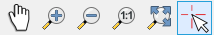

.. |identifytools2| image:: tut_img/identify_tools2.png
   :height: 27px