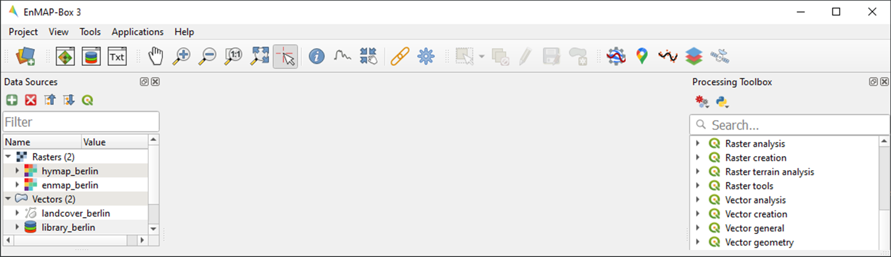

.. _tut_urban_unmixing:

=============================================
Regression-based unmixing of urban land cover
=============================================

**Authors:**  Akpona Okujeni, Patrick Hostert, Benjamin Jakimow, Andreas Janz, Fabian Thiel, & Sebastian van der Linden

**Contributors:** Klara Busse, Sam Cooper, Clemens Jaenicke

**Publication date:** 05/02/2019

**Latest update:** 23/01/2024

Introduction
============

.. TODO Slide Collection Link once on EOC or directly link here

1. Background
-------------

.. image:: /img/hyperedu_logo.png
   :alt: hyperEDU logo
   :align: right
   :width: 30%

This tutorial is featured on the `HYPERedu online learning platform <https://eo-college.org/resource-spectrum/hyperspectral/>`_, an educational initiative under the `EnMAP mission <https://www.enmap.org/>`_ hosted on EO College. HYPERedu offers annotated slide collections and hands-on tutorials utilizing the open-source EnMAP-Box software, covering fundamental principles, methods, and applications of imaging spectroscopy.

Slide collections with annotations for the tutorial *Regression-based unmixing of urban land cover* and a software description unit for the EnMAP-Box can be found here:

* `Tutorial slides <https://eo-college.org/resource/regression-based-unmixing-of-urban-land-cover/>`_
* `EnMAP software description <https://eo-college.org/resource/enmap-box/>`_

In addition to this tutorial, the unit *Imaging spectroscopy for urban mapping* offers an introduction to the capabilities of imaging spectroscopy for urban mapping.

* `Urban mapping unit <https://eo-college.org/resource/imaging-spectroscopy-for-urban-mapping/>`_

2. Content
----------

Land cover fraction mapping based on unmixing is well suited to describe the composition of surface types in heterogeneous environments, particularly when using coarser spatial resolution satellite data with a high share of mixed pixels. Fraction mapping proves more useful than discrete classification, as exemplified by the utilization of 30 m resolution imagery from the spaceborne imaging spectrometer mission EnMAP for urban mapping.

This tutorial focuses on regression-based unmixing of urban land cover, utilizing synthetically mixed training data from spectral libraries. The exercises incorporate hyperspectral images from both the airborne HyMap sensor and the spaceborne EnMAP mission (simulated here from HyMap), along with a corresponding spectral library and reference land cover information. The tutorial is designed to offer both a theoretical foundation addressing challenges in urban mapping and a hands-on training for effectively working the EnMAP-Box.

3. Requirements
---------------

This tutorial is designed for EnMAP-Box 3, version 3.13.0 or higher. Minor changes may be present in subsequent versions, such as modified menu labels or added parameter options.

4. Further Reading
------------------

We recommend [1]_ for a comprehensive overview on imaging spectroscopy of urban environments. We refer to [2]_ and [3]_ for conceptual introductions into the regression-based unmixing workflow using synthetically mixed training data, and [4]_ for a description of the latest implementation.

.. [1] van der Linden, et al. (2018). Imaging Spectroscopy of Urban Environments. Surveys in Geophysics. `https://doi.org/10.1007/s10712-018-9486-y <https://doi.org/10.1007/s10712-018-9486-y>`_
.. [2] Okujeni, A., et al. (2013). Support vector regression and synthetically mixed training data for quantifying urban land cover. Remote Sensing of Environment. `https://doi.org/10.1016/j.rse.2013.06.007 <https://doi.org/10.1016/j.rse.2013.06.007>`_
.. [3] Okujeni, A., et al. (2017). Ensemble learning from synthetically mixed training data for quantifying urban land cover with support vector regression. IEEE Journal of Selected Topics in Applied Earth Observations and Remote Sensing. `https://doi.org/10.1109/JSTARS.2016.2634859 <https://doi.org/10.1109/JSTARS.2016.2634859>`_
.. [4] Okujeni, A., et al., 2021. Multi-season unmixing of vegetation class fractions across diverse Californian ecoregions using simulated spaceborne imaging spectroscopy data. Remote Sensing of Environment. `https://doi.org/10.1016/j.rse.2021.112558 <https://doi.org/10.1016/j.rse.2021.112558>`_

4. Data
-------

The tutorial data can be downloaded here: `Download Data <https://box.hu-berlin.de/f/e4fa78c198bc4d868d30/?dl=1>`_

The tutorial data covers a region along the urban gradient of Berlin, Germany. It consists of a simulated hyperspectral EnMAP image at 30 m resolution, a corresponding hyperspectral HyMap image at 3.6 m resolution, a spectral library, and detailed land cover reference information.

.. csv-table::
   :header-rows: 1
   :delim: ;
   :widths: auto

   Data type; Filename; Description
   Raster; :file:`hymap_berlin.tif`; Airborne hyperspectral data from the HyMap sensor with a spatial resolution of 3.6 m, 111 bands and 346x3200 pixels (GeoTIFF ``tif``)
   Raster; :file:`enmap_berlin.tif`; Spaceborne hyperspectral data from the EnMAP sensor (here simulated from HyMAP) with a spatial resolution of 30 m, 177 bands and 220x400 pixels (GeoTIFF ``tif``)
   Spectral library; :file:`library_berlin.gpkg`; Urban spectral library with 75 pure surface materials categorized in a hierarchical class scheme. The Library was developed from the HyMap image and spectrally resampled to the EnMAP sensor (Geopackage ``gpkg`` with QGIS layer style file ``qml``)
   Vector; :file:`landcover_berlin.gpkg`; Detailed land cover reference information categorized in a hierarchical class scheme (GeoPackage ``gpkg`` with QGIS layer style file ``qml``)

The tutorial data is a subset extracted from the Berlin-Urban-Gradient dataset [5]_. Please cite the dataset as follows:

.. [5] Okujeni, A., van der Linden, S., Hostert, P. (2016): Berlin-Urban-Gradient dataset 2009 - An EnMAP Preparatory Flight Campaign (Datasets). V.1.2. GFZ Data Services. https://doi.org/10.5880/enmap.2016.008

Exercise A: Urban land cover
============================

.. admonition:: Description

   Airborne imaging spectroscopy data proves highly effective for urban mapping. The combination of high spectral and spatial resolution enhances the separability  of surface types and preserves intricate spatial details of various urban features. This exercise...

   * Provides an insight into how urban areas are depicted by airborne hyperspectral images and introduces a hierarchical classification scheme commonly adopted for urban mapping.
   * Introduces basic functionalities of the EnMAP-Box. You will familiarizing yourself with the graphical user interface, and learn how to load data, visualize raster and vector data, and use the basic navigation tools.

    Duration: 15 min

1. Start the EnMAP-Box
----------------------

* Launch QGIS and click the |enmapbox| icon in the toolbar to open the EnMAP-Box. The EnMAP-Box GUI comprises a **Menu** and a **Toolbar**, panels for **Data Sources** and **Data Views**, and the **QGIS Processing Toolbox**, which includes the **EnMAP-Box geoalgorithms**.

.. image:: tut_img/01_gui.png
   :width: 100%

2. Load data
------------

* The EnMAP-Box provides easy drag-and-drop functionality for loading data from an external explorer.
  Simply drag the datasets listed below from your explorer into the :guilabel:`Data Sources` panel:

  * Raster: :file:`hymap_berlin.tif`, :file:`enmap_berlin.tif`
  * Vector: :file:`landcover_berlin.gpkg`
  * Spectral library: :file:`library_berlin.gpkg`

3. Visualize raster and vector data
-----------------------------------

* The EnMAP-Box provides **Map Windows (Map #)** for visualizing raster and vector data. Click the |viewlist_mapdock| icon, and drag the datasets listed below from the :guilabel:`Data Sources` panel into Map #1:

   * :file:`hymap_berlin.tif`
   * :file:`landcover_berlin.gpkg`

* Map #1 is now visible in the :guilabel:`Data Views` panel, where the visibility, order and properties of datasets can be modified. Expand Map #1. To adjust the order of stacked layers, drag one layer above or below another. Organize the layers so that :file:`landcover_berlin.gpkg` is displayed above :file:`hymap_berlin.tif`.
* **Raster Layer Styling** is a versatile tool for defining or modifying the RGB representation of raster images, either manually or through pre-defined settings.

    * Open the Raster Layer Styling panel by clicking the |symbology| icon in the :guilabel:`Data Views` panel.
    * Choose :file:`hymap_berlin.tif` from the dropdown menu and the :guilabel:`RGB tab` as render type.
    * You can now choose between various pre-defined RGB representations from the dropdown menu (note: rasters needs to have wavelength information) or manually specify your RGB band combination. Choose `True/Natural color R-G-B`.
    * You may further use the functionalities offered for contrast enhancement (e.g. Cumulative count cut: 2-98%).

* The symbology for :file:`landcover_berlin.gpkg` is predefined by a QGIS layer style file (:file:`.qml`). You can modify the symbology using standard QGIS functionality.

    * Right-click on the vector layer, select :guilabel:`Layer Properties` and navigate to :guilabel:`Symbology`.
    * Coose :guilabel:`Categorized` and use the :guilabel:`Value` and :guilabel:`Classify` options to explore the information content of the attribute table and modify the representation of the land cover information.

4. Basic navigation tools
-------------------------

* The toolbar provides standard navigation tools for exploring visualized datasets. Familiarize yourself with the following navigation tools: |navtools|. Additionally, note that you can use the mouse wheel alternatively for zooming (roll the mouse wheel forward/backward) and panning (press and hold the mouse wheel)
* amiliarize yourself with the crosshair functionality. To show/hide the crosshair, change its style, or display the pixel cell of a selected layer, right-click within MAP #1 and select :guilabel:`Crosshair`.

.. admonition:: Learning activities:

   * **A1**: Visually explore the airborne hyperspectral image (:file:`hymap_berlin.tif`). What major land cover types do you observe along Berlin’s urban-gradient?

     .. raw:: html

        

 
click to expand...

        
Major land cover types: buildings/roofs, paved areas (e.g., streets, backyards),
        trees (e.g., park trees, street trees), grass (e.g., lawns, soccer field), crops (on agricultural sites),
        bare soil (e.g., agricultural sites, construction sites), and water (e.g., lakes, swimming pools).

        

         

   * **A2**: Explore the land cover reference data (:file:`landcover_berlin.gpkg`) and draw a flowchart of the hierarchical classification scheme stored in the attribute table.

     .. raw:: html

        

 
click to expand...

        
        

         

|

Exercise B: Spectral mixing
===========================

.. admonition:: Description

   Spaceborne imaging spectroscopy missions create new opportunities for global urban mapping. However, the transition to satellite observations comes with coarser spatial resolution, leading to a loss in spatial detail and an increase in the number of mixed pixels.

   * Provides an insight into how urban areas are depicted by spaceborne hyperspectral images and illustrates challenges associated with spectral mixing when using such data for urban mapping.
   * Introduces additional basic functionalities of the EnMAP-Box. You will learn how to work with multiple map views, and how to visualize image spectra using Spectral Library Windows.

   Duration: 15 min

1. Multiple map views
---------------------

* Close Map #1 from the previous exercise by using the |closemapview| icon on the blue Map #1 title bar.
* The EnMAP-Box allows users to work with multiple Map Windows, which can be organized and geospatially linked. Open two new Map Windows. For horizontal arrangement, click and hold on the blue Map #2 title bar, then drag it to the right edge of of Map #1. A transparent blue rectangle will appear, indicating the docking position once you release the mouse button.

* Display :file:`hymap_berlin.tif` and :file:`enmap_berlin.tif` as RGB composite of your preference in Map #1 and Map #2, respectively.
* To establish geospatial linking, click the |link_basic| icon to open the :guilabel:`Map Linking` window. Choose the |link_all_mapscale_center| :sup:`Link Map Scale and Center` option, and close the dialog.

2. Visualize image spectra
--------------------------

* The EnMAP-Box provides **Spectral Library Windows (SpectralLibrary #)** for visualizing spectra and managing their
  metadata. To visualize image spectra, activate the **Identify** tool along with the **Identify raster profiles**
  |identifytools| option.
* Click on an image pixel, and SpectralLibrary #1 will automatically open, displaying the corresponding pixel spectrum (dotted line). The :guilabel:`Spectral Profile Sources` panel will also open automatically. Note that the plotted spectrum always corresponds to the top-most raster layer of the respective Map Window you click on, unless you change this in the :guilabel:`Spectral Profile Sources` panel .

* Familiarize yourself with the following tools in the Spectral Library #1 toolbar:

  * The |plus_green| icon adds a plotted spectrum to a collection.
  * The |attributes| icon shows the attribute table, which lists every collected spectrum in a separate row.
  * The |mActionToggleEditing| icon can be used to switch on/off the editing mode. If switched on, you can edit the attribute table, add or delete columns using the |mActionNewAttribute| |mActionDeleteAttribute| icons, etc.
  * You can delete selected spectra in editing mode using the |mActionDeleteSelected| icon (hold :kbd:`Ctrl` or :kbd:`Shift` to select multiple rows).
  * The |speclib_save| icon saves a spectrum or a collection of spectra as a spectral library.

.. admonition:: Learning activities

   * **B1**: Visually compare the airborne and spaceborne hyperspectral images (:file:`hymap_berlin.tif`, :file:`enmap_berlin.tif`). How much of the spatial detail is lost when stepping from airborne to spaceborne scale?

     .. raw:: html

        

 
 click to expand... 

        
The spatial detail of most urban features (e.g., buildings, streets, trees along streets or in private gardens)
        disappears due to spatial aggregation at spaceborne scale. However, large homogenous urban features (e.g., waterbodies, sport grounds, tree stand in parks) remain apparent.

        

         

   * **B2**: Provide an average estimate on the percentage of pixels covered by 1, 2, 3, and 4 or more land cover classes for both images. Use level 3 of the classification scheme for your estimate. You may use the reference land cover information (:file:`landcover_berlin.gpkg`) for orientation.

     .. raw:: html

        

 
 click to expand... 

        
        

         

   * **B3**: Compare pairs of spectra from the airborne and spaceborne hyperspectral images (:file:`hymap_berlin.tif`, :file:`enmap_berlin.tif`). For which urban surface materials is it still possible to collect pure spectra at spaceborne scale, and for which not?

     .. raw:: html

        

 
 click to expand... 

        
Pure spectra can be collected for homogenous urban surfaces with a patch size of ~100 x 100 m
        and larger (e.g., roofing material spectra for large industrial buildings, ground paving material spectra for yards
        of industrial complexes, grass spectra on lawns or soccer fields, tree spectra in dense stands, water spectra from water bodies).
        Pure spectra cannot be collected for urban surfaces with a patch size below ~100 x 100 m (i.e., for most roofing materials, street asphalt, street trees).

        

         

|

Exercise C: Urban spectral libraries
====================================

.. admonition:: Description

   Urban spectral libraries comprise collections of pure surface spectra (endmembers) that depict the spectral diversity and variability of urban land cover types at high spectral resolution. These library spectra are commonly derived from laboratory, field, or image data and are well-suited for library-based mapping approaches, such as unmixing. This exercise...

   * Provides insight into the design of urban spectral libraries and illustrates challenges related to within-class variability and between-class similarity during urban mapping
   * Focuses on the management of spectral libraries in the EnMAP-Box. You will become familiar with the spectral library format used in the EnMAP-Box and learn how to load and visualize external urban spectral libraries along with their associated.

   Duration: 15 min

1. Load spectral libraries
-----------------------------
* Close all Map and Spectral Library Windows from the previous exercise.
* The Geopackage format ``gpkg`` allows for the effective storage of spectral profiles along with their attributes (e.g., labels, location, descriptions, etc.), thus extending standard spectral library formats like the ENVI Spectral Library.
* To load the urban spectral library, right-click on :file:`library_berlin.gpkg` in the :guilabel:`Data Views` panel and select :guilabel:`Open Spectral Library Viewer`.
* Familiarize yourself with the representation of the spectral library and the attribute table.

2. Spectral library handling
----------------------------

* You can change the symbology of the displayed spectra using standard QGIS functionality.

    * Right-click on the spectral library in the :guilabel:`Data Views` panel, select :guilabel:`Layer Properties` and navigate to :guilabel:`Symbology`.
    * Select :guilabel:`Categorized` and use the :guilabel:`Value` and :guilabel:`Classify` options to change the color representation of the spectral profiles.

* To display a subset of spectra in a separate Spectral Library Window…

  * Select the spectra of interest by clicking on their corresponding row numbers (use :kbd:`Ctrl` or :kbd:`Shift` to select multiple rows). To select spectra with the same attributes, prior sorting of the attribute table by clicking on the corresponding column header is recommended.
  * Click on the |mActionEditCopy| icon in the toolbar (or :kbd:`Ctrl+C`) to copy the selected spectra to clipboard.
  * Open a second Spectra Library Window. Similar to the work with multiple Map Windows, Spectral Library Windows can be arranged according to the user needs.
  * Switch on the editing mode |mActionToggleEditing| in the SpectralLibrary #2 toolbar and use the |mActionEditPaste| icon (or :kbd:`Ctrl+V`) to paste the copied spectra into SpectralLibrary #2. Switch off the editing mode.

.. admonition:: Learning activities

   * **C1**: Load the urban spectral library (:file:`library_berlin.gpkg`) and display each level 3 class in a separate Spectral Library Window. How diverse is each class with regard to within-class variability?

     .. raw:: html

        

 
 click to expand... 

        
        
The roof class shows a very high within-class variability. The classes pavement, low vegetation,
        and tree show a high within-class variability. The classes soil and water show a rather low within-class variability.

        

         

   * **C2**: List classes which show a high between-class similarity and provide an explanation.

     .. raw:: html

        

 
 click to expand... 

        
The classes roof and pavement are highly similar with regard to the following surface materials:
        bitumen vs. asphalt, red clay tiles vs. red sand, grey roofing materials (most likely concrete) vs concrete. The classes
        roof and soil are highly similar with regard to the following surface materials: concrete vs. bare soil, red clay tiles vs.
        bare soil. The classes low vegetation and tree are highly similar regarding the following vegetation types: darker grass types
        (clover, agricultural grassland) vs. brighter trees.

        

         

|

Exercise D: Regression-based unmixing
=====================================

.. admonition:: Description

   To map the land cover composition of urban areas using data from spaceborne imaging spectrometer missions, unmixing proves more useful than discrete classification. This exercise...

   * Introduces a regression-based unmixing approach for land cover fraction mapping. The approach effectively addresses spectral diversity, variability, and mixing, utilizing synthetic mixtures from spectral libraries to train regression models.
   * Guides you through using the 'Regression-based unmixing' application in the EnMAP-Box.

   Duration: 30 min

1. Introduction
---------------

Regression-based unmixing using synthetically mixed data from spectral libraries for land cover fraction mapping is implemented as the **Regression-based unmixing** application in the EnMAP-Box 3. Given that the implemented regression algorithms are designed for single-output tasks, the procedure is successively conducted internally for each class. In this process, the current class is designated as the **target class**, while all others are considered as **background classes**. The workflow of the unmixing approach is illustrated below:

**Step 1**: An spectral library with associated class information is used to randomly create a synthetically mixed dataset. This involves creating pairs of mixed spectra and associated mixing fractions for each target class.

**Step 2**: The synthetically mixed dataset is used to train a regression model for each target class.

**Step 3**: The regression model is applied to an image to derive a fraction map for each target class.

The approach can be integrated into an ensemble framework, where steps 1-3 are iterated n-times and the final fraction map for each target class is created by combining the intermediate maps. The ensemble modeling facilitates the incorporation of diverse synthetic mixtures into the unmixing process, all while maintaining a low training sample size.

2. Start the application
------------------------
* Close all Map and Spectral Library Windows from the previous exercise.
* Load :file:`enmap_berlin.tif` as RGB composite of your choice and :file:`library_berlin.gpkg` into new Map and Spectral Library Windows.
* Navigate to :guilabel:`Applications` in the Menu, choose :guilabel:`Unmixing`, and then :guilabel:`Regression-based unmixing`.
* The **Regression-based unmixing** GUI will open, consisting of sections for defining :guilabel:`Inputs`, selecting the :guilabel:`Regression algorithm`, configuring the :guilabel:`Mixing parameters`, and specifying the :guilabel:`Outputs`.

3. Inputs and class selection
-----------------------------

* The regression-based unmixing workflow requires two input datasets.

  * :guilabel:`Endmember dataset`: Spectral library containing the endmembers with associated class labels (i.e. single or multiple class levels) used for generating synthetic training information for subsequent regression model training. The spectral library has to be converted into a classification dataset wherein each spectral profile is associated with a single class label.
  * :guilabel:`Raster image`: An image to which the regression model training will be applied to derive a fraction map.

* To set up the :guilabel:`Endmember dataset`, click on the |processing_collapse| icon and select |speclib| :sup:`Create classification dataset (from categorized spectral library)`. The :guilabel:`Create Classification Dataset` algorithm will open, where you can specify the following settings:

  * :guilabel:`Categorized spectral library`: :file:`library_berlin.gpkg`
  * :guilabel:`Field with class values`: level_1
  * :guilabel:`Field with spectral profiles`: profiles
  * :guilabel:`Output dataset`: Path/filename to store the classification dataset

* Execute the process. The classification dataset will be visible in the :guilabel:`Data Source` panel and automatically assigned as the :guilabel:`Endmember dataset`.

4. Regression Algorithm
-----------------------

* The subsequent step involves selecting a regression algorithm. The EnMAP-Box provides a range of state-of-the-art algorithms from the scikit-learn library (see https://scikit-learn.org/stable/index.html). It's important to note that different algorithms may result in varying accuracies and processing times, especially when incorporating the unmixing process into an ensemble.
* Choose RandomForestRegression from the dropdown menu as the :guilabel:`Regressor` due to its lower processing time. Keep the default parameter settings. Refer to the scikit-learn documentation for more information.
* Iterate the unmixing 3 times by setting :guilabel:`Ensemble size` to 3 (scroll down).

5. Mixing parameters
--------------------

* The mixing parameters steer the process of generating the synthetically mixed training data from the spectral library.

  * The :guilabel:`Number of mixtures per class` specifies the total number of synthetic mixtures per target class to be created.
  * The :guilabel:`Proportion of background mixtures` enables the user to increase the number  mixtures, i.e. mixtures between endmembers that do not belong to the current target class.
  * The check option to |cb1| :guilabel:`Include original endmembers` allows to append the spectral library to the synthetically mixed training data, with fractions of either 0% or 100% of a respective target class.

* The synthetic mixing process itself is randomized. That is, to generate a synthetic mixture ...

  * ... a mixing complexity is randomly assigned, determining the number of endmembers contributing to a mixture (e.g., 2EM, 3EM). User-defined  :guilabel: 'Mixing complexity probabilities' guide this random selection; for instance, 0.6 and 0.4 imply a 60% chance of a two-endmember mixture and a 40% chance of a three-endmember mixture. Ensure that the probabilities sum up to 1.
  * ... endmembers are randomly sampled from the library. The number of endmembers is determined by the previously assigned mixing complexity.
    The first endmember is always drawn from the target class. Subsequent endmembers are sampled based on :guilabel:`Class probabilities`,
    which are either proportional to the class size (default; if not specified) or can be defined by the user. The |cb1| :guilabel:`Allow within-class mixtures` check option enables the user to decide whether multiple endmembers of the same class can be sampled to create a mixture.
  * ... mixing fractions between 0 and 1 (0-100%) are randomly assigned to the previously drawn endmembers. The total sum of fractions is always 1 (100%).
  * ... endmembers are linearly combined based on the mixing fractions to create the mixture.

* Select the following mixing parameters:

  * :guilabel:`Number of synthetic mixtures per class`: ``1000`` (default)
  * :guilabel:`Include original endmembers`: Yes (default)
  * :guilabel:`Mixing complexity probabilities`: 2EM= ``0.4``, 3EM= ``0.4``, 4EM= ``0.2``
  * :guilabel:`Allow within-class mixtures`: Yes (default)
  * :guilabel:`Class probabilities`: Proportional (leave unspecified = default)

6. Outputs
----------

* The final component of the regression-based unmixing application involves specifying the outputs.

  * :guilabel:`Output class fraction layer`: Path/filename to store the final fraction maps of the target classes.
  * :guilabel:`Output classification layer`: Optional output to store a discrete classification map derived from the final fraction map, where each pixel is assigned the class with the maximum class fraction.
  * :guilabel:`Output class fraction variation layer`: Optional output to store the variation of the intermediate fraction maps from ensemble modeling.

* Two additional options enable the user to modify the output fraction map.

  * :guilabel:`Robust decision fusion`: Option to determine the method of combining intermediate fraction maps from ensemble modeling. The default setting involves utilizing the mean and standard deviation. By selecting this option, the combination is based on the median and interquartile range.
  * :guilabel:`Sum-to-one constraint`: Option for post-hoc normalization of fractions to ensure they sum to one. This involves dividing the fractions of each class by the total sum of fractions across all classes.

* Specify the following outputs:

  * :guilabel:`Output class fraction layer`: Path/filename to store the :file:`class fraction layer_prediction.tif`

7. Run the application
----------------------

* Execute the process. The outputs will be visible in the :guilabel:`Data Source` panel.

8. Visualize the urban land cover fraction map
----------------------------------------------

* The :file:`class fraction layer_prediction.tif` consists of 4 bands, where each band represents a fraction map of a respective target class. Display map in a useful render style and appropriate contrast stretch:

  * e.g., as multiband RGB composite of three target classes in a single Map Window. For stretching fraction maps to the full range of possible fraction, set :guilabel:`Min` = 0 and :guilabel:`Max` = 1.
  * e.g., as singleband greyscale image per target class in multiple Map Windows. For stretching fraction maps to the full range of possible fraction, set :guilabel:`Min` = 0 and :guilabel:`Max` = 1.

* Visually explore your fraction map. Display :file:`enmap_berlin.tif` in a separate Map Window for comparison. You may use the **Identify** tool together with the **Identify cursor location values** |identifytools2| option to display fraction values of pixels.

.. admonition:: Learning activities

   * **D1**: Visually explore the fraction map (:file:`class fraction layer_prediction.tif`). How are level 1 land cover distributed across the urban gradient. Are the fraction values physically plausible?

     .. raw:: html

        

 
 click to expand... 

        
High impervious fractions can be observed in the city center. A general increase in vegetation
        cover and decrease in impervious cover is observed when moving towards suburban areas. Soil is only abundant on single patches,
        e.g., along rail tracks or on construction sites. Fractions for each class are in the physically meaningful range between 0 and 1.
        The sum of fractions per pixel over all classes is, however, often larger than 1.

        

         

   * **D2**: Do you observe an over- or underestimation of fractions for specific land cover types indicating errors in map?

     .. raw:: html

        

 
 click to expand... 

        
Soil fractions are overestimated by around 20%, particularly for areas where red clay tiles /
        bitumen / asphalt mixtures are apparent but no soil surfaces. Water fractions are overestimated by around 20%
        throughout the city on all impervious surfaces.

        

         

|

Exercise E: Validation of fraction maps
=======================================

.. admonition:: Description

   Validation of fraction maps is typically performed by comparing estimated and reference fractions through scatterplots and various statistical measures. These measures include mean absolute error, root mean squared error, R², as well as the slope and intercept of a linear fitted regression model. This exercise……

   * Illustrates the validation procedure for fraction maps.
   * Introduces EnMAP-Box geoalgorithms for producing reference fractions from high resolution land cover information and statistical accuracy assessment of fraction maps.

   Duration: 15 min

1. Create reference fraction map
--------------------------------

* The generation of a reference fraction map involves converting the existing reference land cover information into the pixel grid of the estimated fraction map through rasterization. Achieving accurate fractions requires the reference land cover information to be at a notably higher spatial resolution than the pixel grid.
* Close all Map and Spectral Library Windows from the previous exercise.
* Load :file:`enmap_berlin.tif` as an RGB composite of your choice into new Map Window.
* Load :file:`landcover_berlin.gpkg` into the same Map Window visualize the land cover based on the level 1 scheme.
* Click on the |processingAlgorithm| icon in the menu to open the QGIS Processing Toolbox, where you can find the |enmapbox| :sup:`EnMAP-Box` geoalgorithms.
* Run the :menuselection:`Classification --> Class fraction layer from categorized vector layer` algorithm with the following settings:

  * :guilabel:`Categorized vector layer`: :file:`berlin_landcover.gpkg`
  * :guilabel:`Grid`: :file:`enmap_berlin.tif`
  * :guilabel:`Minimal pixel coverage [%]`: 0.95
  * :guilabel:`Output class fraction layer`: Path/filename to store the :file:`class fraction layer_reference.tif`

  * Execute the process. The result will be visible in the :guilabel:`Data Source` panel.
  * Display :file:`class fraction layer_prediction.tif` and :file:`class fraction layer_reference.tif` as multiband RGB composites (e.g. R=impervious, G=vegetation, B=soil, min=0, max=1) in two additional Map Windows.

2. Statistical validation of fraction maps
------------------------------------------
*  Validation is conducted by comparing prediction and reference fractions.
*  Run the :menuselection:`Regression --> Regression layer accuracy report` algorithm to conduct the validation with the following settings:

  * :guilabel:`Regression layer`: :file:`class fraction layer_prediction.tif`
  * :guilabel:`Observed continuous-valued layer`: :file:`class fraction layer_reference.tif`

* Execute the process, and the results will open in your default explorer.
* Make yourself familiar with the HTML report.

.. admonition:: Learning activities

   * **E1**: Visually compare your estimated fraction map (:file:`class fraction layer_prediction.tif`) with the reference fraction map (:file:`class fraction layer_reference.tif`). Do both maps show a good agreement in terms of spatial patterns or are there areas with large differences?
   * **E2**: Discuss the accuracy of your fraction map. What are the accuracies for the different classes and which classes show striking errors like underestimation or overestimations of fractions?

|

Additional Exercises
====================

.. admonition:: Additional learning activities

   * **AE1**: Repeat Exercises D & E using the two other class schemes (level 2, level 3) stored in the spectral library metadata and the land cover reference information. How do the accuracies vary and where are the limitations in mapping the more detailed class levels?
   * **AE2**: Explore the effects of changing the mixing parameters on the mapping accuracy of the level 2 classes. For more direct comparison, we recommend to alter only one parameter at a time. We further recommend to use the Random Forest Regression due to the low processing time. For example, …

     * change the **Number of synthetic mixtures per class**: e.g. 10 vs. 1000 vs. 2000
     * do not **Include original endmembers**
     * change the **Mixing complexity probabilities**: e.g. only 2EM vs. only 3EM vs. only 4EM
     * change the **Ensemble size**: e.g. 1 vs. 10 vs. 20

   * **AE3**: Compare the performance of the different regression algorithms offered in the EnMAP-Box. Please note that the other regressors have significantly longer processing times.

.. |closemapview| image:: tut_img/cl_mv.png

.. |identifytools| image:: tut_img/identify_tools.png
   :height: 27px

.. |identifytools2| image:: tut_img/identify_tools2.png
   :height: 27px

.. AUTOGENERATED SUBSTITUTIONS - DO NOT EDIT PAST THIS LINE

.. |attributes| image:: /img/icons/attributes.svg
   :width: 28px
.. |cb1| image:: /img/icons/cb1.png
   :width: 28px
.. |enmapbox| image:: /img/icons/enmapbox.svg
   :width: 28px
.. |link_all_mapscale_center| image:: /img/icons/link_all_mapscale_center.svg
   :width: 28px
.. |link_basic| image:: /img/icons/link_basic.svg
   :width: 28px
.. |mActionDeleteAttribute| image:: /img/icons/mActionDeleteAttribute.svg
   :width: 28px
.. |mActionDeleteSelected| image:: /img/icons/mActionDeleteSelected.svg
   :width: 28px
.. |mActionEditCopy| image:: /img/icons/mActionEditCopy.svg
   :width: 28px
.. |mActionEditPaste| image:: /img/icons/mActionEditPaste.svg
   :width: 28px
.. |mActionNewAttribute| image:: /img/icons/mActionNewAttribute.svg
   :width: 28px
.. |mActionToggleEditing| image:: /img/icons/mActionToggleEditing.svg
   :width: 28px
.. |plus_green| image:: /img/icons/plus_green.svg
   :width: 28px
.. |processingAlgorithm| image:: /img/icons/processingAlgorithm.svg
   :width: 28px
.. |processing_collapse| image:: /img/icons/processing_collapse.svg
   :width: 28px
.. |speclib| image:: /img/icons/speclib.svg
   :width: 28px
.. |speclib_save| image:: /img/icons/speclib_save.svg
   :width: 28px
.. |symbology| image:: /img/icons/symbology.svg
   :width: 28px
.. |viewlist_mapdock| image:: /img/icons/viewlist_mapdock.svg
   :width: 28px
