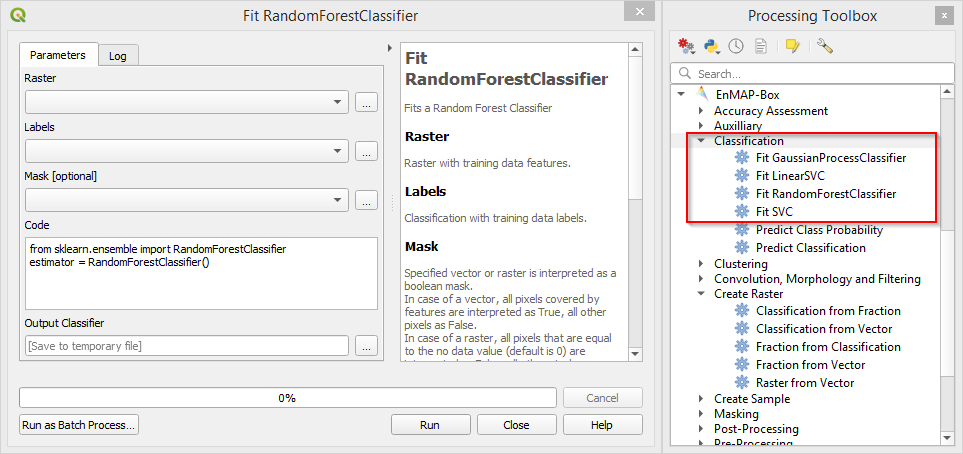
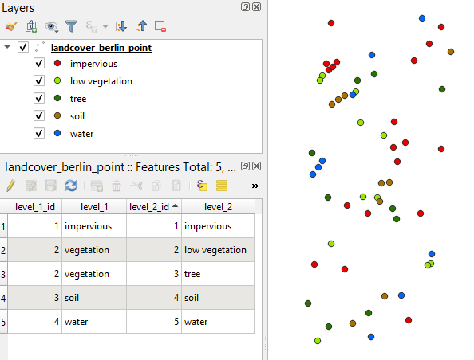

Classification
==============

This section will demonstrate the process of image classification using the :ref:`test dataset <test_dataset>`.
In this example we will use the processing algorithms only. For classification purposes you might also want to have a look
at the :ref:`Classification Workflow` application, which provides a convenient graphical user interface and manages all intermediate
steps 'under the hood' (see also :ref:`Getting Started <getting_started>`).

Fit a Classifier
----------------

The first step towards image classification is to fit a classifier. The available algorithms are listed in the processing
toolbox under :menuselection:`EnMAP-Box --> Classification --> Fit [...]`. These Fit [...] algorithms expect a raster dataset
where samples are extracted from as first input (:guilabel:`Raster`). The second input is a :ref:`classification raster <datatype_classification>`
which contains the class labels/target variable (:guilabel:`Labels`). Optionally you can include a :ref:`mask layer <datatype_mask>`.
The output of those algorithms is a :file:`.pkl` file, an intermediate exchange format which stores all relevant information
and will be needed in the consecutive step.

   Fit algorithms and their common window layout

**Using vector datasets as reference and input for** :guilabel:`Labels` **:**

Often reference datasets with class information are available as vector datasets, for example point shapefiles where
class information is stored in the attribute table. In order to use this information in the Fit algorithm,
the vector dataset has to be converted to a classification raster first. This can be done with the :ref:`Classification from Vector <>`
algorithm (in the processing toolbox under :menuselection:`EnMAP-Box --> Create Raster`).

   Example from test dataset: Multipoint layer with class information, coloured by level_2 attribute

* Open :menuselection:`EnMAP-Box --> Create Raster --> Classification from Vector`

    * :guilabel:`Pixel Grid` expects a raster layer that defines the target grid based on which the vector geometries will be rasterized
    * :guilabel:`Vector` is the reference dataset which should be rasterized
    * :guilabel:`Class id attribute` points to the field in the :guilabel:`Vector` layer which contains the class values
      (which will become the cell values in the raster)
    * :guilabel:`Minimal overall coverage`, :guilabel:`Minimal dominant coverage` and :guilabel:`Oversampling factor` are important
      parameters when working with polygon geometries. For the example we will use a point vector layer, so you can stick with the default values.
    * :guilabel:`Output Classification`: Output path for classification raster.
* Using the test dataset, enter the following parameters:

  .. figure:: ../../img/classificationfromvector.png

* Click :guilabel:`Run`

  .. figure:: ../../img/vectortoclass.png
     :width: 100%

     Side by side: Inputs and Output of Classification from Vector

The generated classification raster can now be used to fit a classifier.

.. _hint_class_json:

.. hint::

   In order for the :guilabel:`Classification from Vector` algorithm to know the class labels (names) and colors for rasterization
   you need to provide this information in a :file:`.json` file which has the same basename and is located in the same directory as the
   underlying vector dataset. Otherwise random colors will be assigned and labels will be *class 1*, *class 2*, *class 3* and so on.

   For example, the :file:`.json` file of the :file:`landcover_berlin_point.shp` (:file:`landcover_berlin_point.json`) looks like this:

   .. code:: json

      {
        "level_1_id": {
          "categories":  [
            [0, "unclassified", [0, 0, 0]],
            [1, "impervious", [230, 0, 0]],
            [2, "vegetation", [56, 168, 0]],
            [3, "soil", [168, 112, 0]],
            [4, "water", [0,100,255]]
          ],
          "no data value": 0,
          "description": "Classification"
        },
        "level_2_id": {
          "categories":  [
            [0, "unclassified", [0, 0, 0]],
            [1, "impervious", [230, 0, 0]],
            [2, "low vegetation", [152, 230, 0]],
            [3, "tree", [38, 115, 0]],
            [4, "soil", [168, 112, 0]],
            [5, "water", [0,100,255]]
          ],
          "no data value": 0,
          "description": "Classification"
        }
      }

**Fit Classifier:**

* Go to :menuselection:`EnMAP-Box --> Classification` and select one of the Fit [...] algorithms, for example :menuselection:`Fit SVC`
* Now select :file:`enmap_berlin.bsq` as :guilabel:`Raster` and the output of the :guilabel:`Classification from Vector` algorithm as :guilabel:`Labels`,
  leave the remaining parameters at default and specify an output path (:guilabel:`Output Classifier`) for the classifier file (:file:`.pkl`).
* Click :guilabel:`Run`.

Predict Classification
----------------------

In this step the classification will be applied to an image, which is usually (but not necessarily) the same image used in the fitting of the classifier.
The :menuselection:`Predict Classification` algorithm can be found in the same category (:menuselection:`EnMAP-Box --> Classification`).

* Select the image you want to classify as :guilabel:`Raster` and the :file:`.pkl` file from the previous step as :guilabel:`Classifier`.
* For the test data this might look something like this:

  .. image:: ../../img/predict_classification.png

* Specify an output path for the classification image and click :guilabel:`Run`.
* Now you should end up with a classified image

  .. figure:: ../../img/screenshot_class_result.png

Accuracy Assessment
-------------------

.. TODO Add AA section
.. todo::

   Under construction...

.. tip:: If you want to automatize workflows we suggest using the graphical modeler available in QGIS! See the
         :ref:`Graphical Modeler <graphical_modeler>` recipe in the cookbook on how to create a graphical model
         for image classification.