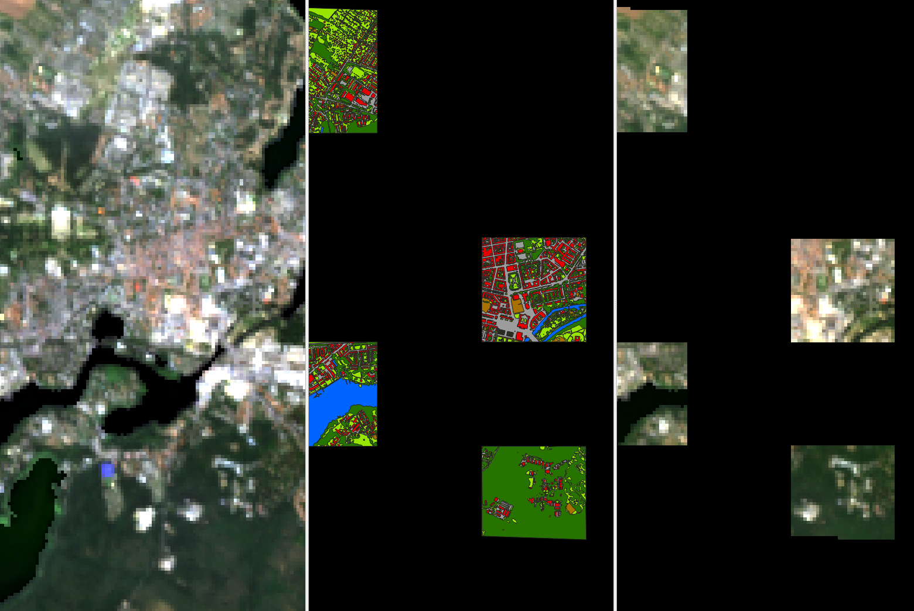

Clip a raster with a vector
===========================

Clipping a raster to the bounds of a vector layer is fairly simple in the EnMAP-Box, since vector layers can be
interpreted as :term:`mask layer`.

* Go to the Processing Algorithms and select :menuselection:`Masking --> Apply Mask to Raster`
* Under :guilabel:`Raster` select the raster layer you want to clip, and under :guilabel:`Mask` select the vector layer.

  .. tip:: If you want to *invert the clip*, which means that only pixels are included which are NOT within a polygon,
           simply activate the :guilabel:`Invert Mask` option.

   Output example: Input raster (left), vector geometry for clipping (middle) and resulting output (right)

.. attention::

   This method will just mask the raster according to the vector geometries, the extent will not be altered,
   which means the raster will not be cropped to the extent of the vector layer. You may use the :guilabel:`Translate raster layer`
   algorithm for this.

