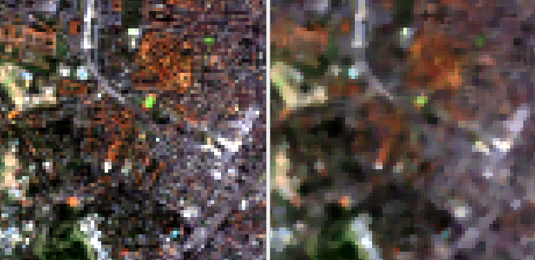
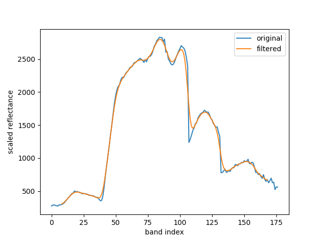

Filtering
=========

The EnMAP Box comes with a variety of filtering algorithms. You can find them in the processing
toolbox under :menuselection:`EnMAP-Box --> Convolution, Morphology and Filtering`. In this section we will demonstrate how to apply them,
by showing a spatial filter and a spectral filter.

Spatial Filter
--------------

Spatial filters apply a 2D kernel spatially (i.e. y/x dimensions) for each band.

Open the :ref:`testdataset`. In the processing toolbox go to :menuselection:`EnMAP-Box --> Convolution, Morphology and Filtering --> Spatial Median Filter`.

* Select :file:`enmap_berlin.bsq` as :guilabel:`Raster`
* Use the default settings in the code window
* Specify :guilabel:`Output Raster`, and click :guilabel:`Run`

   Input image on the left (true color RGB), median filtered image on the right (same band combination)

Spectral Filter
---------------

In spectral filtering a 1D kernel is applied along the z dimension of the raster (bands). Mind that in some cases you will
reduce the overall number of band values as values in the beginning and at the end will be set to nodata (depending on the kernel type and size).

Open the :ref:`testdataset`. In the processing toolbox go to :menuselection:`EnMAP-Box --> Convolution, Morphology and Filtering --> Spectral Convolution Gaussian1DKernel`.

* Select :file:`enmap_berlin.bsq` as :guilabel:`Raster`
* In the code window, change ``stddev=1`` to ``stddev=2``
* Specify :guilabel:`Output Raster`, and click :guilabel:`Run`

   Spectral signature of a pixel, original vs filtered with a Gaussian1DKernel

