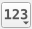

.. _graphical_modeler:

Graphical Modeler
=================

.. note:: This section demonstrates how to use the Graphical Modeler in QGIS with EnMAP-Box processing algorithms
          in order to automate common workflows. Instead of manually clicking our way through the
          processing algorithms, we will build a model which combines all the steps of image classification and can potentially be reused and
          generalized for further applications.

          You can find general information on the Graphical Modeler in the `QGIS documentation <https://docs.qgis.org/3.4/en/docs/user_manual/processing/modeler.html>`_.

#. Start the EnMAP-Box and load the test dataset under :menuselection:`Project --> Load example data`.
#. In the menubar go to :menuselection:`Processing --> Graphical Modeler`. In the Modeler you have two major
   items or building blocks, which are the :guilabel:`Inputs` and :guilabel:`Alogrithms`. The latter basically lists all algorithms
   available in the QGIS Processing Toolbox and the first lists all available types of inputs, which can be used by the
   processing algorithms.
#. For image classification we need at least an input raster and a reference dataset. In case of the EnMAP-Box testdata
   the reference dataset is a point shapefile. Under :guilabel:`Inputs` search for :guilabel:`Raster Layer` and select it (double-click or drag-and-drop).
   As :guilabel:`Parameter Name` you can for example choose ``input_image``. Mind how this input graphically appears in the main window.
   Now again, look for :guilabel:`Vector Layer`, double-click, and assign a name, e.g. ``reference_vector``.

   .. note:: You can of course change the :guilabel:`Parameter name` as you wish, but it might be easier to follow this guide when you use the suggestions.

#. Add a :guilabel:`Vector Field` input to the model. Enter ``reference_field`` as :guilabel:`Parameter name` and ``reference_vector`` as :guilabel:`Parent layer`.

#. Now we need the :guilabel:`Classification from Vector` algorithm in order to rasterize the reference dataset. Find it in the
   :guilabel:`Algorithms` tab and select it.  Now enter the following parameters:

   * :guilabel:`Pixel grid`: input_image
   * :guilabel:`Vector`: reference_vector
   * :guilabel:`Class id attribute`: reference_field
   * :guilabel:`Minimal overall coverage`: 0.0
   * :guilabel:`Minimal dominant coverage`: 0.0
   * :guilabel:`Oversampling factor`: 1

   .. caution::

      If you want to control the label names and colors of the output raster, you have to add a ``.json`` file to your vector dataset, see
      :ref:`here <hint_class_json>`. If you use the test dataset the json file is already supplied.

#. Now add the :guilabel:`Fit RandomForestClassifier` algorithm to your model. In the dialog, select ``input_image`` as :guilabel:`Raster` and
   under :guilabel:`Labels` select ``'Output Classification' from algorithm 'Classification from Vector'``. Leave the rest at default
   and click :guilabel:`OK`.

#. In the next step select the :guilabel:`Predict Classification` algorithm. Under :guilabel:`Raster` select ``input_image`` and under :guilabel:`Classifier`
   select ``'Output Classifier' from algorithm 'Fit RandomForestClassifier'`` (click on the |123| button and
   switch mode to :guilabel:`Algorithm Output`). Enter a name under :guilabel:`Output Classification`, e.g. ``predicted_image``. Confirm with :guilabel:`OK`.

#. The model is already able to run and perform an image classification, but we will add the generation of an accuracy assessment:
   Look for the Algorithm :guilabel:`Classification Performance` and select it. Choose ``'Output Classification' from algorithm 'Predict Classification'`` as
   :guilabel:`Prediction` and ``'Output Classification' from algorithm 'Classification from Vector'`` as :guilabel:`Reference`. Specify a name
   under :guilabel:`HTML Report`, for example ``accuracy_assessment``.

#. Under :guilabel:`Model properties` you can specify a name and a group for your model and save it.
#. Click the run button or press F5 to test your model. Use the following settings:

    * :guilabel:`input_image`: :file:`enmap_berlin.bsq`
    * :guilabel:`reference_vector`: :file:`landcover_berlin_point.shp`
    * :guilabel:`reference_field`: level_2_id

   .. figure:: ../../img/graphical_model_classification.png
      :width: 100%

      Screenshot of the final model

#. After saving, your model will also appear in the Processing Toolbox:

   .. image:: ../../img/screenshot_toolbox_models.png

   ... and can be openend as a regular processing algorithm:

   .. image:: ../../img/graphical_model_gui.png

.. admonition:: Final remarks

   * Mind that this example was quite specific to the EnMAP test dataset. You might want to alter the model in a way that it
     is more generalizable or fitting for your specific use cases.
   * Also, consider extending the model inputs to have even more parameters to select from, e.g. by using the Number input type
     to make the parameter :guilabel:`Minimal overall coverage` from the algorithm :guilabel:`Classification from Vector` directly specifiable as a parameter
     in your model dialog.
   * Consider including a separate reference dataset as an additional selectable input parameter (for the accuracy assessment).

