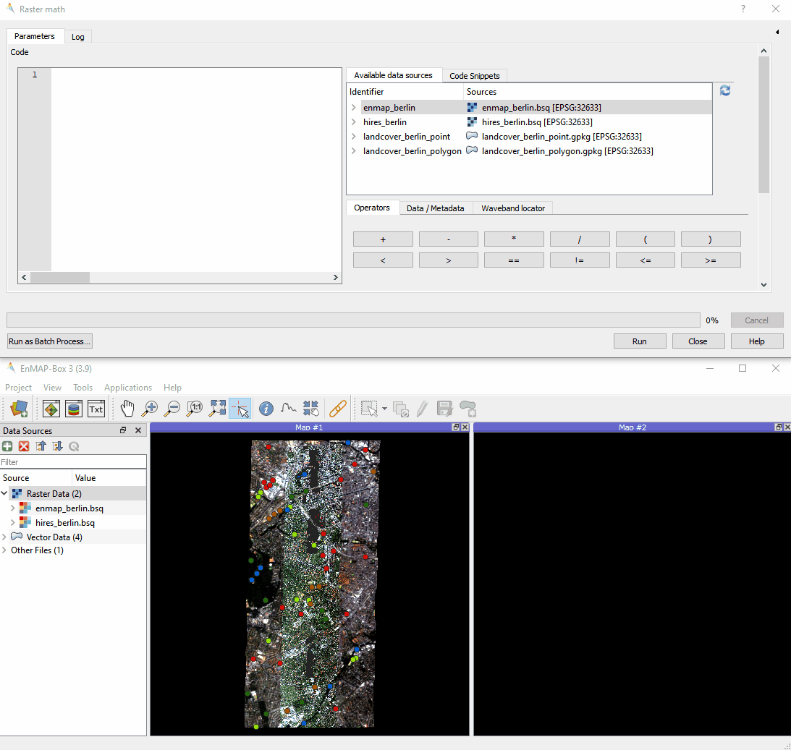
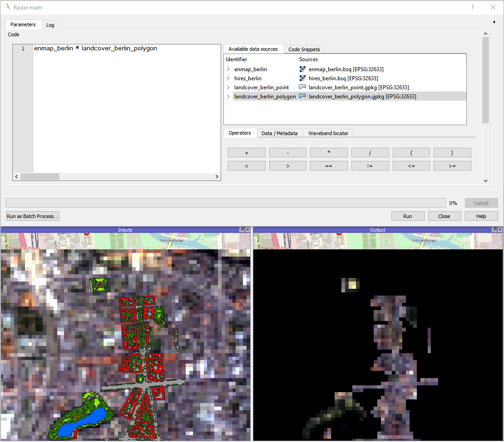
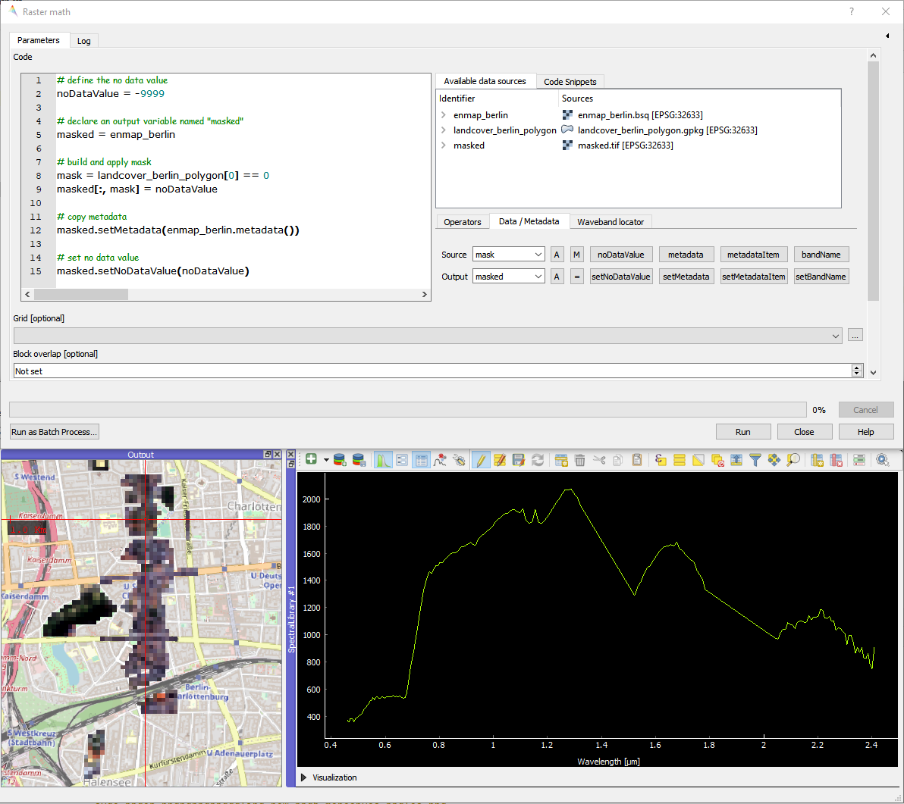
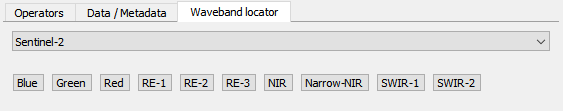

Using Raster math for performing both simple and complex raster arithmetics
===========================================================================

:guilabel:`Raster math` is a powerful raster calculator inspired by the :guilabel:`QGIS Raster calculator`,
the :guilabel:`GDAL Raster calculator` and :guilabel:`ENVI Band Math`.
In addition to those tools, :guilabel:`Raster math` supports multi-band arrays, vector layer inputs,
multi-line code snippets and metadata handling.

As a getting started, we load the EnMAP-Box testdata,
open Raster math under :menuselection:`Applications --> Raster math`,
load and execute the predefined NDVI code snippet:

Using simple expressions
~~~~~~~~~~~~~~~~~~~~~~~~

Now we can use the :guilabel:`Available data sources` and the :guilabel:`Operators` buttons to quickly define an
expression. Let's just mask the *enmap_berlin* raster layer with the *landcover_berlin_polygon* vector layer.

In this expression, the *enmap_berlin* variable is a 3d numpy array with shape [177 bands, ysize, xsize]
and *landcover_berlin_polygon* is a binary 0/1-valued rasterization of the vector geometries, also given as a
3d numpy array with shape [1 band, ysize, xsize].

Note that the output raster is correctly masked, but we haven't set an appropriate no data value,
nor have we taken care of wavelength information or any other source metadata.

Using multi-line code snippets and handle metadata
~~~~~~~~~~~~~~~~~~~~~~~~~~~~~~~~~~~~~~~~~~~~~~~~~~

To enable more complex computations and metadata handling, we can use multi-line code snippets.

Let's advance on the simple expression from above and improve it, by setting a no data value,
and proper metadata handling.

Use the :guilabel:`Available data sources` and the :guilabel:`Data / Metadata` buttons to quickly define the
code snippet.

Using individual bands by band index, band position or wavelength location
~~~~~~~~~~~~~~~~~~~~~~~~~~~~~~~~~~~~~~~~~~~~~~~~~~~~~~~~~~~~~~~~~~~~~~~~~~

When using a raster layer inside a calculation, the default is to read all bands into memory.
This can be really disadvantageous in case you only need two bands to calculate the NDVI.

For example, you can index into the *enmap_berlin* array to access the *red* and *nir* band::

    # find bands
    red = enmap_berlin[36]  # band 37 at 653 Nanometers
    nir = enmap_berlin[65]  # band 66 at 864 Nanometers

    # calculate NDVI
    ndvi = (nir - red) / nir + red

But it would be more efficient to access those bands via the special :code:`@<band number>` syntax.
This way, only two bands are mapped into memory as individual arrays of shape [1 band, ysize, xsize]::

    red = enmap_berlin@37
    nir = enmap_berlin@66

In case of a :term:`spectral raster layer`, bands can also be accessed via a target wavelength in Nanometers::

    red = enmap_berlin@655nm
    nir = enmap_berlin@865nm

You may use the :guilabel:`Waveband locator` for quickly selecting some predefined sensor waveband locations:

Using band masks
~~~~~~~~~~~~~~~~

ToDo

Using advanced band subsetting
~~~~~~~~~~~~~~~~~~~~~~~~~~~~~~

ToDo

Using special variables and logging feedback
~~~~~~~~~~~~~~~~~~~~~~~~~~~~~~~~~~~~~~~~~~~~

ToDo

Running Raster math from command line
~~~~~~~~~~~~~~~~~~~~~~~~~~~~~~~~~~~~~

Like any other processing algorithm, :guilabel:`Raster math` can be executed from the command line. Here is a simple NDVI example:

Anaconda Prompt:
    Activate your QGIS conda environment and use the **qgis_process** command line tool::

        qgis_process run enmapbox:RasterMath -- code="(R1@865nm - R1@655nm) / (R1@865nm + R1@655nm)" R1=enmap_berlin.bsq outputRaster=c:/result/ndvi.tif

OSGeo4W Shell:
    As an initial step, run **qgis_process-qgis.bat** to setup the environment. Now use the **qgis_process** command line tool::

        qgis_process run enmapbox:RasterMath -- code="(R1@865nm - R1@655nm) / (R1@865nm + R1@655nm)" R1=enmap_berlin.bsq outputRaster=c:/result/ndvi.tif

