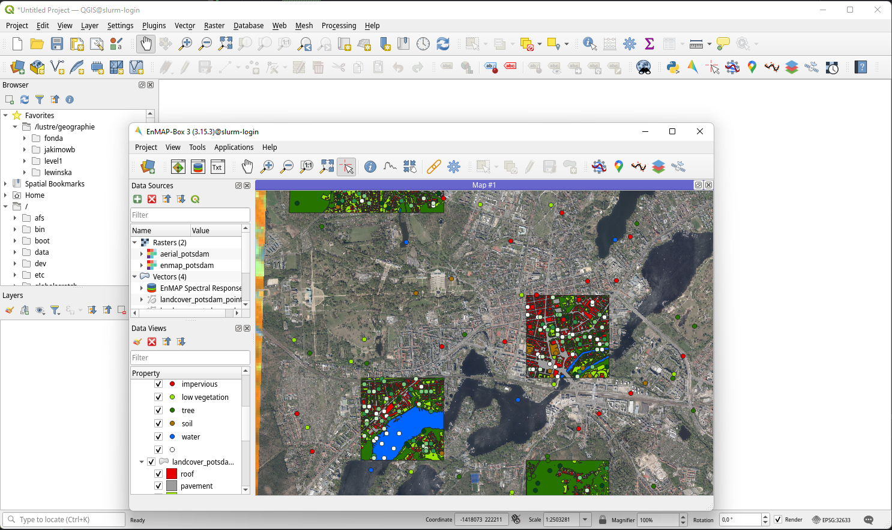
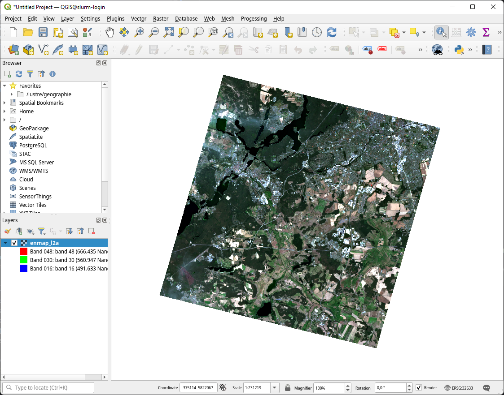

EnMAP-Box in High Performance Computer (HPC) environments
=========================================================

.. _run_on_hpc:

This section describes how the EnMAP-Box can be installed and used on a Linux Server using the job scheduler SLURM.

.. note::

    This guide is written for users who are familiar with the command line and job schedulers. If you are not familiar with these topics, please ask your system administrator for help.

Installation
------------

1. Login to your HPC shell

2. Ensure that conda / miniconda is installed and available to you.
   See [miniforge3](https://github.com/conda-forge/miniforge) for installation instructions.

   Example: to activate conda on the HU HPC, you need to load the miniforge3 module.

    .. code-block:: bash

        module load miniforge3

3. Create a conda environment *enmapbox* with all dependencies needed to the EnMAP-Box:

    .. code-block:: bash

        conda env create -n enmapbox -f https://raw.githubusercontent.com/EnMAP-Box/enmap-box/main/.env/conda/enmapbox_full_latest.yml

4. Activate *enmapbox* and ensure that the local QGIS installation is setup right:

    .. code-block:: bash

        # activate EnMAP-Box environment
        conda activate enmapbox

        # show version infos
        qgis_process --version

        # list qgis plugins
        qgis_process plugins # list plugins
        qgis_process list # list available processing algorithms

    To visualize geo-data on the HPC, you can start QGIS in a X-Window:

    .. code-block:: bash

        qgis&

5. Install and activate the EnMAP-Box QGIS plugin. Either start the QGIS GUI and use the QGIS plugin manager, or use
   the `3Liz qgis-plugin-manager <https://github.com/3liz/qgis-plugin-manager>`_ to manage QGIS plugins from the command line.

    .. tabs::

        .. tab:: QGIS GUI

            1. Call ``qgis&`` to ppen QGIS in an X-Window
            2. Go to Plugins -> Manage and Install Plugins
            3. Search for 'EnMAP-Box'
            4. Click on 'Install Plugin'

            .. figure:: ../../img/hpc/qgis_plugin_manager.png
               :align: center

        .. tab:: Command Line (Bash)

            To install QGIS plugins from CLI only, we fist install the https://github.com/3liz/qgis-plugin-manager

            .. code-block:: bash

                # define the path where your plugins are stored
                export QGIS_PLUGINPATH=~/.local/share/QGIS/QGIS3/profiles/default/python/plugins
                mkdir $QGIS_PLUGINPATH

                # install the 3Liz qgis-plugin-manager
                conda install qgis-plugin-manager
                qgis-plugin-manager init
                qgis-plugin-manager update

                # install the EnMAP-Box
                qgis-plugin-manger install 'EnMAP-Box 3'

7. Check that the EnMAP-Box is installed and their processing algorithms available on your CLI:

    Call ``qgis_process plugins list`` to see which plugins are loaded and available.

    .. code-block:: bash

        jakimowb@slurm-login:~> qgis_process plugins list
        load /home/geographie/jakimowb/.local/share/QGIS/QGIS3/profiles/default/python/plugins/enmapboxplugin/enmapbox/enmapboxresources_rc.py
        load /home/geographie/jakimowb/.local/share/QGIS/QGIS3/profiles/default/python/plugins/enmapboxplugin/enmapbox/coreapps/enmapboxapplications/ressources_rc.py
        load /home/geographie/jakimowb/.local/share/QGIS/QGIS3/profiles/default/python/plugins/enmapboxplugin/enmapbox/qgispluginsupport/qps/qpsresources_rc.py
        <frozen importlib._bootstrap>:488: RuntimeWarning: numpy.ufunc size changed, may indicate binary incompatibility. Expected 216 from C header, got 232 from PyObject
        Problem with GRASS installation: GRASS was not found or is not correctly installed
        Available plugins
        (* indicates loaded plugins which implement Processing providers)

          enmapboxplugin
        * grassprovider
        * processing

    If necessary, enable the EnMAP-Box plugin with ``qgis_process plugins enable enmapboxplugin``:

    .. code-block:: bash

        jakimowb@slurm-login:~> qgis_process plugins enable enmapboxplugin
        Enabling plugin: "enmapboxplugin"
        load /home/geographie/jakimowb/.local/share/QGIS/QGIS3/profiles/default/python/plugins/enmapboxplugin/enmapbox/enmapboxresources_rc.py
        load /home/geographie/jakimowb/.local/share/QGIS/QGIS3/profiles/default/python/plugins/enmapboxplugin/enmapbox/coreapps/enmapboxapplications/ressources_rc.py
        load /home/geographie/jakimowb/.local/share/QGIS/QGIS3/profiles/default/python/plugins/enmapboxplugin/enmapbox/qgispluginsupport/qps/qpsresources_rc.py
        <frozen importlib._bootstrap>:488: RuntimeWarning: numpy.ufunc size changed, may indicate binary incompatibility. Expected 216 from C header, got 232 from PyObject
        Enabled enmapboxplugin (EnMAP-Box 3)

        Available plugins
        (* indicates enabled plugins which implement Processing providers)

        * enmapboxplugin
        * grassprovider
        * processing

    Now list the processing algorithms provided by the EnMAP-Box:

    .. code-block:: bash

        qgis_process list | grep 'enmapbox'
        <frozen importlib._bootstrap>:488: RuntimeWarning: numpy.ufunc size changed, may indicate binary incompatibility. Expected 216 from C header, got 232 from PyObject
        Problem with GRASS installation: GRASS was not found or is not correctly installed
        enmapbox:AggregateRasterLayerBands      Aggregate raster layer bands
        enmapbox:AggregateRasterLayers  Aggregate raster layers
        enmapbox:ApplyMaskLayerToRasterLayer    Apply mask layer to raster layer
        enmapbox:Build3DCube    Build 3D Cube
        enmapbox:ClassFractionLayerFromCategorizedLayer Class fraction layer from categorized layer
        enmapbox:ClassSeparabilityReport        Class separability report
        enmapbox:ClassificationLayerAccuracyAndAreaReportForStratifiedRandomSampling    Classification layer accuracy and area report (for stratified random sampling)
        enmapbox:ClassificationLayerAccuracyReport      Classification layer accuracy report
        enmapbox:ClassificationLayerFromClassProbabilityfractionLayer   Classification layer from class probability/fraction layer
        enmapbox:ClassificationLayerFromRenderedImage   Classification layer from rendered image
        enmapbox:ClassificationWorkflow Classification workflow
        enmapbox:ClassifierFeatureRankingPermutationImportance  Classifier feature ranking (permutation importance)
        enmapbox:ClassifierPerformanceReport    Classifier performance report
        enmapbox:ConvexHullAndContinuumremoval  Convex hull and continuum-removal
        enmapbox:CreateClassificationDatasetFromCategorizedRasterLayerAndFeatureRaster  Create classification dataset (from categorized raster layer and feature raster)
        enmapbox:CreateClassificationDatasetFromCategorizedSpectralLibrary      Create classification dataset (from categorized spectral library)
        enmapbox:CreateClassificationDatasetFromCategorizedVectorLayerAndFeatureRaster  Create classification dataset (from categorized vector layer and feature raster)
        enmapbox:CreateClassificationDatasetFromCategorizedVectorLayerWithAttributeTable        Create classification dataset (from categorized vector layer with attribute table)
        enmapbox:CreateClassificationDatasetFromJsonFile        Create classification dataset (from JSON file)
        enmapbox:CreateClassificationDatasetFromPythonCode      Create classification dataset (from Python code)
        enmapbox:CreateClassificationDatasetFromTableWithCategoriesAndFeatureFields     Create classification dataset (from table with categories and feature fields)
        enmapbox:CreateClassificationDatasetFromTextFiles       Create classification dataset (from text files)
        . . .

Run EnMAP-Box GUI
-----------------

1. Call ``qgis&`` to open QGIS in an X-Window.
2. Click the EnMAP-Box icon |enmapbox| to start the EnMAP-Box
3. Click *Project->Add Exampledata* to download and visualize the EnMAP-Box example data.

Run EnMAP-Box Processing Algorithms:
------------------------------------

Let's create a working directory and download some example data:

.. code-block:: bash

    DIR_DATA=/lustre/geographie/jakimowb/data
    mkdir -p $DIR_DATA
    cd $DIR_DATA
    wget -O enmapdata.zip https://box.hu-berlin.de/f/c35a6b0655c54d518aab/?dl=1
    unzip enmapdata.zip -d enmapdata

    # list all *METADATA.XML files
    find . -type f -name '*METADATA.XML'

Select the METADATA.XML path and run the *EnMAP-Box import EnMAP L2A* algorithm. It will create a single raster file from the L2A product that
contains the reflectance values of the EnMAP bands and enriches this raster with metadata for QGIS and the EnMAP-Box.

.. code-block:: bash

   PATH_L2A=enmapdata/ENMAP01-____L2A-DT0000001867_20220724T104526Z_008_V010302_20230628T165614Z-METADATA.XML
   qgis_process run enmapbox:ImportEnmapL2AProduct \
      --detectorOverlap=1 \
      --file=$PATH_L2A \
      --outputEnmapL2ARaster=$DIR_DATA/enmap_l2a.vrt

The output should look like:

.. code-block:: bash

   load /home/geographie/jakimowb/.local/share/QGIS/QGIS3/profiles/default/python/plugins/enmapboxplugin/enmapbox/enmapboxresources_rc.py
   load /home/geographie/jakimowb/.local/share/QGIS/QGIS3/profiles/default/python/plugins/enmapboxplugin/enmapbox/coreapps/enmapboxapplications/ressources_rc.py
   load /home/geographie/jakimowb/.local/share/QGIS/QGIS3/profiles/default/python/plugins/enmapboxplugin/enmapbox/qgispluginsupport/qps/qpsresources_rc.py
   <frozen importlib._bootstrap>:488: RuntimeWarning: numpy.ufunc size changed, may indicate binary incompatibility. Expected 216 from C header, got 232 from PyObject
   Problem with GRASS installation: GRASS was not found or is not correctly installed

   ----------------
   Inputs
   ----------------

   file:   enmapdata/ENMAP01-____L2A-DT0000001867_20220724T104526Z_008_V010302_20230628T165614Z-METADATA.XML
   outputEnmapL2ARaster:   /lustre/geographie/jakimowb/data/enmap_l2a.tif

   Create Raster [1275x1240x206](Float32) -co INTERLEAVE=BAND COMPRESS=LZW TILED=YES BIGTIFF=YES /lustre/geographie/jakimowb/data/enmap_l2a.tif
   0...10...20...30...40...50...60...70...80...90...100 - done.
   Execution completed in 19.3 seconds
   Results: {'outputRaster': '/lustre/geographie/jakimowb/data/enmap_l2a.tif'}
   Execution completed in 22.61 seconds

   ----------------
   Results
   ----------------

   outputEnmapL2ARaster:   /lustre/geographie/jakimowb/data/enmap_l2a.tif

Now open the image in QGIS:

.. code-block:: bash

    qgis $DIR_DATA/enmap_l2a.vrt&

Use SLURM
---------

tbd.

Notes
-----

The *QT_QPA_PLATFORM* environment variable can be used to enable or disable graphical windows for QGIS / Qt apps.

This is necessary to run the EnMAP-Box on a HPC which usually has now graphical interface.

.. code-block:: bash

    export QT_QPA_PLATFORM=offscreen

.. Substitutions definitions - AVOID EDITING PAST THIS LINE
   This will be automatically updated by the find_set_subst.py script.
   If you need to create a new substitution manually,
   please add it also to the substitutions.txt file in the
   source folder.

.. |enmapbox| image:: /img/icons/enmapbox.png
   :width: 28px
