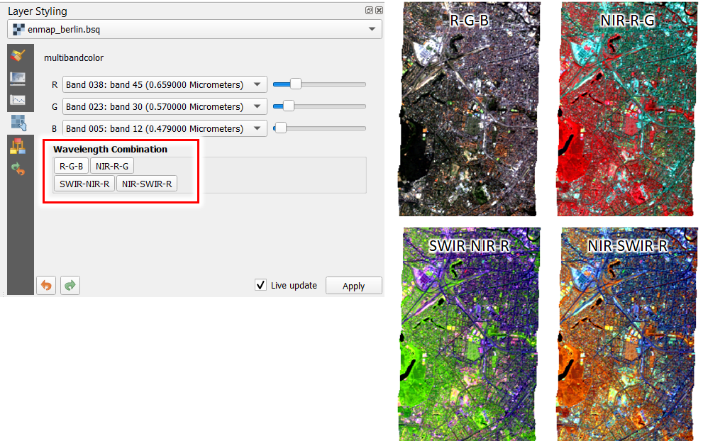
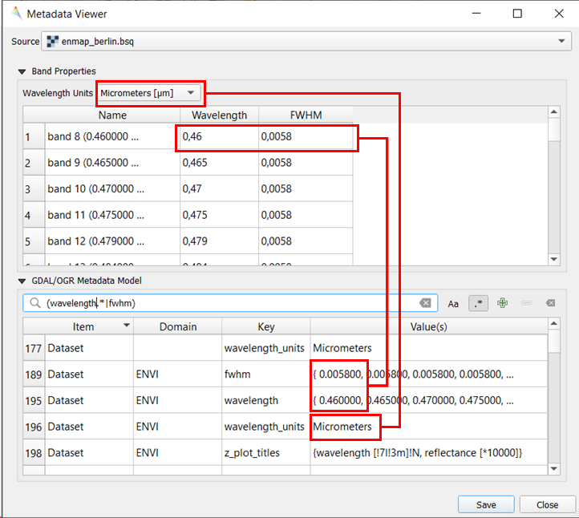

Wavelength Information
======================

If wavelength information is defined for each band of a
raster image, the EnMAP-Box can use it to easily select pre-defined band combinations or to
better compare spectral profiles of sensors with different number of bands.

The wavelength information needs to be defined similar to the ENVI metadata standard:

1. *wavelength units* defines the metric unit of the wavelength, e.g. nm, mu, cm,..

2. *wavelength* defines the band values in *wavelength units*, e.g. 450 nm.

3. *fwhm* defines the full width at half maximum in *wavelength units*

Wavelength information can be inspected with the *Tools -> Metadata Viewer*

In the QGIS python shell, wavelength information can be read as followed:

.. code-block:: python

    from enmapbox.gui.utils import parseWavelength, parseFWHM
    source = 'path to raster file / QgsRasterLayer / GDAL DataSource'
    wavelength, wavelength_unit = parseWavelength(source)
    fwhm = parseFWHM(source)
    print(wavelength)
    print(wavelength_unit)
    print(fwhm)

Internally, the EnMAP-Box reads wavelength information via the GDAL metadata model:

.. code-block:: python

    from osgeo import gdal
    path = r'path to image'
    dataset: gdal.DataSet = gdal.Open(path)
    print(dataset.GetMetadataItem('wavelength_units', 'ENVI'))
    print(dataset.GetMetadataItem('wavelengths', 'ENVI'))

Wavelength information can be set in the same way:

.. code-block:: python

    from osgeo import gdal
    path = r'path to image'
    dataset: gdal.DataSet = gdal.Open(path)
    print(dataset.SetMetadataItem('wavelength_units', 'nm', 'ENVI'))
    print(dataset.SetMetadataItem('wavelengths', '{490, 560, 665}', 'ENVI'))
    dataset.FlushCache()
    del dataset

Please note that this will only work if the image is not opened in QGIS!.

