.. include:: /icon_links.rst

.. _getting_started:

###############
Getting Started
###############

.. admonition:: Info

    This section is aimed at users with no previous EnMAP-Box experience. You will get a brief introduction into the
    main functionalities:

    * Getting to know the Graphical User Interface
    * Use an EnMAP-Box Application (Classification Workflow)
    * Use a Processing Algorithm
    * Use the Spectral Library

Primer
######

The EnMAP-Box can be divided into several major components. The :ref:`Graphical User Interface (GUI) <gui>`
provides main access to all features and lets you manage and visualize raster and vector data as well as spectral libraries.
From here you can access further :ref:`Tools <tools>` and :ref:`Applications <applications>`, which can be regarded as additional plugins
that add specific functionalities such as plotting, metadata editing or raster algebra.

Furthermore, the EnMAP-Box extents the QGIS Processing Toolbox with a comprehensive collection of various :ref:`Processing Algorithms` for data manipulation.

'Underneath'
all this is the :ref:`EnMAP-Box API, HUB-Workflow API and HUB-Datacube API <dev_cookbook>`, which are high-level application programming interfaces that
allow more advanced users to operate EnMAP-Box functionalities directly from code or to build their own applications on top.

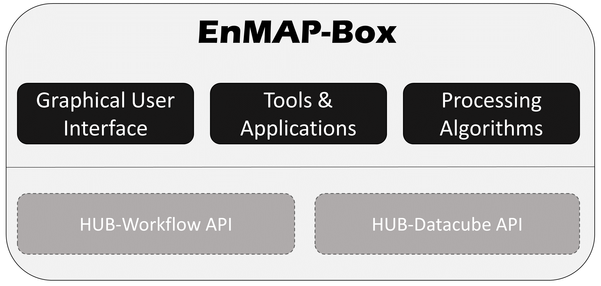

Launching the EnMAP-Box
#######################

Once you successfully :ref:`installed the EnMAP-Box <usr_installation>`, you can access the plugin via the |enmapbox| icon
in the QGIS toolbar. Furthermore, the EnMAP-Box :ref:`Processing Algorithms` should also appear in the QGIS Processing Toolbox.

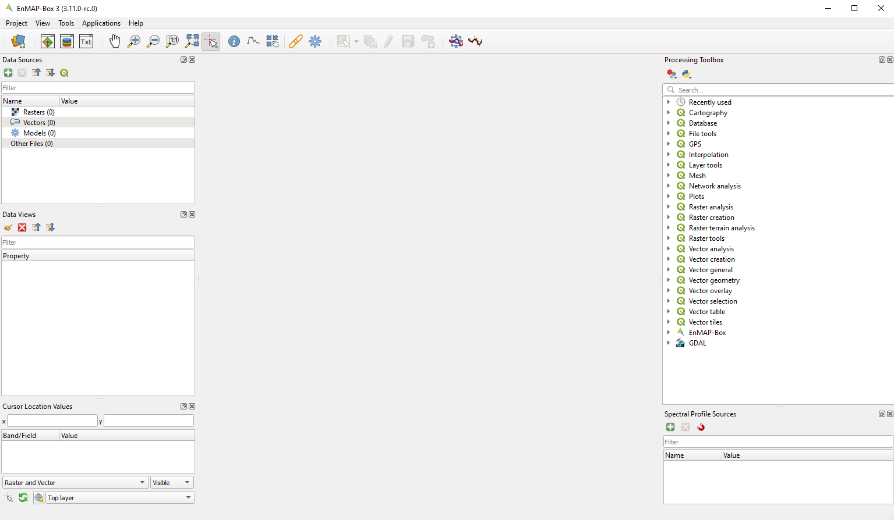

    The Graphical User Interface (GUI) of the EnMAP-Box on first open

.. tip:: Have a look at the :ref:`User Manual <gui>` for a detailed description of the GUI.

Loading Testdata
################

* Go to :menuselection:`Project --> Load Example Data` to load example datasets into you project (on first open, you will be asked whether
  to download the dataset, confirm with :guilabel:`OK`). The following datasets
  will be added (now they are listed in the :guilabel:`Data Sources` window):

  * :file:`enmap_berlin.bsq`
  * :file:`hires_berlin.bsq`
  * :file:`landcover_berlin_point.gpkg`
  * :file:`landcover_berlin_polygon.gpkg`
  * :file:`library_berlin.gpkg`
  * :file:`library_berlin.sli`
  * :file:`enmap_sf_library.gpkg`
  * :file:`veg-cover-fraction_berlin_point.gpkg`

.. tip::

   Have a look at the section :ref:`Test dataset <test_dataset>` for further information on the datasets. In this section we will
   mainly work with :file:`enmap_berlin.bsq` and :file:`landcover_berlin_point.gpkg`

First Steps in the GUI
######################

By default the example data is loaded into a single Map View. Let's rearrange those for better visualisation and in order
to get to know the GUI functionalities:

1. Click the *Open a map window* |viewlist_mapdock|  button to add a second map view. The window appears below the first map window.
2. We want to arrange the windows so that they are next to each other (horizontally). Click and hold on the blue area of :guilabel:`Map #2` and drag it to the right of :guilabel:`Map #1` (see figure below). The translucent blue rectangle indicates where the map window will be docked once you stop holding the left mouse button.

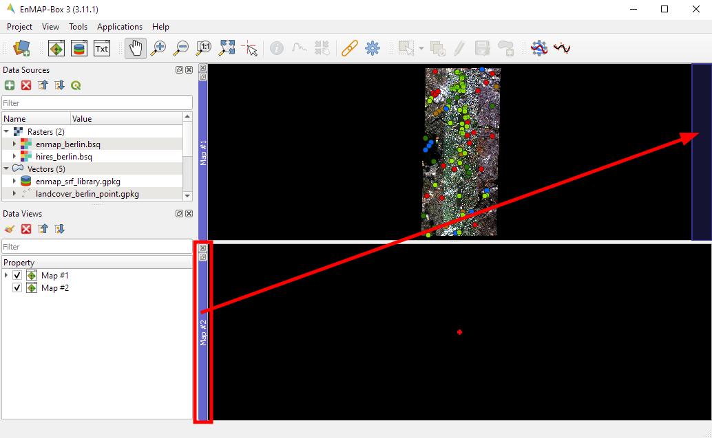

3. Now, in the :guilabel:`Data Views` window, expand the :guilabel:`Map #1` list, so that you can see the individual layers. Select :file:`hires_berlin.bsq` and drag the layer into :guilabel:`Map #2` (you can drag them directly into the map views or the respective menu item under :guilabel:`Data Views`). You can remove :file:`library_berlin.sli` and :file:`landcover_berlin_polygon.gpkg`, since they are not needed here. Right-click on the layer in the Data Views panel and select :guilabel:`Remove Layer`.
4. In the next step we link both map views, so that zoom and center are synchronized between both. Go to :menuselection:`View --> Set Map Linking` and select *Link map scale and center* |link_all_mapscale_center| .
5. Move the map (using |mActionPan| or holding mouse wheel) and see how both map views are synchronized.

Use an Application
##################

In this section we will use the EnMAP-Box application **Classification Workflow** to classify the :file:`enmap_berlin.bsq`
image using a point vector dataset with the classes *impervious, low vegetation, tree, soil, water* and a random forest classifier.

1. Open the Classification workflow :menuselection:`Applications --> Classification Workflow (advanced)`.
2. In the :guilabel:`Source` dropdown menu select *categorized vector layer and feature raster*.

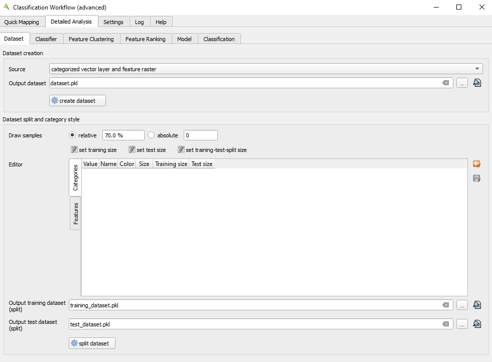

3. Click on :guilabel:`create dataset`. A new window is opened, where you have to choose the *Categorized vector layer* and the *Raster layer with features*.
4. Choose :file:`landcover_berlin_point.gpkg` as :guilabel:`Vector layer` and :file:`enmap_berlin.bsq` as :guilabel:`Raster layer`.
5. You also need to define the :guilabel:`Field with class values`. Select :file:`level_2_id` here. Specify an output path and filename by pressing :guilabel:`...` or use the default, which will save the output to a temporary location. Leave all other default settings and run the algorithm.

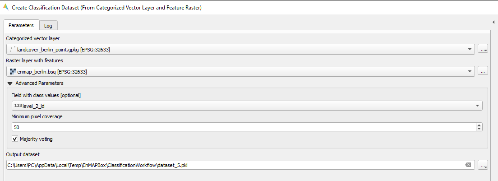

6. The newly created dataset is now used to fit the classifier. The advanced classification workflow also allows you to split the dataset, select different classifiers, calculate feature clusters and rankings. For now, however, let's leave everything at the default settings and continue with the model fitting.

.. tip::

     Find more information on the Classification Workflow application in the :ref:`User Manual > Applications > Classification Worklow <applications>`.

7. Move on to the tab :guilabel:`Model` and select *dataset* as :guilabel:`Dataset`. Again specify an output path and filename by pressing :guilabel:`...` or use the default, and run :guilabel:`fit classifier`.

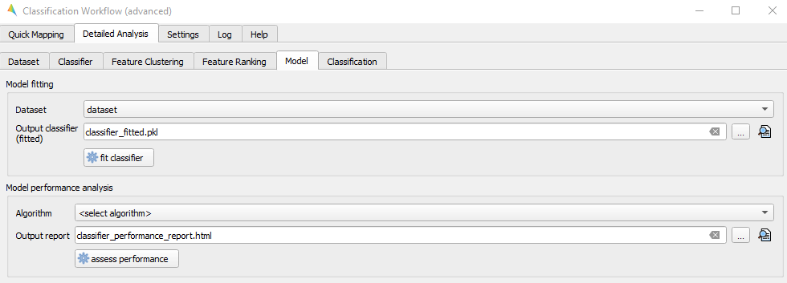

8. We can also already test our model by using a cross-validation performance. Choose *cross-validation performace* as :guilabel:`Algorithm`, specify an output path and file name or leave the default and click on :guilabel:`assess performance`. The HTML report will open automatically in the default web browser.

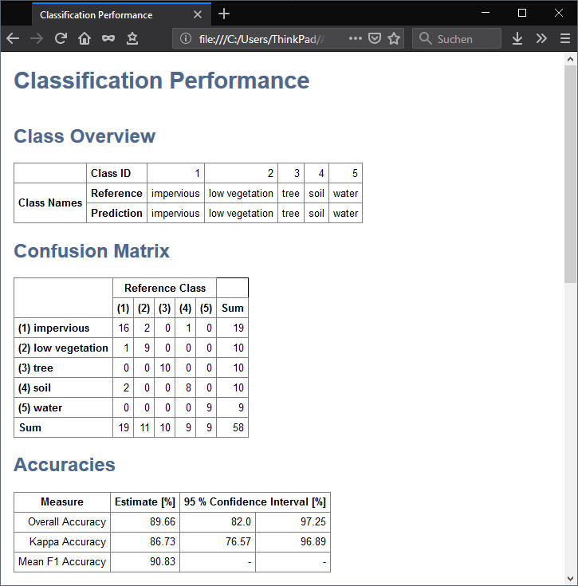

9. Now that we finished fitting the classifier, we can move on to the actual image classification. The :guilabel:`Classifier` will be set automatically. Choose the :file:`enmap_berlin.bsq` as :guilabel:`Raster layer with features` which is the image that we want to classify. Specify an output path and filename for the prediction output or use the default, and run :guilabel:`predict output products`.

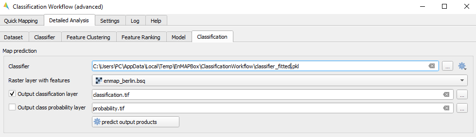

10. Once the process has finished, the classification image will be listed in the :guilabel:`Data Sources` panel (if not, open it again via |add_datasource|).
11. Now visualize the classification result side-by-side with the initial image. Therefore, right-click into :guilabel:`Map #2` and select :menuselection:`--> Clear`. Drag the classification image from the :guilabel:`Data Sources` panel into :guilabel:`Map #2`

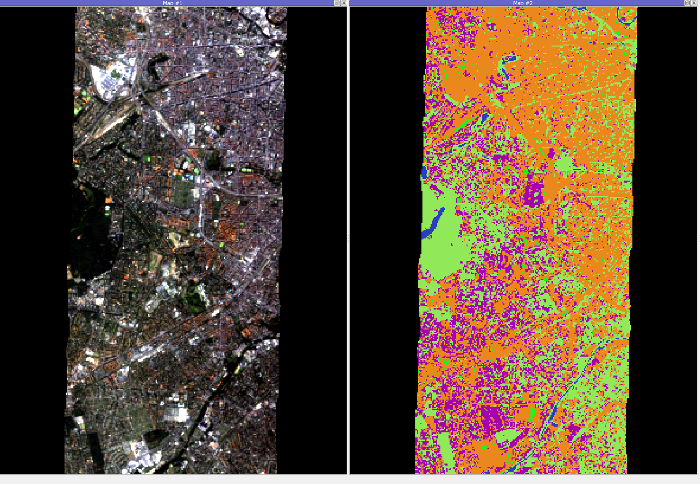

Example output of the Random Forest Classification

.. tip::

     The classification output is displayed in random colours. You can change the visualization settings in the **Layer Properties** of the raster. Right click on the
     layer in the :guilabel:`Data Views` panel, select **Layer Properties** and edit the colors and names accordingly.

12. In the :guilabel:`Data Views` panel, right-click on the classification layer and select :guilabel:`Classification Statistics`. This will show you an interactive plot with the different class counts

.. figure:: /img/classification_statistics1.png
   :align: center

Example of the statistics of the classification result

Use a Processing Algorithm
##########################

In this section we will use a processing algorithm from the EnMAP-Box algorithm provider. More precise, we are converting a
polygon dataset holding information on different landcover types into a classification raster, i.e., we are going to
rasterize the vector dataset.

1. First of all, make sure the :ref:`Processing Toolbox <processing_toolbox>` window is opened. If not, activate it via :menuselection:`View --> Panels --> Processing Toolbox`
2. Open the :menuselection:`Rasterize categorized vector layer` algorithm under :menuselection:`EnMAP-Box --> Raster Creation`
3. Use the following settings:

  * :guilabel:`Categorized vector layer`: :file:`landcover_berlin_polygon.gpkg`
  * :guilabel:`Grid`: :file:`enmap_berlin.bsq`

4. Specify an output filepath under :guilabel:`Output Classification` and click :guilabel:`Run`.

.. figure:: /img/example_rasterize_classification.png
   :width: 100%

   Result of the Classification from Vector algorithm (right) and the input grid (left) and polygon dataset (middle)

Use the Spectral Library
########################

A Spectral Library is a library is a vector layer with a layer field designated to store spectral profiles. This section gives a very brief overview of
the Spectral Library. To get more detailed information about all the functionalities, please follow the instructions in the :ref:`User Manual > Spectral Libraries <spectral_libraries>`.

1. Open the spectral library window via :menuselection:`View --> Add Spectral Library Window`.
2. You should now see an empty window where you can collect spectra.

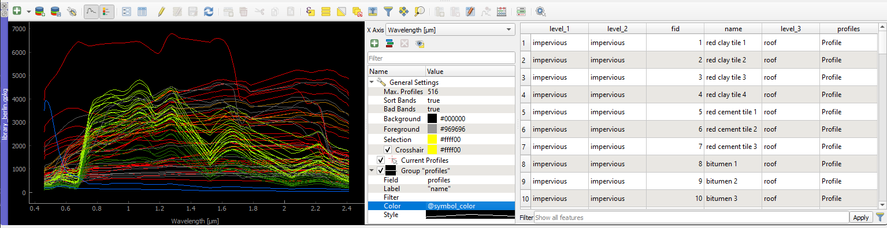

3. If not already activated, enable the |profile| button in the menu bar and open a raster in a new map view from which you want to collect spectra.
4. Create spectra from the image by clicking with the left mouse button in the opened image. The collected spectral information is now stored as a temporary profile candidate, which is displayed as a dotted line. Each time you click into the image, the profile candidate is replaced by a new one.
5. Click on *Add Profile(s)* |plus_green| to keep the candidate profile in the spectral library. Activate  *Add profiles automatically* |profile_add_auto| to collect multiple profiles and display them all in the same spectral library.

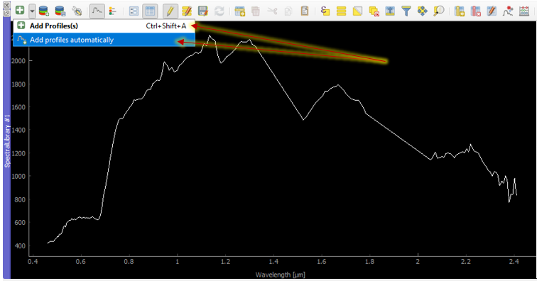

**Add information to the attribute table:**

Each spectral library has its own attribute table where you can manage your collected spectral profiles and add or delete information.
The Spectral Library Window has a number of functions similar to the vector editing functions you may be familiar with from QGIS.

1. To add information, open the *Attribute table* by clicking the |attributes| icon, then enable the **Editing mode** by clicking the |mActionToggleEditing| symbol.
2. Add a new field via |mActionNewAttribute|

.. figure:: ../img/Speclib_addNewField.png
   :width: 100%

3. A new column is added to the attribute table, which you can edit with a double click.
4. To delete a column, use the *Delete field button* |mActionDeleteAttribute|.