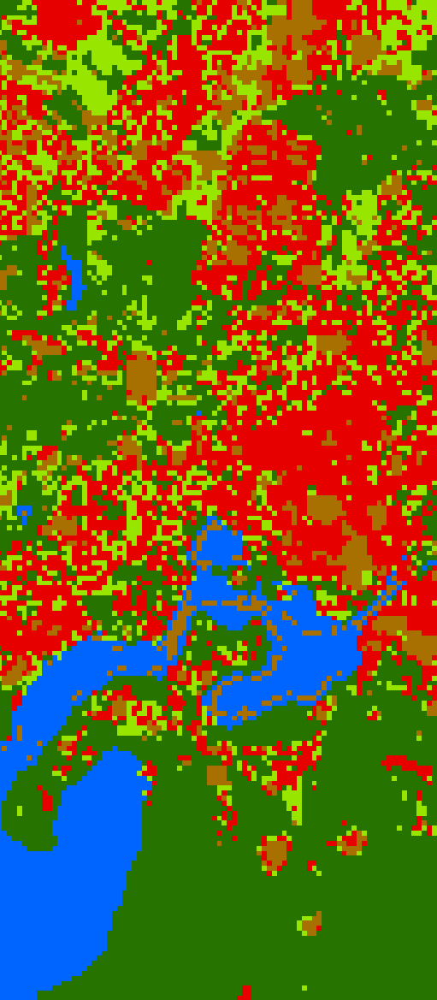

.. include:: /icon_links.rst

.. _applications:

Applications
************

.. TODO add ensomap https://gitext.gfz-potsdam.de/stephane/HYSOMA-ENSOMAP

ImageMath
=========

.. _synthMix:

Regression-based unmixing (synthMix)
====================================

You can find the Regression-based unmixing in the menu bar :menuselection:`Applications --> Regression-based unmixing (synthMix)`

.. seealso:: Have a look at the :ref:`Urban Unmixing Tutorial <tut_urban_unmixing>` for a use case example of the Regression-based unmixing Application.

Input Parameters:

* **Inputs**

  * :guilabel:`Endmember Library`: Select spectral library
  * :guilabel:`Class Attribute`: Specify the attribute which contains class/material information.
  * :guilabel:`Spectral Image`: Specify spectral image on which unmixing should be applied.

* **Class Selection**

  * :guilabel:`Target Classes` |combo|: Specify the desired target classes (which are derived from the Class Attribute field specified above).
    Can be used to select only a subset of target classes from a spectral library.

* **Mixing Parameters**

  * :guilabel:`Number of Synthetic Mixtures per Class`: Amount of mixtures to be generated per class.
  * :guilabel:`Include Original Library Endmembers` |cb0|: Whether to include the original spectra in the training library.
  * :guilabel:`Mixing Complexity Probabilities`: Defines the likelihood of creating a binary, ternary or fourfold mixture. For example,
    by specifing the probabilities as ``0.5``, ``0.5``, ``0``, it is equally likely that binary and ternary mixtures are created, whereas no fourfold mixtures will be generated.
    Enter decimals between 0.0-1.0 (all three probabilities need to sum up to 1).

    * 2EM: Likelihood of creating a binary mixture (2 endmembers)
    * 3EM: Likelihood of creating a ternary mixture (3 endmembers)
    * 4EM: Likelihood of creating a fourfold mixture (4 endmembers)
  * :guilabel:`Allow Within-Class Mixtures` |cb0|: Whether to allow mixtures between signatures of the same endmember.
  * :guilabel:`Class Probabilities` |combo| *(Proportional | Equalized)*: In case of proportional class probabilities the number of
    mixtures of a class in the output library will be proportional to the number of spectra in the input library of that class. In case of equalized,
    all classes will be represented equally.

* **Regression Algorithm**

 * In the :guilabel:`Regressor` |combo| dropdown menu you can choose different regressors (e.g. Random Forest, Support Vector Regression, Kernel Ridge Regression)
  * |mIconCollapse| :guilabel:`Model parameters`: Specify the parameters of the selected regressor.

     .. hint::

        Scikit-learn python syntax is used here, which means you can specify model parameters accordingly. Have a look at
        the scikit-learn documentation on the individual parameters, e.g. for the `RandomForestRegressor <https://scikit-learn.org/stable/modules/generated/sklearn.ensemble.RandomForestRegressor.html>`_

  * :guilabel:`Use Ensemble` |cb0|: If enabled, more than one iteration of mixing, training and prediction will be performed.
    The results of each iteration will be combined into a final ensemble result (see :guilabel:`Decision Fusion (Ensemble)` on how results should be combined).
  * :guilabel:`Ensemble Size`: Specify the size of the ensemble (number of iterations).

* **Outputs**

 * :guilabel:`Folder`: Specify an output folder where results will be written to.
 * :guilabel:`Name`: Basename of the output files

 * |mIconCollapse| :guilabel:`Advanced`

   * :guilabel:`Decision Fusion (Ensemble)` |combo| *(median | mean | iqr | std)*: Select one or multiple options of the kind of
     decision fusion (how individal predictions of the ensemble will be combined)
   * :guilabel:`Save` Check the following to save additional outputs ...

     * :guilabel:`Training Samples` |cb0|: Save the training samples
     * :guilabel:`Predictions` |cb0|: Save the individual predictions of the ensemble
     * :guilabel:`Models` |cb0|: Save the model files
   * :guilabel:`Create Class Fraction RGB` |cb0|: Generates a RGB visualisation based on the weighted sum of class colors and corresponding fractions
   * :guilabel:`Derive Classification from Fraction Map` |cb0|: Save classification from fraction map (class with the highest fraction will be assigned)

.. admonition:: Run the regression-based unmixing

   Once all parameters are entered, press the |action| button to start the regression-based unmixing.

|

....

|

.. _Classification Workflow:

Classification Workflow
=======================

You can find this application in the menu bar :menuselection:`Applications --> Classification Workflow`

The Classification Workflow application let's you easily perform classification analysis and mapping tasks using
remote sensing data.

Quick Mapping
-------------

In the **Quick Mapping** section you can very easily define your training dataset, fit a classifier and predict a
classification layer, with only a few clicks.

E.g. use EnMAP-Box testdata together with a Random Forest classifier:

.. image:: ../../general/img/raster_layer.png
    :width: 32%

For a more elaborated analysis see the **Detailed Analysis** section.

Detailed Analysis
-----------------

In the **Detailed Analysis** section you have more control over individual analysis steps.
When performing a detailed analysis, you can basically go through every subsection from left to right.
But, depending on the usecase, it is also possible to skip individual steps you're not interested in.

Dataset
.......

You have various options to create a dataset for subsequent analysis: select a :guilabel:`Source` option
and click :guilabel:`create dataset` to create a new dataset`.

In the :guilabel:`Editor`, category colors and names, and feature names can be changed and saved.

By using the various controls in the :guilabel:`Draw samples` section, you can easily define a training-test-split setup.
The number of training and test samples to be drawn for each category are listed, and also editable, inside the :guilabel:`Editor`.

Click :guilabel:`split dataset` to perform the split, resulting in a training and a test dataset, that can be used in subsequent analysis.

Classifier
..........

In the **Classifier** section you can either select a :guilabel:`Predifined` classifier or provide a user-defined Python
:guilabel:`Code` snipped. See the https://scikit-learn.org/ documentation for a complete overview.

Click :guilabel:`create classifier` to create an (unfitted) classifier, that can be used in subsequent analysis.

Feature Clustering
..................

In the **Feature Clustering** section you can perform an unsupervised :guilabel:`Feature redundancy analysis`,
that clusters similar features together: select a :guilabel:`Dataset`, an :guilabel:`Algorithm`
and click :guilabel:`cluster features` to create and an :guilabel:`Output report`.

After inspecting the report you can perform a :guilabel:`Feature subset selection`:
select a suitable :guilabel:`Number of features` and click :guilabel:`select features` to create a training and a test dataset
with fewer features, that are less correlated and can be used in subsequent analysis.

Feature Ranking
...............

In the **Feature Ranking** section you can perform a supervised :guilabel:`Feature importance analysis`,
that ranks features in terms of their importance for the classification task at hand:
select a :guilabel:`Dataset`, an :guilabel:`Algorithm
and click :guilabel:`rank features` to create and an :guilabel:`Output report`.

After inspecting the report you can perform a :guilabel:`Feature subset selection`:
select a suitable :guilabel:`Number of features` and click :guilabel:`select features` to create a training and a test dataset
with fewer features, that are most important and can be used in subsequent analysis.

Model
.....

In the **Model** section you can perform :guilabel:`Model fitting`:
select a :guilabel:`Dataset` and click :guilabel:`fit classifier` to create a fitted :guilabel:`Output classifier`,
that is used in subsequent analysis.

For :guilabel:`Model performance analysis` select an :guilabel:`Algorithm` and click :guilabel:`assess performance` to create an  :guilabel:`Output report`.

Classification
..............

In the **Classification** section you can perform :guilabel:`Map prediction`:
select a :guilabel:`Raster layer with features` that matches the features used in :guilabel:`Model fitting`.
Click :guilabel:`predict output products` to create an :guilabel:`Output classification layer` and/or an :guilabel:`Output class probability layer`.
Note that outputs are opened inside the EnMAP-Box :guilabel:`Data Sources` panel.

For :guilabel:`Map accuracy and area estimation` select a :guilabel:`Ground truth categorized layer` and click :guilabel:`assess performance` to create an  :guilabel:`Output report`.

Settings
--------

In the **Settings** section you can specify the :guilabel:`Output directory` (e.g. `C:/Users/USERNAME/AppData/Local/Temp/EnMAPBox/ClassificationWorkflow`),
that is used as the default file destination path, when creating file outputs.
Note that each output file wigdet (e.g. :guilabel:`Output dataset`) has a default basename (e.g. `dataset.pkl`),
that is used to create a default file destination (e.g. `C:/Users/USERNAME/AppData/Local/Temp/EnMAPBox/ClassificationWorkflow/dataset.pkl`).
If the default file destination already exists, the basename is enumerated (e.g. `.dataset_2.pkl`) to avoid overwriting existing outputs.

Log
---

|

.. _Classification Workflow Classic:

Classification Workflow Classic
===============================

You can find this application in the menu bar :menuselection:`Applications --> Classification Workflow Classic`

.. figure:: /img/classification_workflow.png

   Classification Workflow Application

.. seealso:: Have a look at the :ref:`Getting Started <getting_started>` for a use case example of the Classification Workflow Application.

Input Parameters:

* **Training Inputs**

  * :guilabel:`Type` |combo|

    Three different types of input data sources are supported and have to be specified beforehand in the dropdown menu.
    Depending on the selected input type the user interface shows different options.

    * ``Raster / Classification``:

      * :guilabel:`Raster`: Specify input raster based on which samples will be drawn for training a classifier.
      * :guilabel:`Classification`: Specify input raster which holds class information.

    * ``Raster / Vector Classification``:

      * :guilabel:`Raster`: Specify input raster based on which samples will be drawn for training a classifier.
      * :guilabel:`Reference`: Specify vector dataset with reference information. Has to have a column in the attribute table with a
        unique class identifier (numeric). The class colors and labels are derived from the current Symbology. To set or
        change those settings, click the |rendererCategorizedSymbol| button or go to the Layer Properties (:menuselection:`Layer properties --> Symbology`).
        The vector dataset is rasterized/burned on-the-fly onto the grid of the input raster in order to extract the sample.
        If the vector source is a polygon dataset, only polygons which cover more than 75% of a pixel in the target grid are rasterized.

    * ``labelled Library``:

      * :guilabel:`Library`: Specify input spectral library.

* **Sampling**

  Once you specified all inputs in the Training inputs section, you can edit the class colors, names and class sample sizes
  in the Sampling submenu.

  .. note::

     If set, the class labels and color information is automatically retrieved from the layers current renderer settings
     (:menuselection:`Layer properties --> Symbology`).

  * :guilabel:`Sample size` |combo| |spin| Specify the sample size per class, either relative in percent or in absolute pixel counts.
  * The total sample size is shown below
  * |cb0| :guilabel:`Save sample`: Activate this option and specify an output path to save the sample as a raster.

* **Training**

  * In the :guilabel:`Classifier` |combo| dropdown menu you can choose different classifiers (e.g. Random Forest, Support Vector Machine)
  * |mIconCollapse| :guilabel:`Model parameters`: Specify the parameters of the selected classifier.

     .. hint::

        Scikit-learn python syntax is used here, which means you can specify model parameters accordingly. Have a look at
        the scikit-learn documentation on the individual parameters, e.g. for the `RandomForestClassifier <https://scikit-learn.org/stable/modules/generated/sklearn.ensemble.RandomForestClassifier.html>`_

  * |cb0| :guilabel:`Save model`: Activate this option to save the model file (:file:`.pkl`) to disk.

* **Mapping**

  * :guilabel:`Raster`: Specify the raster you would like to apply the trained classifier to (usually -but not necessarily-
    this is the same as used for training)
  * :guilabel:`Mask`: Specify a :ref:`mask <datatype_mask>` layer if you want to exclude certain areas from the prediction.

      * Outputs:

         * :guilabel:`Classification`: Output path where to write the classification image to.
         * :guilabel:`Probability`: Output path of the class probability image.

           .. hint:: This outputs the result of a classifiers ``predict_proba`` method. Note that depending on the classifier this
                     option might not be available or has to be activated in the model parameters (e.g. for the Support Vector Machine,
                     the line ``svc = SVC(probability=False)`` has to be altered to ``svc = SVC(probability=True)``
         * :guilabel:`RGB`: Generates a RGB visualisation based on the weighted sum of class colors and class probabilities.

* **Cross-validation Accuracy Assessment**

  * |cb0| Cross-validation with n-folds |spin|: Activate this setting to assess the accuracy of the classification by performing cross
    validation. Specify the desired number of folds (default: 3). HTML report will be generated at the specified output path.

.. admonition:: Run the classification workflow

   Once all parameters are entered, press the |action| button to start the classification workflow.

|

....

|

.. _Regression Workflow:

Regression Workflow
===================

You can find the Regression Workflow in the menu bar :menuselection:`Applications --> Classification Workflow`

.. seealso:: Have a look at the :ref:`Biomass Mapping Tutorial <tutorial_biomass>` for a use case example of the Regression Workflow Application.

Input Parameters:

* **Training Inputs**

  * :guilabel:`Raster`: Specify input raster based on which samples will be drawn for training a regressor.
  * :guilabel:`Reference`: Specify vector or raster dataset with reference information (regression target). In case of
    vector input, dataset has to have a numeric column in the attribute table with a
    target variable of interest. This vector dataset is rasterized/burned on-the-fly onto the grid of
    the input raster in order to extract the sample. If the vector source is a polygon dataset, all pixels will be drawn which
    intersect the polygon.

  * :guilabel:`Attribute`: Attribute field in the reference vector layer which contains the regression target variable.

* **Sampling**

  * :guilabel:`Number of Strata` |spin|: Specify the desired number of strata sampling. If you don't want to use
    stratified sampling, just enter ``1``.
  * :guilabel:`Min` & :guilabel:`Max`: Defines the value range in which samples should be drawn.
  * :guilabel:`Sample size` |combo| |spin|: Specify the sample size per stratum, either relative in percent or in absolute pixel counts.

    Every stratum is listed below with the value range that is covered by this stratum depicted in square brackets
    (e.g., ``Stratum 1: [1.0, 4.33]``). Furthermore, you can see and alter the number of pixels/samples for each stratum using the |spin| spinboxes.
  * |cb0| :guilabel:`Save sample`: Activate this option and specify an output path to save the sample as a raster.

* **Training**

  * In the :guilabel:`Regressor` |combo| dropdown menu you can choose different regressors (e.g. Random Forest, Support Vector Regression, Kernel Ridge Regression)
  * |mIconCollapse| :guilabel:`Model parameters`: Specify the parameters of the selected regressor.

     .. hint::

        Scikit-learn python syntax is used here, which means you can specify model parameters accordingly. Have a look at
        the scikit-learn documentation on the individual parameters, e.g. for the `RandomForestRegressor <https://scikit-learn.org/stable/modules/generated/sklearn.ensemble.RandomForestRegressor.html>`_

  * |cb0| :guilabel:`Save model`: Activate this option to save the model file (:file:`.pkl`) to disk.

* **Mapping**

  * :guilabel:`Input Raster`: Specify the raster you would like to apply the trained regressor to (usually -but not necessarily-
    this is the same as used for training)

* **Cross-validation Accuracy Assessment**

  * |cb0| Cross-validation with n-folds |spin|: Activate this setting to assess the accuracy of the regression by performing cross
    validation. Specify the desired number of folds (default: 3). HTML report will be generated at the specified output path.

.. admonition:: Run the regression workflow

   Once all parameters are entered, press the |action| button to start the regression workflow.

EO Time Series Viewer
=====================

Please visit `EO Time Series Viewer Documentation <https://eo-time-series-viewer.readthedocs.io/en/latest/>`_ for more information.

Agricultural Applications
=========================

Please visit `LMU Vegetation Apps Documentation <https://enmap-box-lmu-vegetation-apps.readthedocs.io/en/latest/>`_ for more information.
