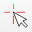
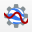

.. include:: /icon_links.rst

.. _eo4q:

Earth Observation for QGIS (EO4Q)
*********************************

Earth Observation for QGIS (EO4Q) is a collection of EnMAP-Box tools and applications designed to integrate well in both,
EnMAP-Box and QGIS environments.
In both environments, EO4Q applications can be started from the :guilabel:`Earth Observation for QGIS (EO4Q) Toolbar`:

    .. figure:: ./img/EO4QToolbar.png
            :align: center

GEE Time Series Explorer
========================

The :guilabel:`GEE Time Series Exlorer` integrates `Google Earth Engine <https://earthengine.google.com>`_ (GEE) into
QGIS/EnMAP-Box. It allows the interactive exploration of temporal raster data available in
the `Earth Engine Data Catalog <https://developers.google.com/earth-engine/datasets/>`_ .

A first version of the :guilabel:`GEE Time Series Exlorer` was released as a QGIS plugin.
Future versions will be maintained as an EO4Q application that integrates into QGIS and EnMAP-Box GUI.

Live demonstration
    ..  youtube:: UD4lKu17xwk
        :width: 100%
        :privacy_mode:

Slides from the Living Planet Symposium 2022 talk in Bonn, Germany
    Janz, A. et al. (2022, May 26).
    `GEE Time Series Explorer: Planetary-scale visualization and temporal profile sampling of EO imagery from the Earth Engine Data Catalog in QGIS and the EnMAP-Box
    <https://box.hu-berlin.de/f/941bcd4eba494c3eb6c5>`_
    [oral presentation]. Living Planet Symposium, Bonn, Germany

How to cite
    Rufin, P., Rabe, A., Nill, L., and Hostert, P. (2021)
    `GEE TIMESERIES EXPLORER FOR QGIS - INSTANT ACCESS TO PETABYTES OF EARTH OBSERVATION DATA
    <https://doi.org/10.5194/isprs-archives-XLVI-4-W2-2021-155-2021>`_
    , Int. Arch. Photogramm. Remote Sens. Spatial Inf. Sci., XLVI-4/W2-2021, 155-158,
    https://doi.org/10.5194/isprs-archives-XLVI-4-W2-2021-155-2021, 2021.

Prerequisite
    The :guilabel:`GEE Time Series Exlorer` depends on the `QGIS Google Earth Engine plugin <https://plugins.qgis.org/plugins/ee_plugin/>`_ .
    In order to access Earth Engine, you must have an Google account that is authorized for Earth Engine.
    If you haven't used Earth Engine so far, the easiest way to make sure that everything is working on your system,
    is to follow the instruction here: https://gee-community.github.io/qgis-earthengine-plugin/

Getting started
---------------

Usage
    1. Start the application from the :guilabel:`View > Panels > GEE Time Series Exlorer` menu or from the
       :guilabel:`Earth Observation for QGIS (EO4Q) Toolbar` |iconGeeTimeSeriesExplorer|.

       .. figure:: ./img/GeeTimeSeriesExplorer_DataCatalog.png
           :align: center

           GEE Time Series Explorer main panel, showing the Data Catalog tab with Landsat collections.

    2. Select a collection.

       .. figure:: ./img/GeeTimeSeriesExplorer_ProfileViewer.png
           :align: center

            GEE Time Series Explorer (Profile Viewer) panel, showing available bands and spectral indices.

Load a collection, plot a temporal profile and visualize an image
    1. Select the **Landsat 8 Surface Reflectance** collection in the **Data Catalog** tab of the main panel.
    2. Select the **NDVI** band in the **Profile Viewer** panel.
    3. Activate the **Current Location** map tool |icon_location| and select a location on the map.
       This will plot the temporal profile for that location in the **Profile Viewer** panel.
    4. Select a data point in the plot to visualize the associated image.
       The image is displayed in it's default visualization.

    .. # getting_started_1.mp4

    .. raw:: html

       <figure class="video_container">
          <video width="100%" controls="true" allowfullscreen="true">
              <source src="https://box.hu-berlin.de/f/4593643ce5144081a3cd/?dl=1" type="video/mp4">
          </video>
       </figure>

Improve image contrast stretch
    The default visualization may give a poor image contrast, which you may want to improve.
    In the **Band Rendering** tab of the main panel, you may set suitable min/max values manually,
    or specify lower/upper percentile cut off values, e.g. 2% to 98%.
    Note that the statistics are calculated for the current map extent.

    .. # getting_started_2.mp4

    .. raw:: html

       <figure class="video_container">
          <video width="100%" controls="true" allowfullscreen="true">
              <source src="https://box.hu-berlin.de/f/c2ca0938fd5d415bbd8d/?dl=1" type="video/mp4">
          </video>
       </figure>

Visualize derived vegetation indices
    Beside visualizing original image bands in Multiband color RGB,
    it is possible to visualize derived vegetation indices.

    .. # getting_started_3.mp4

    .. raw:: html

       <figure class="video_container">
          <video width="100%" controls="true" allowfullscreen="true">
              <source src="https://box.hu-berlin.de/f/c0a82f90a143444ba973/?dl=1" type="video/mp4">
          </video>
       </figure>

Prepare a cloud-free composite
    To create a composite that aggregates all images in a given date range,
    we just switch from **Image Selection** mode to **Composite Selection** mode in the **Profile Viewer** panel.
    In the plot we can now select a date range and create our first, very cloudy, composite.
    By applying a **Pixel Quality Filter** we can easily exclude all pixel affected by cloud and cloud shadow.
    And finally, we can improve the contrast stretch of the visualization.

    .. # getting_started_4.mp4

    .. raw:: html

       <figure class="video_container">
          <video width="100%" controls="true" allowfullscreen="true">
              <source src="https://box.hu-berlin.de/f/985676ab4b9c497882bb/?dl=1" type="video/mp4">
          </video>
       </figure>

Location Browser
================

The :guilabel:`Location Browser` panel allows to
a) navigate to a map location directly, or to
b) send a request to the Nominatim geocoding service.

Usage
    1. Start the tool from the :guilabel:`View > Panels > Location Browser` menu or from the
       :guilabel:`Earth Observation for QGIS (EO4Q) Toolbar`.

    2. Go to locations directly by entering the coordinates in one of the following formats:

       - ``53.07478793449, 13.895089018465338``  (longitude, latitude in decimal format)

       - ``53°04'29.2"N, 13°53'42.3"E``  (longitude, latitude in GPS format)

       - ``13.895089018465338, 53.07478793449, [EPSG:4326]``  (east, north, EPSG ID)

       Or send a request to the Nominatim geocoding service and explore the results:

       - ``berlin`` (free-form textual description of the location to be geocoded)

GUI
    .. figure:: ./img/LocationBrowser.png
        :align: center

    |

    .. figure:: ./img/LocationBrowser_2.png
        :align: center

Live demonstration
    ..  youtube:: 2mgx4_pIHqg
        :width: 100%
        :privacy_mode:

Profile Analytics
=================

The :guilabel:`Profile Analytics` panel allows to visualize various types of spectral, temporal and spatial profiles.
Additionally, profile data can be analysed by user-defined functions (ufuncs).
A ufunc has access to the plot widget and can draw additional plot items.

Usage
    1. Start the tool from the :guilabel:`View > Panels > Profile Analytics` menu or from the
       :guilabel:`Earth Observation for QGIS (EO4Q) Toolbar`.

    2. Select the :guilabel:`Source type`, that is providing the profiles.
       Note that we're currently only support raster layer as source,
       but we plan to have other sources like profiles from the :guilabel:`GEE Time Series Explorer`.

    3. Select the :guilabel:`Profile type` you want to extract from the raster layer:

    4. Select a :guilabel:`Raster`.

    5. In case of a spatial profile
       (i.e. :guilabel:`X-Profile`, :guilabel:`Y-Profile` and :guilabel:`Profile along a line`),
       also select a :guilabel:`Band`. In case of a :guilabel:`Z-Profile`),
       the selected band is ignored.

    6. :guilabel:`Style` the profile.

    7. Apply data :guilabel:`Scaling`.

    8. Choose an ufunc to perform :guilabel:`Analytics` on the profile data and add extra plot annotations.
       The ufunc has full access to the plot widget and can add plot items like:

       - plot line (e.g. fitted data, vegetation regrowth, trend lines, etc.)

       - plot marker symbols (e.g. forest clear cut events, mowing events, fire events, red-edge inflection point, etc.)

       - plot text

       - insert images

       Examples can be found under ``/enmapbox/eo4qapps/profileanalyticsapp/examples/``.

    9. Depending on the :guilabel:`Profile type` and availability of raster metadata,
       different :guilabel:`X Axis` units can be choosen:

       :guilabel:`Z-Profile` values:

       - can always be plotted against :guilabel:`Band Numbers`

       - can be plotted against :guilabel:`Wavelength`, if band center wavelength is specified

       - can be plotted against :guilabel:`Date Time`, if band (aquisition) date time is specified

       :guilabel:`X-Profile` values are always plotted against the :guilabel:`Column Number`.

       :guilabel:`Y-Profile` values are always plotted against the :guilabel:`Row Number`.

       :guilabel:`Profile along a line` values are always plotted against the :guilabel:`Distance from line start`.

    10. In case of :guilabel:`X-Profile`, :guilabel:`Y-Profile` and :guilabel:`Z-Profile`,
        use the :guilabel:`Cursor Location` map tool to select a location that specifies the profile.

        In case of :guilabel:`Profile along a line`,
        use the :guilabel:`Select Feature` map tool to select a line-vector feature that specifies the profile.

GUI
    Spectral Z-Profile
        .. figure:: ./img/ProfileAnalytics.png
            :align: center

    Temporal Z-Profiles
        .. figure:: ./img/ProfileAnalytics_2.png
            :align: center

    Temporal Z-Profile annotated with a Support Vector Regression fit (``svr_fitting.py`` used as ufunc)
        .. figure:: ./img/ProfileAnalytics_3.png
            :align: center

        |

        .. figure:: ./img/ProfileAnalytics_4.png
            :align: center

Live demonstration
    ..  youtube:: 5Un7lxw-PN8
        :width: 100%
        :privacy_mode:

Raster Band Stacking
====================

The :guilabel:`Raster Band Stacking` panel allows to stack bands into a new VRT :term:`raster layer`.
Raster bands can be selected inside the panel or added via drag&drop in various ways.

Usage
    1. Start the tool from the :guilabel:`View > Panels > Raster Band Stacking` menu or from the
       :guilabel:`Earth Observation for QGIS (EO4Q) Toolbar`.

    2. Add raster sources and select bands:

       - add a new raster source via the "+" button

       - select raster(s)  inside the :guilabel:`Data Sources` panel and drag&drop the selection into the table

       - select band(s) inside the :guilabel:`Data Sources` panel and drag&drop the selection into the table

       - select raster layer(s) inside the :guilabel:`Data Views` panel and drag&drop the selection into the table

       - select raster files inside the file explorer (e.g. Windows Explorer) and drag&drop the selection into the table

    3. Prepare the final band stack inside the table by:

       - changing individual band selections

       - removing rows

       - moving rows up and down

    4. Choose an output filename and create the band stack.
       By default, the output pixel grid (i.e. extent, resolution, crs) is derived automatically (i.e. *gdal.BuildVrt* defaults).
       To use a custom pixel grid, switch to the :guilabel:`Raster` option and select a raster.

GUI
    .. figure:: ./img/RasterBandStacking.png
        :align: center

Live demonstration
    ..  youtube:: KGKVvBwz2S0
        :width: 100%
        :privacy_mode:

Sensor Product Import
=====================

The :guilabel:`Sensor Product Import` panel allows to import various sensor products via drag&drop.
E.g. a downloaded Landsat product can be imported as is:

Landsat 9 Product Example
    .. figure:: ./img/SensorProductImport.png
        :align: center

All the surface reflectance bands are automatically stacked, band offset and scaling factors are applied,
and proper metadata, like center wavelength and band names, are specified.

Usage
    1. Start the tool from the :guilabel:`View > Panels > Sensor Product Import` menu or from the
       :guilabel:`Earth Observation for QGIS (EO4Q) Toolbar`.

    2. Drag&drop the product folder, or any file inside the product folder, into the :guilabel:`Drop Product Here` area.

    3. Run the import algorithm. Note that the result is stored next to the source product.
       When opening the product for the next time, this algorithm is not shown.

    4. Visualize the result raster.

GUI
    .. figure:: ./img/SensorProductImport_2.png
        :align: center

Live demonstration
    ..  youtube:: MDjH6SdrDME
        :width: 100%
        :privacy_mode:
