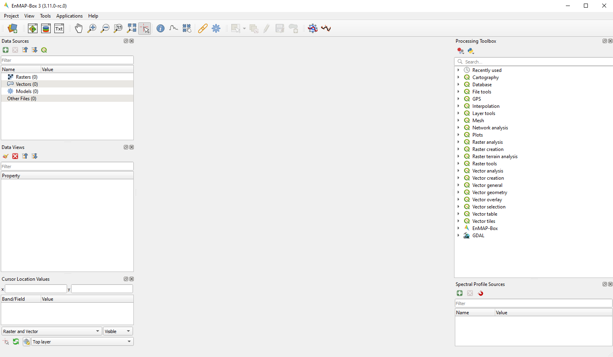

.. include:: /icon_links.rst

.. _gui:

=======
The GUI
=======

Toolbar
=======

In the toolbar you can find the most common tasks. See table below for information on different buttons and their functionality.

Data Sources
------------

.. list-table::
   :widths: auto
   :header-rows: 1

   * - Button
     - Button Name
     - Description
   * - |mActionDataSourceManager|
     - Adds a data source
     - Here you can add data from different sources, e.g. raster and vector

Maps and Views
--------------

.. list-table::
   :widths: auto
   :header-rows: 1

   * - Button
     - Button Name
     - Description
   * - |viewlist_mapdock|
     - Open a map window
     - Opens a new Map Window
   * - |viewlist_spectrumdock|
     - Open a spectral library window
     - Opens a new spectral library window
   * - |viewlist_textview|
     - Open a text window
     - Opens a new text window, you can for example use it to store metadata, take notes etc.

Map Tools
---------

.. list-table::
   :widths: auto
   :header-rows: 1

   * - Button
     - Button Name
     - Description
   * - |mActionPan|
     - Pan Map
     - Moves the map. Can also be achieved by holding the mouse wheel
   * - |mActionZoomIn|
     - Zoom In
     - Increases the zoom level. You can also scroll the mouse wheel forward.
   * - |mActionZoomOut|
     - Zoom Out
     - Decreases the zoom level. You can also scroll the mouse wheel backwards.
   * - |mActionZoomActual|
     - Zoom to native resolution
     - Zoom to the native resolution
   * - |mActionZoomFullExtent|
     - Zoom to full extent
     - Changes the zoom level of the map you click to show the full extent of all layers visualized in it
   * - |select_location|
     - Identify
     - Identify locations on the map where you click with the cursor. Use the two options on the right to specify what to identify
   * - |metadata|
     - *option:* Location value
     - Shows pixel values of all layers at the selected position
   * - |profile|
     - *option:* Pixel profile
     - Opens spectral library window (if not opened yet) and plots the spectral profile of the selected pixel
   * - |pan_center|
     - *option:* Center map
     - Moves the map center to the selected cursor location
   * - |link_basic|
     - Specify the linking between different maps
     - Opens the Map Linking Dialog
   * - |processingAlgorithm|
     - Toggle processing toolbox visibility
     - Opens the Processing toolbox panel

Vector Tools
------------

.. list-table::
   :widths: auto
   :header-rows: 1

   * - Button
     - Button Name
     - Description
   * - |mActionSelectRectangle|
     - Select features
     - Click in the image to select different features. Use the dropdown menu to choose what kind of feature to select, e.g., by polygon, freehand or radius.
   * - |mActionDeselectAll|
     - Deselect selected features
     - Click to delete selection.
   * - |mActionToggleEditing|
     - Toggle editing
     - Activate to be able to work with vector data, e.g. to edit or save features
   * - |mActionSaveEdits|
     - Save Edits
     - Hit button to save changes.
   * - |mActionCapturePoint|
     - Draw a new feature (point)
     - Add a point feature to existing data.
   * - |mActionCapturePolygon|
     - Draw a new feature (polygon)
     - Add a polygon feature to existing data.

Plugins Toolbar
---------------

.. list-table::
   :widths: auto
   :header-rows: 1

   * - Button
     - Button Name
     - Description
   * - ||
     - GEE Time Series Explorer
     - Opens the GEE Time Series Explorer in a new view.
   * - ||
     - Profile Analytics
     - Opens the Profile Analytics in a new view.

Panels
=======

Data Sources
------------

The **Data Sources** panel lists the data in your current project, comparable to the Layers panel in QGIS. The following data types and their
corresponding metadata are available:

* |mIconRasterLayer| Raster Data

  * **File size**: Metadata on resolution and extent of the raster
  * **CRS**: Shows Coordinate Reference System (CRS) information
  * **Bands**: Information on overall number of bands as well as band-wise metadata such as name, class or wavelength (if available)

    .. note::

       Depending on the type, raster layers will be listed with different icons:

       * |mIconRasterImage| for default raster layers (continuous value range)
       * |mIconRasterMask| for mask raster layers
       * |mIconRasterClassification| for classification raster layers

       Also see section on :ref:`data types <processing_data_types>` for further information.

* |mIconLineLayer| Vector Data

  * **File size**: Shows the file size and extent of the vector layer
  * **CRS**: Shows Coordinate Reference System (CRS) information
  * **Features**: Information on number of features and geometry types
  * **Fields**: Attribute information, number of fields as well as field names and corresponding datatype

* |speclib| Spectral Libraries

  * **File size**: Size of the file on hard disk
  * **Profiles**: Shows the number of spectra in the library

* |processingAlgorithm| Models

**Buttons of the Data Sources panel:**

.. csv-table::
   :header: "Button", "Description"
   :widths: auto

   |mActionDataSourceManager|, "This button lets you add data from different sources, e.g. raster and vector. Same function as |add_datasource|."
   |mActionRemove|, "Remove layers from the Data Sources panel. First select one or more and then click the remove button."
   |mActionCollapseTree|, "Collapses the whole menu tree, so that only layer type groups are shown."
   |mActionExpandTree|, "Expands menu tree to show all branches."
   |qgis_icon|, "Synchronizes Data Sources with QGIS."

.. tip::
   * If you want to remove all layers at once, right-click in the Data Sources panel and and select :guilabel:`Remove all DataSources`
   * The EnMAP-Box also supports Tile-/Web Map Services (e.g. Google Satellite or OpenStreetMap) as a raster layer. Just add them to
     your QGIS project as you normally would, and then click the |qgis_icon| :superscript:`Synchronize Data Sources with QGIS`
     button. Now they should appear in the data source panel and can be added to a Map View.

Data Views
----------

The Data Views panel organizes the different windows and their content.
You may change the name of a Window by double-clicking onto the name in the list.

**Buttons of the Data Views panel:**

.. csv-table::
   :header-rows: 1
   :widths: auto
   :delim: ;

   Button; Description
   |symbology|; Open the Raster Layer Styling panel
   |mActionRemove|; Remove layers from the Data Views panel. First select one or more and then click the remove button.
   |mActionCollapseTree|;  Collapses the whole menu tree, so that only layer type groups are shown.
   |mActionExpandTree|; Expands menu tree to show all branches.

**Organization of the Data Views panel:**

.. figure:: ../../img/example_data_views.png
   :width: 100%

   Example of how different window types and their contents are organized in the Data Views panel. In this case there
   are two Map Windows and one Spectral Library Window in the project.

Map Window |viewlist_mapdock|
~~~~~~~~~~~~~~~~~~~~~~~~~~~~~

The map window allows you to visualize raster and vector data. It is interactive, which means you can move the content or
zoom in/out.

* In order to add a new Map Window click the |viewlist_mapdock| :superscript:`Open a Map Window` button. Once you added a
  Map Window, it will be listed in the ``Data Views`` panel.
* Add layers by either drag-and-dropping them into the Map Window (from the Data Sources list) or right-click onto
  the layer :menuselection:`--> Open in existing map...`
* You can also directly create a new Map Window and open a layer by right-clicking the layer :menuselection:`--> Open in new map`

.. can display raster and vector data (+ layer styling as is QGIS)
.. a variety of alignment options (maybe show animated gif)

Linking
^^^^^^^

You can link multiple Map Windows with each other, so that the contents are synchronized. The following options are
available:

* |link_mapscale_center| Link map scale and center
* |link_mapscale| Link map scale
* |link_center| Link map center

In order to link Map Windows, go to :menuselection:`View --> Set Map Linking` in the menu bar, which will open the following dialog:

    .. figure:: /img/map_linking.png
       :align: center
       :width: 30%

Here you can specify the above mentioned link options between the Map Windows. You may either specify linkages between pairs
or link all canvases at once (the :guilabel:`All Canvases` option is only specifiable when the number of Map Windows is > 2). Remove
created links by clicking |link_open|.

.. raw:: html

   
<video width="100%" controls><source src="../../_static/videos/maplinking.webm" type="video/webm">Your browser does not support HTML5 video.</video>
   
<i>Demonstration of linking two Map Windows</i>

Crosshair
^^^^^^^^^

* Activate the crosshair by right-clicking into a Map Window and select :menuselection:`Crosshair --> Show`
* You can alter the style of the crosshair by right-clicking into a Map Window and select :menuselection:`Crosshair --> Style`

    .. figure:: /img/crosshair_style.png
       :align: center
       :width: 40%

Spectral Profile Sources
------------------------

see Section on :ref:`spectral_libraries_spectral_profile_sources`

.. _processing_toolbox:

Processing Toolbox
------------------

The processing toolbox is basically the same panel as in QGIS. Here you can find all EnMAP-Box processing algorithms
listed under *EnMAP-Box*. In case it is closed/not visible you can open it by clicking the |processingAlgorithm|
button in the menubar or :menuselection:`View --> Panels --> QGIS Processing Toolbox`.

    .. figure:: /img/processing_toolbox.png
       :align: center
       :width: 40%

See `QGIS Documentation - The toolbox <https://docs.qgis.org/3.22/en/docs/user_manual/processing/toolbox.html>`_ for further information.

Cursor Location Values
----------------------

This tools lets you inspect the values of a layer or multiple layers at the location where you click in the map view. To select a location (e.g. pixel or feature)
use the |select_location| :superscript:`Select Cursor Location` button together with the |cursorlocationinfo| :sup:`Identify cursor location value` option activated and click somewhere in the map view.

* The Cursor Location Value panel should open automatically and list the information for a selected location. The layers will be listed in the order they appear in the Map View.
  In case you do not see the panel, you can open it via :menuselection:`View --> Panels --> Cursor Location Values`.

    .. figure:: /img/cursorlocationvalues.png
       :align: center
       :width: 40%

* By default, raster layer information will only be shown for the bands which are mapped to RGB. If you want to view all bands, change the :guilabel:`Visible` setting
  to :guilabel:`All` (right dropdown menu). Also, the first information is always the pixel coordinate (column, row).
* You can select whether location information should be gathered for :guilabel:`All layers` or only the :guilabel:`Top layer`. You can further
  define whether you want to consider :guilabel:`Raster and Vector` layers, or :guilabel:`Vector only` and :guilabel:`Raster only`, respectively.
* Coordinates of the selected location are shown in the :guilabel:`x` and :guilabel:`y` fields. You may change the coordinate system of the displayed
  coordinates via the |mActionSetProjection| :superscript:`Select CRS` button (e.g. for switching to lat/long coordinates).

Windows
==========

Map Window
-----------

    .. figure:: /img/mapWindow.png
       :align: center
       :width: 100%

Spectral Library Window |viewlist_spectrumdock|
-----------------------------------------------

Text Window |viewlist_textview|
-------------------------------

    .. figure:: /img/textWindow.png
       :align: center
       :width: 100%
