.. _processing_data_types:

Processing Data Types
*********************

.. specify supported drivers for output

Raster
======

* Can be any `GDAL readable raster format <https://gdal.org/formats_list.html>`_

.. Any GDAL readable raster
.. no data wert wichtig (band-wise) -> hinweis auf metadata editor: auslesen und ändern dieses wertes

.. warning:: If no nodata value is defined, GDAL will automatically assume 0, which might lead to artifacts at the image edges.
             Therefore always specify the nodata value, band-wise if necessary. You might use the :ref:`Metadata Editor <metadata_editor>` for this.

Vector
======

* Can be any `OGR readable vector format <https://gdal.org/ogr_formats.html>`_
* A vector layer is a list of features, where every feature consists of a geometry and attributes
.. Layer from any OGR readable vector dataset
.. brief intro into vector layer (geometry + attribute) = feature
.. Layer besteht aus liste von features, jedes feature geometry + attributes
.. screenshot_ layer+ attributtabelle

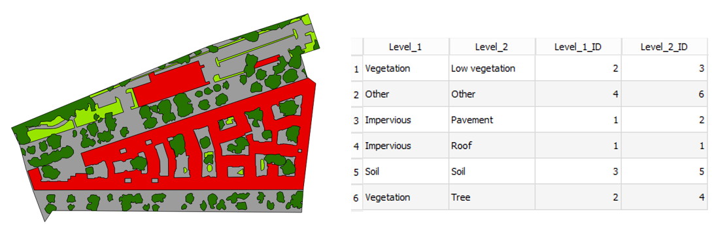

   Example of the vector dataset :ref:`landcover_berlin_polygon.shp <shp_berlingradient>` from the test dataset with
   geometries (i.e. polygon) and corresponding attribute table.

.. _datatype_mask:

Mask
====

Any GDAL/OGR readable raster or vector file can be interpreted as a boolean mask.

    * In case of a raster, all pixels that are equal to the no data value (default is 0) are interpreted as False, all other pixels as True.
      Multiband rasters are first evaluated band wise. The final mask for a given pixel is True, if all band wise masks for that pixel are True.

    .. list-table::
       :name: rastermasks
       :align: left
       :header-rows: 1

       * - Image
         - Mask Layer (Raster)
         - Binary Mask
       * - |mask_image|
         - |hires|
         - |mask_raster|

    * In case of a vector, all pixels covered by features are interpreted as True, all other pixels as False. This means:

      * ... for point features: If point falls inside the pixel, it is mapped to True
      * ... for line features: If pixel is on line render path, it is mapped to True
      * ... for polygon features: If the center of the pixel is within the polygon, the pixel is mapped to True

    .. list-table::
       :name: vectormasks
       :align: left
       :header-rows: 1

       * - Image
         - Mask Layer (Vector)
         - Binary Mask
       * - |mask_image|
         - |poly|
         - |mask_poly|
       * - |mask_image|
         - |points|
         - |mask_point|
       * - |mask_image|
         - |line|
         - |mask_line|

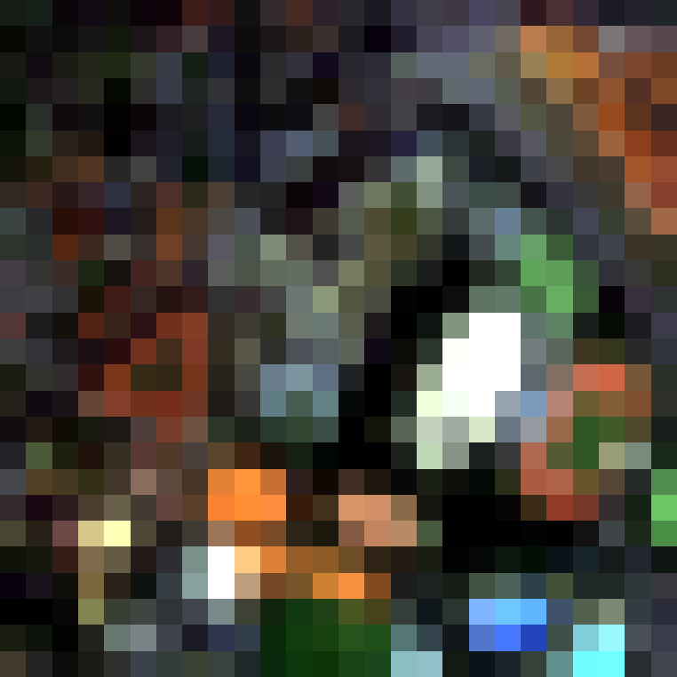
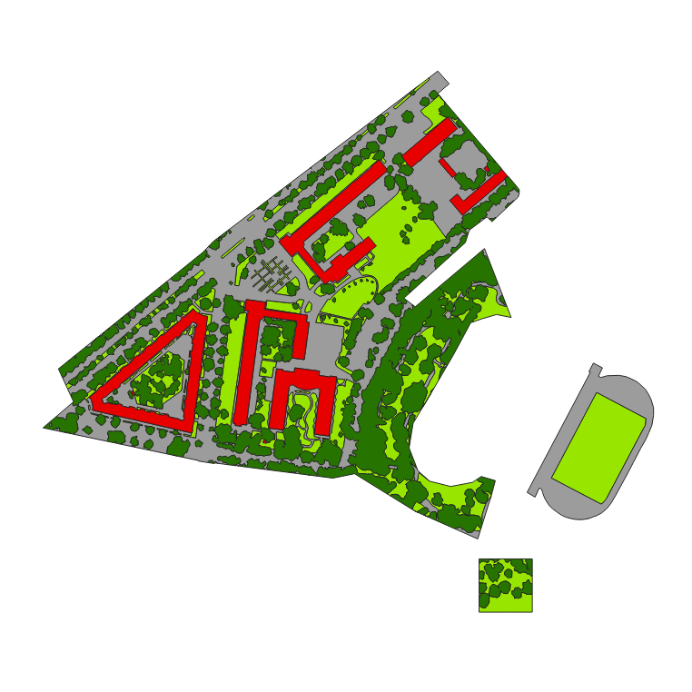
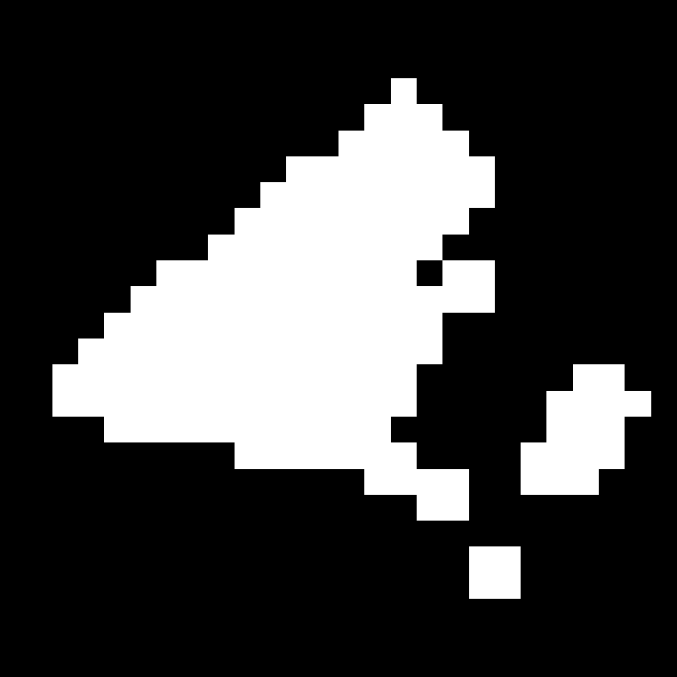
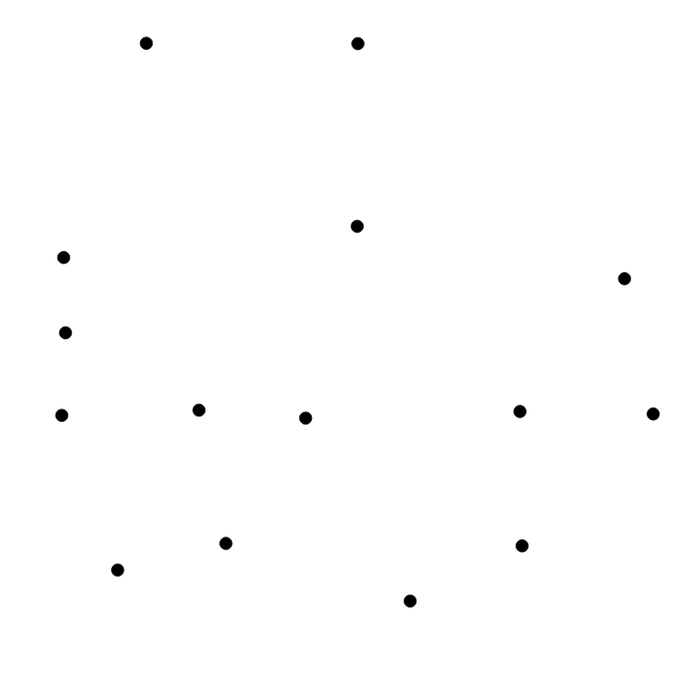
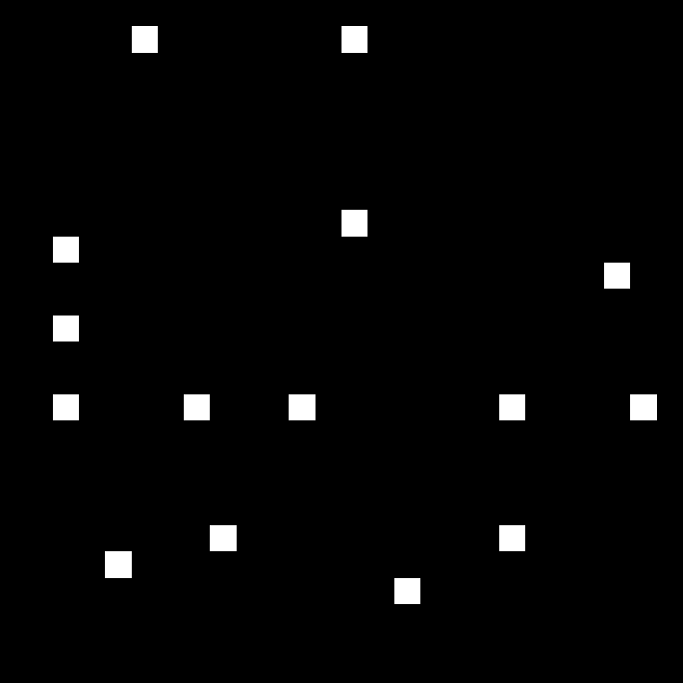
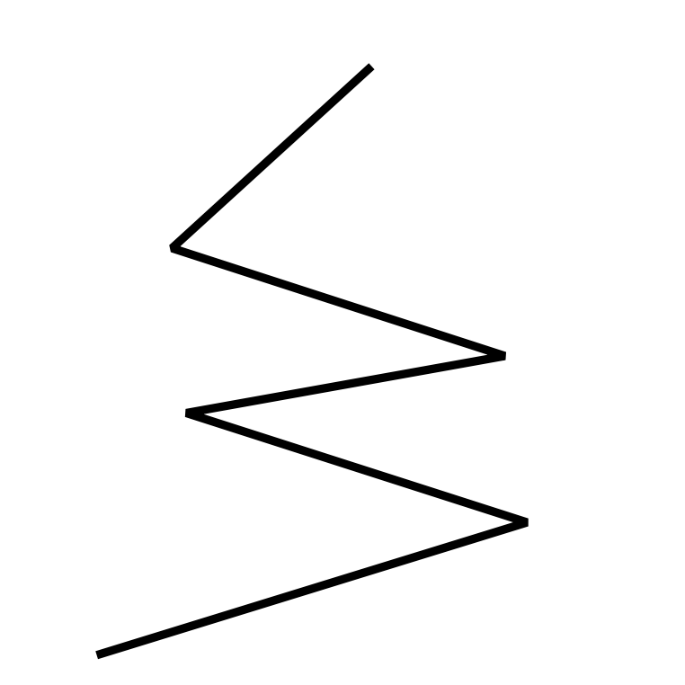
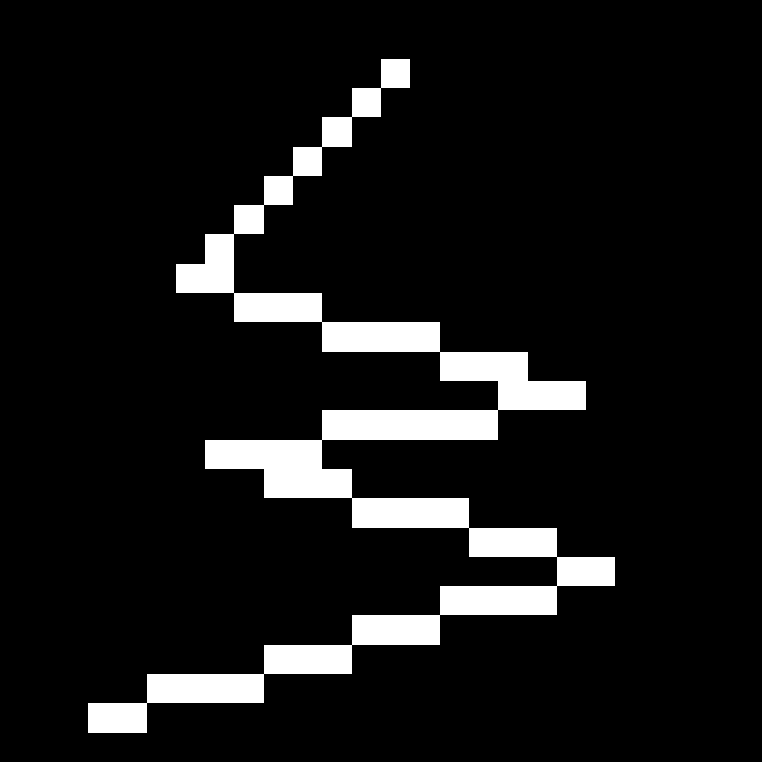
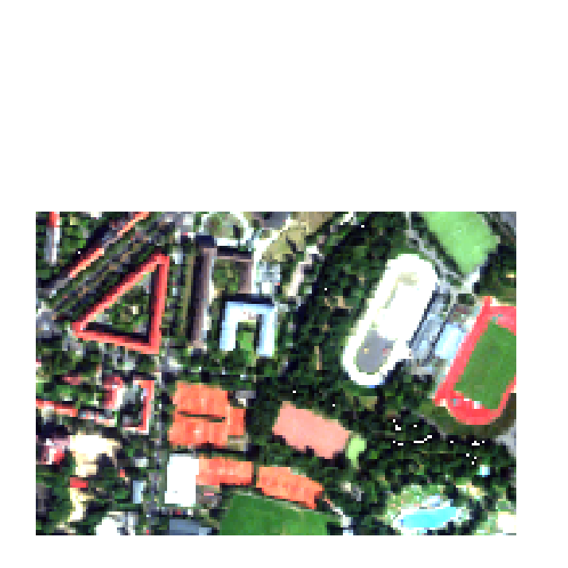

.. _datatype_classification:

Classification
==============

* A classification is a representation of a map holding categorical information.
* 0 will be implicitly assumed as nodata value
* Metadata for class names and colors are saved in the ENVI metadata domain (``class names``, ``class lookup``). If those
  parameters are not defined, classes will be numbered consecutively and random colors will be used.
* The class *unclassified* is always expected to be 0 and will be treated as nodata.

  .. figure:: ../../img/classification_metadata.png

     Example of the metadata of a classification image viewed in the :ref:`Metadata Editor <metadata_editor>`

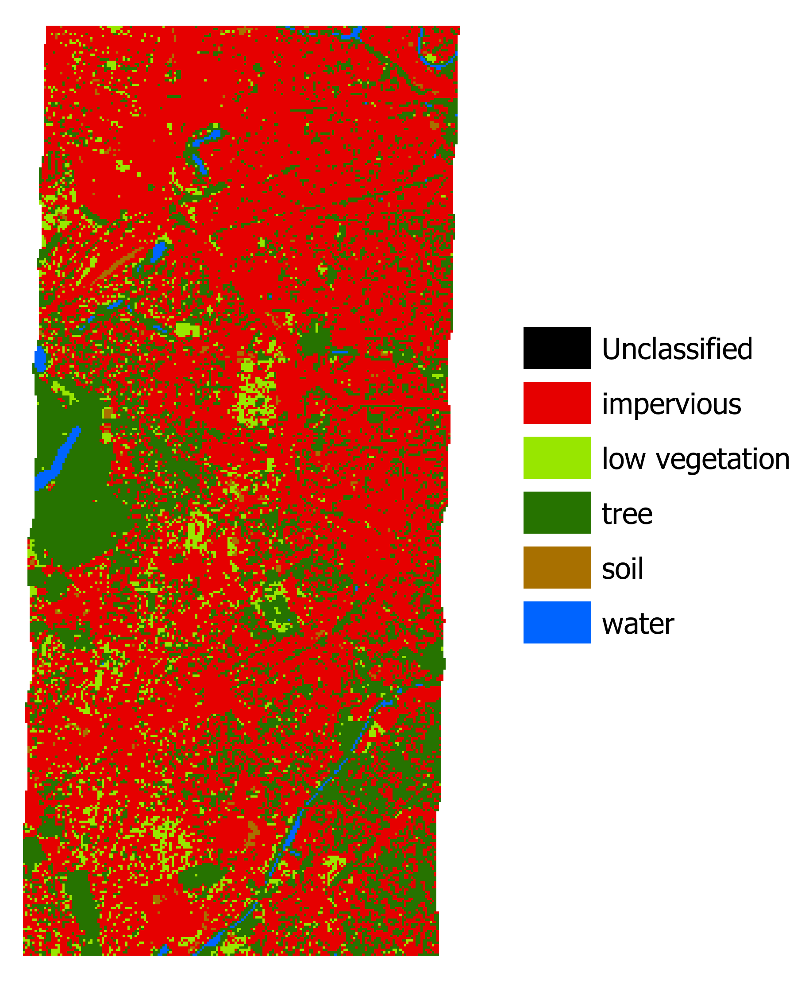

   Example of a classification image with corresponding classes, derived from the EnMAP test dataset

.. is a representation of a map holding categorical information
.. screenshot + tabelle mit required metadata

.. 1 kanal rasterbild (minimalanforderung)
.. optional: metadaten für klassennamen und farben (in der ENVI Metadatendomäne [key: class names, class lookup]
.. wenn nicht gesetzt, werden klassen durchnummeriert und farben random gesetzt
.. wenn float datensatz: verhalten unklar (TODO), möglichkeit: wenn float, fehlermeldung, oder wenn ganzzahl trotzdem als classification?
.. ABER wenn float und metadaten gesetzt -> OK
.. als no data wert wird implizit immer 0 angenommen
.. unclassified klasse ist immer ID0 und wird immer als nodata behandelt

Regression
==========

* A regression is a representation of a map holding quantitative information.
* The number of bands and the band names are dependent on the number of response variables.
* The nodata value has to be defined
* Band names are stored in the GDAL band descriptions

.. is a representation of a map holding quantitative information
.. multiband raster, bandnames sind namen der targets variables
.. muss zwingend nodata wert gesetzt haben
.. band namen sind gdal band descriptions (auch ersichtlich in metadtane editor)

Fraction
========

* Special form of regression, where the quantitative information is representing class fractions (relative coverage of a class inside a pixel).
* Optional: Metadata for class names and colors are stored in the ENVI metadata domain (``class names``, ``class lookup``).
  In this case there is no *unclassified* class (compared to Classification)

  .. figure:: ../../img/fraction_metadata.png
     :alt: Screenshot of fraction image metadata

     Example of the metadata of a fraction image viewed in the :ref:`Metadata Editor <metadata_editor>`

.. muss zwingend nodata wert gesetzt haben
..  bedingungen regression
.. optional: metadaten für klassennamen und farben (in der ENVI Metadatendomäne [key: class names, class lookup]
.. beachten: hier keine unclassified klasse! (vgl. classification)

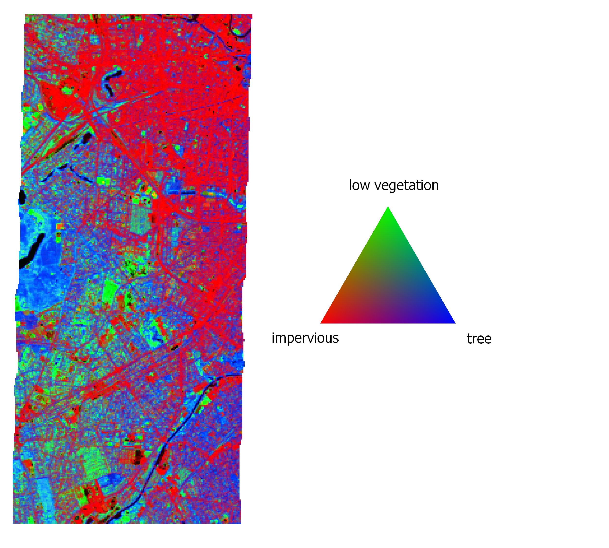

   Example of a fraction image holding class fraction information visualized in RGB,
   where *R = percent impervious*, *G = percent low vegetation* and *B = percent tree*

Spectral Library
================

The EnMAP-Box supports the ENVI standard spectral library format (.sli + .hdr file). Spectral libraries can be imported
as single line raster using the processing algorithm :menuselection:`Auxillary --> Import Library`.

.. todo:: Support for further formats will be implemented soon (e.g. import spectral library from ASD field spectrometer)

.. screenshot von der tetslibrary im speclib viewer

.. Auxillary -> Import Library

Labelled Spectral Library
=========================

The labelled spectral library extents the default .sli format by adding additional metadata information (e.g., class labels, class colors).
This information is stored by adding a .csv and .json file to the default spectral library, so that the labelled spectral library consists of

* .sli file (ENVI standard)
* .hdr file (ENVI standard)
* .csv file (containing the additional information)

  * should be comma-separated csv
  * should have same basename as .sli file
  * first row stores the headers, where the first element has to be the spectra names as specified in the .hdr file:

    .. code-block:: csv

       spectra names, attribute1, attribute2

  * Example from the EnMAP-Box test dataset:

    .. figure:: ../../img/speclib_csv_example.png
       :width: 100%

* .json file (stores class name and class color information)

  * should have same basename as .sli file
  * class name and color information should be provided for every attribute in the csv:

    .. code-block:: json

      {
        "attribute_name": {
          "categories":  [
            [0, "unclassified", [0, 0, 0]],
            [1, "class1", [230, 0, 0]],
            [2, "class2", [56, 168, 0]],
            [3, "class3", [168, 112, 0]],
            [4, "class4", [0,100,255]]
          ],
          "no data value": 0,
          "description": "Classification"
      }

  * The keys ``categories``, ``no data value`` and ``description`` should not be altered. But change ``attribute_name`` according to your data.
  * ``no data value`` should be supplied
  * Example from the EnMAP-Box test dataset:

    .. figure:: ../../img/speclib_json_example.png
       :width: 100%

.. aufbau: .sli + .hdr + csv

.. hdr: (ENVI standard) wichtig wavelength information

.. csv header names referenzieren zu spectra names in hdr datei

.. zweite csv:
.. classification case: Klassenname; KLassenname (rgb tuple) ,basename.attributname.classdef.csv

.. regression case: klasse + farbtuple + nodata wert  , basename.attributname.regrdef.csv

Models
======

* Certain algorithms produce output files with model information stored as **.pkl** file (e.g. algorithms starting with *Fit ...*)
* There 4 kinds of model files: **Classifiers**, **Clusterers**, **Regressors** and **Transformers**.
* The content of those files can be inspected in the Data Sources panel

.. note::

    You can generate example model files which are based on the EnMAP-Box test dataset. In the processing algorithms under
    :menuselection:`EnMAP-Box --> Auxilliary` you can find one algorithm for each kind of model file:

    * Create Test Classifier (RandomForest)
    * Create Clusterer (KMeans)
    * Create Regressor (RandomForest)
    * Create Transformer (PCA)

.. Erwähnen dass manche Algorithmen Regressoren;Klassifikatoren etc. generieren

.. jede kategorie anlegen unterübschrift, screenshot (random forest als beispiel, clusterer kmeans, transformer pca)

