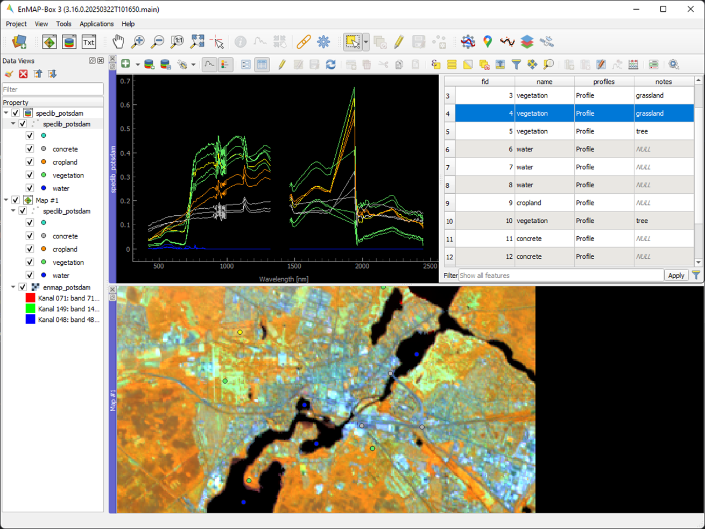

.. _speclib:

Spectral Libraries
##################

Spectral Libraries are collections of spectral profiles with additional attributes to describe these profiles.
The EnMAP-Box stores spectral profile in vector layers. Compared to *"traditional"*
spectral library formats, this offers some advantages:

* we can link spectral profiles to spatial geometries (points, lines, polygons) and display them in GIS maps.
  For example locations of image endmembers
  or where measurments have been takenn with a field spectrometer,

* we can use QGIS/GDAL functionality to ensure data integrity by design to avoid incorrect or inconsistent attribute values.
  For example, we can ensure that the values of a numerical attribute *leaf area index* have to be within a reasonable ranges,
  and the values of a categorical attribute *material_type* need to be taken from a list of predefined material names.

* we can store spectral profiles in a wide range of well-known and widely supported data backends, ranging from local file types like
  `GeoJSON <https://geojson.org/>`_ or `GeoPackage <https://www.geopackage.org/>`_ to remote server hosted databases like `PostgreSQL. <https://www.postgresql.org/>`_

Spectral Profile
----------------

A single spectral profile contains the minimum information that is required to draw a profile.
This information is stored in a JSON dictionary that contains at least a list `y` with profile values:

.. code-block:: text

    {
        "y": [0.1011, 0.1018, ... , 0.1080]
    }

Optionally, we can specify the position of the spectral values (`y`) along the x-axis, axis units (`yUnit`, 'xUnit'), and a
list of bad band multipliers (`bbl`):

.. code-block:: text

    {
        "y": [0.1011, 0.1018, ... , 0.1080],
        "x": [418.24, 423.874, ... , 2445.53],
        "xUnit" : "nanometers",
        "yUnit" : "reflectance",
        "bbl" : [1, 0, ... , 1]
    }

The EnMAP-Box reads and writes these dictionaries of spectral profile values
from any vector layer field of the following data types:

.. list-table:: Datatypes to store spectral profiles
    :header-rows: 1

    * - Data Type
      - SQL
      - GDAL/OGR
      - Qt/QGIS
      - Notes
    * - Text, Strings
      - TEXT, VARCHAR
      -
      -
      - needs to support an arbitrary length
    * - JavaScript Object Notation
      - `JSON, JSONB <https://www.postgresql.org/docs/current/datatype-json.html>`_
      -
      - `QVariantMap <https://qthub.com/static/doc/qt5/qtcore/qmetatype.html#details>`_
      -
    * - Binary Large Objects
      - BLOB
      -
      - `QByteArray <https://qthub.com/static/doc/qt5/qtcore/qmetatype.html#details>`_
      - deprecated, please use TEXT, VARCHAR or JSON data tyoes

But how does the EnMAP-Box know which fields contain spectral profiles and which contain other text values?
Fields from vector layers that are intended to contain spectral profiles must be assigned the widget type *Spectral Profiles*.
This can be done in the Vector Layer Properties or using the QGIS API.

.. figure:: img/speclib/attribute.png
    :width: 60%

Other attributes used to describe spectral profiles, such as a *name* or the *date* on which the profile was measured,
are best stored in conventional vector attributes with a suitable data type.
This makes them easy to search using QGIS/GDAL functions, for example to filter spectral profiles based on
their attributes.

Spectral Library Viewer
-----------------------

The main tool to display spectral profiles in the EnMAP-Box is the Spectral Library Viewer.
It can be used to visualize profile from different spectral libraries / vector layers and allows to
customize the visualization along vector layer attributes.

Simlar to a map canvas, where you can display different raster and vector layers,
the Spectral Library Viewer displays different profile fields from vector layers.
This is organized in *profile visualizations*, where each single visualization defines the profile's:

* source: vector layer and field the profiles are stored in
* style: line type, symbol type, color
* name:
* filter: this allows you to display only thoose profiles that match a specific QGIS expression, e.g. `class_type='vegetation'`

Import and Export Profiles
--------------------------

Attribute Table
---------------

In der QGIS Attribut Tabelle können
The QGIS attribute table can be switched into the editor view mode

Spectral Library API
--------------------

