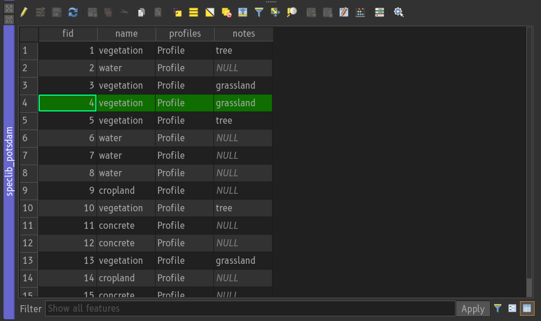
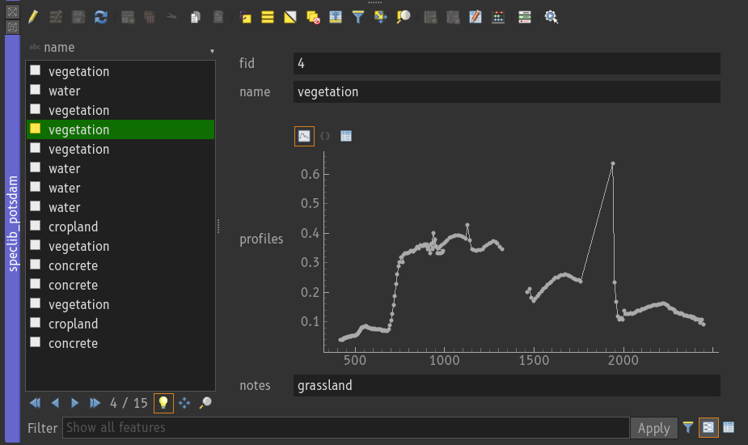

.. _speclib:

Spectral Libraries
##################

Spectral Libraries are collections of spectral profiles and attributes that describe these profiles.
The EnMAP-Box stores spectral profile in vector layers. Compared to *"traditional"*
spectral library formats like CSV text files or the ENVI Spectral library format, this offers some advantages:

* we can link spectral profiles to spatial geometries (points, lines, polygons) and display them in GIS maps.
  For example to show the locations of collected image endmembers or where measurements have been taken with a field spectrometer.

* we can store spectral profiles in a wide range of well-known data formats, ranging from local file types like
  `GeoJSON <https://geojson.org/>`_ or `GeoPackage <https://www.geopackage.org/>`_ to powerful
  database management systems like `PostgreSQL. <https://www.postgresql.org/>`_

* we can link spectral profiles with an arbitrary number of numeric, textual or categorical attributes, each having a dedicated data types

* we can link spectral profiles with other spectral profiles, e.g. pairs of "white reference" and "target" measurements

* we can use QGIS/GDAL or data format-specific features to prevent incorrect values and ensure data integrity by design.
  For example, we can ensure that values of a numerical attribute *leaf area index* have to be within a reasonable range,
  or that values of a categorical attribute *material_type* need to be taken from a list of predefined material names.

.. figure:: img/speclibs/overview.png
    :width: 60%

Spectral Library Viewer
-----------------------

The main tool to display spectral profiles in the EnMAP-Box is the Spectral Library Viewer.
It can be used to show profiles from different profile fields and different spectral libraries.

.. figure:: img/speclibs/speclibviewer.png

The settings tree define the *profile visualizations*, where each visualization defines:

* the profile source: the vector layer and field to read spectral profiles from
* the profile style: line type, symbol type, color
* the profile name: a QGIS expression to generate a name that is used in the legend
* an optional filter, e.g. to display only profiles that match a criterion, like `class_type='vegetation'`

Selecting profiles in the profile plot does select their features in linked views, e.g. the geometries in a map or rows in an attribute table which show the same vector layer.

.. figure:: img/speclibs/speclibviewer_selected_features.png

    When profiles are selected in the spectral library viewer, the corresponding vector features will also be selected in the map (top) and attribute table (bottom).

Attribute Table
---------------

The Attribute Table widget is used to inspect profile attribute values. This can be done in *table view* or *form view*. In the View form, the values of an individual spectral profile can be displayed either as a graph, as JSON text, or in a table.

    Spectral Library in attribute table widget with table view.

    Spectral Library in attribute table widget with form view.

Profile Data
------------

A single spectral profile contains the minimum information that is required to draw a profile.
This information is stored in a JSON dictionary that contains at least a list `y` with profile values:

.. code-block:: text

    {
        "y": [0.1011, 0.1018, ... , 0.1080]
    }

Optionally, we can specify the position of the spectral values (`y`) along the x-axis, axis units (`yUnit`, 'xUnit'), and a
list of bad band multipliers (`bbl`):

.. code-block:: text

    {
        "y": [0.1011, 0.1018, ... , 0.1080],
        "x": [418.24, 423.874, ... , 2445.53],
        "xUnit" : "nanometers",
        "yUnit" : "reflectance",
        "bbl" : [1, 0, ... , 1]
    }

The EnMAP-Box can read and write spectral profile from or to any vector layer field that is of the following data types:

.. list-table:: Datatypes to store spectral profiles
    :header-rows: 1

    * - Data Type
      - SQL
      - GDAL/OGR
      - Qt/QGIS
      - Notes
    * - Text, Strings
      - TEXT, VARCHAR
      -
      -
      - needs to support an arbitrary length
    * - JavaScript Object Notation
      - `JSON, JSONB <https://www.postgresql.org/docs/current/datatype-json.html>`_
      -
      - `QVariantMap <https://qthub.com/static/doc/qt5/qtcore/qmetatype.html#details>`_
      -
    * - Binary Large Objects
      - BLOB
      -
      - `QByteArray <https://qthub.com/static/doc/qt5/qtcore/qmetatype.html#details>`_
      - deprecated, please use TEXT, VARCHAR or JSON data types

Profile Fields
--------------

Text, json or blob fields of a vector layer may be used for different purposes. It is therefore required to inform the EnMAP-Box which of them contain spectral profiles. This is achieved by assigning the *SpectralProfile* widget type to a layer field, either using the Layer Property Dialog or Python:

.. tabs::

    .. tab:: Layer Property Dialog
        To use a vector layer field for storing spectral profiles

        1. Open the *Layer Properties* and select the *Attributes Form* page
        2. Select the text or JSON field to store profiles
        3. Choose *SpectralProfile* as *Widget Type*

        .. figure:: img/speclibs/layerproperties_attributeform.png

            The *SpectralProfile* widget type tells the EnMAP-Box, which layer fields can contain vector spectral profiles.

    .. tab:: PyQGIS

        .. code-block:: python

            from qgis.core import QgsVectorLayer, QgsEditorWidgetSetup

            layer = QgsVectorLayer('myspeclib.gpkg')
            # other code
            i = layer.fields().indexOf('profiles')
            layer.setEditorWidgetField(i, QgsEditorWidgetSetup('SpectralProfile', {}))

The profile fields of vector layers that opened in the EnMAP-Box, e.g. as layer in a map, can be selected as source for a profile visualization

.. figure:: img/speclibs/speclibview_multiple_speclibs.png

    Selection of a profile field as source for a visualization.

Collect Profiles
----------------

The identify map tool can be used to collect spectral profiles from displayed raster layers.

1. Activate the *Identify map tool* and its option *Identify pixel profiles*.
2. Click on a raster pixel

By default, this create a new in-memory vector layer "Profiles #1" and opens a spectral library viewto show it. The *Spectral Profile Sources* panel can be used to specify how profiles are collected, e.g. from which raster layer, and to which vector layer field they will be written. In addition it allows to specify values for other other fields of the vector layer too, e.g. to generate a profile name automatically.

.. figure:: img/speclibs/profilesourcepanel.png

    The spectral profile source panel described how profiles are collected and written to vector layers.

Import Profiles
---------------

The *Import Spectral Profiles* (``enmapbox:importspectralprofiles``) algorithm loads profiles from different sources into a new vector layer. The algorithm tries to identify the format of each source file on its own.
However, to improve speed it is useful to specify the file input type explicitly:

.. list-table:: File types from which spectral profiles can be imported
    :header-rows: 1

    * - Input File Type
      - Description
    * - ASD
      - Binary file output created by `ASD Field Spectrometers <https://www.malvernpanalytical.com/en/products/product-range/asd-range/fieldspec-range>`_
    * - ECOSTRESS
      - CSV text files from the NASA JPL ECOSTRESS Spectral Library https://speclib.jpl.nasa.gov/
    * - ENVI
      - `ENVI Spectral Library <https://www.nv5geospatialsoftware.com/docs/enviheaderfiles.html>`_ binary format
    * - EcoSIS
      - CSV text files from the `Ecological Spectral Information System (EcoSIS) <https://ecosis.org/>`_
    * - GeoJSON
      - EnMAP-Box Spectral Library, saved as GeoJSON
    * - GeoPackage
      - EnMAP-box Spectral Library, saved as GeoPackage
    * - SED
      - Text file output created by `Spectral Evolution Spectroradiometers <https://spectralevolution.com/>`_
    * - SVC
      - Text file output created by `Spectral Vista Corporation Spectroradiometers <https://spectravista.com/>`_

.. figure:: img/speclibs/import_profiles.png

Export Profiles
---------------

The *Export Spectral Profiles* (``enmapbox:exportspectralprofiles``) algorithm allows to spectral profiles in
other file formats. It requires to specify the *Profile Field* to take the profile data from and a field or expression
to generate for each profile a name.

.. list-table:: File types into which spectral profiles can be exported
    :header-rows: 1

    * - Export File Type
      - Extension
      - Description
    * - ENVI Spectral Library
      - `*.sli`
      - `ENVI Spectral Library <https://www.nv5geospatialsoftware.com/docs/enviheaderfiles.html>`_ binary format
    * - EcoSIS
      - `*.csv`
      - CSV text files used by `Ecological Spectral Information System (EcoSIS) <https://ecosis.org/>`_
    * - GeoJSON
      - EnMAP-Box Spectral Library, saved as GeoJSON
    * - GeoPackage
      - EnMAP-box Spectral Library, saved as GeoPackage

.. figure:: img/speclibs/export_profiles.png

