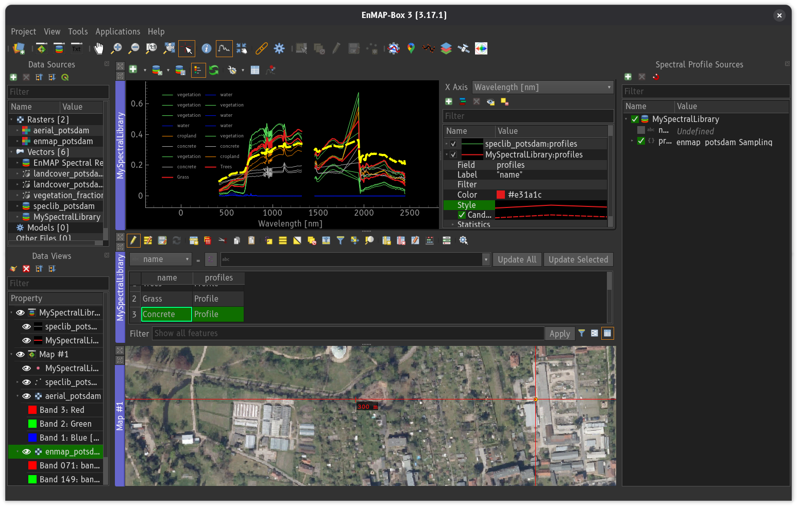
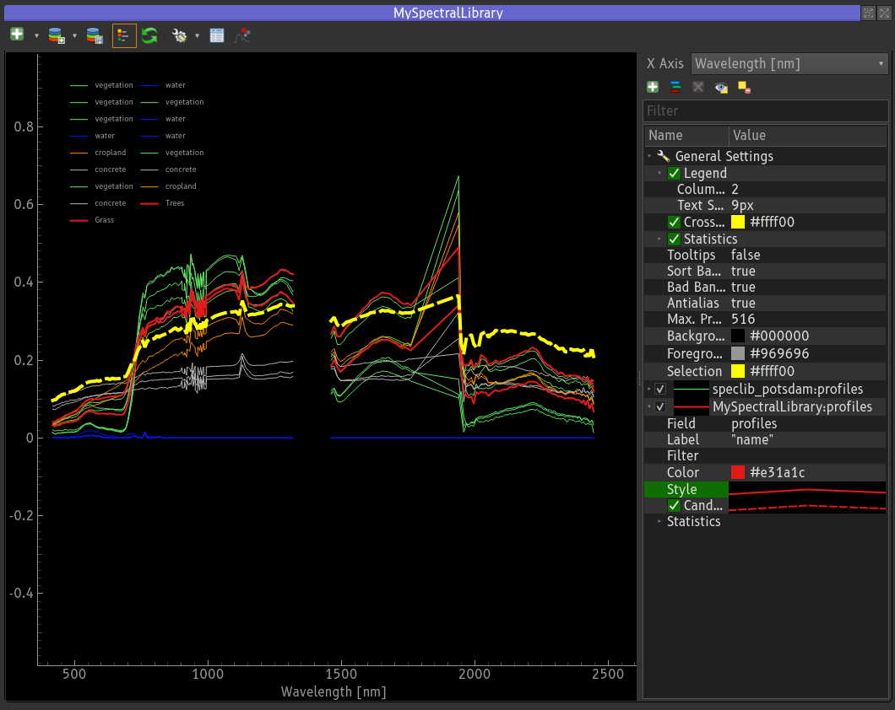
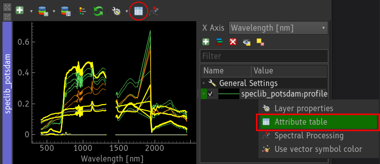
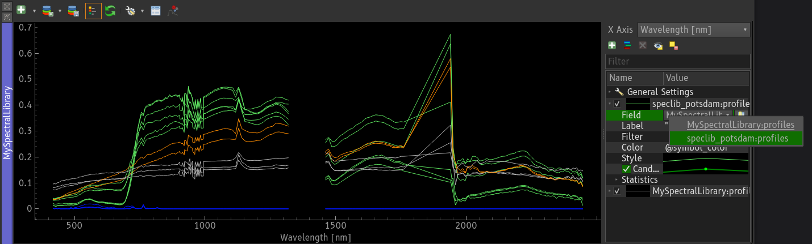
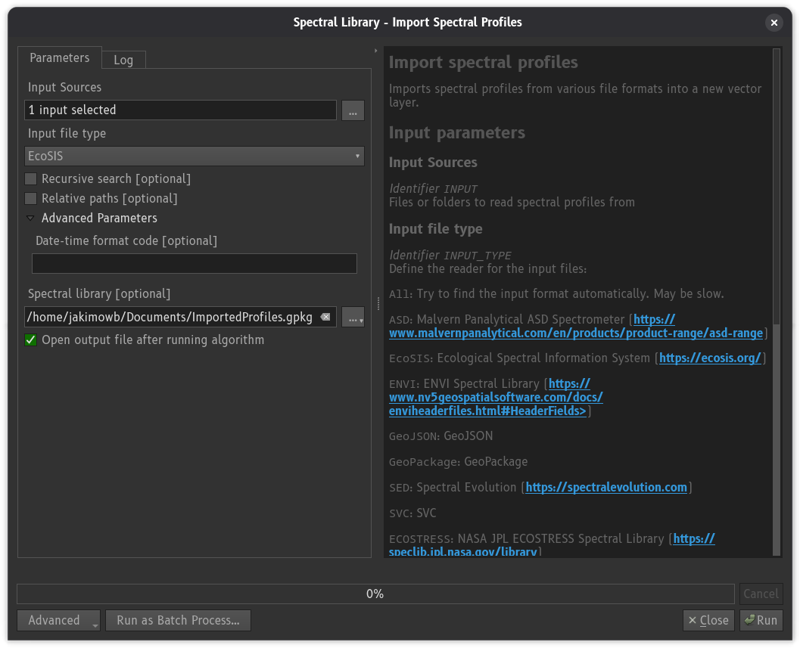
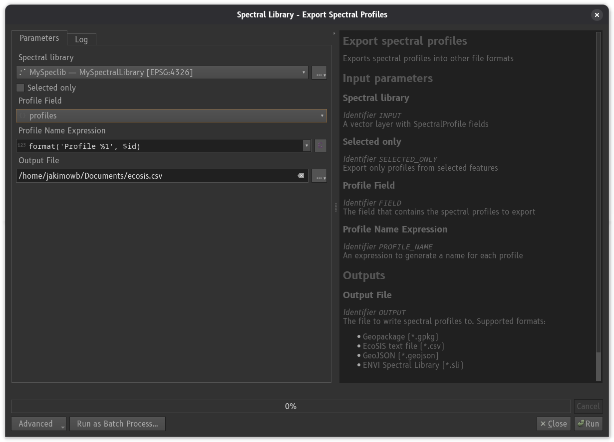

.. _speclib:

|speclib| Spectral Libraries
############################

Spectral Libraries are collections of (i) spectral profiles and (ii) attributes that describe these profiles.
The EnMAP-Box stores spectral profiles in vector layers. Compared to "traditional" spectral library
formats like CSV text files or the ENVI Spectral library format, this has some advantages:

* we can link spectral profiles to geometries (points, lines, polygons) and easily display them in GIS maps.
  For example the locations of measurements made with a field spectrometer.

* spectral profiles can be linked with other spectral profiles. For example a "target" measurement and the related
  "white reference" measurement can be stored together in the same vector layer feature.

* spectral profiles can be linked with an arbitrary number of numeric, textual or categorical attributes,
  each having a dedicated data type. We can use QGIS/GDAL or data format-specific features to prevent
  incorrect values and ensure data integrity by design.
  For example, is can be ensured that *leaf area index* values have to be numeric and larger zero,
  or that values of an attribute *material_type* need to exist in a list of predefined material names.

* spectral profiles can be stored in a wide range of data formats, ranging from local file types like
  `GeoJSON <https://geojson.org/>`_ or `GeoPackage <https://www.geopackage.org/>`_ to powerful
  database management systems like `PostgreSQL. <https://www.postgresql.org/>`_. Each of them may have
  its own advantages, often specific to the project, user and metadata to be stored together with
  spectral profiles.

Since spectral profiles and their metadata are usually offered in different formats (ENVI, ASD, text files, ...)
the EnMAP-Box supports to :ref:`import profiles <speclib_import_profiles>` from wide range of file types.

    EnMAP-Box, showing profiles from the `speclib_potsdam.zip` example library, together with profiles collected from an EnMAP example image.

.. _spectral_library_viewer:

|viewlist_spectrumdock| Spectral Library Viewer
-----------------------------------------------

The *Spectral Library Viewer* is the main tool to display spectral profiles in the EnMAP-Box.
It showa profiles that can be stored in different :ref:`profile_fields` and in different vector layers.

The plot settings panel on the right of the viewer is shown by activating the |legend| button.
The panel is used to setup one or multiple *profile visualizations*. Each defines:

* the vector layer and :ref:`profile_fields`  to read the spectral profiles
* the profile styling: line type, symbol type, color. The color can be set static or using a QGIS expression.
* the profile name: a QGIS expression that generates the name that is used in the legend
* an optional filter, for example to display only profiles matching with a criterion like `class_type='vegetation'`

The *General Settings* node allows to adjust the general appearance of the plot, e.g. by
changing the background and foreground color, or activating the legend.

    Spectral Library Viewer

Selecting profiles in the profile plot does select the vector features the profile data is stored in.
Selecting vector features in a map or attribute table does highlight the related profiles in the profile plot.

.. figure:: img/speclibs/speclibviewer_selected_features.png

    When profiles are selected in the spectral library viewer, the corresponding vector features will also be selected in the map (top) and attribute table (bottom).

.. _attribute_table:

|viewlist_attributetabledock| Attribute Table
---------------------------------------------

The *Attribute Table* widget can be used to inspect and modify profile attributes. It
displays vector data either in a *table view* or a *form view*.
The form view shows attribute values in specialized widgets, that can be configured in the layer properties.
The *SpectralProfile* form allows to show spectral profile values as graph, JSON text, or in a small table.

.. tabs::

    .. tab:: |mActionOpenTable| Table View

        .. figure:: img/speclibs/attributetable_tableview.png

            Attribute table widget, showing spectral library attributes in table view.

    .. tab:: |mActionFormView| Form View

        .. figure:: img/speclibs/attributetable_formview.png

            Attribute table widget, showing spectral library attributes in form view.

The attribute table widget can be opened from different places, e.g. the context menu of a
vector data source in the data sources panel or a vector layer in a layer tree of the data view panel.

In the Spectral Library Viewer it can be selected from the toolbar and the context menu of
a profile visualization node, whose vector layer will then be opened in the attribute table widget.

    Opening the attribute for a vector layer whose profiles are shown in the spectral library viewer.

.. _profile_data:

|profile| Profile Data
----------------------

A single spectral profile contains the minimum information that is required to draw a profile.
This information is stored in a JSON dictionary that contains at least a list ``y`` with profile values:

.. code-block:: text

    {
        "y": [0.1011, 0.1018, ... , 0.1080]
    }

In addition it is possible to specify:

* ``x`` a list of position values along the x-axis, e.g. the band wavelength
* ``xUnit`` a string describing the unit of the x values
* ``yUnit`` a string describing the unit of the y values
* ``bbl`` a list of bad band multipliers values:

If defined, the lists for ``x`` and ``bbl`` need to have the same length like ``y``.
Values in `xUnit` should use SI-symbols wherever possible, e.g. ``μm`` instead of ``um`` or ``micrometers``.

.. code-block:: text

    {
        "y": [0.1011, 0.1018, ... , 0.1080],
        "x": [418.24, 423.874, ... , 2445.53],
        "xUnit" : "nm",
        "yUnit" : "reflectance",
        "bbl" : [1, 0, ... , 1]
    }

.. _profile_fields:

|profile_fields| Profile Fields
-------------------------------

The EnMAP-Box can read and write profile data into any vector layer field of the following data types:

.. list-table:: Datatypes to store spectral profiles
    :header-rows: 1

    * - Data Type
      - SQL
      - GDAL/OGR
      - Qt/QGIS
      - Notes
    * - Text, Strings
      - TEXT, VARCHAR
      -
      -
      - needs to support an arbitrary length
    * - JavaScript Object Notation
      - `JSON, JSONB <https://www.postgresql.org/docs/current/datatype-json.html>`_
      -
      - `QVariantMap <https://qthub.com/static/doc/qt5/qtcore/qmetatype.html#details>`_
      -
    * - Binary Large Objects
      - BLOB
      -
      - `QByteArray <https://qthub.com/static/doc/qt5/qtcore/qmetatype.html#details>`_
      - deprecated, please use TEXT, VARCHAR or JSON data types

However, many text, JSON and BLOB may be used for different purposes. It is therefore required
to flag those fields that are to used to store spectral profiles by setting the field's editor
widget type to *SpectralProfile*. This can be done in the *Layer Property Dialog* or Python.

A \*.qml sidecar file, e.g. `myspeclib.qml` next to `myspeclib.gpkg`, allows to
save layer properties like the editor widget type persistently. This way QGIS can restore it
automatically when loading the vector source again.

.. tabs::

    .. tab:: Layer Property Dialog
        To use a vector layer field for storing spectral profiles

        1. Open the *Layer Properties* and select the *Attributes Form* |mActionFormView| page
        2. Select the text or JSON field to store profiles
        3. Choose *SpectralProfile* as *Widget Type* and *Apply* the changes
        4. Call "Style" -> "Save as Default" to create a \*.qml file that saves the layer style

        .. figure:: img/speclibs/layerproperties_attributeform.png

            The *SpectralProfile* widget type tells the EnMAP-Box, which layer fields can contain vector spectral profiles.

    .. tab:: PyQGIS

        This exmaple shows how to use the QGIS Python API to set the editor widget type
        to `SpectralProfiles` and to save these settings as default style.

        .. code-block:: python

            from qgis.core import QgsVectorLayer, QgsEditorWidgetSetup

            layer = QgsVectorLayer('myspeclib.gpkg')
            # other code
            i = layer.fields().indexOf('profiles')
            layer.setEditorWidgetField(i, QgsEditorWidgetSetup('SpectralProfile', {}))

            # save the layer style in a *.qml file (myspeclib.qml)
            layer.saveDefaultStyle(QgsMapLayer.StyleCategory.AllStyleCategories)

    .. tab:: QML

        A minimal QML file to ensure, that data from the vector field "profiles" is used as profile field.

        .. code-block:: xml

            <qgis>
              <fieldConfiguration>
                <field name="profiles">
                  <editWidget type="SpectralProfile">
                    <config>
                      <Option/>
                    </config>
                  </editWidget>
                </field>
              </fieldConfiguration>
            </qgis>

The profile fields of vector layers that opened in the EnMAP-Box, e.g. as layer in a map, can be selected as source for a profile visualization

    Selection of a profile field as source for a visualization.

.. _speclib_collect_profiles:

|select_location| Collect Profiles
----------------------------------

To collect spectral profiles from raster layers, go into the toolbar and
activate the *Identify map tool* |select_location| with option *Identify pixel profiles* |profile|.

Now click on a raster pixel. By default, this create a new in-memory vector layer "Profiles #1" and opens a spectral library viewto show it. The *Spectral Profile Sources* panel can be used to specify how profiles are collected, e.g. from which raster layer, and to which vector layer field they will be written. In addition it allows to specify values for other other fields of the vector layer too, e.g. to generate a profile name automatically.

.. figure:: img/speclibs/profilesourcepanel.png

    The spectral profile source panel described how profiles are collected and written to vector layers.

.. _speclib_import_profiles:

|speclib_add| Import Profiles
-----------------------------

The *Import Spectral Profiles* algorithm loads profiles from different sources into a new vector layer.
It can be opened from the Spectral Library Viewer, using the |speclib_add| button,
or from the QGIS processing toolbox (``enmapbox:importspectralprofiles``).

The import algorithm tries to identify the format of each source file on its own.
However, to improve speed it is recommended to specify the file input type manually.

.. list-table:: File types from which spectral profiles can be imported
    :header-rows: 1

    * - Input File Type
      - Description
    * - ASD
      - Binary file output created by `ASD Field Spectrometers <https://www.malvernpanalytical.com/en/products/product-range/asd-range/fieldspec-range>`_
    * - ECOSTRESS
      - CSV text files from the NASA JPL ECOSTRESS Spectral Library https://speclib.jpl.nasa.gov/
    * - ENVI
      - `ENVI Spectral Library <https://www.nv5geospatialsoftware.com/docs/enviheaderfiles.html>`_ binary format
    * - EcoSIS
      - CSV text files from the `Ecological Spectral Information System (EcoSIS) <https://ecosis.org/>`_
    * - GeoJSON
      - EnMAP-Box Spectral Library, saved as GeoJSON
    * - GeoPackage
      - EnMAP-box Spectral Library, saved as GeoPackage
    * - SED
      - Text file output created by `Spectral Evolution Spectroradiometers <https://spectralevolution.com/>`_
    * - SVC
      - Text file output created by `Spectral Vista Corporation Spectroradiometers <https://spectravista.com/>`_

.. _speclib_export_profiles:

|speclib_save| Export Profiles
------------------------------

The *Export Spectral Profiles* algorithm allows to save spectral profiles in
other file formats. It can be opened either from the Spectral Library Viewer, using the |speclib_save| button,
or from the QGIS processing toolbox (``enmapbox:exportspectralprofiles``).

The algorithm requires to specify the *Profile Field* whose profiles are to save, and a field or QGIS expression
to get a profile name from.

.. list-table:: File types into which spectral profiles can be exported
    :header-rows: 1

    * - Export File Type
      - Extension
      - Description
    * - ENVI Spectral Library
      - `*.sli`
      - `ENVI Spectral Library <https://www.nv5geospatialsoftware.com/docs/enviheaderfiles.html>`_ binary format
    * - EcoSIS
      - `*.csv`
      - CSV text files used by `Ecological Spectral Information System (EcoSIS) <https://ecosis.org/>`_
    * - GeoJSON
      - EnMAP-Box Spectral Library, saved as GeoJSON
      -
    * - GeoPackage
      - EnMAP-box Spectral Library, saved as GeoPackage
      -

.. AUTOGENERATED SUBSTITUTIONS - DO NOT EDIT PAST THIS LINE

.. |legend| image:: /img/icons/legend.svg
   :width: 28px
.. |mActionFormView| image:: /img/icons/mActionFormView.svg
   :width: 28px
.. |mActionOpenTable| image:: /img/icons/mActionOpenTable.svg
   :width: 28px
.. |profile| image:: /img/icons/profile.svg
   :width: 28px
.. |profile_fields| image:: /img/icons/profile_fields.svg
   :width: 28px
.. |select_location| image:: /img/icons/select_location.svg
   :width: 28px
.. |speclib| image:: /img/icons/speclib.svg
   :width: 28px
.. |speclib_add| image:: /img/icons/speclib_add.svg
   :width: 28px
.. |speclib_save| image:: /img/icons/speclib_save.svg
   :width: 28px
.. |viewlist_attributetabledock| image:: /img/icons/viewlist_attributetabledock.svg
   :width: 28px
.. |viewlist_spectrumdock| image:: /img/icons/viewlist_spectrumdock.svg
   :width: 28px
