.. _speclib:

|speclib| Spectral Libraries
############################

Spectral Libraries are collections of (i) spectral profiles and (ii) attributes that describe these profiles.
The EnMAP-Box stores spectral profiles in vector layers. Compared to "traditional" spectral library
formats like CSV text files or the ENVI Spectral library format, this has some advantages:

* We can link spectral profiles to geometries (points, lines, polygons) and easily display them in GIS maps.
  For example, the locations of measurements made with a field spectrometer.

* Spectral profiles can be linked with other spectral profiles. For example, a "target" measurement and the related
  "white reference" measurement can be stored together in the same vector layer feature.

* Spectral profiles can be linked with an arbitrary number of numeric, textual or categorical attributes,
  each having a dedicated data type. We can use QGIS/GDAL or data format-specific features to prevent
  incorrect values and ensure data integrity by design.
  For example, it can be ensured that *leaf area index* values have to be numeric and larger zero,
  or that values of an attribute *material_type* need to exist in a list of predefined material names.

* Spectral profiles can be stored in a wide range of data formats, ranging from local file types like
  `GeoJSON <https://geojson.org/>`_ or `GeoPackage <https://www.geopackage.org/>`_ to powerful
  database management systems like `PostgreSQL. <https://www.postgresql.org/>`_. Each of them may have
  its own advantages, often specific to the project, user and metadata to be stored together with
  spectral profiles.

Since spectral profiles and their metadata are usually offered in different formats (ENVI, ASD, text files, ...),
the EnMAP-Box supports :ref:`importing profiles <speclib_import_profiles>` from a wide range of file types.

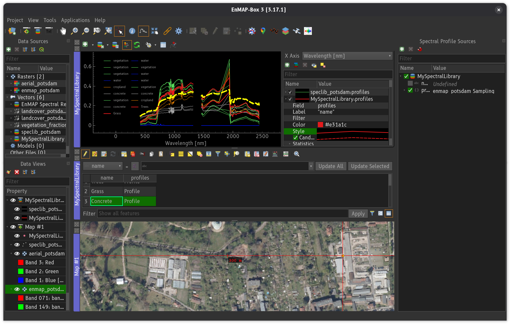

    EnMAP-Box, showing profiles from the `speclib_potsdam.zip` example library, together with profiles collected from an EnMAP example image.

.. _spectral_library_viewer:

|viewlist_spectrumdock| Spectral Library Viewer
-----------------------------------------------

The *Spectral Library Viewer* is the main tool to display spectral profiles in the EnMAP-Box.
It shows profiles that can be stored in different :ref:`profile_fields` and in different vector layers.

The plot settings panel on the right of the viewer is shown by activating the |legend| button.
The panel is used to set up one or multiple *profile visualizations*. Each defines:

* The vector layer and :ref:`profile_fields`  to read the spectral profiles
* The profile styling: line type, symbol type, color. The color can be set statically or using a QGIS expression.
* The profile name: a QGIS expression that generates the name that is used in the legend
* An optional filter, for example to display only profiles matching a criterion like `class_type='vegetation'`

The *General Settings* node allows to adjust the general appearance of the plot, e.g. by
changing the background and foreground color, or activating the legend.

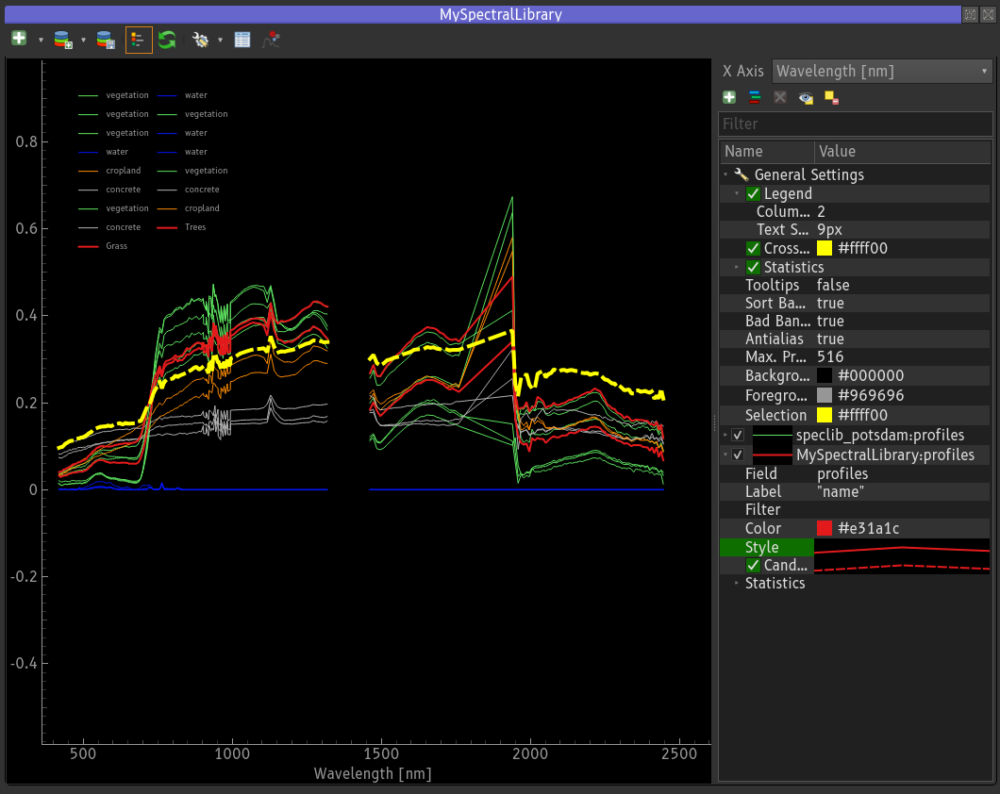

    Spectral Library Viewer

Selecting profiles in the profile plot does select the vector features the profile data is stored in.
Selecting vector features in a map or attribute table does highlight the related profiles in the profile plot.

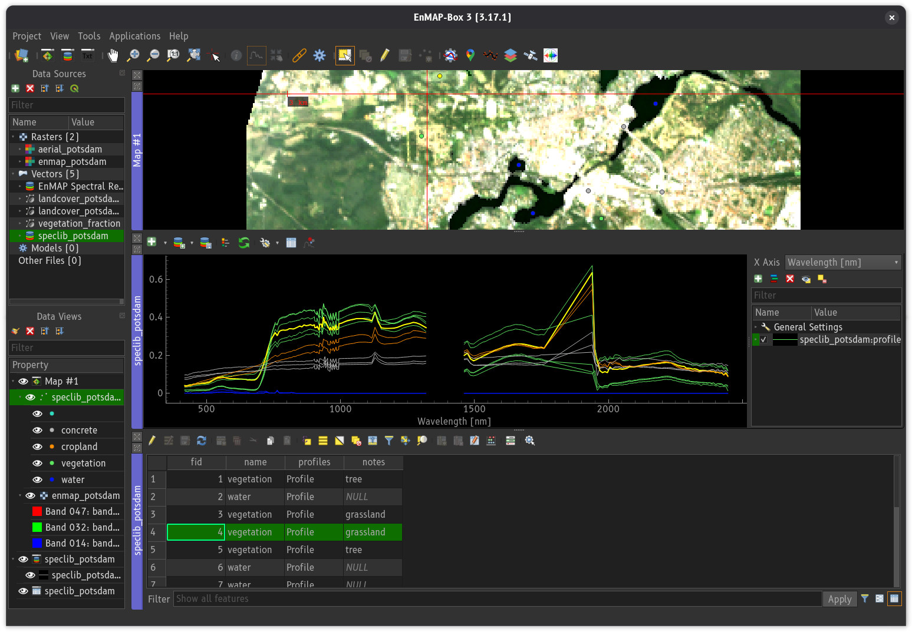

    When profiles are selected in the spectral library viewer, the corresponding vector features will also be selected in the map (top) and attribute table (bottom).

.. _attribute_table:

|viewlist_attributetabledock| Attribute Table
---------------------------------------------

The *Attribute Table* widget can be used to inspect and modify profile attributes. It
displays vector data either in *table view* |mActionOpenTable| or using the *form view* |mActionFormView|.
The form view for *Spectral Profile* fields allows to show spectral profile values as
graph, JSON document or in a table.

.. tabs::

    .. tab:: |mActionOpenTable| Table View

        .. figure:: img/speclibs/attributetable_tableview.png

            Attribute table widget, showing spectral library attributes in table view.

    .. tab:: |mActionFormView| Form View

        .. figure:: img/speclibs/speclib_table_formview.gif

            Attribute table widget, showing spectral library attributes in form view.

The attribute table widget can be opened from different places, e.g., the context menu of a
vector data source in the data sources panel or a vector layer in the layer tree of the data view panel.

In the Spectral Library Viewer it can be selected from the toolbar and the context menu of
a profile visualization node, whose vector layer will then be opened in the attribute table widget.

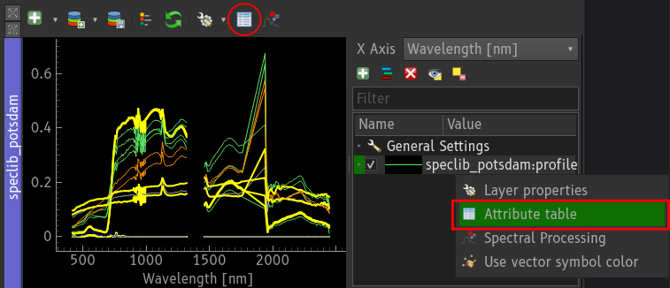

    Opening the attribute table for a vector layer whose profiles are shown in the spectral library viewer.

.. _profile_data:

|profile| Profile Data
----------------------

A single spectral profile contains the minimum information that is required to draw a profile.
This information is stored in a JSON dictionary that contains at least a list ``y`` with profile values:

.. code-block:: text

    {
        "y": [0.1011, 0.1018, ... , 0.1080]
    }

In addition it is possible to specify:

* ``x`` a list of position values along the x-axis, e.g. the band wavelength
* ``xUnit`` a string describing the unit of the x values
* ``yUnit`` a string describing the unit of the y values
* ``bbl`` a list of bad band multiplier values

If defined, the lists for ``x`` and ``bbl`` need to have the same length as ``y``.
Values in `xUnit` should use SI symbols wherever possible, e.g., ``μm`` instead of ``um`` or ``micrometers``.

.. code-block:: text

    {
        "y": [0.1011, 0.1018, ... , 0.1080],
        "x": [418.24, 423.874, ... , 2445.53],
        "xUnit" : "nm",
        "yUnit" : "reflectance",
        "bbl" : [1, 0, ... , 1]
    }

Modify spectral profiles
------------------------

The EnMAP-Box is highly generic in how it supports raster and spectral data.
After collecting spectral profiles, e.g. from raster images, by importing them from field measurements
or sources like the USGS Spectral Library, the EnMAP Box offers different ways to modify them.

Profile Editor
^^^^^^^^^^^^^^

Using the attribute table widget, the *Form View* |mActionFormView| for *Spectral Profile* fields can be used
to edit profile values, either using a JSON editor or a table that lists the profile values.

1. Open the attribute table of a spectral library
2. Activate the form view |mActionFormView|
3. Activate the layer edit mode
4. Select the JSON or Table view
5. Edit the profile values

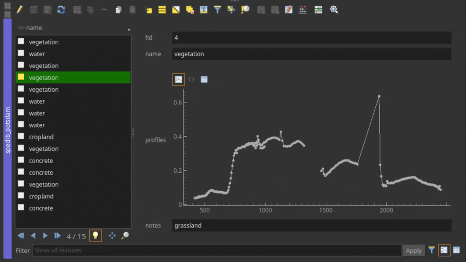

        Setting an outlier value to NaN.

Field Calculator
^^^^^^^^^^^^^^^^

Simple calculations can be done using the *QGIS Field Calculator*.

1. Open an attribute table
2. Open the Field Calculator
3. Set a new field name or the name of a field you would like to update
4. Use the *spectral_math* function to calculate new profiles using a Python expression. Ensure that the
   output type meets the field type.
5. If a new field was created, use the layer settings to ensure that the editor widget type is set to *Spectral Profile*

*Example: Calculate reflectance profiles*

Let's assume we have imported radiance measurements made with an ASD Field Spectrometer (for example, the `*.asd` files available
`here <https://github.com/EnMAP-Box/qgispluginsupport/tree/master/qpstestdata/asd/gps>`_).

For each measurement we have the radiance profile of the white reference panel (*reference*) and the target surface (*target*).
To obtain the surface reflectance, we need to divide the target radiance by the corresponding white reference radiance
(https://eol.pages.cms.hu-berlin.de/geo_rs/S04_Lab_and_field_spectroscopy.html).

1. Open an attribute table
2. Open the *Field Calculator* |mActionCalculateField|
3. Define the output field. This can be a new field or an existing one.
4. Use the *spectral_math* function to calculate new profiles

   * define the input profiles. E.g., let `p1` be the field with the reference radiance profiles and
     `p2` the field with target radiance profiles.
   * define a Python expression that calculates output profiles. For example:
     ``y = y2 / y1`` to divide target radiance by the reference radiance and obtain a reflectance profile.
   * ensure that the *spectral_math* function's output type meets the type of the output field.
     For example, use ``format='text'`` if profiles are written into a string/varchar field.

5. Press 'OK'

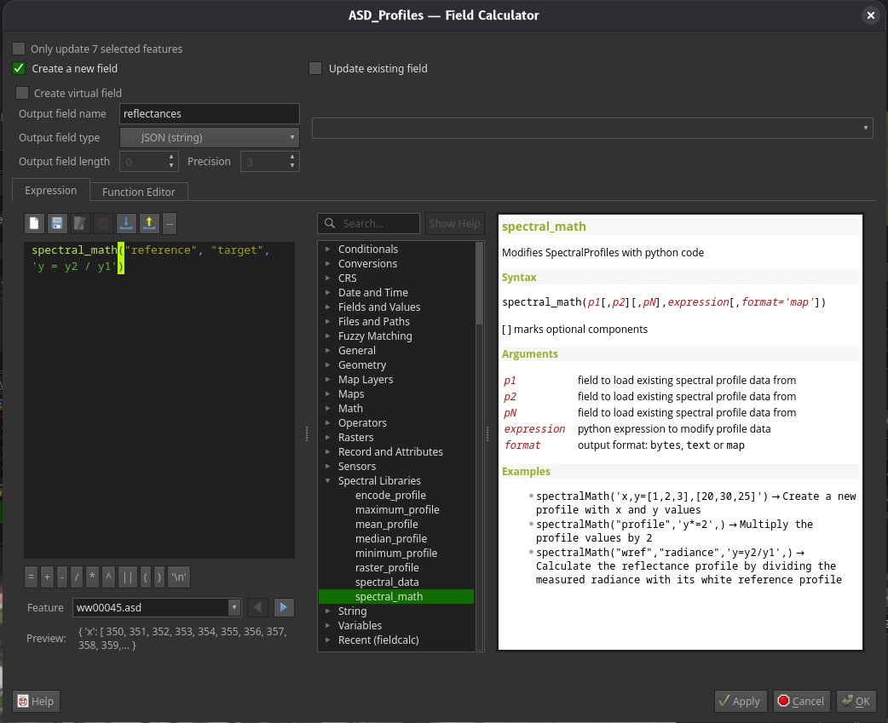

    QGIS field calculator with spectral_math function to calculate profile reflectances.

The *spectral_math* function makes input `profile data <profile_data>`_ available to the Python expression as follows:

* `y` -> ``y<n>``, 1D numpy array, e.g., ``y1`` for y values of the first input profile
* `x` -> ``x<n>``, 1D numpy array, e.g., ``x1`` for x values of the first input profile
* `xUnit` -> ``xUnit<n>``, string, e.g., ``xUnit1`` for the xUnit string of the first input profile

The output profile is specified using the following variables and default values:

* `y` numpy array or list with y values, defaults to `y1`
* `x` numpy array or list with x values, defaults to `x1`
* `xUnit` string with x unit, e.g., `nanometers`, defaults to `xUnit1`

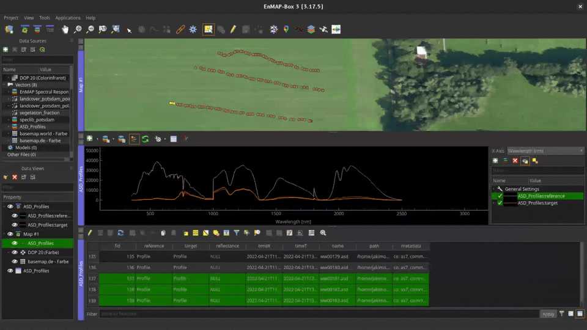

    Calculating profile reflectances using the QGIS Field Calculator.

Spectral Processing
^^^^^^^^^^^^^^^^^^^

The *Spectral Processing* tool uses *QGIS Processing Algorithms* to process spectral profiles.

1. Open an EnMAP-Box Spectral Library viewer
2. Within the plot settings tree, select a profile source you would like to process.
3. Click the *Spectral Processing* button |profile_processing| to open the Spectral Processing Dialog.
4. Select a processing algorithm that uses raster layers as input
5. Set your processing parameters.
6. Define the processing output. File names will be mapped into existing or new vector layer fields.
7. Click *Run* to start the processing.

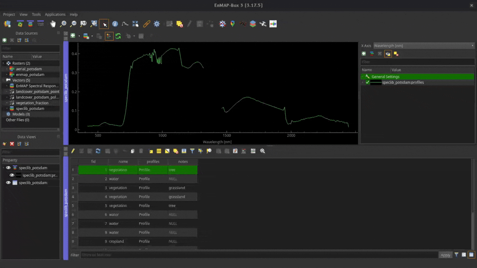

    Using the Spectral Processing dialog to resample EnMAP profiles to Landsat.

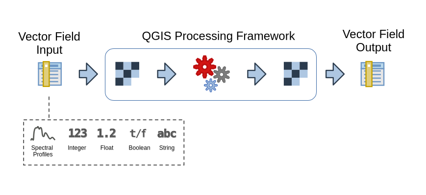

    The data flow handled by the Spectral Processing Dialog to use vector attribute values as raster inputs for
    QGIS Processing algorithms.

The Spectral Processing Dialog maps the attributes of a spectral library vector layer to temporary raster files.
These files are then used as input for QGIS Processing Algorithms. Created raster outputs are converted back into
attribute values for the spectral library vector layer. For example, the attribute fields of a spectral library
with n = 20 features (aka rows in the Table view) are converted into rasters with one line and 20 pixels.
The data type and number of bands of these temporary raster files depend on the input vector attributes.

.. list-table:: Mapping of vector attributes field values to temporary raster files
    :header-rows: 1

    *   - Field Type
        - Raster File
    *   - Spectral Profile
        - float raster with n > 1 bands
    *   - int / float
        - int / float raster with n = 1 band
    *   - string / any other data type
        - int classification image with n = 1 band.   Each unique string value is an individual class value

.. list-table:: Mapping of raster outputs into vector layer attributes
    :header-rows: 1

    *   - Raster File
        - Vector Field
    *   - n > 1 bands
        - Spectral profile
    *   - n = 1 band, int / float
        - int / float
    *   - n = 1 band, classification
        - string field containing the class name of each input pixel

Python Code
^^^^^^^^^^^

.. tabs::

    .. tab:: QGIS API

        .. todo:: Add example

    .. tab:: GDAL only

        .. todo:: Add example

.. _profile_fields:

|profile_fields| Profile Fields
-------------------------------

The EnMAP-Box can read and write profile data into any vector layer field of the following data types:

.. list-table:: Datatypes to store spectral profiles
    :header-rows: 1

    * - Data Type
      - SQL
      - GDAL/OGR
      - Qt/QGIS
      - Notes
    * - Text, Strings
      - TEXT, VARCHAR
      -
      -
      - needs to support an arbitrary length
    * - JavaScript Object Notation
      - `JSON, JSONB <https://www.postgresql.org/docs/current/datatype-json.html>`_
      -
      - `QVariantMap <https://doc.qt.io/qt-6/qvariant.html#QVariantMap-typedef>`_
      -
    * - Binary Large Objects
      - BLOB
      -
      - `QByteArray <https://doc.qt.io/qt-6/qbytearray.html>`_
      - deprecated, please use TEXT, VARCHAR or JSON data types

However, many text, JSON, and BLOB fields may be used for different purposes. It is therefore required
to flag those fields that are used to store spectral profiles by setting the field's editor
widget type to *SpectralProfile*. This can be done in the *Layer Property Dialog* or via Python.

A \*.qml sidecar file, e.g., `myspeclib.qml` next to `myspeclib.gpkg`, allows you to
save layer properties like the editor widget type persistently. This way QGIS can restore them
automatically when loading the vector source again.

.. tabs::

    .. tab:: Layer Property Dialog
        To use a vector layer field for storing spectral profiles

        1. Open the *Layer Properties* and select the *Attributes Form* |mActionFormView| page
        2. Select the text or JSON field to store profiles
        3. Choose *SpectralProfile* as *Widget Type* and *Apply* the changes
        4. Call "Style" -> "Save as Default" to create a \*.qml file that saves the layer style

        .. figure:: img/speclibs/layerproperties_attributeform.png

            The *SpectralProfile* widget type tells the EnMAP-Box, which layer fields can contain vector spectral profiles.

    .. tab:: PyQGIS

        This example shows how to use the QGIS Python API to set the editor widget type
        to `SpectralProfiles` and save these settings as the default style.

        .. code-block:: python

            from qgis.core import QgsVectorLayer, QgsEditorWidgetSetup

            layer = QgsVectorLayer('myspeclib.gpkg')
            # other code
            i = layer.fields().indexOf('profiles')
            layer.setEditorWidgetField(i, QgsEditorWidgetSetup('SpectralProfile', {}))

            # save the layer style in a *.qml file (myspeclib.qml)
            layer.saveDefaultStyle(QgsMapLayer.StyleCategory.AllStyleCategories)

    .. tab:: QML

        A minimal QML file to ensure that data from the vector field "profiles" is used as a profile field.

        .. code-block:: xml

            <qgis>
              <fieldConfiguration>
                <field name="profiles">
                  <editWidget type="SpectralProfile">
                    <config>
                      <Option/>
                    </config>
                  </editWidget>
                </field>
              </fieldConfiguration>
            </qgis>

The profile fields of vector layers that are opened in the EnMAP-Box, e.g., as a layer in a map, can be selected as a source for a profile visualization

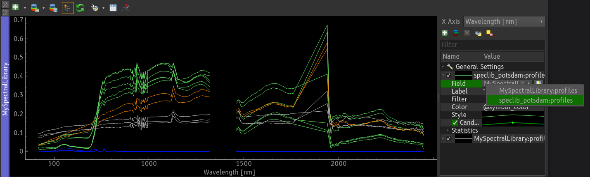

    Selection of a profile field as a source for a visualization.

.. _speclib_collect_profiles:

|select_location| Collect Profiles
----------------------------------

To collect spectral profiles from raster layers, go into the toolbar and
activate the *Identify map tool* |select_location| with option *Identify pixel profiles* |profile|.

Now click on a raster pixel. By default, this creates a new in-memory vector layer "Profiles #1" and opens a spectral library view to show it. The *Spectral Profile Sources* panel can be used to specify how profiles are collected, e.g., from which raster layer, and to which vector layer field they will be written. In addition, it allows you to specify values for other fields of the vector layer, e.g., to generate a profile name automatically.

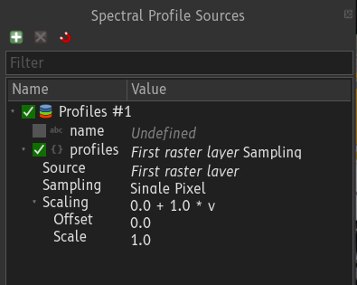

    The spectral profile source panel describes how profiles are collected and written to vector layers.

.. _speclib_import_profiles:

|speclib_add| Import Profiles
-----------------------------

The *Import Spectral Profiles* algorithm loads profiles from different sources into a new vector layer.
It can be opened from the Spectral Library Viewer, using the |speclib_add| button,
or from the QGIS processing toolbox (``enmapbox:importspectralprofiles``).

The import algorithm tries to identify the format of each source file on its own.
However, to improve speed it is recommended to specify the file input type manually.

.. list-table:: File types from which spectral profiles can be imported
    :header-rows: 1

    * - Input File Type
      - Description
    * - ASD
      - Binary file output created by `ASD Field Spectrometers <https://www.malvernpanalytical.com/en/products/product-range/asd-range/fieldspec-range>`_
    * - ECOSTRESS
      - CSV text files from the NASA JPL ECOSTRESS Spectral Library https://speclib.jpl.nasa.gov/
    * - ENVI
      - `ENVI Spectral Library <https://www.nv5geospatialsoftware.com/docs/enviheaderfiles.html>`_ binary format
    * - EcoSIS
      - CSV text files from the `Ecological Spectral Information System (EcoSIS) <https://ecosis.org/>`_
    * - GeoJSON
      - EnMAP-Box Spectral Library, saved as GeoJSON
    * - GeoPackage
      - EnMAP-box Spectral Library, saved as GeoPackage
    * - SED
      - Text file output created by `Spectral Evolution Spectroradiometers <https://spectralevolution.com/>`_
    * - SVC
      - Text file output created by `Spectral Vista Corporation Spectroradiometers <https://spectravista.com/>`_

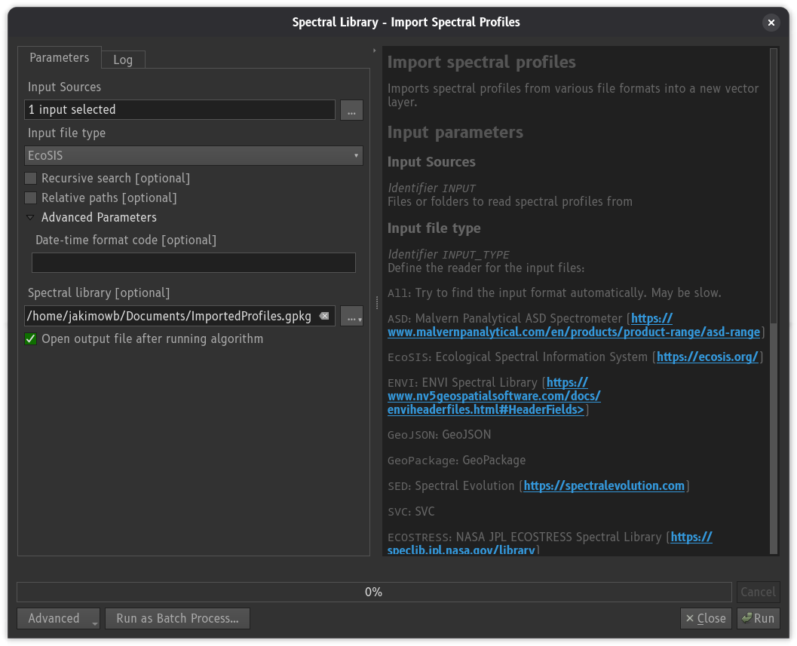

.. _speclib_export_profiles:

|speclib_save| Export Profiles
------------------------------

The *Export Spectral Profiles* algorithm allows to save spectral profiles in
other file formats. It can be opened either from the Spectral Library Viewer, using the |speclib_save| button,
or from the QGIS processing toolbox (``enmapbox:exportspectralprofiles``).

The algorithm requires to specify the *Profile Field* whose profiles are to be saved, and a field or QGIS expression
to get a profile name from.

.. list-table:: File types into which spectral profiles can be exported
    :header-rows: 1

    * - Export File Type
      - Extension
      - Description
    * - ENVI Spectral Library
      - `*.sli`
      - `ENVI Spectral Library <https://www.nv5geospatialsoftware.com/docs/enviheaderfiles.html>`_ binary format
    * - EcoSIS
      - `*.csv`
      - CSV text files used by `Ecological Spectral Information System (EcoSIS) <https://ecosis.org/>`_
    * - GeoJSON
      - EnMAP-Box Spectral Library, saved as GeoJSON
      -
    * - GeoPackage
      - EnMAP-box Spectral Library, saved as GeoPackage
      -

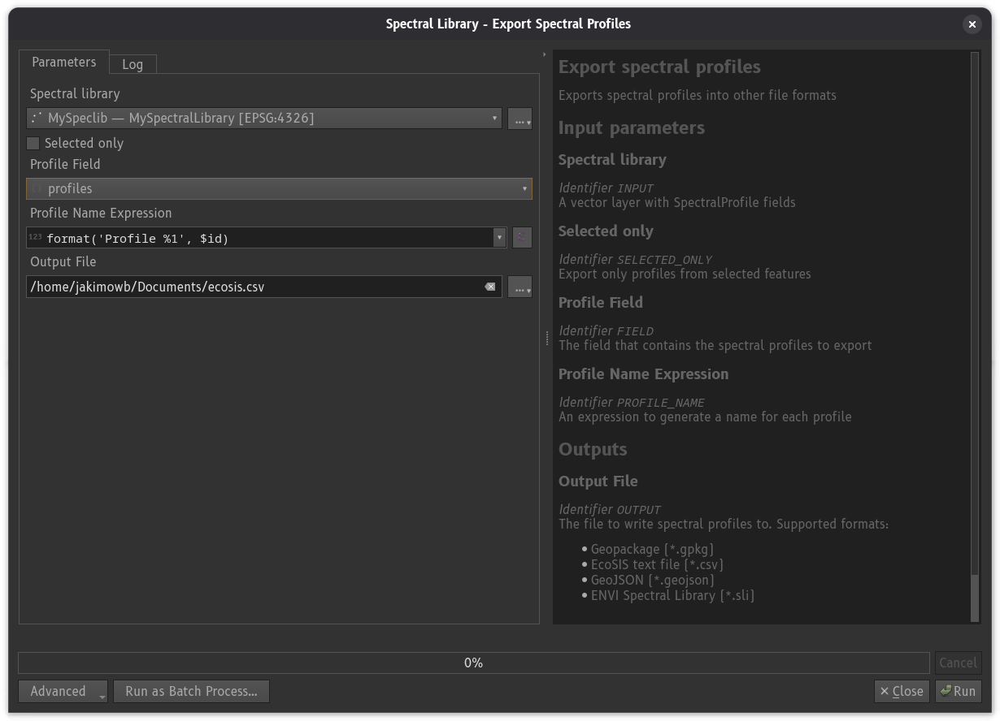

Remove spectral profiles
------------------------

To remove spectral profiles from the spectral library, follow these steps:

1. Switch to the **Table view** |mActionOpenTable| if not already in table view.
2. Activate the **Editing mode** |mActionToggleEditing| to enable modifications.
3. Select the profiles you want to delete:

   * To select a single profile, click on its row in the table.
   * To select multiple profiles, hold the :kbd:`Shift` key and click on the desired rows, or use :kbd:`Ctrl` + click to select individual profiles.

    .. figure:: /img/remove_spectralprofiles.png
       :align: center
       :width: 50%

   *Selecting spectral profiles in the attribute table*

4. Click the **Delete selected features** |mActionDeleteSelected| button to remove the selected profiles from the spectral library.
5. The profiles will be removed immediately. Save your changes using the **Save edits** |mActionSaveAllEdits| button or by clicking **Toggle editing mode** |mActionToggleEditing| again to exit edit mode.

.. AUTOGENERATED SUBSTITUTIONS - DO NOT EDIT PAST THIS LINE

.. |legend| image:: /img/icons/legend.svg
   :width: 28px
.. |mActionCalculateField| image:: /img/icons/mActionCalculateField.svg
   :width: 28px
.. |mActionDeleteSelected| image:: /img/icons/mActionDeleteSelected.svg
   :width: 28px
.. |mActionFormView| image:: /img/icons/mActionFormView.svg
   :width: 28px
.. |mActionOpenTable| image:: /img/icons/mActionOpenTable.svg
   :width: 28px
.. |mActionSaveAllEdits| image:: /img/icons/mActionSaveAllEdits.svg
   :width: 28px
.. |mActionToggleEditing| image:: /img/icons/mActionToggleEditing.svg
   :width: 28px
.. |profile| image:: /img/icons/profile.svg
   :width: 28px
.. |profile_fields| image:: /img/icons/profile_fields.svg
   :width: 28px
.. |profile_processing| image:: /img/icons/profile_processing.svg
   :width: 28px
.. |select_location| image:: /img/icons/select_location.svg
   :width: 28px
.. |speclib| image:: /img/icons/speclib.svg
   :width: 28px
.. |speclib_add| image:: /img/icons/speclib_add.svg
   :width: 28px
.. |speclib_save| image:: /img/icons/speclib_save.svg
   :width: 28px
.. |viewlist_attributetabledock| image:: /img/icons/viewlist_attributetabledock.svg
   :width: 28px
.. |viewlist_spectrumdock| image:: /img/icons/viewlist_spectrumdock.svg
   :width: 28px
