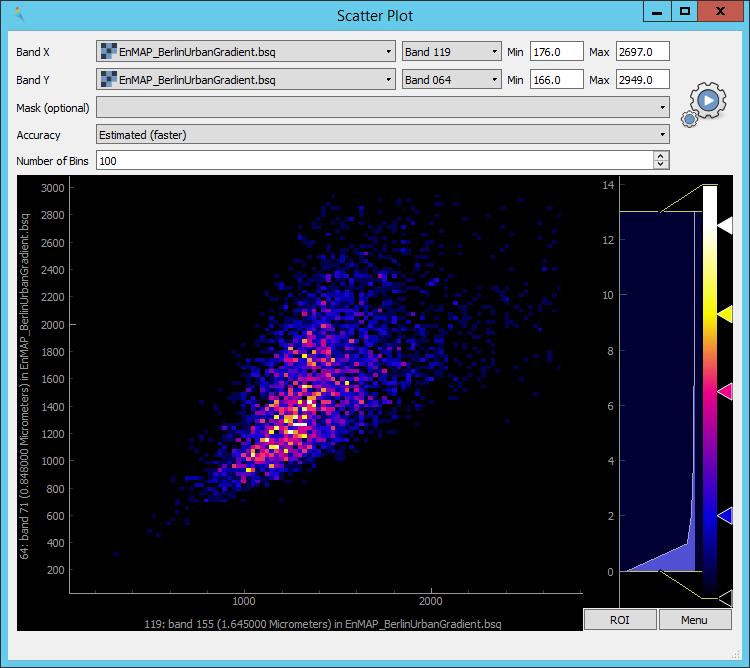
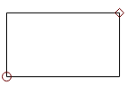

.. include:: /icon_links.rst

.. |reset_plot| image:: ../../img/pyqtgraph_reset.png
   :width: 15px

.. _tools:

Tools
*****

Image Statistics
================

The image statistics tool provides access to basic summary statistics for each raster band. Those statistics are reported
in a table and can be visualized as a histogram. It can be opened from the menu bar via :menuselection:`Tools --> ImageStatistics`

* In order to calculate the statistics, select a desired raster dataset under :guilabel:`Raster`.
* Optionally, you can specify a :guilabel:`Mask` in order to only include a subset of pixels.
* Under :guilabel:`Accuracy` you can specify whether the statistics will be calculated based on a random subset of the data
  (*Estimated*) or using the complete dataset (*Actual*). Using a subset will be faster.
* :guilabel:`Histogram bins`: Choose between different algorithms used to calculate the size/number of histogram bins.
* Click the |action| button to start the calculation of the image statistics.

  .. figure:: /img/image_statistics_tool.png
     :width: 80%

     Image Statistics tool

* After the calculation is complete, a tabular representation of the results is shown.
* In order to show a histogram of a bands value distribution, select a row in the table.
* Multiple histograms can be plotted by activating the |plus_green| button
* In order to show all possible histograms (i.e., one histogram for each band) click the |histogram| button.
* Check the |mIconEditableEdits| button in order to only draw lines of the histogram (advised if multiple are plotted)

....

Scatterplot
===========

The Scatterplot tool allows you to plot the values of two bands against each other.
It can be opened from the menu bar via :menuselection:`Tools --> Scatterplot`. You can specify the following settings:

 * :guilabel:`Band X`: Choose the raster (first dropdown menu) and the band (second dropdown menu) to be plotted on the X-axis.
   ``Min`` and ``Max`` depict the limits of the axis. By default, Min and Max will be automatically derived. You can also
   manually specify the limits of the axis by entering another value.
 * :guilabel:`Band Y`: Same as above, just for the Y-axis.
 * :guilabel:`Mask (optional)`: You can specify a mask here, so that pixels which are covered by the mask will not be included in the
   scatterplot.
 * :guilabel:`Accuracy`: Can either be set to *Estimated (faster)* or *Actual (slower)*. Defines whether to use a subset of pixels for calculation
   or all of them.
 * :guilabel:`Number of Bins`: Defines the number of bins in x and y direction.

After you entered all settings, click the |action| button to create the plot.

   Screenshot of the Scatter Plot Tool

**Scatterplot Navigation**

* The plot window is interactive, which means you can zoom in and out using the mouse.
* Reset the plot window to the default zoom level by clicking the |reset_plot| button in the lower left of the plot window.
* Right-clicking inside the plot offers you several additional options.
* Change the color scheme of the plot by right-clicking into the color bar on the right.

**ROI**

The ROI option allows you to select a rectangular region in the scatterplot, for which the density distribution will be
displayed in a second plot window below.

* Click the :guilabel:`ROI` button to open up the ROI functionality. Mind how a small rectangle |roi| appears at the bottom left of the plot
  (usually between the values 0 and 10, depending on your axis scaling you have to zoom in order to see it properly). Clicking and holding the circle
  allows you to change the rotation of the rectangle, while clicking and holding the square you can change the size of it.
* Close the ROI mode by clicking on the :guilabel:`ROI` button again.

.. _metadata_editor:

Metadata editor
===============

Reclassify
==========

The reclassify tool is a convenient graphical user interface for reclassifying classification rasters.

Specify the file you want to reclassify under :guilabel:`Input File`. Either use the dropdown menu to select one of the
layers which are already loaded or use the |mActionAddRasterLayer| button to open the file selection dialog.

Under :guilabel:`Output Classification` you can specify the classification scheme of the output classification which
will be created.

* You can import schemes from existing rasters or text files by clicking the |plus_green| button.
* Use the |classinfo_add| button to manually add classes.
* To remove entries select the respective rows and click the |classinfo_remove| button.
* So save a classification scheme select the desired classes (or use :kbd:`Crtl + A` to select all) and click on the
  |mActionFileSaveAs| button.
* Likewise, you can copy and paste classes by selecting them and clicking the |mActionEditCopy| :sup:`Copy Classes`
  |mActionEditPaste| :sup:`Paste Classes` buttons.

.. image:: /img/reclassifytool1.png

* The table is sorted by the **Label** field in ascending order. The value in **Label** will become the pixel value
  of this class and can not be altered.
* Double-click into the **Name** field in order to edit the class name.
* Double-click into the **Color** field to pick a color.

Under :guilabel:`Class Mapping` you can reassign the old classes (**From**) to values of the new classification scheme (**To**)

.. image:: /img/reclassifytool2.png

Specify the output path for the reclassified image under :guilabel:`Output File`

Click :guilabel:`OK` to run the tool.

Image Cube
==========

The Image Cube tool visualizes a raster image in an interactive 3D view:

.. image:: /img/imagecube_animation.gif

1.  Select the raster image.

2.  Specify the:

    * **Top Plane** renderer. It can be any raster renderer known from QIGS, e.g. a Multiband
        color renderer that shows the true color bands

    * **Cube & Slice** renderer. This must be a render that uses a single band only, e.g. a
      *Singleband grey* or *Pseudocolor renderer*. It will colorize the band-related pixel values
      of the 3D image cube and planes relating to the X, Y or Z slice.

3.  Press **Load Data** to (re)load and render the raster image values.

.. image:: /img/imagecube_gui.png

The 3D scene contains the following elements:

* Top Plane - a raster layer for spatial orientation
* Image Cube - a volumetric representation of the raster image, showing the raster bands on the z axis
* X Slice - a slice along the raster's X / column / sample dimension
* Y Slice - a slice along the raster's Y / row / line dimension
* Z Slice - a slice along the raster's Z / band dimension
* Box (Image) - a 3D bounding box along the maximum image extent
* Box (Subset) - a 3D bounding box to show the extent of the spatial subset that migh be used to focus on specific
  image areas

.. image:: /img/imagecube_gui_slices.png

Virtual Raster Builder
======================

See https://virtual-raster-builder.readthedocs.io/en/latest/
