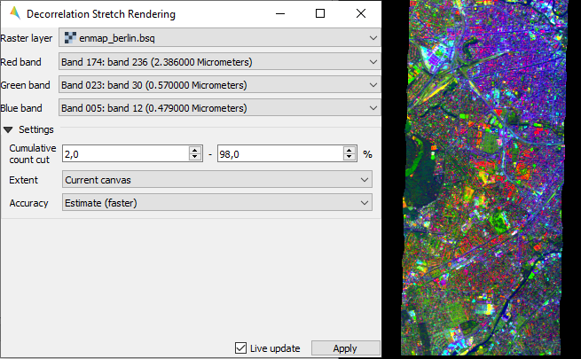
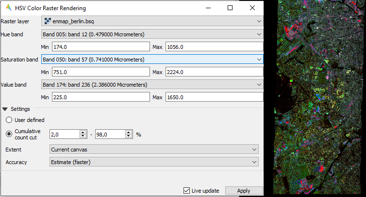
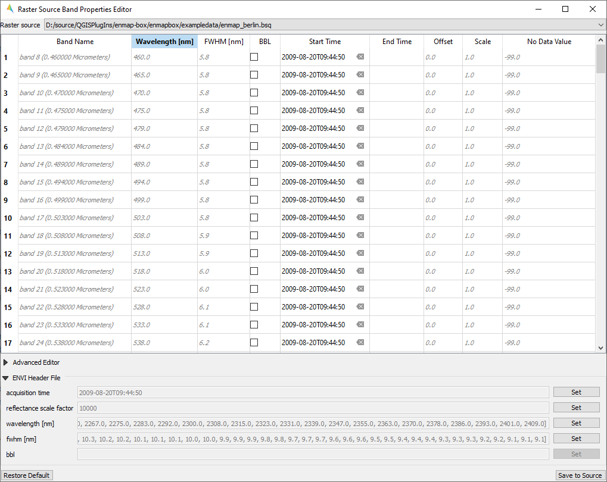

.. include:: /icon_links.rst

.. |reset_plot| image:: ../../img/pyqtgraph_reset.png
   :width: 15px

.. _tools:

Tools
*****

Add Product
===========

Import a satellite product into the EnMAP-Box via the main menu or by drag&drop from your file explorer.

..  youtube:: G7UE-DIhXi8
    :width: 100%
    :privacy_mode:

Add Web Map Services (WMS)
==========================

Add a predefined WMS layer.

..  youtube:: SRJPh4bxcnw
    :width: 100%
    :privacy_mode:

Band Statistics
===============

The Band Statistics tool reports band histograms and basic statistics like min, max, mean and standard deviation.

..  youtube:: tS2B9EsHutY
    :width: 100%
    :privacy_mode:

Bivariate Color Raster Renderer
===============

The Bivariate Color Raster Renderer allows to visualize two bands using a 2d color ramp.
Find a mapping example here: https://www.joshuastevens.net/cartography/make-a-bivariate-choropleth-map/

..  youtube:: TW3hrWKLpbs
    :width: 100%
    :privacy_mode:

Class Fraction/Probability Renderer and Statistics
==================================================

The Class Fraction/Probability Renderer allows  allows to visualize arbitrary many fraction/probability bands
at the same time, using the original class colors.

..  youtube:: fflhmRl_Npw
    :width: 100%
    :privacy_mode:

Classification Statistics
=========================

The Classification Statistics tool reports class histograms and area covered in percentage, pixel and map units.

..  youtube:: Go7tRzwKPvs
    :width: 100%
    :privacy_mode:

CMYK Color Raster Renderer
==========================

The CMYK Color Raster Renderer allows to visualize 4 bands using the CMYK (Cyan, Magenta, Yellow, and Key/Black)
color model. Find a mapping example here: https://adventuresinmapping.com/2018/10/31/cmyk-vice/

..  youtube:: aVy9WXM3Q84
    :width: 100%
    :privacy_mode:

Color Space Explorer
====================

The Color Space Explorer allows
a) to select random and predefined RBG band combinations, and
b) to animate RGB bands.

..  youtube:: e5SLW1pB06A
    :width: 100%
    :privacy_mode:

Decorrelation Stretch Renderer
==============================

The Decorrelation Stretch Renderer allows to visualize 3 band. It removes the high correlation commonly found in
optical bands to produce a more colorful color composite image.

Enhanced Multiband Color Renderer
=================================

The Ehanced Multiband Color Renderer allows to visualize arbitrary many bands at the same time using individual
color canons for each band (it's currently more a prototype).

.. todo::

    Find a good dataset and make a video.

HSV Color Raster Renderer
=========================

The HSV Color Raster Renderer allows to visualize 3 bands using the HSV (Hue, Saturation, Value/Black) color model.
Find a mapping example here: https://landmonitoring.earth/portal/ ; select Maps > Global Landcover Dynamics 2016-2020

.. todo::

    Find a good dataset, that is comparable to the *Global Landcover Dynamics 2016-2020* from GeoVille,
    and make a video.

Image Cube
==========

The Image Cube tool visualizes a raster image in an interactive 3D view:

.. image:: /img/imagecube_animation.gif

1.  Select the raster image.

2.  Specify the:

    * **Top Plane** renderer. It can be any raster renderer known from QIGS, e.g. a Multiband
        color renderer that shows the true color bands

    * **Cube & Slice** renderer. This must be a render that uses a single band only, e.g. a
      *Singleband grey* or *Pseudocolor renderer*. It will colorize the band-related pixel values
      of the 3D image cube and planes relating to the X, Y or Z slice.

3.  Press **Load Data** to (re)load and render the raster image values.

.. image:: /img/imagecube_gui.png

The 3D scene contains the following elements:

* Top Plane - a raster layer for spatial orientation
* Image Cube - a volumetric representation of the raster image, showing the raster bands on the z axis
* X Slice - a slice along the raster's X / column / sample dimension
* Y Slice - a slice along the raster's Y / row / line dimension
* Z Slice - a slice along the raster's Z / band dimension
* Box (Image) - a 3D bounding box along the maximum image extent
* Box (Subset) - a 3D bounding box to show the extent of the spatial subset that migh be used to focus on specific
  image areas

.. image:: /img/imagecube_gui_slices.png

Metadata Viewer
===============

todo

Raster Layer Styling
====================

The Raster Layer Styling panel allows to quickly select a RGB, Gray or Pseudocolor visualizations.

..  youtube:: ImO8BzHNjlk
    :width: 100%
    :privacy_mode:

It also supports the linking of the style between multiple raster layer.

..  youtube:: HJSNhG7vKKg
    :width: 100%
    :privacy_mode:

Raster Source Band Properties Editor
====================================

The Raster Source Band Properties Editor allows to view and edit band properties of GDAL raster sources,
with special support for ENVI metadata.

Reclassify
==========

The reclassify tool is a convenient graphical user interface for reclassifying classification rasters.

Specify the file you want to reclassify under :guilabel:`Input File`. Either use the dropdown menu to select one of the
layers which are already loaded or use the |mActionAddRasterLayer| button to open the file selection dialog.

Under :guilabel:`Output Classification` you can specify the classification scheme of the output classification which
will be created.

* You can import schemes from existing rasters or text files by clicking the |plus_green| button.
* Use the |classinfo_add| button to manually add classes.
* To remove entries select the respective rows and click the |classinfo_remove| button.
* So save a classification scheme select the desired classes (or use :kbd:`Crtl + A` to select all) and click on the
  |mActionFileSaveAs| button.
* Likewise, you can copy and paste classes by selecting them and clicking the |mActionEditCopy| :sup:`Copy Classes`
  |mActionEditPaste| :sup:`Paste Classes` buttons.

.. image:: /img/reclassifytool1.png

* The table is sorted by the **Label** field in ascending order. The value in **Label** will become the pixel value
  of this class and can not be altered.
* Double-click into the **Name** field in order to edit the class name.
* Double-click into the **Color** field to pick a color.

Under :guilabel:`Class Mapping` you can reassign the old classes (**From**) to values of the new classification scheme (**To**)

.. image:: /img/reclassifytool2.png

Specify the output path for the reclassified image under :guilabel:`Output File`

Click :guilabel:`OK` to run the tool.

Scatter Plot
============

The Scatter Plot allows to plot two raster bands or vector fields against each other.
The visualization of both, denstity and scatter is supported.

..  youtube:: bMfklHoEqJc
    :width: 100%
    :privacy_mode:

Virtual Raster Builder
======================

See https://virtual-raster-builder.readthedocs.io/en/latest/
